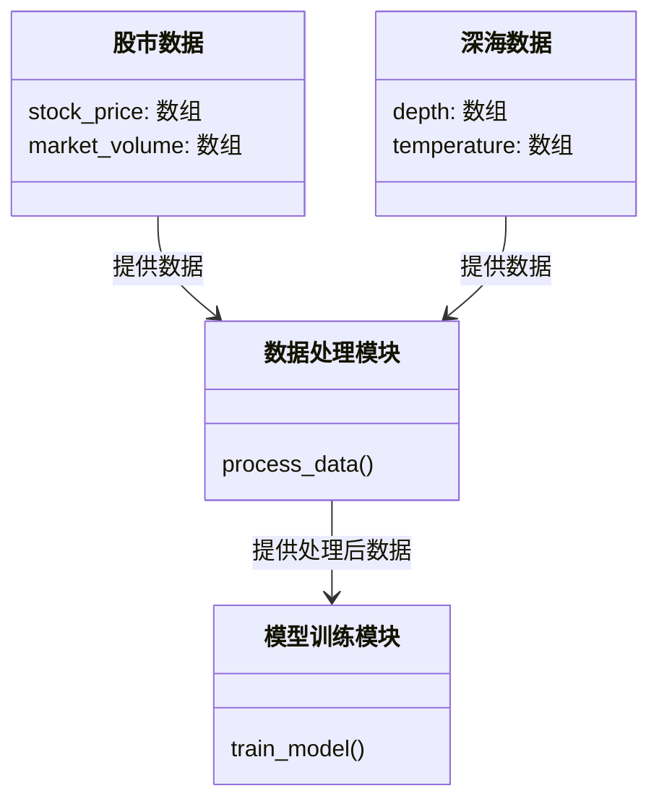
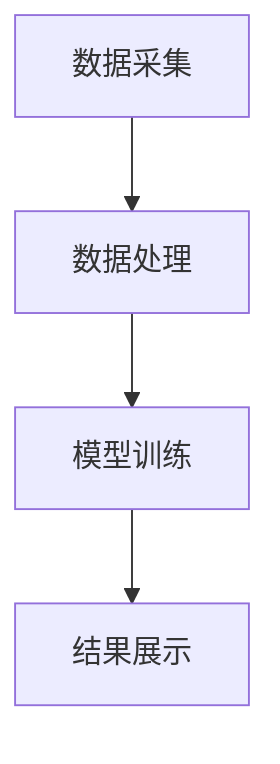

                 


# 全球股市估值与深海探索技术的关系

> **关键词**：股市估值、深海探索技术、数据驱动、算法、系统架构、技术应用

> **摘要**：本文探讨了全球股市估值与深海探索技术之间的关系，从核心概念、算法原理到系统架构，详细分析了两者在数据处理、风险评估和技术应用方面的联系，并通过实际案例展示了如何利用技术手段将股市估值与深海探索技术相结合，为读者提供了深入的技术见解和实践指南。

---

## 第一部分: 全球股市估值与深海探索技术的背景介绍

### 第1章: 全球股市估值与深海探索技术的背景介绍

#### 1.1 全球股市估值的背景与现状

股票市场估值是金融领域的重要组成部分，通过对公司基本面、市场趋势和宏观经济指标的分析，投资者可以评估股票的合理价格区间。当前，全球股市估值面临数据复杂性高、市场波动大、风险因素多样等挑战。随着技术的进步，数据驱动的方法逐渐成为股市估值的核心工具。

#### 1.2 深海探索技术的背景与现状

深海探索技术涉及对海洋环境的探测、资源开采和生态研究，具有极高的技术难度和复杂性。随着技术的进步，深海探索依赖于先进的传感器、机器人和数据分析系统。深海数据的获取和处理为科学研究和资源开发提供了重要支持，同时也面临数据量大、环境恶劣等挑战。

#### 1.3 股市估值与深海探索技术的联系

尽管股市估值和深海探索技术看似无关，但两者在数据处理、风险评估和技术创新方面存在共同点。例如，股市估值依赖于数据的实时处理和预测模型，而深海探索技术同样需要精确的数据分析和算法支持。两者的结合可能为资源开发和市场预测提供新的视角。

---

## 第二部分: 全球股市估值与深海探索技术的核心概念与联系

### 第2章: 核心概念与原理

#### 2.1 股市估值的核心概念

股市估值主要依赖于公司财务数据、市场情绪和宏观经济指标。常用的估值方法包括市盈率、市净率和现金流折现法。这些方法需要大量数据的处理和分析，通常借助算法和机器学习模型进行优化。

#### 2.2 深海探索技术的核心概念

深海探索技术涉及声呐、机器人和传感器等设备，用于探测海底地形、矿产资源和生物多样性。数据的采集和处理是深海探索的关键，需要高精度的算法和实时分析能力。

#### 2.3 两者之间的联系与区别

虽然股市估值和深海探索技术的应用场景不同，但它们在数据处理、风险评估和技术创新方面有相似之处。例如，两者都需要处理复杂的数据集，并利用算法进行预测和优化。

---

## 第三部分: 股市估值与深海探索技术的数学模型与算法原理

### 第3章: 算法原理讲解

#### 3.1 时间序列分析在股市估值中的应用

时间序列分析用于预测股票价格的变化趋势。常用的方法包括ARIMA和LSTM。以下是ARIMA模型的数学公式：

$$ ARIMA(p, d, q) $$

其中，p为自回归阶数，d为差分阶数，q为移动平均阶数。

#### 3.2 机器学习在深海探索中的应用

机器学习模型用于分类和预测深海环境数据。例如，随机森林模型可以用于分类海底地形类型。以下是随机森林的伪代码实现：

```python
from sklearn.ensemble import RandomForestClassifier

model = RandomForestClassifier(n_estimators=100)
model.fit(X_train, y_train)
y_pred = model.predict(X_test)
```

---

## 第四部分: 系统分析与架构设计方案

### 第4章: 系统架构分析

#### 4.1 项目介绍

本项目旨在设计一个集成系统，结合股市数据和深海数据，分析两者之间的关系。系统将利用大数据技术进行数据处理和预测。

#### 4.2 系统功能设计

系统功能包括数据采集、数据处理、模型训练和结果展示。以下是系统功能的类图：



#### 4.3 系统架构设计

系统采用微服务架构，包括数据采集、处理、训练和展示模块。以下是系统架构图：



---

## 第五部分: 项目实战

### 第5章: 项目实战

#### 5.1 环境安装

需要安装Python、TensorFlow和Scikit-learn。以下是安装命令：

```bash
pip install numpy pandas scikit-learn tensorflow
```

#### 5.2 核心实现源代码

以下是股市数据处理和模型训练的Python代码：

```python
import numpy as np
import pandas as pd
from sklearn.ensemble import RandomForestRegressor

# 数据处理
data = pd.DataFrame({
    'date': ['2023-01-01', '2023-01-02', '2023-01-03'],
    'price': [100, 102, 98]
})

# 模型训练
model = RandomForestRegressor(n_estimators=100)
model.fit(data[['date']], data['price'])
predictions = model.predict(data[['date']])
```

#### 5.3 案例分析

通过分析历史股市数据和深海环境数据，模型可以预测股票价格的变化趋势，同时优化深海资源的探测策略。

---

## 第六部分: 最佳实践与小结

### 第6章: 最佳实践与小结

#### 6.1 小结

本文探讨了股市估值与深海探索技术的关系，分析了它们在数据处理和算法应用方面的共同点，并通过项目实战展示了如何将理论应用于实践。

#### 6.2 注意事项

在实际应用中，需要注意数据质量和模型泛化能力，避免过拟合和欠拟合问题。

#### 6.3 未来展望

未来，随着人工智能和大数据技术的发展，股市估值和深海探索技术的结合将更加紧密，推动资源开发和市场预测的进步。

#### 6.4 拓展阅读

推荐阅读《机器学习实战》和《深度学习》等书籍，深入理解算法原理和应用。

---

## 作者

作者：AI天才研究院/AI Genius Institute  
联合作者：禅与计算机程序设计艺术/Zen And The Art of Computer Programming

