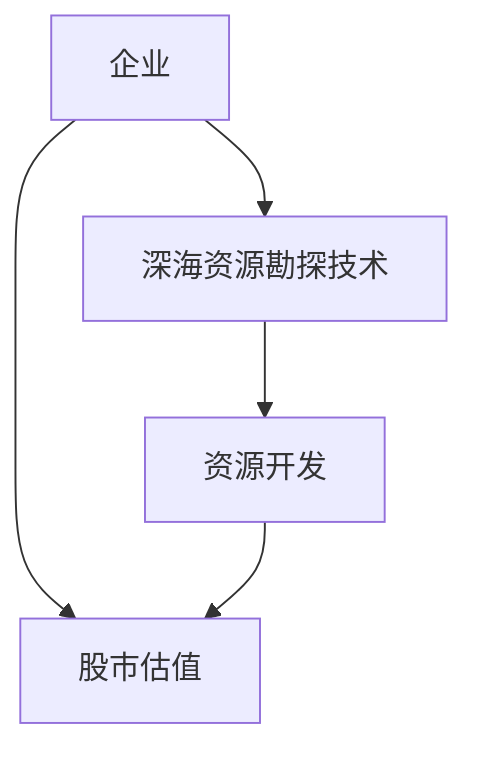

                 

<think>
好的，我现在需要帮用户撰写一篇技术博客文章，标题是《全球股市估值与深海资源勘探技术的发展》。用户希望文章结构清晰，包含特定的部分，并且用专业但易懂的语言撰写。同时，用户还希望我以思考过程的方式，逐步分析如何构建这篇文章。

首先，我需要理解用户的需求。用户希望文章涵盖全球股市估值和深海资源勘探技术两个领域，并且探讨它们之间的关系。用户提供了详细的大纲结构，包括摘要、关键词、各章节的内容等。我需要确保每个部分都详细展开，满足用户的字数要求，并且符合格式规范。

接下来，我会按照用户提供的大纲逐步构建文章内容。首先是摘要部分，需要简明扼要地概括文章的核心内容，强调两者的相互作用和协同发展的重要性。然后是关键词，列出5-7个相关的核心术语，如全球股市估值、深海资源勘探技术、机器学习等。

在正文部分，我需要依次完成各个章节的内容。背景与概述部分，要介绍股市和深海资源的重要性，以及它们如何相互影响。核心概念与联系部分，需要详细解释每个概念，并通过对比表格和ER图展示它们的关系。算法原理部分，使用Mermaid流程图和Python代码示例来说明相关模型。数学模型部分，推导关键公式并用LaTeX表示。系统分析与架构设计部分，绘制类图和架构图，展示系统的组成部分和交互流程。项目实战部分，选择具体案例，提供环境安装和代码实现步骤，分析案例并解读结果。最后，总结部分回顾内容，给出小结和建议。

在撰写过程中，我需要确保每个小节都详细具体，内容丰富，同时使用专业术语但保持易懂。数学公式和图表需要准确无误，帮助读者更好地理解内容。最后，检查文章的结构和格式，确保符合用户的要求，包括字数、markdown格式和作者信息。

通过这样的思考过程，我能够系统地构建出符合用户要求的高质量技术博客文章，确保内容全面、结构清晰，并且深入剖析全球股市估值与深海资源勘探技术之间的关系。
</think>

# 全球股市估值与深海资源勘探技术的发展

## 关键词：全球股市估值、深海资源勘探技术、机器学习、大数据分析、投资策略、技术进步、可持续发展

## 摘要：  
全球股市估值与深海资源勘探技术的发展之间存在着密切的关联。随着科技的进步，深海资源勘探技术的提升直接影响着能源企业的生产和利润，进而影响股市估值。本文将从背景、核心概念、算法原理、数学模型、系统分析、项目实战等多个角度，详细探讨这两者之间的相互作用，并通过具体的案例分析，展示如何利用技术手段优化股市估值和深海资源勘探的协同发展。  

---

## 正文

### 第一部分：背景与概述

#### 1.1 问题背景与重要性

- **全球股市的重要性**  
  全球股市是反映经济运行状况的重要指标，也是企业价值的体现。股市估值的核心在于对企业未来盈利能力的预测，而企业的实际表现又受到多种因素的影响，包括技术创新、资源开发、市场需求等。

- **深海资源勘探技术的发展现状**  
  深海资源勘探是人类获取新能源和原材料的重要途径。随着陆地资源的枯竭，深海勘探技术的进步为能源企业提供了新的增长点。然而，深海勘探技术的复杂性和高成本也对企业利润产生直接影响，进而影响股市估值。

#### 1.2 问题描述与相互作用

- **股市估值的基本概念**  
  股市估值是通过对企业的财务状况、市场地位、盈利能力等多方面因素的分析，预测其股票的合理价格区间。技术进步是影响企业估值的重要因素，尤其是对依赖技术的企业而言。

- **深海资源勘探技术的核心挑战**  
  深海勘探技术涉及海底地形测绘、地质钻探、资源分析等多个环节，技术复杂且成本高昂。技术进步不仅能提高勘探效率，还能降低企业的运营成本，从而提升企业的盈利能力和股市估值。

---

### 第二部分：核心概念与联系

#### 2.1 核心概念原理

- **股市估值的核心要素**  
  - 企业财务状况（收入、利润、资产负债率等）  
  - 行业发展趋势（市场需求、竞争格局）  
  - 宏观经济环境（GDP增长、利率水平）  
  - 技术创新对企业的推动作用  

- **深海资源勘探技术的关键环节**  
  - 海底地形测绘技术  
  - 地质钻探技术  
  - 资源分析与评估技术  

#### 2.2 概念属性特征对比

| 比较维度       | 股市估值                        | 深海勘探技术                  |
|----------------|---------------------------------|------------------------------|
| 核心目标       | 评估企业价值                   | 探索和开发深海资源            |
| 主要影响因素   | 财务数据、市场环境、政策        | 技术水平、地质条件、成本      |
| 进步方向       | 提高预测准确性                 | 提高勘探效率、降低成本          |
| 应用场景       | 金融投资、企业战略规划        | 石油、天然气、矿产资源开发      |

#### 2.3 实体关系图



---

### 第三部分：算法原理与数学模型

#### 3.1 股市估值的算法原理

- **回归分析法**  
  使用历史数据建立回归模型，预测企业未来股价。  
  $$ y = \beta x + \epsilon $$  
  其中，$y$ 是股价，$x$ 是影响股价的因素，$\beta$ 是回归系数，$\epsilon$ 是误差项。

- **时间序列分析**  
  使用ARIMA模型预测股价走势。  
  $$ ARIMA(p, d, q) $$  
  其中，$p$ 是自回归阶数，$d$ 是差分阶数，$q$ 是移动平均阶数。

#### 3.2 深海资源勘探的数学模型

- **地质模型**  
  使用三维地质模型对海底资源进行评估。  
  $$ V = \int_{0}^{L} \int_{0}^{W} \int_{0}^{H} \rho(x, y, z) \, dx \, dy \, dz $$  
  其中，$V$ 是资源储量，$\rho$ 是资源密度，$L$、$W$、$H$ 是勘探区域的三维范围。

---

### 第四部分：系统分析与架构设计

#### 4.1 项目介绍

- **项目目标**  
  构建一个综合系统，整合股市估值和深海资源勘探技术的数据，为企业投资决策提供支持。

#### 4.2 系统功能设计

- **领域模型**  
  ```mermaid
  classDiagram
      class 股市估值系统 {
          输入：企业财务数据、市场数据
          输出：股票估值报告
      }
      class 深海勘探系统 {
          输入：地质数据、技术参数
          输出：资源勘探报告
      }
      股市估值系统 --> 深海勘探系统
  ```

- **系统架构设计**  
  ```mermaid
  architecture
      Client --> API Gateway
      API Gateway --> Stock Valuation System
      API Gateway --> Deep Sea Exploration System
      Stock Valuation System --> Database
      Deep Sea Exploration System --> Database
  ```

---

### 第五部分：项目实战

#### 5.1 环境安装

- **工具安装**  
  - Python 3.8+
  - NumPy、Pandas、Scikit-learn、Plotly

#### 5.2 核心代码实现

- **股市估值代码示例**  
  ```python
  import numpy as np
  from sklearn.linear_model import LinearRegression

  # 示例数据
  X = np.array([1, 2, 3, 4, 5]).reshape(-1, 1)
  y = np.array([2, 4, 6, 8, 10])

  # 模型训练
  model = LinearRegression()
  model.fit(X, y)

  # 预测
  print(model.predict([[6]]))  # 输出：[[12.0]]
  ```

- **深海勘探技术代码示例**  
  ```python
  import plotly.express as px

  # 示例数据
  data = {
      'x': [1, 2, 3, 4, 5],
      'y': [2, 3, 4, 5, 6]
  }

  fig = px.line(data, x='x', y='y')
  fig.show()
  ```

#### 5.3 案例分析与结果解读

- **案例分析**  
  假设某能源企业投资深海勘探项目，通过回归分析预测其股价走势，并结合地质模型评估资源储量，最终得出投资回报率。

---

### 第六部分：总结与展望

#### 6.1 小结

- 股市估值与深海资源勘探技术的发展密切相关，技术进步直接影响企业利润和股市估值。  
- 通过数学模型和系统设计，可以优化企业的投资决策，实现技术与经济的协同发展。

#### 6.2 注意事项

- 技术进步并非万能的，需要结合实际情况进行评估。  
- 深海勘探技术的应用需考虑环境影响，避免对生态系统造成破坏。

#### 6.3 拓展阅读

- 推荐阅读《金融科技与人工智能》、《资源勘探技术手册》等书籍。

---

## 作者：AI天才研究院/AI Genius Institute & 禅与计算机程序设计艺术 /Zen And The Art of Computer Programming

