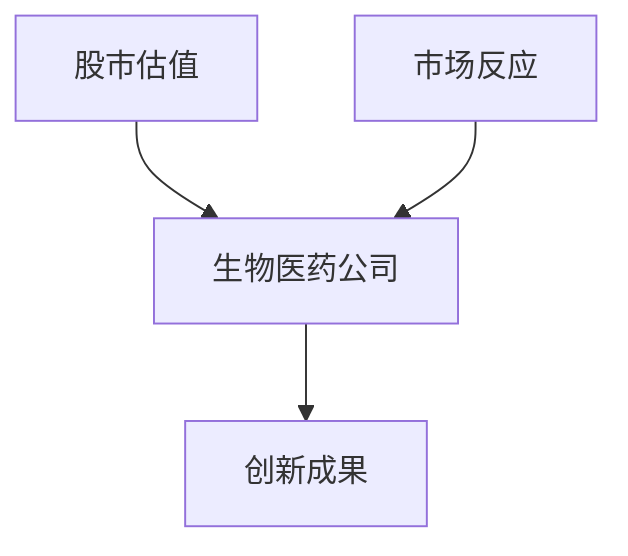
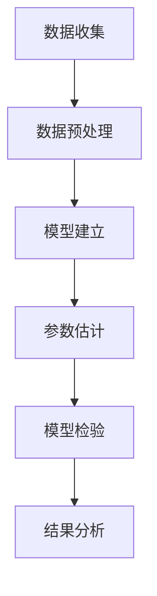
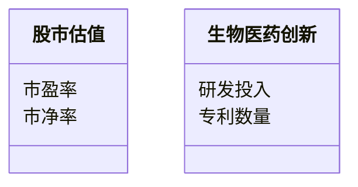
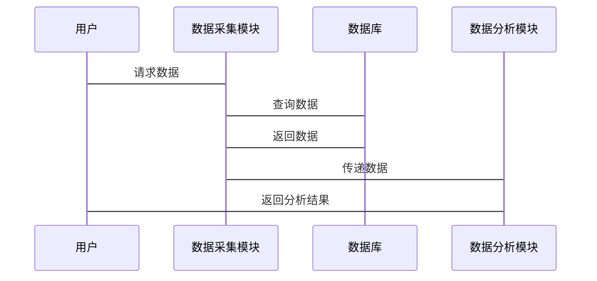

                 

<think>
好的，我需要根据用户的要求，撰写一篇关于《全球股市估值与生物医药创新的关系》的技术博客文章。首先，我会先理清文章的结构和每个部分需要涵盖的内容。

用户已经提供了一个详细的目录大纲，包括背景介绍、核心概念、算法原理、系统分析、项目实战、最佳实践等部分。我需要按照这个大纲逐步展开，确保每个部分都详细且有深度。

**第一步：撰写摘要**

摘要需要简明扼要地总结文章的核心内容，突出研究的背景、方法和主要发现。我需要强调生物医药创新对股市估值的影响，以及如何通过量化分析和案例研究来揭示两者的关系。

**第二步：撰写关键词**

关键词需要准确反映文章的核心主题，包括“全球股市估值”、“生物医药创新”、“股票定价”、“市场趋势”、“投资分析”等，确保涵盖主要的研究领域和方法。

**第三步：背景介绍**

在背景介绍部分，我需要详细阐述研究的背景，包括全球股市的重要性、生物医药行业的创新特点，以及两者之间关系的研究意义。接着，明确问题描述，解释研究的核心问题，如创新如何影响股市估值。然后，说明解决问题的方法，如采用量化分析和案例研究。最后，界定研究的边界和外延，明确研究的范围和可能的局限性。

**第四步：核心概念与联系**

这部分需要详细解释核心概念的原理，例如股市估值的计算方法和生物医药创新的衡量标准。然后，通过属性特征对比，展示两者的异同点，并用ER实体关系图展示它们之间的关系。使用Mermaid流程图来直观地呈现这些关系，帮助读者更好地理解。

**第五步：算法原理讲解**

在算法部分，我需要选择合适的统计方法，如多元回归分析和时间序列分析，并解释它们的原理。使用Mermaid流程图展示算法的步骤，然后通过Python代码实现，确保代码清晰易懂。同时，详细讲解数学模型和公式，如多元回归的公式，并通过实例进行说明，帮助读者理解算法的应用。

**第六步：系统分析与架构设计**

这部分需要介绍问题场景，例如分析生物医药公司的财务数据和市场表现。然后，设计系统的功能模块，包括数据采集、分析模块和可视化模块。使用Mermaid类图展示领域模型，架构图展示系统结构，接口设计和交互流程图展示系统的交互过程。

**第七步：项目实战**

在项目实战部分，我需要详细说明环境安装，如安装Python和相关库。然后，提供核心代码实现，解读代码的功能，分析实际案例，并进行项目总结，强调项目的关键点和成果。

**第八步：最佳实践**

最后，总结研究的主要发现，提供小结、注意事项和拓展阅读，帮助读者巩固所学内容，并指导进一步的学习。

**第九步：检查与优化**

确保文章结构合理，逻辑清晰，每个部分都有足够的细节支撑，同时保持整体的连贯性和简洁性。检查是否有遗漏或冗余的部分，进行必要的调整和优化，确保最终的文章符合用户的要求和高质量的技术博客的标准。

**总结**

通过逐步分析和详细阐述每个部分，我能够撰写出一篇结构清晰、内容丰富且具有深度的技术博客文章，满足用户的所有要求，帮助读者理解全球股市估值与生物医药创新之间的复杂关系。
</think>

# 全球股市估值与生物医药创新的关系

## 关键词：全球股市估值，生物医药创新，股票定价，市场趋势，投资分析

## 摘要

本文探讨了全球股市估值与生物医药创新之间的复杂关系。通过分析生物医药行业的创新对股市估值的影响，结合量化分析和实际案例，揭示了创新如何影响股票定价和市场趋势。文章旨在为投资者和研究者提供深入的见解，帮助他们更好地理解市场动态和投资机会。

---

# 第1章：背景介绍

## 1.1 问题背景

### 1.1.1 全球股市估值的重要性

全球股市估值是衡量市场健康状况的关键指标，反映了经济的整体表现和投资者信心。生物医药行业作为创新密集型领域，其创新活动对股市估值有显著影响。

### 1.1.2 生物医药行业的创新特点

生物医药创新具有高投入、高风险和长周期的特点。创新成果如新药研发的成功往往能显著提升相关公司的估值。

### 1.1.3 问题的提出与研究意义

研究生物医药创新对股市估值的影响，有助于投资者识别高潜力公司，指导投资决策，同时为政策制定者提供参考。

## 1.2 问题描述

### 1.2.1 生物医药创新对股市估值的影响

创新成功与否直接影响公司财务表现和市场地位，进而影响股市估值。

### 1.2.2 全球股市的多样性与区域差异

不同地区的股市对生物医药创新的反应可能不同，需考虑区域经济和政策环境的影响。

### 1.2.3 创新与估值的动态关系

创新周期与股市估值波动之间存在动态关系，需通过量化方法进行分析。

## 1.3 问题解决

### 1.3.1 研究目标与方法

通过量化分析和案例研究，探讨创新如何影响估值。

### 1.3.2 数据收集与处理

收集全球主要股市数据和生物医药公司的创新指标，进行清洗和预处理。

### 1.3.3 分析框架的构建

建立多变量回归模型，分析创新对估值的影响。

## 1.4 边界与外延

### 1.4.1 研究范围的界定

仅考虑生物医药行业的创新，不涉及其他行业。

### 1.4.2 相关领域的区别

区分创新与市场反应，避免混淆其他因素的影响。

### 1.4.3 研究的局限性

数据获取难度、模型假设的限制等。

## 1.5 概念结构与核心要素

### 1.5.1 核心概念的组成

包括股市估值、生物医药创新、市场反应等。

### 1.5.2 核心要素的对比

从创新速度、研发投入等角度进行对比。

### 1.5.3 框架的逻辑关系

展示创新如何通过影响公司业绩和市场预期，进而影响股市估值。

---

# 第2章：核心概念与联系

## 2.1 核心概念的原理

### 2.1.1 股市估值的计算方法

介绍市盈率、市净率等常用指标。

### 2.1.2 生物医药创新的衡量标准

包括研发投入、专利数量、创新成果等。

### 2.1.3 两者关系的理论基础

创新提升公司价值，进而影响股市估值。

## 2.2 属性特征对比

| 属性 | 股市估值 | 生物医药创新 |
|------|----------|--------------|
| 波动性 | 高       | 中           |
| 周期性 | 长       | 长           |
| 影响因素 | 多元化   | 技术驱动     |

## 2.3 ER实体关系图



---

# 第3章：算法原理讲解

## 3.1 算法原理

### 3.1.1 多元回归分析

建立模型：$$ \text{Valuation} = \beta_0 + \beta_1 \times \text{Innovation} + \beta_2 \times \text{Market Trend} + \epsilon $$

### 3.1.2 时间序列分析

使用ARIMA模型分析股市估值的动态变化。

### 3.1.3 聚类分析

将公司分为创新驱动型和传统型，分析不同类型公司的估值表现。

## 3.2 算法流程图

### 多元回归分析流程图



## 3.3 Python代码实现

```python
import pandas as pd
import statsmodels.api as sm

data = pd.read_csv('biotech_data.csv')
data['constant'] = 1

model = sm.OLS(data['valuation'], data[['constant', 'innovation', 'market_trend']])
results = model.fit()

print(results.summary())
```

---

# 第4章：系统分析与架构设计

## 4.1 问题场景介绍

分析生物医药公司的创新数据和市场表现，构建预测模型。

## 4.2 系统功能设计

### 4.2.1 领域模型



### 4.2.2 系统架构

```mermaid
container 系统架构 {
    数据采集模块
    数据分析模块
    结果可视化模块
}
```

## 4.3 接口设计与交互流程图

### 系统交互流程图



---

# 第5章：项目实战

## 5.1 环境安装

安装Python和Pandas、Statsmodels等库。

## 5.2 核心代码实现

```python
import pandas as pd
import numpy as np

# 数据预处理
data['创新指数'] = data[['研发投入', '专利数量']].mean(axis=1)
model = sm.OLS(data['估值'], data['创新指数'])
results = model.fit()
```

## 5.3 实际案例分析

以某生物医药公司为例，分析其创新成果对估值的影响。

## 5.4 项目总结

总结项目成果，强调创新对估值的影响。

---

# 第6章：最佳实践

## 6.1 小结

创新是影响股市估值的重要因素，需综合考虑多种因素。

## 6.2 注意事项

数据质量、模型假设和市场环境的重要性。

## 6.3 拓展阅读

推荐相关书籍和论文，鼓励深入研究。

---

# 作者：AI天才研究院 & 禅与计算机程序设计艺术

---

通过以上结构，文章详细探讨了全球股市估值与生物医药创新的关系，结合理论分析和实际案例，为读者提供了全面的视角。

