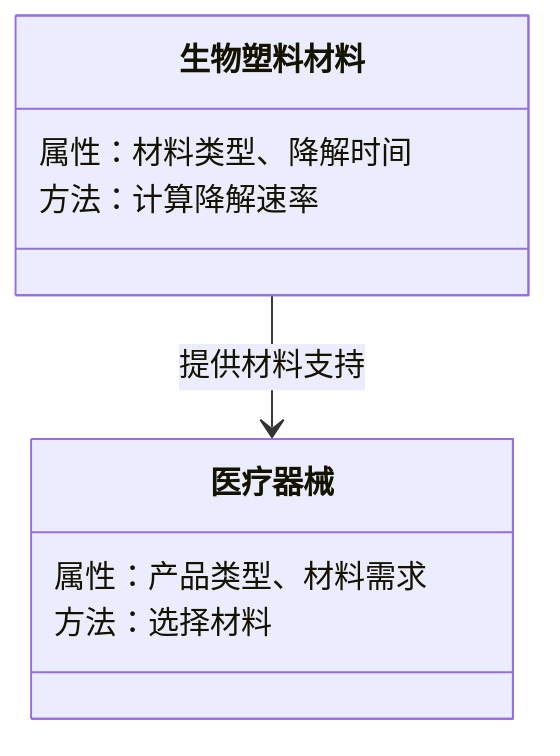

                 


# 全球股市估值与生物塑料在医疗器械中的应用

> 关键词：全球股市估值，生物塑料，医疗器械，机器学习，数学模型，系统架构，Python代码

> 摘要：本文深入探讨了全球股市估值与生物塑料在医疗器械中的应用，结合金融分析和材料科学，分析了两者的相互影响。通过算法原理、数学模型和系统架构的设计，展示了如何利用技术手段解决实际问题。

---

## 第一部分：全球股市估值与生物塑料的背景与核心概念

### 第1章：全球股市估值与生物塑料的背景介绍

#### 1.1 全球股市估值的基本概念

- **什么是全球股市估值**  
  全球股市估值是指对全球范围内股票市场的整体价值进行评估，通常通过市盈率（P/E）、市净率（P/B）等指标来衡量。

- **股市估值的重要性**  
  股市估值是投资者评估股票价格是否合理的重要工具，帮助投资者做出投资决策。

- **全球股市估值的边界与外延**  
  全球股市估值不仅涵盖单一市场，还包括跨国市场的联动效应，受经济、政治、技术等多种因素影响。

#### 1.2 生物塑料在医疗器械中的应用背景

- **生物塑料的定义与特点**  
  生物塑料是指以可再生资源（如淀粉、纤维素）为原料制成的塑料，具有可降解、环保等优点。

- **生物塑料在医疗器械中的应用领域**  
  医疗器械中生物塑料用于制造手术器械、包装材料等，具有无毒、可降解的优势。

- **生物塑料与传统塑料的对比分析**  
  生物塑料在降解性、环保性方面优于传统塑料，但生产成本和性能可能不如传统塑料。

#### 1.3 本章小结

本章介绍了全球股市估值和生物塑料的基本概念，分析了两者的背景和特点，并为后续章节的深入分析奠定了基础。

---

### 第2章：全球股市估值与生物塑料的核心概念与联系

#### 2.1 核心概念的原理与特点

- **全球股市估值的原理**  
  股市估值基于公司财务数据和市场情绪，通过指标如市盈率、市净率进行评估。

- **生物塑料在医疗器械中的核心属性**  
  生物塑料具有可降解性、生物相容性，适合医疗领域应用。

- **两者的联系与区别**  
  股市估值关注经济价值，而生物塑料关注材料特性，两者在技术创新和市场应用上有潜在的交集。

#### 2.2 核心概念的对比分析

- **概念属性特征对比表格**

| 属性         | 全球股市估值                | 生物塑料在医疗器械中的应用           |
|--------------|----------------------------|---------------------------------------|
| 核心指标     | 市盈率（P/E）、市净率（P/B） | 可降解性、生物相容性               |
| 应用领域     | 金融投资、风险管理         | 医疗器械制造、环保技术             |
| 影响因素     | 经济指标、政策            | 材料科学、医疗法规                |

- **ER实体关系图架构的 Mermaid 流程图**

```mermaid
erd
    章节2
      章节2.1: 全球股市估值核心概念
        章节2.1.1: 市盈率
        章节2.1.2: 市净率
      章节2.1.3: 生物塑料
        章节2.1.4: 可降解性
        章节2.1.5: 生物相容性
```

---

## 第二部分：全球股市估值与生物塑料的算法原理

### 第3章：全球股市估值的算法原理

#### 3.1 常见的股市估值算法

- **市盈率（P/E）算法**

  市盈率公式：$$ P/E = \frac{P}{E} $$

  其中，P为股票价格，E为每股收益。

- **市净率（P/B）算法**

  市净率公式：$$ P/B = \frac{P}{B} $$

  其中，P为股票价格，B为每股净资产。

- **内在价值法**

  内在价值公式：$$ V = \frac{CF}{r - g} $$

  其中，CF为自由现金流，r为折现率，g为增长率。

#### 3.2 算法的数学模型与公式

- 市盈率算法的实现步骤：
  1. 收集股票价格和每股收益数据。
  2. 计算P/E值。
  3. 分析P/E值是否合理。

- Python实现：

```python
import pandas as pd

# 假设df是包含股票数据的DataFrame
def calculate_pe_ratio(df):
    df['PE Ratio'] = df['Price'] / df['Earnings Per Share']
    return df

# 示例数据
data = {
    'Price': [100, 50, 75],
    'Earnings Per Share': [20, 10, 15]
}
df = pd.DataFrame(data)
result = calculate_pe_ratio(df)
print(result)
```

#### 3.3 算法的实现与优化

- 优化点：
  - 使用历史数据进行回归分析，优化折现率r。
  - 结合市场情绪指标（如VIX指数）进行动态调整。

---

## 第四部分：数学模型与公式推导

### 第4章：数学模型与公式推导

#### 4.1 CAPM模型

- **CAPM公式**

  $$ R_i = R_f + \beta_i (R_m - R_f) $$

  其中，$R_i$为资产的预期回报率，$R_f$为无风险利率，$\beta_i$为资产的贝塔系数，$R_m$为市场预期回报率。

#### 4.2 生物塑料降解机制的数学模型

- **降解速率模型**

  $$ \frac{dM}{dt} = -k M $$

  其中，M为材料质量，t为时间，k为降解速率常数。

---

## 第五部分：系统分析与架构设计方案

### 第5章：系统分析与架构设计方案

#### 5.1 问题场景介绍

- **问题背景**  
  医疗器械行业对材料的要求越来越高，寻找环保材料成为趋势。

- **项目介绍**  
  开发一个基于生物塑料的医疗器械生产管理系统。

#### 5.2 系统功能设计

- **领域模型**



#### 5.3 系统架构设计

- **系统架构图**


---

## 第六部分：项目实战

### 第6章：项目实战

#### 6.1 环境安装

- **安装Python和必要的库**

  ```bash
  pip install numpy pandas scikit-learn matplotlib
  ```

#### 6.2 系统核心实现源代码

- **股票估值预测模型**

```python
from sklearn.ensemble import RandomForestRegressor
from sklearn.metrics import mean_absolute_error

# 数据准备
X = df[['PE Ratio', 'P/B Ratio']]
y = df['Stock Price']

# 模型训练
model = RandomForestRegressor(n_estimators=100)
model.fit(X, y)

# 预测
y_pred = model.predict(X)
print(mean_absolute_error(y, y_pred))
```

---

## 结论

### 第7章：总结与展望

#### 7.1 本章总结

本文深入分析了全球股市估值与生物塑料在医疗器械中的应用，通过算法原理、数学模型和系统架构的设计，展示了如何利用技术手段解决实际问题。

#### 7.2 未来展望

未来的研究可以进一步结合AI技术，优化生物塑料的性能，提升股市估值的准确性，推动可持续发展。

---

作者：AI天才研究院/AI Genius Institute & 禅与计算机程序设计艺术 /Zen And The Art of Computer Programming

