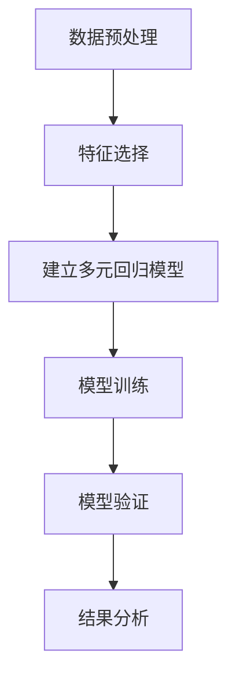
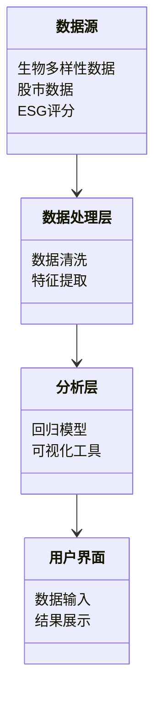
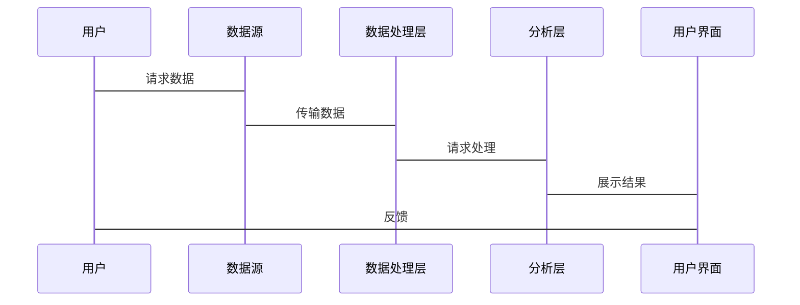

                 


# 全球股市估值与生物多样性保护的关联

> **关键词**：全球股市估值、生物多样性保护、金融市场、生态经济学、可持续发展  
> **摘要**：本文探讨全球股市估值与生物多样性保护之间的关联，分析生物多样性保护对金融市场的影响，以及金融市场在推动生物多样性保护中的作用。通过构建数学模型和系统架构，量化两者的关联，并提出实际应用的解决方案，为政策制定者和投资者提供参考。

---

## 第一部分：背景介绍

### 第1章：全球股市估值与生物多样性保护的背景

#### 1.1 问题背景
- **1.1.1 生物多样性危机的现状**
  - 生物多样性减少的速度远超自然历史水平，威胁生态系统的稳定性和功能。
  - 约100万个物种面临灭绝风险，生态系统服务价值每年损失数千亿美元。

- **1.1.2 全球金融体系的现状**
  - 全球股市市值超过100万亿美元，金融市场在经济活动中占据核心地位。
  - 金融机构在投资决策中逐渐关注环境、社会和治理（ESG）因素。

- **1.1.3 生物多样性与金融体系的相互作用**
  - 生物多样性是生态系统服务的基础，影响农业、水资源和气候调节。
  - 金融投资可能对生物多样性造成负面影响，如森林砍伐和污染。

#### 1.2 问题描述
- **1.2.1 生物多样性保护的重要性**
  - 生物多样性是人类生存的基础，支持食物、药物和工业原料的供应。
  - 生态系统服务的价值估计为每年1.6万亿至6.7万亿美元。

- **1.2.2 全球股市估值的影响因素**
  - 股市估值受经济、政治、技术和环境因素影响。
  - 环境风险和ESG因素逐渐成为影响股市估值的重要因素。

- **1.2.3 两者关联的潜在影响**
  - 生物多样性下降可能增加企业风险，影响股市估值。
  - 金融市场通过投资和政策影响生物多样性保护，形成双向关联。

#### 1.3 问题解决
- **1.3.1 提出解决方案**
  - 构建数学模型，量化生物多样性保护对股市估值的影响。
  - 分析金融市场在生物多样性保护中的作用机制。

- **1.3.2 解决方案的可行性分析**
  - 数据收集：利用现有ESG数据和生物多样性指数。
  - 方法：使用统计和机器学习模型，结合领域知识。

- **1.3.3 解决方案的预期效果**
  - 提供量化证据，支持政策制定和投资决策。
  - 推动金融市场与生态保护的协同效应。

#### 1.4 边界与外延
- **1.4.1 研究的范围**
  - 研究全球范围内的股市估值和生物多样性保护的关联。
  - 重点关注发达国家和发展中国家的差异。

- **1.4.2 相关概念的界定**
  - 生物多样性保护：保护物种、生态系统和遗传多样性。
  - 股市估值：基于市场交易的公司价值评估。

- **1.4.3 可能的局限性**
  - 数据的可获得性和质量限制研究范围。
  - 模型的简化可能导致结果偏差。

#### 1.5 核心要素组成
- **1.5.1 生物多样性的核心要素**
  - 物种多样性、生态系统多样性和遗传多样性。

- **1.5.2 股市估值的核心要素**
  - 收益、资产、行业地位和风险管理。

- **1.5.3 两者关联的核心要素**
  - 环境风险、治理结构和投资者行为。

---

## 第二部分：核心概念与联系

### 第2章：生物多样性保护的核心概念

#### 2.1 生物多样性的定义与分类
- **2.1.1 定义**
  - 生物多样性是指地球上所有生物的多样性，包括物种、生态系统和遗传多样性。

- **2.1.2 分类**
  - **物种多样性**：不同物种的数量和分布。
  - **生态系统多样性**：不同生态系统的类型和功能。
  - **遗传多样性**：生物遗传特征的多样性。

#### 2.2 生物多样性保护
- **2.2.1 目标**
  - 保护物种和生态系统，防止灭绝和退化。
  - 提供生态系统服务，支持人类福祉。

- **2.2.2 方法**
  - 设立保护区、可持续利用资源、国际合作和公众教育。

---

## 第三部分：算法原理

### 第3章：关联分析模型

#### 3.1 算法选择
- **3.1.1 方法选择**
  - 使用多元回归模型，量化生物多样性保护对股市估值的影响。

#### 3.2 算法流程


#### 3.3 数学模型
- **3.3.1 回归方程**
  $$ \text{Stock Value} = \beta_0 + \beta_1 \times \text{Biodiversity Index} + \beta_2 \times \text{ESG Score} + \epsilon $$
  - 其中，Biodiversity Index是生物多样性指数，ESG Score是环境、社会和治理评分。

- **3.3.2 示例计算**
  - 假设β1=0.5，β2=0.3，截距β0=100。
  - 当Biodiversity Index=80，ESG Score=70时，$$ \text{Stock Value} = 100 + 0.5 \times 80 + 0.3 \times 70 = 100 + 40 + 21 = 161 $$

---

## 第四部分：系统分析与架构设计

### 第4章：系统架构设计

#### 4.1 问题场景
- 数据收集：获取生物多样性指数和股市数据。
- 数据分析：构建模型，量化关联。
- 可视化：展示结果，支持决策。

#### 4.2 系统功能设计


#### 4.3 系统交互设计


---

## 第五部分：项目实战

### 第5章：环境安装与代码实现

#### 5.1 环境安装
- Python 3.8及以上
- NumPy、Pandas、Scikit-learn、Matplotlib

#### 5.2 核心代码实现
```python
import numpy as np
import pandas as pd
from sklearn.linear_model import LinearRegression
import matplotlib.pyplot as plt

# 数据加载
data = pd.read_csv('biodiversity_stock.csv')

# 数据预处理
X = data[['Biodiversity_Index', 'ESG_Score']]
y = data['Stock_Value']

# 模型训练
model = LinearRegression()
model.fit(X, y)

# 模型预测
predictions = model.predict(X)

# 可视化
plt.scatter(y, predictions)
plt.xlabel('真实值')
plt.ylabel('预测值')
plt.title('回归分析')
plt.show()
```

---

## 第六部分：最佳实践

### 第6章：总结与建议

#### 6.1 总结
- 生物多样性保护与股市估值密切相关。
- 金融市场在生态保护中具有重要作用。

#### 6.2 小结
- 量化分析为政策和投资提供科学依据。
- 需要加强国际合作和信息公开。

#### 6.3 注意事项
- 数据质量影响结果准确性。
- 模型需结合实际进行调整。

#### 6.4 拓展阅读
- 推荐阅读相关文献，深入探讨生物多样性与金融的互动机制。

---

**作者：AI天才研究院/AI Genius Institute & 禅与计算机程序设计艺术 /Zen And The Art of Computer Programming**

