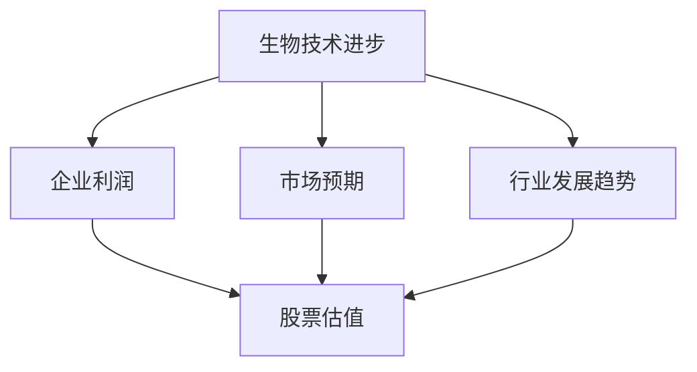
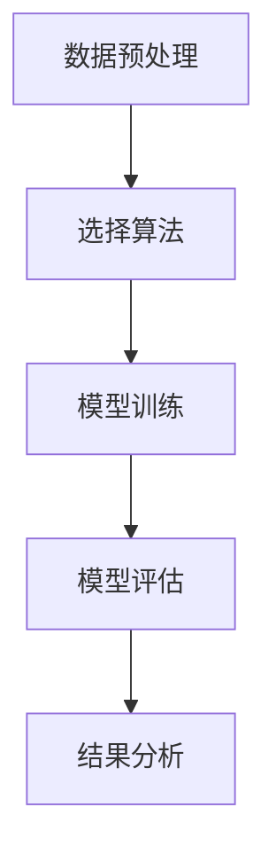
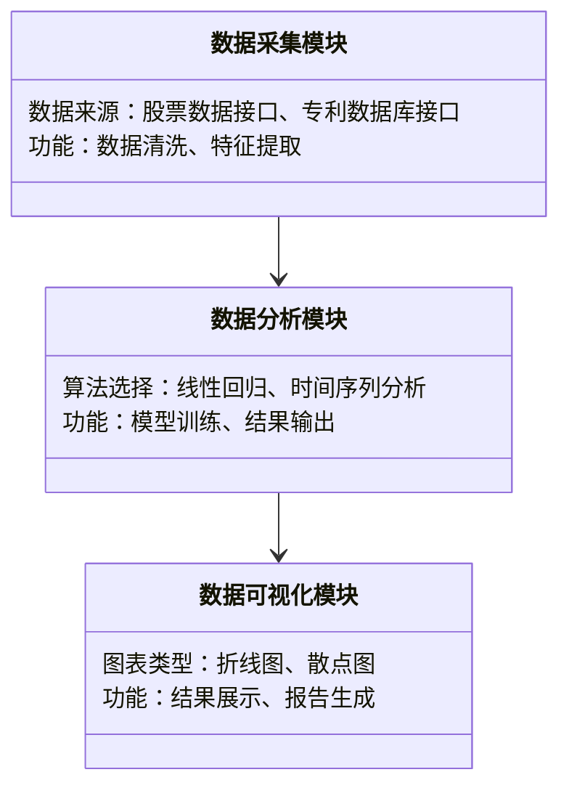
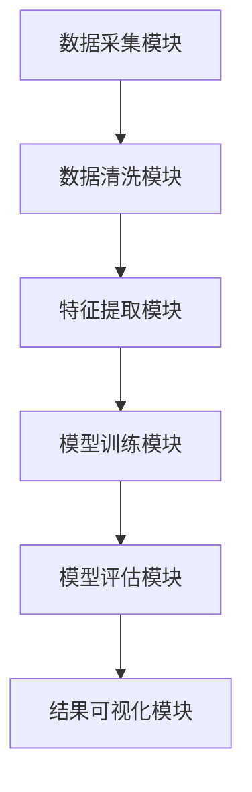

                 


# 全球股市估值与生物技术进步的关联

---

## 关键词：  
全球股市估值、生物技术进步、数学模型、股票市场分析、技术经济关联、投资策略

---

## 摘要：  
本文探讨了生物技术进步与全球股市估值之间的深刻关联。通过建立数学模型和实证分析，我们揭示了生物技术创新对股市估值的直接影响和间接影响路径。文章从生物技术进步的经济影响、股市估值的核心原理出发，结合回归分析和时间序列分析等算法，构建了定量评估模型。我们还通过实际案例分析，展示了如何利用这些模型优化投资策略，为投资者和管理层提供科学依据。

---

## 目录大纲

### 第一部分：背景介绍

#### 第1章：问题背景与问题描述

##### 1.1 生物技术进步的经济影响
- 1.1.1 生物技术的定义与核心领域
  - 生物技术的定义：生物技术是指利用生物科学知识和技术，通过对生物体或其成分进行操作，以获得具有经济价值的产品或服务。
  - 核心领域：医药、农业、工业、环保。
- 1.1.2 生物技术进步对经济的推动作用
  - 医药领域的突破（如基因编辑技术）降低了疾病治疗成本，提升了企业利润。
  - 农业领域的创新（如转基因作物）提高了粮食产量，推动农业经济发展。
- 1.1.3 生物技术进步与股市估值的关联性
  - 生物技术公司的创新成果直接推动其股票价值上升。
  - 技术进步带来的市场前景变化会影响整个股市的估值水平。

##### 1.2 股市估值的基本概念
- 1.2.1 股市估值的定义与计算方法
  - 股市估值：对股票市场价格的评估，通常基于企业的财务状况、行业地位和市场前景。
  - 常用方法：市盈率（P/E）、市净率（P/B）、股息率等。
- 1.2.2 影响股市估值的主要因素
  - 宏观经济环境、行业发展趋势、企业盈利状况、市场情绪等。
- 1.2.3 生物技术进步对股市估值的特殊影响
  - 生物技术的突破性创新会导致相关股票估值的快速上升。
  - 技术转化周期长，导致市场对估值的反应存在滞后性。

##### 1.3 问题解决与研究目标
- 1.3.1 确定生物技术进步与股市估值的关系
  - 通过数据分析，验证生物技术进步对股市估值的正向影响。
- 1.3.2 建立数学模型分析二者关联性
  - 利用回归分析等方法，量化生物技术进步对股市估值的影响程度。
- 1.3.3 提出优化股市估值的策略
  - 基于模型结果，为投资者提供科学的投资建议。

##### 1.4 边界与外延
- 1.4.1 研究范围的界定
  - 本文主要研究生物技术进步对全球股市整体估值的影响，重点关注医药和农业领域。
- 1.4.2 研究的局限性
  - 数据获取限制：仅考虑公开上市的生物技术公司数据。
  - 时间范围：分析2010年至2023年的数据。
- 1.4.3 研究的潜在扩展方向
  - 探讨不同生物技术领域（如基因编辑、合成生物学）对股市估值的具体影响。
  - 结合人工智能技术进一步优化模型。

##### 1.5 核心概念与组成
- 1.5.1 生物技术进步的核心要素
  - 技术创新性：衡量技术突破的频率和程度。
  - 产业化程度：技术在实际生产中的应用范围。
- 1.5.2 股市估值的关键指标
  - 市盈率（P/E）：股票价格与每股收益的比率。
  - 市净率（P/B）：股票价格与每股净资产的比率。
- 1.5.3 二者的相互作用机制
  - 技术进步推动企业盈利上升，吸引投资者，提升估值。
  - 市场对技术前景的预期会影响股市估值的波动。

---

### 第二部分：核心概念与联系

#### 第2章：生物技术进步与股市估值的核心原理

##### 2.1 生物技术进步的原理
- 2.1.1 生物技术的创新机制
  - 基因编辑技术（如CRISPR-Cas9）的应用推动了医药行业的发展。
  - 合成生物学的进步促进了工业领域的创新。
- 2.1.2 技术进步的周期性
  - 生物技术从实验室研究到产业化应用通常需要较长周期。
- 2.1.3 技术进步对产业的推动作用
  - 创新技术的商业化推动了相关企业收入和利润的增长。

##### 2.2 股市估值的原理
- 2.2.1 估值的基本方法
  - 基于基本面分析：通过财务指标评估企业价值。
  - 基于市场情绪分析：通过市场参与者的心理预期评估价格。
- 2.2.2 市场情绪对估值的影响
  - 市场对生物技术前景的乐观预期会推高相关股票的估值。
- 2.2.3 财务指标对估值的作用
  - 高利润率和高成长性的生物技术企业通常具有较高的市盈率。

##### 2.3 二者的联系与区别
- 2.3.1 生物技术进步对股市估值的直接影响
  - 技术突破直接推动企业盈利增长，提升股票估值。
- 2.3.2 间接影响的路径分析
  - 技术进步带动行业整体发展，影响板块估值。
  - 市场预期变化影响整体估值水平。
- 2.3.3 区别与共同点的对比
  - 区别：生物技术进步是技术创新的结果，而股市估值是市场行为的结果。
  - 共同点：二者都受到经济环境和市场参与者行为的影响。

---

#### 第3章：核心概念的属性特征对比

##### 3.1 生物技术进步的属性特征
- 技术创新性：衡量技术的原创性和先进性。
- 产业化程度：衡量技术在实际生产中的应用范围。
- 市场反应的滞后性：技术进步到市场估值变化的时间差。

##### 3.2 股市估值的属性特征
- 价格波动性：股票价格受多种因素影响，具有较强的波动性。
- 信息敏感性：市场对信息的反应迅速，尤其是利好消息会快速推高估值。
- 主观性与客观性结合：估值既基于企业的客观财务指标，也受到市场情绪的主观影响。

##### 3.3 ER实体关系图架构



---

### 第三部分：算法原理讲解

#### 第4章：算法原理与实现

##### 4.1 算法选择与原理
- 4.1.1 回归分析
  - 线性回归模型：用于分析生物技术进步对股市估值的线性关系。
- 4.1.2 时间序列分析
  - ARIMA模型：用于分析生物技术进步对股市估值的动态影响。

##### 4.2 算法流程图



##### 4.3 算法实现

```python
# 示例代码：使用线性回归模型分析生物技术进步对股市估值的影响

import numpy as np
import pandas as pd
from sklearn.linear_model import LinearRegression
from sklearn.metrics import mean_squared_error

# 数据加载
data = pd.read_csv('biotech_stock.csv')

# 特征与目标变量分离
X = data[['R&D Investment', 'Patent Count']]
y = data['Stock Valuation']

# 模型训练
model = LinearRegression()
model.fit(X, y)

# 模型预测
y_pred = model.predict(X)

# 模型评估
 mse = mean_squared_error(y, y_pred)
 r2 = model.score(X, y)

print(f"均方误差：{mse}")
print(f"R²值：{r2}")
```

##### 4.4 数学模型与公式

线性回归模型的数学表达式：
$$ y = \beta_0 + \beta_1 x_1 + \beta_2 x_2 + \epsilon $$
其中：
- $y$ 是目标变量（股票估值）。
- $x_1$ 和 $x_2$ 是特征变量（研发投入和专利数量）。
- $\beta_0$ 是截距项。
- $\beta_1$ 和 $\beta_2$ 是回归系数。
- $\epsilon$ 是误差项。

---

### 第四部分：系统分析与架构设计方案

#### 第5章：系统分析与架构设计

##### 5.1 问题场景介绍
- 数据来源：选取全球主要股市中生物技术相关企业的数据。
- 数据范围：2010年至2023年间的股票估值、研发投入、专利数量等。

##### 5.2 系统功能设计



##### 5.3 系统架构设计



---

### 第五部分：项目实战

#### 第6章：项目实战与案例分析

##### 6.1 环境安装与配置
- 安装Python、Pandas、Scikit-learn等工具。
- 数据来源：公开股票数据和专利数据库。

##### 6.2 核心代码实现

```python
# 示例代码：股票估值预测模型

import pandas as pd
from sklearn.linear_model import LinearRegression
from sklearn.metrics import mean_squared_error, r2_score

# 加载数据
data = pd.read_csv('biotech_stocks.csv')

# 特征与目标变量
X = data[['R&D Investment', 'Patent Count']]
y = data['Stock Valuation']

# 训练模型
model = LinearRegression()
model.fit(X, y)

# 预测与评估
y_pred = model.predict(X)
mse = mean_squared_error(y, y_pred)
r2 = r2_score(y, y_pred)

print(f"均方误差：{mse}")
print(f"R²值：{r2}")
```

##### 6.3 实际案例分析
- 数据分析：选取某生物技术公司（如Moderna）的专利数量和研发投入，分析其股票估值的变化。
- 结果解读：模型预测该公司股票估值在未来一年的增长趋势。

##### 6.4 项目小结
- 通过案例分析验证模型的有效性。
- 总结生物技术进步对股市估值的具体影响路径。

---

### 第六部分：最佳实践

#### 第7章：最佳实践与总结

##### 7.1 小结
- 生物技术进步对股市估值具有显著的正向影响。
- 建立数学模型能够量化这种影响，为投资决策提供科学依据。

##### 7.2 注意事项
- 数据质量对模型结果的影响至关重要。
- 模型具有一定的局限性，需结合实际情况进行调整。

##### 7.3 拓展阅读
- 推荐书籍：《生物技术与经济发展》、《股票投资策略》。
- 推荐论文：《技术创新与股市估值的动态关系研究》。

---

## 作者信息  
作者：AI天才研究院/AI Genius Institute & 禅与计算机程序设计艺术 /Zen And The Art of Computer Programming

