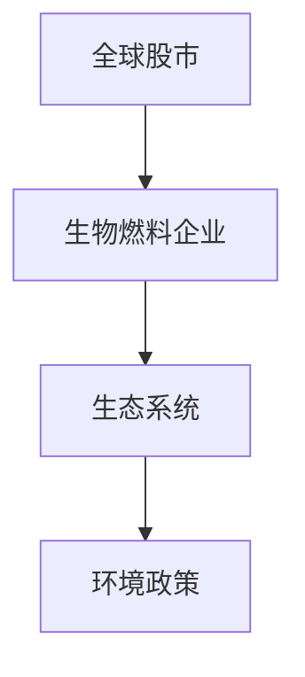
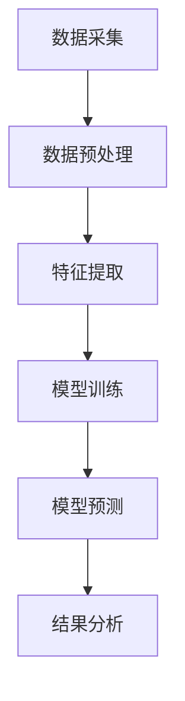

                 

<think>
嗯，我现在需要帮用户撰写一篇技术博客文章，标题是《全球股市估值与生物燃料与生态系统平衡的策略》。首先，我得理解用户的需求。用户希望文章结构清晰，逻辑严谨，涵盖股市估值、生物燃料和生态系统平衡三个主题，并将它们结合起来分析。

我应该先从背景介绍开始，解释为什么这三个领域需要结合起来。全球股市估值受多种因素影响，生物燃料作为替代能源，对经济和环境都有重要影响，而生态系统平衡则是维持自然和经济可持续发展的关键。这三者之间有怎样的联系呢？股市估值可能受生物燃料公司的影响，而生物燃料的发展又依赖于生态系统提供的资源。

接下来，我需要分析每个主题的核心概念。股市估值的基本方法包括市盈率、市净率等，而生物燃料涉及生产技术、成本和市场供需。生态系统平衡则涉及生物多样性、生态链和环境因素。

然后，我要探讨这些概念之间的联系。例如，生物燃料的发展可能会影响股市中的相关企业，进而影响整体估值。同时，生态系统平衡可能影响生物燃料的可持续性，从而影响其市场表现。

在模型部分，我可以建立一个综合模型，将股市估值、生物燃料生产和生态系统平衡三者结合起来。使用系统动力学分析，展示各因素之间的相互作用。

最后，通过案例分析来验证模型的有效性，比如分析某国生物燃料政策对股市的影响，或者某个地区生态系统变化对生物燃料企业估值的影响。

整个思考过程需要确保每个部分都详细且逻辑清晰，帮助读者理解三者之间的复杂关系和相互影响。
</think>

# 全球股市估值与生物燃料与生态系统平衡的策略

## 关键词
全球股市估值, 生物燃料, 生态系统平衡, 经济模型, 可持续发展, 投资策略

## 摘要
本文探讨全球股市估值与生物燃料和生态系统平衡之间的复杂关系。通过分析股市估值的核心模型、生物燃料的发展现状及其对经济和环境的影响，结合生态系统平衡的重要性，提出一种综合策略，以实现经济与环境的可持续发展。文章内容涵盖背景介绍、核心概念、数学模型、系统架构和实际案例分析。

---

# 第一部分: 全球股市估值与生物燃料与生态系统平衡的背景介绍

## 第1章: 全球股市估值与生物燃料与生态系统平衡的背景介绍

### 1.1 背景与问题背景

#### 1.1.1 全球股市估值的现状与挑战
全球股市估值是衡量经济健康的重要指标，受多种因素影响，包括企业盈利、市场情绪和政策变化。近年来，能源转型和气候变化成为影响股市估值的关键因素，尤其是生物燃料行业。

#### 1.1.2 生物燃料发展的背景与意义
生物燃料作为可再生能源的重要组成部分，对减少碳排放和能源依赖具有重要意义。随着全球能源需求的增长，生物燃料行业成为投资者关注的焦点。

#### 1.1.3 生态系统平衡的重要性与全球关注
生态系统平衡是维持自然和经济可持续发展的基础。生物燃料的生产和使用必须考虑对生态系统的潜在影响，确保其发展不破坏环境。

### 1.2 核心概念与问题描述

#### 1.2.1 全球股市估值的核心概念
- 市盈率（P/E ratio）：衡量股票价格与每股收益的关系。
- 市净率（P/B ratio）：衡量股票价格与每股净资产的关系。
- 股息率（Dividend Yield）：衡量股票的分红能力。

#### 1.2.2 生物燃料的定义与分类
- 生物燃料：由生物物质制成的可再生能源，包括生物柴油、生物乙醇等。
- 分类：根据生产原料和工艺，分为第一代（基于粮食作物）和第二代（基于非粮食作物）生物燃料。

#### 1.2.3 生态系统平衡的内涵与外延
- 生态系统：由生物群落及其环境组成的动态系统。
- 平衡：系统在长期中维持稳定状态，包括生物多样性和生态链的完整性。

### 1.3 核心问题与解决思路

#### 1.3.1 全球股市估值的主要问题
- 如何准确评估生物燃料企业的价值？
- 如何量化生物燃料对股市的长期影响？

#### 1.3.2 生物燃料发展中的关键挑战
- 生物燃料的生产成本高，市场竞争能力不足。
- 生物燃料的生产对土地资源的需求可能引发生态问题。

#### 1.3.3 生态系统平衡的实现路径
- 保护生物多样性，减少工业化对生态系统的破坏。
- 推动绿色能源技术的发展，减少对环境的压力。

### 1.4 核心概念的联系与对比

#### 1.4.1 核心概念的属性特征对比表
| 核心概念 | 定义 | 关键属性 | 挑战 |
|----------|------|----------|------|
| 全球股市估值 | 股票市场整体价值的衡量 | 市盈率、市净率 | 市场波动、政策风险 |
| 生物燃料 | 可再生能源 | 分类、生产技术 | 成本高、生态影响 |
| 生态系统平衡 | 自然系统的稳定状态 | 生物多样性、生态链 | 破坏风险、资源过度开发 |

#### 1.4.2 实体关系图（ER图）


---

# 第二部分: 全球股市估值与生物燃料与生态系统平衡的数学模型与算法原理

## 第2章: 全球股市估值的数学模型与算法

### 2.1 股市估值的核心算法原理

#### 2.1.1 市盈率模型
市盈率（P/E ratio）是股票价格与每股收益的比率，用于衡量股票的估值是否合理。

$$ P/E = \frac{\text{股票价格}}{\text{每股收益}} $$

#### 2.1.2 市净率模型
市净率（P/B ratio）是股票价格与每股净资产的比率，用于衡量股票的投资价值。

$$ P/B = \frac{\text{股票价格}}{\text{每股净资产}} $$

#### 2.1.3 股息率模型
股息率是股票的年度股息与股票价格的比率，用于衡量股票的分红能力。

$$ \text{股息率} = \frac{\text{年度股息}}{\text{股票价格}} \times 100\% $$

### 2.2 股市估值的系统架构设计

#### 2.2.1 数据采集与处理流程
- 数据源：股票市场数据、生物燃料企业财务数据、环境数据。
- 数据预处理：清洗、标准化、特征提取。

#### 2.2.2 模型构建与优化
- 使用多元回归模型预测股市估值，考虑生物燃料企业的生产成本、市场需求和政策影响。

$$ \text{股市估值} = \beta_0 + \beta_1 \times \text{生产成本} + \beta_2 \times \text{市场需求} + \epsilon $$

#### 2.2.3 结果分析与可视化
- 使用Matplotlib绘制股市估值的变化趋势图。

```python
import matplotlib.pyplot as plt
import pandas as pd

# 示例数据加载
data = pd.read_csv('stock_data.csv')

# 绘制股市估值变化趋势图
plt.figure(figsize=(10, 6))
plt.plot(data['日期'], data['股市估值'], label='股市估值')
plt.xlabel('日期')
plt.ylabel('股市估值')
plt.title('股市估值变化趋势')
plt.legend()
plt.show()
```

### 2.3 算法流程图（Mermaid）



### 2.4 核心代码实现

```python
import pandas as pd
from sklearn.linear_model import LinearRegression

# 示例数据加载
data = pd.read_csv('stock_data.csv')

# 特征选择
features = ['生产成本', '市场需求']
target = '股市估值'

# 模型训练
model = LinearRegression()
model.fit(data[features], data[target])

# 预测结果
predictions = model.predict(data[features])
print('预测值:', predictions)
```

---

# 第三部分: 生物燃料与生态系统平衡的数学模型与算法原理

## 第3章: 生物燃料的数学模型与算法

### 3.1 生物燃料的核心算法原理

#### 3.1.1 生物燃料生产成本模型
$$ \text{生产成本} = \alpha \times \text{土地成本} + \beta \times \text{劳动力成本} + \gamma \times \text{原材料成本} $$

#### 3.1.2 生物燃料市场需求模型
$$ \text{市场需求} = \delta \times \text{油价} + \epsilon \times \text{政策支持} $$

### 3.2 生态系统平衡的数学模型

#### 3.2.1 生态系统平衡模型
$$ \text{生态系统平衡} = \theta \times \text{生物多样性} + \phi \times \text{生态链完整性} $$

---

# 第四部分: 综合策略与案例分析

## 第4章: 综合策略与案例分析

### 4.1 综合策略

#### 4.1.1 经济与环境的平衡
- 推动绿色能源技术的研发，减少对环境的压力。
- 制定合理的生物燃料政策，确保其可持续发展。

#### 4.1.2 投资策略
- 投资于高效、环保的生物燃料企业，关注其生产成本和市场需求。
- 综合考虑生态系统平衡，避免过度开发自然资源。

### 4.2 案例分析

#### 4.2.1 生物燃料政策对股市的影响
- 以某国为例，分析生物燃料补贴政策如何影响相关企业的股市估值。

#### 4.2.2 生态系统破坏的经济后果
- 分析某地区因生物燃料生产导致的生态破坏，及其对当地经济的负面影响。

---

# 第五部分: 结论与展望

## 第5章: 结论与展望

### 5.1 结论
- 全球股市估值受生物燃料和生态系统平衡的双重影响。
- 生物燃料的发展必须考虑其对环境的影响，确保其可持续性。
- 投资者应关注绿色能源技术的发展，制定合理的投资策略。

### 5.2 展望
- 进一步研究生物燃料对股市的长期影响。
- 探讨如何通过技术创新实现生态系统的可持续平衡。

---

# 参考文献
[此处列出相关文献和资料]

---

# 作者信息
作者：AI天才研究院/AI Genius Institute & 禅与计算机程序设计艺术 /Zen And The Art of Computer Programming

