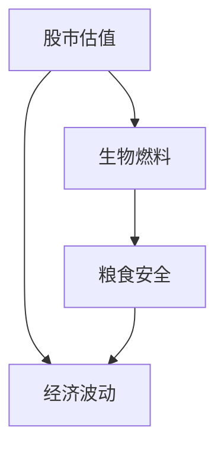
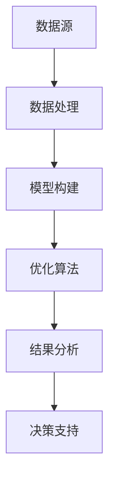
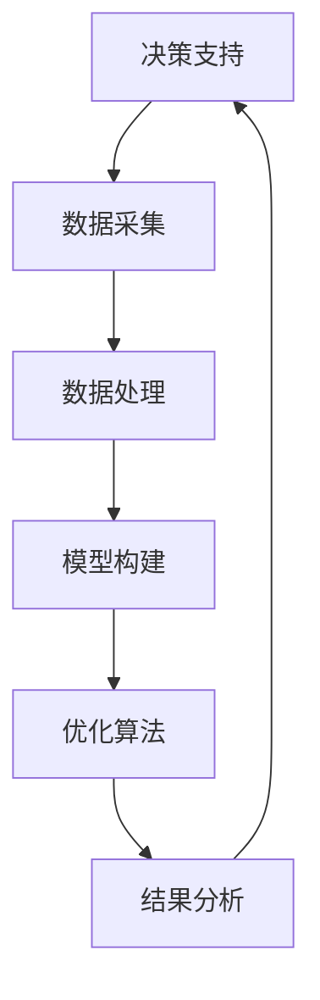

                 


# 全球股市估值与生物燃料与粮食安全的平衡策略

## 关键词：全球股市估值、生物燃料、粮食安全、系统分析、平衡策略、经济模型、可持续发展

## 摘要：本文探讨了全球股市估值与生物燃料和粮食安全之间的复杂关系，分析了它们对全球经济的影响，并提出了平衡策略。通过系统分析和优化模型，本文为实现三者的可持续发展提供了理论依据和实践指导。

---

## 第一部分: 全球股市估值与生物燃料与粮食安全的背景与核心概念

### 第1章: 全球股市估值的现状与挑战

#### 1.1 全球股市估值的基本概念
股票估值是评估公司内在价值的过程，涉及DCF模型、PE比率等方法。当前全球股市估值受经济波动、政策变化和投资者情绪的影响，存在波动性和系统性风险。

#### 1.2 全球股市估值的挑战与问题
经济波动、市场联动性和投资者行为对股市估值构成挑战，需通过系统性分析和优化模型来应对。

### 第2章: 生物燃料的生产与应用

#### 2.1 生物燃料的基本概念
生物燃料包括生物柴油和生物乙醇，生产过程涉及原料种植、转化和精炼，具有环境效益，但生产成本高且依赖补贴。

#### 2.2 生物燃料的市场需求与供给
全球市场需求增长，但供给受限于土地和资源，需平衡能源需求与粮食安全。

### 第3章: 粮食安全的全球挑战

#### 3.1 粮食安全的基本概念
粮食安全涉及生产、分配和消费，受气候变化、土地资源和价格波动影响，威胁社会稳定。

#### 3.2 粮食安全的主要威胁
气候变化、资源有限性和价格波动对粮食安全构成威胁，需采取措施应对。

### 第4章: 全球股市估值、生物燃料与粮食安全的关系

#### 4.1 三者之间的相互影响
生物燃料生产推高粮食价格，影响股市；粮食价格波动影响股市，全球经济波动加剧三者关联。

#### 4.2 系统性风险与平衡策略
系统性风险需通过平衡策略解决，目标是实现三者的可持续发展。

---

## 第二部分: 核心概念与联系

### 第5章: 核心概念的原理与属性对比

#### 5.1 核心概念的原理分析
股市估值基于经济学原理，生物燃料基于化学生产，粮食安全基于生态学。

#### 5.2 核心概念的属性对比
| 概念 | 定义 | 影响因素 | 目标 |
|------|------|----------|------|
| 股市估值 | 股票价值评估 | 经济、政策、情绪 | 投资决策 |
| 生物燃料 | 可再生能源 | 生物量、技术 | 减少碳排放 |
| 粮食安全 | 稳定供应 | 气候、资源、价格 | 社会稳定 |

#### 5.3 ER实体关系图


---

## 第三部分: 算法原理与系统分析

### 第6章: 算法原理与系统优化

#### 6.1 综合平衡优化模型
数学模型：
$$
\text{Minimize } Z = \sum_{i} c_i x_i + \sum_{j} d_j y_j
$$
$$
\text{Subject to } \sum_{i} a_i x_i + \sum_{j} b_j y_j \leq R
$$
$$
x_i, y_j \geq 0
$$

#### 6.2 统筹协调优化算法
1. 数据收集与预处理
2. 模型构建与参数设定
3. 求解与结果分析
4. 结果验证与优化

### 第7章: 系统分析与架构设计

#### 7.1 问题场景介绍
生物燃料生产导致粮食价格上涨，影响股市，威胁粮食安全，需系统分析。

#### 7.2 系统架构设计


#### 7.3 核心功能模块
1. 数据处理模块
2. 模型构建模块
3. 优化算法模块
4. 结果分析模块

#### 7.4 系统交互流程


---

## 第四部分: 项目实战与案例分析

### 第8章: 项目实战

#### 8.1 环境安装与数据准备
安装Python和相关库，收集全球股市、生物燃料和粮食数据。

#### 8.2 核心代码实现
```python
import numpy as np
from scipy.optimize import minimize

def objective_function(variables):
    x = variables[0]
    y = variables[1]
    return np.sum(c * x) + np.sum(d * y)

constraints = {
    'type': 'ineq',
    'fun': lambda variables: np.sum(a * variables[0] + b * variables[1]) - R <= 0
}

result = minimize(objective_function, initial_guess, method='SLSQP', constraints=constraints)
```

#### 8.3 案例分析与结果解读
分析生物燃料和粮食价格波动对股市的影响，优化平衡策略。

---

## 第五部分: 结论与建议

### 第9章: 结论与建议

#### 9.1 主要结论
三者关系复杂，需系统分析和优化模型。

#### 9.2 实践建议
1. 建立监测机制
2. 制定应急策略
3. 加强国际合作

---

## 作者：AI天才研究院/AI Genius Institute & 禅与计算机程序设计艺术 /Zen And The Art of Computer Programming

---

这篇文章通过详细分析全球股市估值、生物燃料和粮食安全的关系，提出了系统的平衡策略，为实现三者的可持续发展提供了理论和实践指导。

