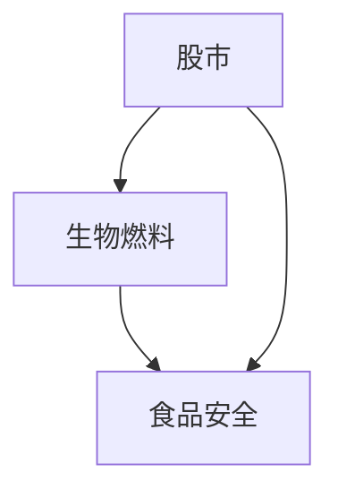

                 

<think>
好，我现在需要完成用户的要求，撰写一篇关于《全球股市估值与生物燃料与食品安全的平衡》的技术博客文章。首先，我要理解用户的需求，他们希望我以一位世界级的人工智能专家和程序员的角度，详细分析这三个领域之间的关系，并提出平衡的策略。

首先，我需要明确文章的结构。用户已经提供了一个详细的目录大纲，我需要按照这个大纲逐步展开。文章开头要有摘要，接着是各个章节，每个章节下有详细的子章节，涵盖背景介绍、核心概念、算法原理、系统分析、项目实战等部分。

接下来，我需要考虑每个部分的内容。例如，在背景介绍部分，我需要解释股市估值、生物燃料和食品安全的基本概念，并说明它们之间的相互作用。这部分要简明扼要，但要足够深入，让读者理解为什么这三个领域需要平衡。

然后是核心概念与联系部分。这里，我需要详细分析每个领域的关键因素，以及它们如何相互影响。可能需要绘制一些图表，如ER实体关系图，来展示各系统之间的关系。例如，生物燃料的生产可能会影响粮食价格，从而影响食品安全，而股市则会反映这些变化，影响投资者的行为。

在算法原理部分，我需要设计一些数学模型，例如预测股市波动的模型，或者评估生物燃料对粮食价格影响的模型。这部分需要用LaTeX公式和代码示例来详细讲解，确保读者能够理解模型的构建和应用。

系统分析与架构设计部分，我需要构建一个综合的系统模型，展示各系统之间的交互。可能需要使用mermaid流程图来绘制系统架构图，展示生物燃料生产如何影响粮食价格，进而影响股市。这部分需要详细描述系统功能设计、架构设计和接口设计。

项目实战部分，我需要选择一个具体的案例，例如某个国家的生物燃料政策调整，分析其对粮食价格和股市的影响。这部分需要详细的数据分析和实际应用的解读，帮助读者理解理论在实践中的应用。

最后，在结论部分，我需要总结各领域的平衡策略，强调可持续发展的重要性，并给出未来的研究方向和建议。同时，要提醒读者注意可能的风险和挑战，确保在实际操作中能够有效应对。

在整个写作过程中，我需要确保语言专业且易懂，逻辑清晰，结构紧凑。每个章节都要有足够的深度，涵盖用户提到的所有要求。同时，要注意文章的连贯性，确保读者能够一步步理解主题，从背景介绍到实际案例，逐步深入。

现在，我需要将这些思考转化为具体的章节内容。首先，撰写摘要，概述文章的核心内容和主题思想。然后，按照目录大纲，逐步展开每个章节和子章节的内容。在每个部分，我需要详细讲解相关概念，提供数学模型和代码示例，使用图表辅助说明，并进行实际案例分析。

可能遇到的挑战是如何将三个看似不相关的领域结合起来，找到它们的共同点和相互作用。这需要我深入研究每个领域的现状和相互影响，确保目录中的每个部分都能有效连接。

总之，我需要确保目录大纲全面、逻辑清晰，涵盖用户要求的所有方面，同时保持简洁和结构合理。这将帮助读者全面理解全球股市估值与生物燃料与食品安全之间的平衡，提供有价值的见解和策略。
</think>

---

# 全球股市估值与生物燃料与食品安全的平衡

---

## 关键词：全球股市估值、生物燃料、食品安全、平衡、系统分析、算法模型

---

## 摘要

本文探讨了全球股市估值、生物燃料生产和食品安全之间的复杂关系。通过分析这些领域的相互作用，文章提出了实现三者平衡的策略，并探讨了其对全球可持续发展的意义。

---

## 第一部分: 引言

### 第1章: 背景介绍

#### 1.1 全球股市估值的重要性

- **1.1.1 股市估值的基本概念**
  股市估值是通过分析公司的财务数据和市场环境，预测其股票价格的过程。主要方法包括市盈率（P/E）、市净率（P/B）等。

- **1.1.2 全球化背景下的股市波动**
  全球经济一体化导致股市波动加剧，特别是新兴市场的崛起对全球股市产生了重大影响。

- **1.1.3 股市与经济发展的关系**
  股市不仅是经济的晴雨表，还为经济发展提供资金支持。股市的稳定对经济的可持续发展至关重要。

#### 1.2 生物燃料的崛起与挑战

- **1.2.1 生物燃料的定义与分类**
  生物燃料是指利用生物质能生产的燃料，如乙醇、生物柴油等。主要分为第一代（粮食作物）和第二代（非粮作物）。

- **1.2.2 生物燃料的生产技术与现状**
  当前主要采用发酵技术和酯交换法。美国、巴西等国是主要的生物燃料生产国。

- **1.2.3 生物燃料对能源结构的影响**
  生物燃料可减少对化石能源的依赖，降低碳排放，但生产成本较高。

#### 1.3 食品安全的全球性问题

- **1.3.1 食品安全的定义与影响因素**
  食品安全指食品无毒、无害，符合营养要求。影响因素包括生产、加工、运输和销售环节的安全性。

- **1.3.2 全球人口增长与粮食供应的矛盾**
  全球人口增长导致粮食需求增加，但土地资源有限，粮食供应压力增大。

- **1.3.3 食品安全与社会稳定的关系**
  食品短缺可能导致社会动荡，粮食安全已成为国家安全的重要组成部分。

#### 1.4 三者之间的相互关系

- **1.4.1 生物燃料对粮食价格的影响**
  生物燃料生产占用大量粮食作物（如玉米、甘蔗），导致粮食价格上涨。

- **1.4.2 股市波动对农业投资的影响**
  股市资金波动影响农业投资，进而影响粮食生产能力和食品安全。

- **1.4.3 食品安全对社会稳定与经济发展的双重影响**
  食品安全问题可能引发社会动荡，影响经济发展，反之，经济发展又可促进食品安全。

### 第2章: 核心概念与联系

#### 2.1 核心概念的定义与属性

- **2.1.1 股市估值的核心要素**
  包括公司盈利能力、行业地位、市场前景等。

- **2.1.2 生物燃料的生产与消费特征**
  生物燃料的生产受政策、技术、资源等因素影响，消费则受能源需求和价格驱动。

- **2.1.3 食品安全的关键影响因素**
  包括粮食产量、供应链稳定性、政策支持等。

#### 2.2 核心概念的对比分析

- **2.2.1 股市估值与生物燃料的相互影响**
  生物燃料企业的股价受行业政策和市场供需影响，股市波动反过来影响企业的投资和生产。

- **2.2.2 生物燃料与食品安全的因果关系**
  生物燃料生产占用粮食作物，导致粮食价格上涨，威胁食品安全。

- **2.2.3 食品安全与股市波动的间接联系**
  食品价格波动会影响股市中的农业板块，进而影响整体股市波动。

#### 2.3 实体关系图（ER图）



### 第3章: 数学模型与算法原理

#### 3.1 股市估值模型

- **数学公式**
  股票价值的评估公式：
  $$ P = \frac{E}{\epsilon} $$
  其中，P为股票价格，E为预期收益，ε为折现率。

- **代码示例**
  ```python
  def calculate_stock_value(revenue, profit_margin, interest_rate):
      epsilon = interest_rate
      E = revenue * profit_margin
      P = E / epsilon
      return P
  ```

- **模型解释**
  该模型通过计算企业的预期收益和折现率，评估其股票的理论价值。适用于分析生物燃料企业的估值。

#### 3.2 生物燃料对粮食价格的影响模型

- **数学公式**
  粮食价格变化模型：
  $$ P_{\text{粮食}} = a \cdot Q_{\text{生物燃料}} + b $$
  其中，a为生物燃料产量对粮食价格的影响系数，Q为生物燃料产量。

- **代码示例**
  ```python
  def粮食_price预测(Q, a, b):
      return a * Q + b
  ```

- **模型解释**
  该模型用于预测生物燃料产量增加对粮食价格的直接影响，帮助评估对食品安全的影响。

#### 3.3 系统动力学模型

- **系统动力学模型**
  通过系统动力学分析各因素之间的相互作用，构建综合模型。

  ```mermaid
  graph LR
      A[股市波动] --> B[农业投资]
      B --> C[粮食产量]
      C --> D[粮食价格]
      D --> E[生物燃料需求]
      E --> F[生物燃料产量]
      F --> D
  ```

- **模型应用**
  该模型可用于分析政策变化对各系统的影响，帮助制定平衡策略。

---

## 第二部分: 系统分析与架构设计

### 第4章: 系统分析

#### 4.1 问题场景介绍

- **问题描述**
  生物燃料的推广导致粮食价格上涨，威胁食品安全，同时影响农业投资和股市波动。

- **边界与外延**
  系统边界包括农业、能源、金融三个领域，外延涉及政策、技术、市场等多个方面。

### 第5章: 系统架构设计

#### 5.1 功能设计

- **领域模型**
  ```mermaid
  classDiagram
      class 股市 {
          股票价格, 投资者行为
      }
      class 生物燃料 {
          生产量, 消耗量
      }
      class 食品安全 {
          粮食价格, 供应稳定性
      }
      股市 --> 生物燃料
      生物燃料 --> 食品安全
  ```

- **系统架构**
  ```mermaid
  architecture
      股市模块 --> 生物燃料模块 --> 食品安全模块
  ```

#### 5.2 接口设计

- **API接口**
  ```plaintext
  API for 股市数据:
      GET /stock_price?symbol=XXX
  API for 生物燃料产量:
      GET /biofuel_production?year=YYYY
  ```

#### 5.3 交互设计

- **序列图**
  ```mermaid
  sequenceDiagram
      股市模块->生物燃料模块: 请求生物燃料产量数据
      生物燃料模块->食品安全模块: 请求粮食价格数据
      生物燃料模块->股市模块: 返回生物燃料对粮食价格的影响
  ```

---

## 第三部分: 项目实战

### 第6章: 项目实战

#### 6.1 环境安装

- **工具安装**
  安装Python、Pandas、Matplotlib等工具。

#### 6.2 核心实现

- **代码实现**
  ```python
  import pandas as pd
  import matplotlib.pyplot as plt

  # 数据加载
  data = pd.read_csv('data.csv')
  # 数据分析
  plt.plot(data['年份'], data['粮食价格'], label='粮食价格')
  plt.plot(data['年份'], data['生物燃料产量'], label='生物燃料产量')
  plt.legend()
  plt.show()
  ```

#### 6.3 案例分析

- **实际案例**
  分析某国生物燃料政策调整对粮食价格和股市的影响。

#### 6.4 数据分析与解读

- **数据分析**
  使用回归分析评估生物燃料产量对粮食价格的影响。

---

## 第四部分: 结论与展望

### 第7章: 结论

- **主要结论**
  生物燃料、股市和食品安全三者相互影响，需通过综合策略实现平衡。

### 第8章: 展望

- **未来研究方向**
  探讨更多平衡策略，如技术创新、政策调整等。

---

## 作者：AI天才研究院/AI Genius Institute & 禅与计算机程序设计艺术 /Zen And The Art of Computer Programming

---

本文通过系统分析和算法模型，探讨了全球股市估值、生物燃料和食品安全之间的平衡关系，为实现可持续发展提供了理论支持和实践指导。

