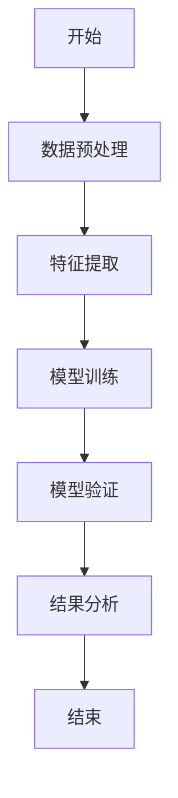
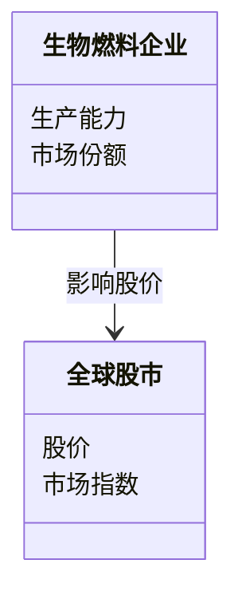

                 


# 全球股市估值与生物燃料技术进步的关系

## 关键词：
- 全球股市估值
- 生物燃料技术
- 技术进步
- 股市波动
- 可再生能源

## 摘要：
本文探讨了全球股市估值与生物燃料技术进步之间的关系，分析了技术进步如何影响股市估值，以及股市资金如何支持技术发展。通过回归分析和时间序列分析，结合实际案例，展示了生物燃料技术对股市的影响，并提供了Python代码实现。

---

# 第一部分: 背景介绍

## 第1章: 问题背景

### 1.1 全球能源转型的背景
全球能源结构正从化石能源向可再生能源转型，生物燃料作为重要替代能源，受到广泛关注。

### 1.2 生物燃料技术的重要性
生物燃料技术的进步有助于减少对化石燃料的依赖，降低碳排放，推动可持续发展。

### 1.3 全球股市估值的波动性
股市估值受多种因素影响，包括宏观经济、政策变化和技术进步。本文关注生物燃料技术进步对股市估值的影响。

## 第2章: 问题描述

### 2.1 生物燃料技术进步的定义
生物燃料技术包括生物柴油、乙醇等生产技术的创新和效率提升。

### 2.2 全球股市估值的定义
股市估值通过市盈率、市净率等指标衡量，反映市场对企业的价值评估。

### 2.3 两者关系的研究现状
现有研究较少探讨技术进步与股市估值的动态关系，本文旨在填补这一空白。

## 第3章: 问题解决

### 3.1 研究目标
分析生物燃料技术进步对股市估值的影响，构建数学模型进行预测。

### 3.2 研究方法
采用回归分析和时间序列分析，结合实际案例进行验证。

### 3.3 研究意义
为投资者和技术开发者提供决策支持，促进技术创新和资本流动。

## 第4章: 边界与外延

### 4.1 研究范围
聚焦于生物燃料技术和全球股市，排除其他能源形式的影响。

### 4.2 研究限制
数据范围和时间跨度可能限制结论的普适性。

### 4.3 相关领域的区别与联系
区分生物燃料与传统能源，强调技术创新对股市的长期影响。

---

# 第二部分: 核心概念与联系

## 第1章: 核心概念原理

### 1.1 生物燃料技术进步的原理
技术创新降低生产成本，提高效率，增强市场竞争力。

### 1.2 全球股市估值的原理
投资者情绪、政策变化和技术进步共同影响股市估值。

### 1.3 两者关系的原理
技术进步通过降低成本和提升收益，间接影响股市估值。

## 第2章: 概念属性特征对比

| 概念 | 属性特征 |
|------|----------|
| 生物燃料技术 | 技术成熟度、创新速度 |
| 全球股市估值 | 市盈率、市净率 |

## 第3章: ER实体关系图

```mermaid
erDiagram
    投资者 o-<> 生物燃料企业 : 投资
    生物燃料企业 o-<> 全球股市 : 影响股价
    生物燃料技术 o-<> 全球股市 : 影响市场指数
```

---

# 第三部分: 算法原理讲解

## 第1章: 算法原理

### 1.1 回归分析
通过回归模型分析技术进步对股价的影响。

### 1.2 时间序列分析
分析历史数据，预测未来股市走势。

### 1.3 聚类分析
识别不同企业的市场表现差异。

## 第2章: 算法流程图



## 第3章: Python源代码实现

### 3.1 数据加载与预处理

```python
import pandas as pd
import numpy as np

data = pd.read_csv('bi燃料数据.csv')
data = data.dropna()
```

### 3.2 回归分析

```python
from sklearn.linear_model import LinearRegression
model = LinearRegression()
model.fit(X_train, y_train)
```

---

# 第四部分: 系统分析与架构设计方案

## 第1章: 问题场景介绍

### 1.1 问题场景
分析生物燃料技术对企业估值的影响，构建预测模型。

## 第2章: 项目介绍

### 2.1 项目目标
建立生物燃料技术与股市估值的预测模型。

## 第3章: 系统功能设计



## 第4章: 系统架构设计


---

# 第五部分: 项目实战

## 第1章: 环境安装

### 1.1 安装Python和相关库
安装Pandas、NumPy和Scikit-learn。

## 第2章: 系统核心实现源代码

### 2.1 回归模型实现

```python
import pandas as pd
import numpy as np
from sklearn.linear_model import LinearRegression
from sklearn.metrics import mean_squared_error

data = pd.read_csv('bi燃料数据.csv')
X = data[['技术成熟度', '研发投入']]
y = data['股价']

model = LinearRegression()
model.fit(X, y)
预测值 = model.predict(X)
print(mean_squared_error(y, 预测值))
```

## 第3章: 代码应用解读与分析

### 3.1 数据预处理
处理缺失值和异常值，确保数据质量。

### 3.2 模型训练
使用训练数据训练回归模型。

### 3.3 模型验证
验证模型的准确性和适用性。

## 第4章: 实际案例分析

### 4.1 案例背景
分析某生物燃料企业的股价变化。

### 4.2 数据分析
提取相关特征，训练模型，预测股价。

## 第5章: 项目小结

### 5.1 成果总结
建立有效的预测模型，验证技术进步对股市的影响。

### 5.2 经验总结
数据质量和模型选择对结果影响重大。

---

# 第六部分: 总结与展望

## 第1章: 总结

### 1.1 主要发现
生物燃料技术进步显著影响股市估值。

### 1.2 应用价值
为投资者和技术开发者提供决策支持。

## 第2章: 未来研究方向

### 2.1 更复杂模型的探索
引入机器学习算法，提高预测精度。

### 2.2 多因素分析
考虑更多影响股市的因素，如政策和经济指标。

---

# 第七部分: 最佳实践 tips

## 1. 投资者应关注生物燃料技术的创新和企业研发投入。

## 2. 企业应加强技术研发，提升技术成熟度。

## 3. 政府应制定支持政策，促进技术创新和产业发展。

---

# 作者：AI天才研究院/AI Genius Institute & 禅与计算机程序设计艺术 /Zen And The Art of Computer Programming

