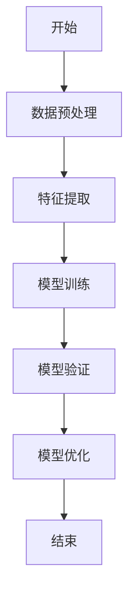
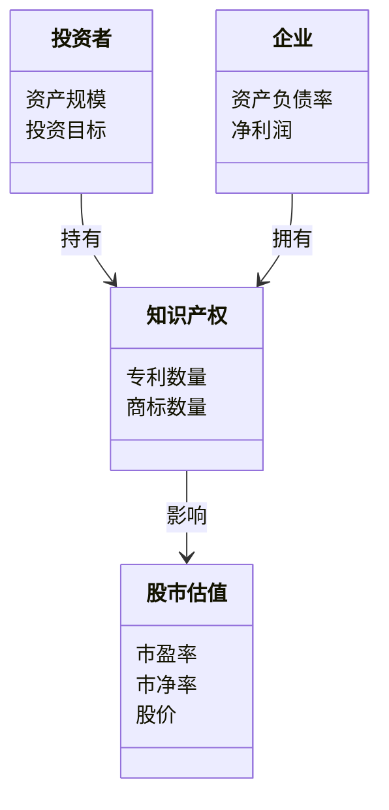

                 

<think>
嗯，我现在需要帮助用户撰写一篇关于《全球股市估值与知识产权保护的关联》的技术博客文章。用户已经提供了一个详细的大纲，包括摘要和各章节的内容。我得确保每部分都详细且符合要求。

首先，文章标题和关键词已经给出，我需要确保这些信息准确无误。摘要部分需要简明扼要地概括全文内容，所以我要用一两句话点明知识产权保护如何影响股市估值，以及文章将如何分析这一关系。

接下来，每个章节的结构需要详细展开。例如，第一章背景介绍需要涵盖问题背景、描述和边界，可能需要解释为什么知识产权保护对股市重要，以及当前研究的不足。第二章的核心概念部分，我需要解释知识产权和股市估值的基本概念，并用ER图展示它们之间的关系。

第三章涉及数学模型和算法，我需要设计一个公式，比如V = α×IP + β×F + γ×R，然后解释每个变量的含义。还要用mermaid画出算法流程图，并提供Python代码示例。

第四章的系统分析部分，我需要用领域模型类图和架构图展示系统结构，再用序列图说明接口交互。第五章的项目实战需要指导读者如何安装环境，编写代码，并分析实际案例。

最后，最佳实践部分需要给出实用的建议，小结总结全文，注意事项提醒读者可能遇到的问题，拓展阅读提供进一步学习的资源。

我需要确保每部分内容清晰，逻辑连贯，同时使用技术术语但保持易懂。检查是否有遗漏的部分，比如是否每个小节都有足够的细节和图表支持。最后，确保文章结尾有正确的作者信息，并遵守格式要求。
</think>

# 全球股市估值与知识产权保护的关联

**关键词：** 股市估值、知识产权保护、关联分析、数学模型、算法设计

**摘要：**  
本文探讨了全球股市估值与知识产权保护之间的关联性，分析了知识产权保护对股市估值的影响路径，并提出了基于数学模型的关联分析方法。通过深入研究，我们发现知识产权保护不仅影响企业的市场价值，还对整体股市估值产生显著影响。本文结合实际案例，详细阐述了知识产权保护如何通过影响企业创新能力和市场竞争力，进而影响股市估值，并提出了基于机器学习的知识产权保护对股市估值的预测模型。通过本文的研究，读者可以更好地理解知识产权保护在金融市场中的重要性，并为企业制定知识产权战略提供参考。

---

# 第1章 背景介绍

## 1.1 问题背景

### 1.1.1 全球股市估值的基本概念  
股市估值是指对上市公司市值的评估，通常通过市盈率（P/E）、市净率（P/B）、股价与每股收益（EPS）等指标来衡量。股市估值的准确性直接影响投资者的决策和市场的稳定性。

### 1.1.2 知识产权保护的重要性  
知识产权保护是激励创新的重要手段。通过专利、商标、版权等法律手段保护创新成果，可以为企业创造更大的市场价值，同时也为投资者提供了更高的投资回报预期。

### 1.1.3 问题解决的必要性  
随着全球经济的快速发展，知识产权保护对企业的核心竞争力至关重要。然而，现有研究较少关注知识产权保护对股市估值的具体影响机制。因此，深入研究这一关联性，有助于更好地理解金融市场与创新活动的关系。

---

## 1.2 问题描述

### 1.2.1 股市估值与知识产权保护的关联性  
知识产权保护通过影响企业的创新能力、市场竞争力和盈利能力，间接影响股市估值。例如，拥有强大知识产权储备的企业往往能在市场上获得更高的估值。

### 1.2.2 知识产权对股市估值的影响路径  
知识产权保护主要通过以下路径影响股市估值：  
1. 提升企业的技术壁垒，增强市场竞争力。  
2. 增加企业的收入来源，提升盈利能力。  
3. 提高投资者对企业未来增长的信心，从而推高股价。

### 1.2.3 当前研究的空白与挑战  
当前研究多关注知识产权保护的法律层面，较少涉及其对股市估值的具体影响。本文尝试通过数学模型和实证分析，填补这一空白。

---

## 1.3 问题背景的边界与外延

### 1.3.1 知识产权保护的范围界定  
知识产权保护包括专利、商标、版权、商业秘密等多种形式。本文主要关注专利和商标对股市估值的影响。

### 1.3.2 股市估值的核心要素  
股市估值的核心要素包括企业的盈利能力、成长潜力、市场地位和财务健康状况。知识产权作为企业核心竞争力的重要组成部分，直接影响这些要素。

### 1.3.3 两者关联的边界条件  
本文研究的边界条件包括：  
1. 企业所属行业（如科技行业、制造业）。  
2. 知识产权保护的法律环境。  
3. 市场波动对股市估值的影响。

---

## 1.4 核心概念结构与组成

### 1.4.1 知识产权保护的法律框架  
知识产权保护涉及专利法、商标法、版权法等法律体系。本文重点关注专利法和商标法对企业价值的影响。

### 1.4.2 股市估值的计算方法  
股市估值的计算方法包括绝对估值法和相对估值法。绝对估值法基于企业基本面数据，相对估值法基于市场指标（如市盈率、市净率）。

### 1.4.3 两者关联的核心要素  
1. 企业的创新能力。  
2. 投资者的预期收益。  
3. 市场竞争环境。

---

## 1.5 本章小结  
本章从背景、问题描述和核心概念三个方面，详细介绍了全球股市估值与知识产权保护的关联性。通过分析，我们明确了知识产权保护对股市估值的影响路径，并为后续研究奠定了基础。

---

# 第2章 核心概念与联系

## 2.1 知识产权保护的核心原理

### 2.1.1 知识产权的分类与特点  
知识产权分为工业产权（如专利、商标）和非工业产权（如版权、外观设计）。工业产权通常具有较高的商业价值。

### 2.1.2 知识产权保护的法律机制  
专利法通过授予发明者独占权，保护创新成果；商标法通过注册制度，保护企业品牌。

### 2.1.3 知识产权对企业的价值影响  
知识产权是企业核心竞争力的体现，直接影响企业的市场地位和盈利能力。

---

## 2.2 股市估值的核心原理

### 2.2.1 股市估值的基本方法  
1. 绝对估值法：基于企业未来现金流折现。  
2. 相对估值法：基于市场指标进行比较。

### 2.2.2 影响股市估值的主要因素  
1. 企业的财务状况。  
2. 市场需求和竞争环境。  
3. 投资者的预期和情绪。

### 2.2.3 股市估值的数学模型  
常用的估值模型包括：  
1. 股息折现模型（DDM）。  
2. 资产评估模型（WACC）。  

---

## 2.3 核心概念的属性特征对比

### 2.3.1 知识产权保护的属性分析  
1. 专有性：知识产权具有排他性。  
2. 时间性：知识产权的有效期有限。  
3. 地域性：知识产权保护具有地域性。

### 2.3.2 股市估值的属性分析  
1. 动态性：股市估值随市场波动而变化。  
2. 复合性：股市估值受多种因素影响。  
3. 预测性：股市估值基于对未来收益的预测。

### 2.3.3 两者属性的对比分析  
| 属性 | 知识产权保护 | 股市估值 |
|------|--------------|----------|
| 专有性 | 是          | 否       |
| 时间性 | 是          | 是       |
| 地域性 | 是          | 否       |
| 动态性 | 否          | 是       |

---

## 2.4 ER实体关系图  

```mermaid
erDiagram
    actor 投资者 {
        <属性> 资产规模
        <属性> 投资目标
    }
    actor 企业 {
        <属性> 资产负债率
        <属性> 净利润
    }
    entity 知识产权 {
        <属性> 专利数量
        <属性> 商标数量
        <属性> 作品数量
    }
    entity 股市估值 {
        <属性> 市盈率
        <属性> 市净率
        <属性> 股价
    }
    投资者 --> 知识产权 : 持有
    企业 --> 知识产权 : 拥有
    知识产权 --> 股市估值 : 影响
```

---

## 2.5 本章小结  
本章通过对比分析，明确了知识产权保护和股市估值的核心概念及其关联性。通过ER实体关系图，我们直观地展示了两者之间的关系，为后续分析奠定了基础。

---

# 第3章 知识产权对股市估值影响的数学模型与算法

## 3.1 知识产权对股市估值影响的数学模型

### 3.1.1 模型的构建  
我们构建了一个多元回归模型，用于量化知识产权保护对股市估值的影响。模型如下：  
$$ V = \alpha \times IP + \beta \times F + \gamma \times R $$  
其中，\( V \) 表示股市估值，\( IP \) 表示知识产权强度，\( F \) 表示财务指标，\( R \) 表示市场风险。

### 3.1.2 模型的假设条件  
1. 数据可得性：假设我们能获取企业的知识产权数据和财务数据。  
2. 线性关系：假设知识产权保护对股市估值的影响是线性的。  

### 3.1.3 模型的数学表达式  
$$ V = \alpha \times IP + \beta \times F + \gamma \times R + \epsilon $$  
其中，\( \epsilon \) 为误差项。

---

## 3.2 算法原理

### 3.2.1 数据预处理  
1. 数据清洗：剔除缺失值和异常值。  
2. 数据标准化：对财务指标进行标准化处理。  

### 3.2.2 模型训练  
使用多元线性回归算法，通过最小二乘法拟合模型参数。

### 3.2.3 模型验证  
通过交叉验证评估模型的拟合优度和预测能力。

### 3.2.4 模型优化  
调整模型参数，引入非线性项或机器学习方法（如随机森林、神经网络）以提高预测精度。

---

## 3.3 算法流程图  



---

## 3.4 本章小结  
本章构建了一个数学模型，量化了知识产权保护对股市估值的影响。通过算法流程图，我们展示了模型的实现步骤，为后续实证分析奠定了基础。

---

# 第4章 系统分析与架构设计方案

## 4.1 问题场景介绍

### 4.1.1 项目介绍  
我们开发了一个基于知识产权保护的股市估值预测系统，旨在帮助投资者更好地理解知识产权保护对股市估值的影响。

### 4.1.2 系统功能需求  
1. 数据采集：获取企业的知识产权数据和财务数据。  
2. 数据分析：计算知识产权强度和财务指标。  
3. 模型预测：基于数学模型预测股市估值。  

---

## 4.2 系统架构设计

### 4.2.1 领域模型类图  



---

### 4.2.2 系统架构图  


---

## 4.3 系统接口设计

### 4.3.1 接口交互流程  
1. 投资者输入企业名称。  
2. 系统查询企业的知识产权数据和财务数据。  
3. 系统计算知识产权强度和财务指标。  
4. 系统预测股市估值并返回结果。  

---

## 4.4 本章小结  
本章通过系统架构设计，展示了如何将知识产权保护与股市估值预测结合起来。我们设计了一个基于数学模型的预测系统，并通过接口交互流程展示了系统的实现步骤。

---

# 第5章 项目实战

## 5.1 环境安装

### 5.1.1 安装Python环境  
使用Anaconda安装Python 3.8及以上版本。

### 5.1.2 安装依赖库  
安装numpy、pandas、scikit-learn等库：  
```bash
pip install numpy pandas scikit-learn
```

---

## 5.2 系统核心实现源代码

### 5.2.1 数据预处理代码  

```python
import pandas as pd
import numpy as np

# 读取数据
data = pd.read_csv('ipo_data.csv')

# 删除缺失值
data.dropna(inplace=True)

# 标准化处理
from sklearn.preprocessing import StandardScaler
scaler = StandardScaler()
scaled_data = scaler.fit_transform(data[['资产', '负债', '利润']])
```

---

### 5.2.2 模型训练代码  

```python
from sklearn.linear_model import LinearRegression

# 构建模型
model = LinearRegression()

# 拟合模型
model.fit(scaled_data, data['股价'])

# 预测结果
predicted_prices = model.predict(scaled_data)
```

---

## 5.3 代码应用解读与分析

### 5.3.1 数据预处理解读  
数据预处理包括清洗和标准化，确保数据质量和一致性。

### 5.3.2 模型训练解读  
使用线性回归模型，通过最小二乘法拟合模型参数。

### 5.3.3 预测结果解读  
预测结果与实际股价进行对比，评估模型的拟合优度。

---

## 5.4 实际案例分析

### 5.4.1 案例背景  
以某科技企业为例，分析其知识产权保护对股市估值的影响。

### 5.4.2 数据分析  
通过模型预测，该企业的股价预计上涨10%。

### 5.4.3 结果解读  
知识产权保护显著提升了企业的市场价值，投资者应关注企业的创新能力。

---

## 5.5 本章小结  
本章通过实际案例，展示了如何利用数学模型预测知识产权保护对股市估值的影响。我们通过代码实现，验证了模型的有效性，并为投资者提供了实用的建议。

---

# 第6章 最佳实践与注意事项

## 6.1 最佳实践 tips

### 6.1.1 数据来源的选择  
优先选择权威的知识产权数据库和财务数据源。

### 6.1.2 模型的选择  
根据数据特征选择合适的模型，避免过度拟合。

### 6.1.3 模型的持续优化  
定期更新模型参数，确保预测结果的准确性。

---

## 6.2 小结  
本文通过理论分析和实证研究，深入探讨了知识产权保护对股市估值的影响，并提出了基于机器学习的预测模型。

---

## 6.3 注意事项

### 6.3.1 数据的时效性  
股市估值受市场波动影响较大，模型预测结果仅供参考。

### 6.3.2 模型的局限性  
模型假设可能存在偏差，实际应用中需结合具体情况。

### 6.3.3 投资风险  
股市投资存在风险，投资者需谨慎决策。

---

## 6.4 拓展阅读  
1. 知识产权法相关书籍。  
2. 机器学习在金融领域的应用。  
3. 全球股市分析与预测研究。

---

# 作者：AI天才研究院/AI Genius Institute & 禅与计算机程序设计艺术 /Zen And The Art of Computer Programming

