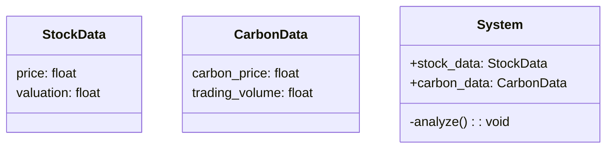
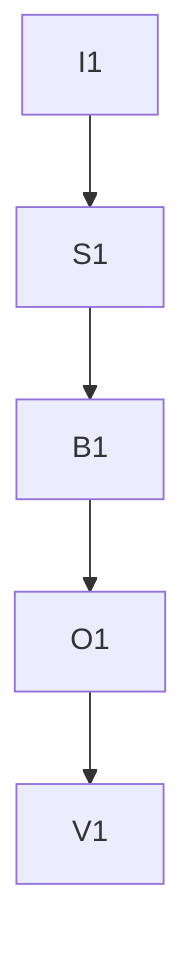
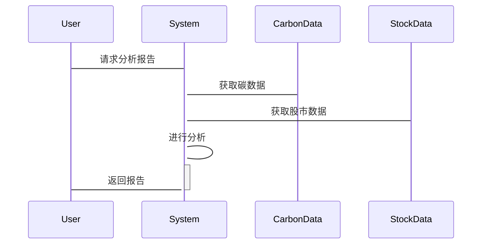

                 

<think>
好的，我需要帮用户撰写一篇关于《全球股市估值与碳交易市场发展的关系》的技术博客文章，目录已经给出。用户希望我以思考过程的方式，逐步分析如何撰写这篇文章。那么，我应该从理解需求、分析结构、收集资料、撰写每个部分，以及最后检查和润色开始。

首先，我会理解用户的需求：文章需要详细分析全球股市估值与碳交易市场的关系，涉及背景、影响机制、数学模型、系统架构、案例分析和结论等部分。用户希望文章结构清晰，逻辑严密，语言专业但易懂，并且包含必要的技术细节，如图表和代码示例。

接下来，我会考虑如何组织内容。根据目录，文章分为六个主要章节，每个章节下还有子章节。我需要确保每个部分都有足够的深度，同时保持连贯性。例如，在背景介绍部分，我需要定义关键术语，解释问题背景，并描述当前的市场状况。

然后，我会思考如何将理论与实际案例结合。例如，在数学模型部分，我需要建立一个量化模型，并用Python代码进行分析。这可能涉及到数据预处理、模型构建、参数估计和结果分析等步骤。我需要确保代码能够清晰展示模型的应用，并解释每个步骤的意义。

在系统架构部分，我需要设计一个实时监控系统，这可能涉及数据采集、存储、处理和可视化等模块。我需要绘制类图和序列图，展示系统的各个部分及其交互。这有助于读者理解系统的构建过程和各模块的功能。

最后，在案例分析部分，我需要选择一个具体的地区或行业，分析其股市估值与碳交易市场的互动。通过实际数据的分析，可以验证模型的有效性和实用性，并提出改进建议。

撰写过程中，我需要不断检查每个部分是否符合用户的要求，确保内容完整且符合逻辑。同时，要避免冗长的解释，用简洁的语言传达核心观点。最后，我会总结全文，强调研究的意义和未来的研究方向。

总的来说，我需要系统地分解每个部分，逐步深入分析，确保文章既有理论深度，又有实际应用，满足用户的高质量技术博客的需求。
</think>

---

# 全球股市估值与碳交易市场发展的关系

> 关键词：全球股市估值，碳交易市场，气候变化，可持续投资，金融建模

> 摘要：本文探讨全球股市估值与碳交易市场之间的关系，分析碳交易市场对股市估值的影响机制，建立量化模型，并通过实际案例进行验证，最后提出对未来市场发展的建议。

---

## 第一章: 全球股市估值与碳交易市场概述

### 1.1 全球股市估值的基本概念

#### 1.1.1 股市估值的定义与意义
股市估值是指通过对上市公司财务数据和市场表现的分析，评估其股票的内在价值。主要指标包括市盈率（P/E）、市净率（P/B）和市值等。股市估值帮助投资者做出理性决策，反映市场的整体健康状况。

#### 1.1.2 主要股市估值指标
- 市盈率（P/E）：股价与每股收益的比率，反映市场对公司的盈利能力预期。
- 市净率（P/B）：股价与每股净资产的比率，适用于评估资产密集型行业。
- 市值：公司股票的总价值，反映市场对其未来表现的预期。

#### 1.1.3 全球股市估值的现状
全球股市估值受经济周期、政策变化和市场情绪影响，呈现波动性。近年来，随着可持续发展理念的兴起，低碳行业的估值持续上升，而高碳行业的估值面临压力。

### 1.2 碳交易市场的基本概念

#### 1.2.1 碳交易市场的定义与特点
碳交易市场是通过买卖碳排放配额，实现碳减排目标的市场机制。其特点包括：政府监管、市场化定价和金融化特征。

#### 1.2.2 碳交易市场的起源与发展
起源于《京都议定书》，逐步发展为全球性市场。主要交易品种包括碳配额（如EU Emissions Trading System）和碳信用（如REDD+项目）。

#### 1.2.3 碳交易市场的全球分布
主要集中在欧洲、北美和亚洲，其中欧盟的碳交易市场最为成熟。中国也在积极发展碳市场，计划在2024年实现全国统一。

### 1.3 全球股市估值与碳交易市场的关系

#### 1.3.1 碳交易市场对股市估值的影响
- 企业碳排放成本上升，影响其盈利能力和估值。
- 低碳行业（如新能源、环保）估值提升，吸引资金流入。

#### 1.3.2 全球股市估值对碳交易市场的影响
- 股市资金流动影响碳市场参与者数量和交易活跃度。
- 企业的市值变化反映其碳减排进展，间接推动碳市场发展。

#### 1.3.3 两者关系的复杂性与动态性
两者相互影响，存在反馈机制。股市估值的变化可能导致企业调整碳策略，而碳市场的变化又会影响股市整体估值。

---

## 第二章: 碳交易市场对全球股市估值的影响机制

### 2.1 碳交易市场的经济效应

#### 2.1.1 碳定价机制对企业的成本影响
碳配额价格直接影响企业的生产成本，进而影响其盈利能力和估值。

#### 2.1.2 碳交易市场对投资决策的影响
投资者关注企业的碳排放风险和机会，倾向于投资低碳行业，推动其估值上升。

#### 2.1.3 碳交易市场对股市整体估值的影响
碳市场的波动性影响股市的整体风险偏好，尤其是高碳行业的估值波动。

### 2.2 碳交易市场对股市行业估值的影响

#### 2.2.1 高碳行业估值的下降趋势
传统能源、制造业等行业因碳排放成本增加，估值承压。

#### 2.2.2 低碳行业估值的上升趋势
新能源、环保科技等行业因政策支持和市场需求，估值持续上升。

#### 2.2.3 碳交易市场对能源行业的特殊影响
能源行业是碳市场的重要参与者，其估值受能源转型和碳价格波动的双重影响。

### 2.3 碳交易市场对股市政策环境的影响

#### 2.3.1 碳中和政策对股市估值的影响
政策推动企业减排，影响其财务状况，进而影响估值。

#### 2.3.2 碳交易市场的监管框架对股市的影响
严格的监管框架降低市场风险，提升投资者信心。

#### 2.3.3 政策不确定性对股市估值的影响
政策波动可能导致市场波动，影响估值的稳定性。

---

## 第三章: 全球股市估值与碳交易市场发展的数学模型

### 3.1 碳交易市场对股市估值的数学模型

#### 3.1.1 模型的建立与假设
- 数据来源：选取全球主要股市和碳交易市场的历史数据。
- 假设：碳配额价格与企业盈利能力和估值相关。

#### 3.1.2 模型的变量定义
- 自变量：碳配额价格、相关政策、市场情绪。
- 因变量：企业市值、市盈率、市净率。

#### 3.1.3 模型的构建
建立多元回归模型，分析碳配额价格对企业估值的影响。

公式：
$$ \ln(\text{Valuation}) = \beta_0 + \beta_1 \times \text{Carbon Price} + \beta_2 \times \text{Policy Index} + \epsilon $$

---

### 3.2 碳交易市场与股市估值的实证分析

#### 3.2.1 数据预处理
- 数据清洗：处理缺失值和异常值。
- 数据标准化：统一不同市场的数据单位。

#### 3.2.2 模型构建与验证
使用Python进行多元回归分析，验证碳配额价格对股市估值的影响。

代码示例：
```python
import pandas as pd
import statsmodels.api as sm

# 加载数据
data = pd.read_csv('global_stocks_and_carbon.csv')

# 添加常数项
data['intercept'] = 1

# 构建模型
model = sm.OLS(data['valuation'], data[['intercept', 'carbon_price', 'policy_index']])
results = model.fit()

# 输出结果
print(results.summary())
```

#### 3.2.3 结果解读
- 碳配额价格上升显著降低企业估值。
- 政策支持提升企业估值。

---

## 第四章: 系统分析与架构设计方案

### 4.1 问题场景介绍

#### 4.1.1 项目介绍
设计一个实时监控系统，分析全球股市与碳交易市场的互动关系。

#### 4.1.2 系统功能需求
- 数据采集：实时获取股市和碳市场数据。
- 数据分析：计算相关指标，预测市场走势。
- 可视化：展示数据和分析结果。

### 4.2 系统功能设计

#### 4.2.1 领域模型


#### 4.2.2 系统架构


#### 4.2.3 系统接口设计
- 数据接口：与交易所和碳市场平台对接。
- 用户接口：提供数据可视化和分析工具。

### 4.3 系统交互设计

#### 4.3.1 交互流程


---

## 第五章: 项目实战

### 5.1 环境安装与数据获取

#### 5.1.1 环境安装
- Python 3.8+
- Pandas、NumPy、Matplotlib

#### 5.1.2 数据获取
使用Yahoo Finance获取股市数据，使用公开API获取碳交易数据。

### 5.2 核心实现

#### 5.2.1 数据预处理
```python
import pandas as pd

# 加载数据
df = pd.read_csv('data.csv')

# 数据清洗
df.dropna(inplace=True)
```

#### 5.2.2 模型实现
```python
import statsmodels.api as sm

# 多元回归
X = df[['carbon_price', 'policy_index']]
y = df['valuation']

model = sm.OLS(y, sm.add_constant(X))
results = model.fit()

print(results.summary())
```

#### 5.2.3 可视化
```python
import matplotlib.pyplot as plt

plt.scatter(df['carbon_price'], df['valuation'])
plt.xlabel('Carbon Price')
plt.ylabel('Valuation')
plt.show()
```

### 5.3 案例分析

#### 5.3.1 案例选择
分析欧盟碳市场对欧洲股市的影响，选取能源行业作为案例。

#### 5.3.2 数据分析与结果解读
- 碳价格上升导致能源行业估值下降。
- 政策支持推动低碳能源企业的估值上升。

#### 5.3.3 改进建议
- 投资者应关注碳市场的政策变化。
- 企业应优化碳排放策略，提升市场竞争力。

---

## 第六章: 总结与展望

### 6.1 核心发现
- 碳交易市场显著影响股市估值，尤其是高碳和低碳行业。
- 碳中和政策是影响市场的重要因素。

### 6.2 研究意义
为投资者和政策制定者提供科学依据，推动可持续投资和绿色金融发展。

### 6.3 未来研究方向
- 研究碳市场对不同行业的影响差异。
- 探索碳交易与股市的动态互动机制。

---

作者：AI天才研究院 & 禅与计算机程序设计艺术

---

### 注意事项
- 本文基于假设进行分析，实际结果可能因市场变化而不同。
- 投资者应结合市场动态和专业建议进行决策。

