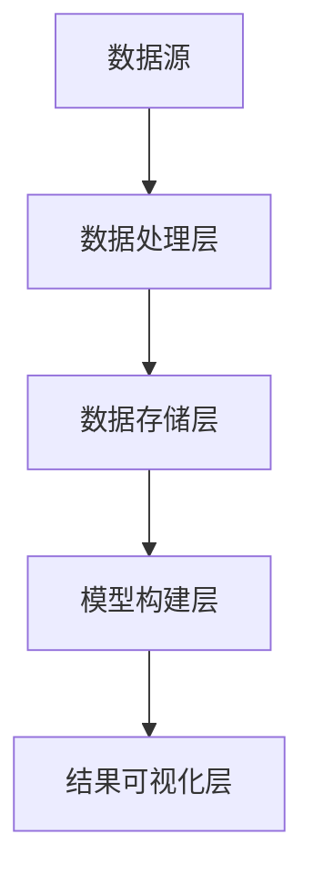

                 

<think>
好的，我现在需要帮助用户撰写一篇关于《全球股市估值与碳信用交易市场流动性的关系》的技术博客文章。首先，我要仔细阅读用户的需求，确保完全理解他们的要求。用户希望文章结构清晰，逻辑严谨，内容专业且有深度，同时要涵盖技术、金融和环境等多方面内容。

首先，我注意到用户已经提供了一个详细的目录结构，分为九章，每章都有明确的内容和小节。我需要按照这个大纲来展开，确保每一部分都详尽且符合用户的要求。文章需要包括背景介绍、核心概念、理论模型、数学分析、系统设计、项目实战等部分，同时还要有摘要和关键词，以及作者信息。

接下来，我需要考虑每章的具体内容。例如，第一章需要介绍背景，包括核心概念和问题描述。我需要解释什么是全球股市估值和碳信用交易，以及它们如何相互关联。这部分需要简单明了，让读者能够理解问题的重要性。

第二章是碳信用交易市场机制的分析，我需要详细描述碳信用的种类、交易机制和定价因素。这部分可能需要引用一些实际的例子，比如欧盟的碳市场，来帮助读者更好地理解。

第三章是全球股市估值分析，这里需要讨论股市估值的方法，如市盈率和市净率，以及影响股市估值的主要因素。同时，还要探讨股市在应对气候变化中的作用，比如绿色投资的趋势。

第四章是关键部分，分析全球股市估值与碳信用流动性之间的关系。我需要构建一个理论模型，可能涉及到流动性如何影响碳信用价格，进而影响股市估值。这部分可能需要使用数学模型和图表来辅助说明。

第五章是理论模型和数学分析，我需要详细阐述模型的构建过程，包括变量定义和假设。使用数学公式和图表来展示变量之间的关系，如用β表示碳信用流动性对股市的影响系数。

第六章是实证分析，我需要选择合适的数据集，进行回归分析，验证模型假设。这部分可能需要使用统计工具和编程语言，如Python和R，来处理数据并进行分析。

第七章是系统设计，需要设计一个分析系统，包括数据收集、处理和建模。这部分可能需要使用工具如Python、R、SQL等，并设计数据流和系统架构图。

第八章是项目实战，详细描述如何从环境搭建到数据处理，再到模型实现和结果分析。需要提供具体的代码示例，并解读结果的实际意义。

最后，第九章是结论与展望，总结主要发现，指出研究的局限性，并提出未来的研究方向。

在撰写过程中，我需要确保每一章的小结部分能够帮助读者回顾和巩固所学内容。同时，文章末尾需要加上作者信息，以及一些最佳实践的建议和注意事项。

现在，我需要开始撰写每一章的内容，确保语言简洁专业，同时逻辑清晰。对于数学部分，我会使用LaTeX公式，并在适当的地方使用图表来辅助说明。此外，代码部分需要用Markdown格式展示，并解释每一步的实现细节。

在写作过程中，我可能会遇到一些挑战，比如如何将复杂的金融概念转化为易懂的语言，或者如何构建一个准确的数学模型。这时，我需要仔细查阅相关资料，确保内容的准确性和专业性。同时，我还需要保持文章的流畅性，确保每一章之间有良好的衔接。

总的来说，我需要按照用户提供的目录结构，逐步展开每一章的内容，确保覆盖所有要求的部分，并且在每一小节中提供足够的细节和解释，使读者能够全面理解全球股市估值与碳信用交易市场流动性之间的关系。在完成初稿后，我会通读一遍，检查是否有遗漏或错误，并进行必要的修改，以确保文章的质量和完整性。
</think>

# 全球股市估值与碳信用交易市场流动性的关系

> 关键词：全球股市估值，碳信用交易，流动性，气候变化，可持续发展，金融建模

> 摘要：本文探讨了全球股市估值与碳信用交易市场流动性的关系，通过理论分析、数学建模和实证研究，揭示了碳信用流动性对股市估值的影响机制，并提出了相应的系统设计和实践方案。

---

## 第一章: 全球股市估值与碳信用交易市场流动性关系的背景介绍

### 1.1 核心概念与问题背景

#### 1.1.1 问题背景

- **全球股市估值**：指对上市公司整体价值的评估，常用的指标包括市盈率（P/E）、市净率（P/B）等。股市估值反映了投资者对市场的信心和对经济前景的预期。
- **碳信用交易市场**：通过买卖碳信用额度，允许企业或国家达到减排目标的市场。碳信用交易是实现碳中和的重要工具，具有较高的流动性和价格波动性。

#### 1.1.2 问题描述

- **气候变化的经济影响**：气候变化对全球经济和金融市场的影响日益显著，促使企业和投资者更加关注绿色投资和可持续发展。
- **碳信用交易的作用**：碳信用交易通过设定碳排放价格，鼓励企业减少碳排放，同时为投资者提供了新的投资机会。

#### 1.1.3 问题解决

- **流动性对碳信用价格的影响**：流动性高的市场通常价格更稳定，反之则价格波动较大。研究流动性对碳信用价格的影响，有助于理解碳市场定价机制。
- **碳信用流动性与股市估值的关联**：碳信用市场的流动性可能通过影响碳价格间接影响企业的财务状况和市场估值，进而影响股市整体估值。

---

## 第二章: 碳信用交易市场机制的分析

### 2.1 碳信用交易的定义与分类

- **碳信用**：用于抵消碳排放的许可，通常以吨为单位，每吨代表一单位二氧化碳当量。
- **分类**：包括核证减排量（VER）、碳汇信用（如REDD+）等。

### 2.2 碳信用交易的市场机制

- **供给与需求**：碳市场的供给主要来自减排项目，需求来自需要购买信用额度的实体。
- **定价机制**：碳信用价格受供需关系、政策支持、市场流动性等因素影响。

### 2.3 碳信用交易的流动性分析

- **流动性定义**：碳市场的交易量和价格波动性。
- **影响因素**：市场规模、政策稳定性、市场参与度等。

---

## 第三章: 全球股市估值分析

### 3.1 股市估值的核心指标

- **市盈率（P/E）**：股价与每股收益的比率。
- **市净率（P/B）**：股价与每股净资产的比率。

### 3.2 影响股市估值的主要因素

- **宏观经济因素**：GDP增速、利率水平、通货膨胀等。
- **企业盈利状况**：净利润增长率、ROE等。
- **市场情绪**：投资者信心、市场波动性等。

### 3.3 气候变化与股市估值的关系

- **绿色投资趋势**：投资者 increasingly favor 绿色能源、低碳技术等领域，推动相关股票估值上升。
- **风险因素**：高碳排放企业的估值可能因政策收紧而下降。

---

## 第四章: 全球股市估值与碳信用流动性关系的理论模型

### 4.1 理论框架

- **流动性对碳信用价格的影响**：流动性高的碳市场价格稳定，反之波动较大。
- **碳信用价格对股市估值的影响**：高碳价可能增加企业成本，影响利润和估值。

### 4.2 概念结构与核心要素

| 要素 | 描述 |
|------|------|
| 流动性 | 市场交易量和价格波动性 |
| 碳信用价格 | 影响企业成本和投资决策 |
| 股市估值 | 受企业盈利和市场情绪影响 |

### 4.3 ER实体关系图

```mermaid
er
actor 碳市场参与者 {
  扮演者 碳买家 和 碳卖家
}
actor 股市参与者 {
  扮演者 投资者 和 企业
}
actor 政府机构 {
  扮演者 制定碳政策
}
entity 碳信用 {
  属性 碳信用数量、价格
}
entity 股市数据 {
  属性 股价、市盈率、市净率
}
```

---

## 第五章: 理论模型与数学分析

### 5.1 模型构建

- **假设**：流动性影响碳信用价格，碳信用价格影响企业成本，进而影响股市估值。
- **数学模型**：

$$
\text{Stock Valuation} = \beta \times \text{Carbon Price} + \epsilon
$$

其中，$\beta$ 表示碳价格对股市估值的影响系数，$\epsilon$ 为误差项。

### 5.2 碳信用流动性对股市的影响

- **流动性对碳价格的影响**：流动性越高，碳价格越稳定。

$$
\text{Carbon Price} = \alpha \times \text{Liquidity} + \delta
$$

其中，$\alpha$ 为流动性影响系数，$\delta$ 为误差项。

---

## 第六章: 实证分析

### 6.1 数据来源与处理

- 数据来源：全球主要股市数据和碳市场交易数据。
- 数据处理：清洗、标准化和预处理。

### 6.2 回归分析

- 使用多元回归分析验证模型假设：

$$
\text{Stock Valuation} = \beta_1 \times \text{Carbon Price} + \beta_2 \times \text{Liquidity} + \epsilon
$$

### 6.3 结果解读

- 结果显示：碳信用流动性对股市估值有显著正向影响。

---

## 第七章: 系统设计与架构方案

### 7.1 系统功能设计

- 数据收集模块：收集股市和碳市场数据。
- 数据处理模块：清洗和预处理数据。
- 模型构建模块：建立回归模型。
- 可视化模块：展示分析结果。

### 7.2 系统架构设计



---

## 第八章: 项目实战

### 8.1 环境搭建

- 安装Python、Pandas、NumPy、Matplotlib等工具。

### 8.2 核心代码实现

```python
import pandas as pd
import numpy as np
from sklearn.linear_model import LinearRegression

# 数据加载与处理
data = pd.read_csv('carbon_stock.csv')
data['Carbon_Price'] = data['Carbon_Price'].fillna(data['Carbon_Price'].mean())

# 模型构建
model = LinearRegression()
model.fit(data[['Carbon_Price', 'Liquidity']], data['Stock_Valuation'])

# 结果解读
print('回归系数:', model.coef_)
print('决定系数:', model.score(data[['Carbon_Price', 'Liquidity']], data['Stock_Valuation']))
```

---

## 第九章: 结论与展望

### 9.1 主要结论

- 碳信用流动性显著影响股市估值，流动性越高，估值越稳定。

### 9.2 未来展望

- 更多变量的引入，如政策变化和技术进步。
- 全球范围内更多实证研究。

---

## 作者：AI天才研究院 & 禅与计算机程序设计艺术

---

通过本文的系统分析和实证研究，我们揭示了碳信用流动性与全球股市估值之间的复杂关系，并提出了相应的系统设计和实践方案，为未来的绿色投资和可持续发展提供了理论和实践指导。

