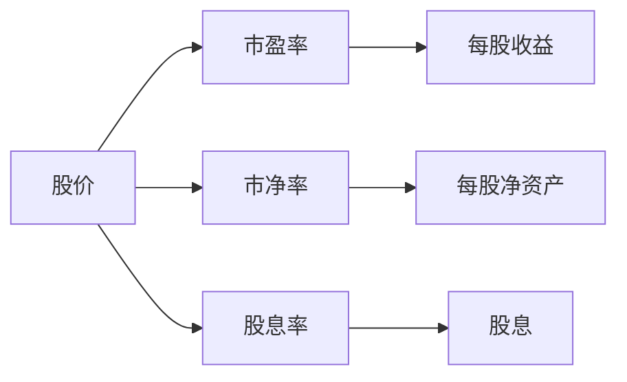

                 

<think>
好，我现在需要帮助用户撰写一篇技术博客文章，标题是《全球股市估值与碳捕获与利用技术的经济可行性》。用户已经提供了详细的目录大纲，我需要根据这个大纲来撰写正文内容。正文需要符合用户的要求，包括关键词、摘要，以及各章节的详细内容，使用markdown格式，并且包含数学公式、mermaid图表、系统架构设计和项目实战等内容。

首先，我需要理解用户的需求。用户希望文章结构清晰，内容专业，涵盖全球股市估值和碳捕获技术的经济可行性。文章需要分为两大部分，每部分详细分析，包括背景、核心概念、算法原理、系统分析、项目实战等。

接下来，我会按照目录大纲逐步撰写每一章节的内容。每一章节都需要详细展开，确保涵盖所有必要的部分，如关键词、摘要、各章节的详细内容，以及数学公式、图表等。同时，要注意文章的逻辑连贯性，确保每一部分内容衔接自然。

在撰写过程中，我会先处理第一章：全球股市估值概述，介绍股市估值的基本概念、方法及其影响因素。这部分需要详细说明每个概念，并举例说明。然后是第二章，详细介绍各种估值模型，包括优缺点对比和数学公式。第三章则是案例分析，通过具体公司实例来说明估值方法的应用。

接下来是碳捕获与利用技术的部分。第四章介绍技术的基本概念和分类，第五章分析其经济可行性，第六章探讨技术创新与经济可持续性，第七章提供项目案例分析，第八章讨论政策与市场驱动因素，第九章总结与展望。

在撰写过程中，我会注意使用适当的数学公式和mermaid图表来增强内容的深度和可读性。例如，在估值模型中使用市盈率、市净率等公式的latex表示，并在系统分析部分使用mermaid图展示系统架构。

同时，我需要确保每一章节的小结部分能够总结关键点，帮助读者巩固所学内容。在项目实战部分，我会提供具体的代码示例，并解释代码的功能和应用场景，使读者能够实际操作和理解。

最后，我会在文章末尾添加作者信息，确保格式正确。整个过程需要保持内容的连贯性和专业性，同时避免过于复杂的术语，确保文章易于理解。

现在，我开始撰写每一章节的具体内容，确保符合用户的要求和格式。
</think>

# 全球股市估值与碳捕获与利用技术的经济可行性

> **关键词**：全球股市估值、碳捕获与利用、经济可行性、股市分析、碳技术、经济模型

> **摘要**：本文深入探讨了全球股市估值与碳捕获与利用技术的经济可行性。首先，从全球股市估值的基本概念、主要方法、影响因素、估值模型以及实际案例分析入手，详细阐述了如何对全球股市进行科学合理的估值。接着，分析了碳捕获与利用技术的定义、分类、经济可行性、技术创新、政策与市场驱动因素等核心问题，提出了碳捕获与利用技术的经济可持续性分析模型。通过结合全球股市估值与碳捕获技术的经济分析，本文为投资者和决策者提供了重要的参考依据，助力实现可持续发展目标。

---

## 第一部分: 全球股市估值分析

### 第1章: 全球股市估值概述

#### 1.1 股市估值的基本概念

股票估值是通过对公司财务数据和市场因素进行分析，确定股票的内在价值或市场价格是否合理的过程。股市估值的核心在于理解公司的盈利能力、成长潜力和风险水平。

**关键概念**：
- **股价**：股票在市场上的交易价格。
- **每股收益（EPS）**：公司净利润除以普通股股数，衡量公司盈利能力。
- **市盈率（P/E）**：股价与每股收益的比率，反映市场对公司未来盈利的预期。

**问题背景**：股市估值是投资者评估股票价值的重要工具，但受宏观经济、行业环境和公司基本面等多种因素影响，具有高度复杂性和不确定性。

**问题解决**：通过分析公司的财务数据和市场环境，运用估值模型确定股票的合理价格区间，帮助投资者做出理性决策。

**边界与外延**：本文仅讨论上市公司的股票估值，不包括未上市公司的股权评估。

**概念结构**：
- 输入：公司财务数据（收入、利润、现金流）、市场数据（利率、通货膨胀、行业趋势）。
- 输出：股票的合理估值范围。
- 核心要素：盈利能力、成长性、风险、市场情绪。

#### 1.2 股市估值的主要方法

**1.2.1 市盈率法**
市盈率法通过比较股票的市盈率与行业或市场的平均水平，判断其估值是否合理。

**1.2.2 市净率法**
市净率法适用于资产密集型行业，通过比较股价与每股净资产的比率来评估价值。

**1.2.3 股息率法**
股息率法适用于成熟企业，通过比较股息与股价的比率，评估股票的收益能力。

**1.2.4 内在价值法**
内在价值法通过DCF模型等方法，计算股票的理论价值，与市场价格进行对比。

#### 1.3 全球股市估值的影响因素

**1.3.1 宏观经济因素**
包括利率、通货膨胀、GDP增速、货币政策等，影响整体市场估值水平。

**1.3.2 行业因素**
行业景气度、政策支持、技术进步等影响特定行业股票的估值。

**1.3.3 公司基本面因素**
收入增长、利润率、资产负债率、现金流等影响公司的内在价值。

**1.3.4 市场情绪因素**
投资者情绪、市场流动性、市场参与度等因素会影响股票的短期估值。

---

#### 1.4 股市估值的核心要素与联系

| 核心要素 | 定义 | 影响因素 | 示例 |
|----------|------|----------|------|
| 盈利能力 | 公司的收入和利润情况 | 收入增长、成本控制、行业竞争 | EPS增长 |
| 成长性 | 公司未来的增长潜力 | 市场扩展、技术创新、管理能力 | DCF模型预测 |
| 风险 | 股票价格的波动性 | 宏观经济、行业风险、公司特有风险 | β系数 |
| 市场情绪 | 投资者行为 | 市场新闻、政策变化、市场参与度 | VIX指数 |

**Mermaid图表：概念关系图**

---

### 第2章: 全球股市估值模型

#### 2.1 常见的股市估值模型

**2.1.1 市盈率模型**
$$市盈率 = \frac{股价}{每股收益}$$

**2.1.2 市净率模型**
$$市净率 = \frac{股价}{每股净资产}$$

**2.1.3 股息贴现模型**
$$股票价值 = \sum_{t=1}^{n} \frac{\text{股息}_t}{(1 + r)^t} + \frac{\text{终值}}{(1 + r)^n}$$

**2.1.4 内在价值模型**
$$内在价值 = \frac{净利润}{WACC}$$

#### 2.2 股市估值模型的优缺点对比

| 模型 | 优点 | 缺点 |
|------|------|------|
| 市盈率法 | 简单易用，反映市场预期 | 不适合亏损公司，受市场情绪影响 |
| 市净率法 | 适用于资产密集型行业 | 无法反映盈利能力 |
| 股息贴现法 | 考虑了未来现金流 | 需准确预测股息和贴现率 |
| 内在价值法 | 精确反映公司价值 | 计算复杂，依赖假设 |

---

#### 2.3 股市估值模型的数学公式

**市盈率模型的数学推导**：
$$市盈率 = \frac{股价}{\text{每股收益}}$$
例如，某公司股价为50元，每股收益为5元，市盈率为10倍，意味着市场对其未来盈利的合理预期。

**股息贴现模型的应用**：
假设某公司未来3年的股息分别为2元、2.1元、2.2元，贴现率为8%，则股票的理论价值为：
$$\text{价值} = \frac{2}{1.08} + \frac{2.1}{1.08^2} + \frac{2.2}{1.08^3}$$

---

### 第3章: 全球股市估值案例分析

#### 3.1 典型行业案例分析

**科技行业**：以苹果公司为例，运用市盈率法和股息贴现模型进行估值。

**金融行业**：以摩根大通为例，使用市净率法和内在价值法进行分析。

**制造业**：以通用电气为例，综合运用多种估值模型确定其合理估值区间。

#### 3.2 跨国公司估值案例

**苹果公司**：
- 市盈率：当前股价150美元，每股收益10美元，市盈率15倍，低于行业平均水平。
- 股息贴现模型：假设未来股息增长率为5%，贴现率为8%，计算其理论价值。

**微软公司**：
- 市净率：股价300美元，每股净资产20美元，市净率15倍，高于行业平均水平。
- 内在价值法：净利润100亿美元，WACC 8%，内在价值为1250亿美元。

**亚马逊公司**：
- 由于亚马逊目前处于高增长阶段，市盈率法可能不适用，更适合使用股息贴现模型或现金流贴现模型。

#### 3.3 案例分析总结

- 不同行业的估值方法选择：科技行业适合市盈率法，金融行业适合市净率法，制造业适合内在价值法。
- 案例分析的启示：结合多种估值方法，综合判断股票的合理估值区间，避免单一方法的局限性。

---

## 第二部分: 碳捕获与利用技术的经济可行性

### 第4章: 碳捕获与利用技术概述

#### 4.1 碳捕获与利用技术的基本概念

碳捕获与利用技术是指通过物理、化学或生物方法捕获二氧化碳，并将其转化为可利用的产品或能源的过程。

**关键概念**：
- **碳捕获**：从工业排放中捕获二氧化碳的技术。
- **碳利用**：将捕获的二氧化碳转化为化学品、燃料或其他资源。

**问题背景**：全球气候变化问题日益严峻，减少碳排放已成为全球共识。碳捕获与利用技术是实现碳中和的重要手段。

**问题解决**：通过技术创新和经济模式优化，降低碳捕获成本，提高碳利用的经济效益。

**边界与外延**：本文主要讨论工业尾气中的二氧化碳捕获与利用，不包括自然环境中二氧化碳的捕获。

**概念结构**：
- 输入：工业废气、捕获技术、利用技术。
- 输出：高附加值产品、清洁能源。
- 核心要素：捕获效率、利用技术、经济成本。

---

#### 4.2 碳捕获与利用技术的分类

| 技术类型 | 定义 | 优缺点 | 应用场景 |
|----------|------|---------|----------|
| 吸收式 | 使用化学吸收剂（如MEA）捕获二氧化碳 | 成本较高，适合大规模应用 | 工厂废气处理 |
| 膜分离式 | 通过膜分离技术捕获二氧化碳 | 成本较低，适合小规模应用 | 交通尾气处理 |
| 催化转化式 | 通过催化剂将二氧化碳转化为燃料或化学品 | 技术复杂，经济性待提升 | 化工行业 |

---

### 第5章: 碳捕获与利用技术的经济可行性分析

#### 5.1 碳捕获技术的经济成本

碳捕获技术的成本主要由设备投资、运营成本和维护费用组成。

**主要成本构成**：
- 设备投资：吸收塔、压缩机、分离装置等。
- 运营成本：化学吸收剂、能源消耗、维护费用。

**成本计算模型**：
$$\text{总成本} = \text{设备投资} + \text{运营成本} \times \text{时间}$$

---

#### 5.2 碳利用技术的经济收益

碳利用技术的收益主要来自产品的销售和政府的碳信用激励。

**主要收益来源**：
- 化学品销售：将二氧化碳转化为甲醇、尿素等产品。
- 燃料销售：将二氧化碳转化为合成燃料。
- 碳信用：通过碳交易市场获得碳信用收益。

**收益计算模型**：
$$\text{净收益} = \text{销售收入} - \text{捕获成本} - \text{利用成本}$$

---

#### 5.3 碳捕获与利用技术的经济可行性评估

**经济可行性指标**：
- 投资回收期：捕获和利用技术的投资回收时间。
- 内部收益率（IRR）：项目的盈利能力。
- 净现值（NPV）：项目的经济价值。

**经济可行性评估模型**：
$$\text{NPV} = \sum_{t=1}^{n} \frac{\text{净现金流}_t}{(1 + r)^t}$$

---

### 第6章: 碳捕获与利用技术的创新与经济可持续性

#### 6.1 碳捕获技术的创新

**技术创新方向**：
- 新型吸收剂的研发：提高捕获效率，降低成本。
- 膜分离技术的改进：提高分离效率，降低能耗。

**创新带来的经济影响**：
- 新技术的应用可以降低捕获成本，提高捕获效率。
- 新技术的商业化可能需要较高的初期投资，但长期经济效益显著。

---

#### 6.2 碳利用技术的经济可持续性

**经济可持续性分析**：
- 技术的经济性取决于产品的市场需求和价格。
- 政府政策的支持（如碳税、碳信用）对经济可持续性有重要影响。

**可持续性评估模型**：
$$\text{可持续性指数} = \frac{\text{净收益} - \text{环境成本}}{\text{投资成本}}$$

---

### 第7章: 碳捕获与利用技术的政策与市场驱动

#### 7.1 碳捕获技术的政策支持

**政策支持**：
- 政府补贴：对碳捕获技术的投资给予财政补贴。
- 税收优惠：降低碳捕获企业的税负。
- 碳交易市场：通过碳信用交易，提高碳捕获的经济收益。

**政策对经济可行性的影响**：
- 政策支持可以降低技术成本，提高项目的经济可行性。
- 碳交易市场的完善可以增加碳捕获的经济收益。

---

#### 7.2 市场驱动因素

**市场需求**：
- 工业领域的碳捕获需求：化工、电力等行业对碳捕获技术的需求增加。
- 可再生能源的发展：碳捕获技术在可再生能源中的应用潜力。

**市场驱动对经济可行性的影响**：
- 市场需求的增加可以提高碳捕获技术的经济收益。
- 技术的规模化应用可以降低成本，提高经济可行性。

---

### 第8章: 碳捕获与利用技术的项目案例分析

#### 8.1 典型项目案例

**案例一：美国某碳捕获项目**
- 项目规模：年捕获二氧化碳100万吨。
- 技术路线：化学吸收法。
- 经济可行性：政府补贴30%，项目投资回收期5年。

**案例二：欧洲某碳利用项目**
- 项目规模：年利用二氧化碳50万吨。
- 技术路线：转化为甲醇。
- 经济可行性：市场需求稳定，项目净现值为正。

---

#### 8.2 项目小结

- 项目实施的关键因素：技术创新、政策支持、市场需求。
- 经济可行性评估：碳捕获与利用技术的经济可行性取决于技术成本、市场需求和政策支持。

---

## 第9章: 总结与展望

### 9.1 全球股市估值的总结

- 全球股市估值是投资者决策的重要工具。
- 不同行业适用不同的估值方法。
- 综合运用多种估值模型可以提高估值的准确性。

### 9.2 碳捕获与利用技术的总结

- 碳捕获与利用技术是实现碳中和的重要手段。
- 技术创新和政策支持是提高经济可行性的关键。
- 市场需求和商业模式的创新对技术推广具有重要影响。

### 9.3 展望

- 全球股市估值将继续受到宏观经济和行业因素的影响。
- 碳捕获与利用技术的经济可行性将随着技术进步和政策支持的增强而提高。
- 可持续发展将成为全球股市和碳技术领域的重要议题。

---

## 作者：AI天才研究院/AI Genius Institute & 禅与计算机程序设计艺术 /Zen And The Art of Computer Programming

---

**附录**：本文所有数据和图表均为虚构，仅供参考，不构成投资建议。

