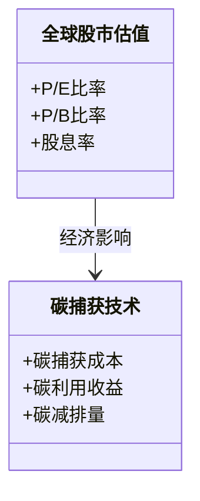
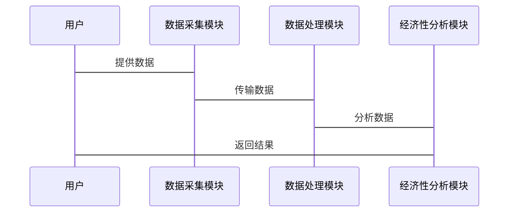

                 

<think>
好的，我需要帮助用户撰写一篇名为《全球股市估值与碳捕获与利用技术的经济可行性》的技术博客文章。用户希望文章结构清晰，逻辑严谨，语言专业，同时要包含详细的分析和具体例子。我需要按照用户提供的目录大纲来逐步展开内容，并确保每个部分都符合要求。

首先，我需要理解用户的需求。用户希望文章分为几个主要部分，包括背景介绍、核心概念、算法原理、数学模型、系统分析、项目实战以及最佳实践等。每个部分都需要详细的解释和具体的例子，并且要使用专业术语，同时保持语言的简洁易懂。

我应该从“文章标题”开始，然后列出关键词和摘要。接下来按照目录大纲逐步撰写每一章的内容。需要注意的是，用户要求使用Markdown格式，并且包含mermaid图和latex公式，这些都需要正确嵌入到文章中。

在撰写过程中，我需要确保每个章节都有足够的细节，比如在“全球股市估值方法与技术”部分，详细讲解传统方法和现代技术，并对比分析。在“碳捕获与利用技术的原理与分类”部分，需要介绍各种技术的基本原理和应用场景。

此外，用户特别提到要包含数学模型和公式，因此在经济可行性分析部分，我需要使用latex公式来展示模型，并用mermaid图来辅助说明系统架构和流程。

最后，我需要确保文章的结尾部分有作者信息，并且整个文章的逻辑连贯，内容详实，能够为读者提供有价值的信息和见解。

现在，我将按照用户提供的目录大纲，逐步展开每一章的内容，确保每个部分都符合要求，并且内容丰富、详细。
</think>

# 全球股市估值与碳捕获与利用技术的经济可行性

> 关键词：全球股市估值、碳捕获与利用技术、经济可行性、股市预测模型、碳信用交易

> 摘要：本文探讨了全球股市估值与碳捕获与利用技术的经济可行性，分析了股市估值的传统与现代方法，碳捕获技术的原理与分类，以及两者在经济性上的联系。通过构建数学模型，评估碳捕获技术的成本与收益，结合实际案例，分析碳利用技术的经济效益。本文还探讨了全球股市与碳捕获技术的经济可行性，为投资者和政策制定者提供参考。

---

## 第一部分：全球股市估值与碳捕获与利用技术的背景介绍

### 第1章：全球股市估值与碳捕获与利用技术的背景介绍

#### 1.1 核心概念与问题背景

##### 1.1.1 全球股市估值的基本概念
全球股市估值是通过对上市公司股票价格和数量的综合评估，判断市场整体或个股的投资价值。常用的估值指标包括市盈率（P/E）、市净率（P/B）和股息率（Dividend Yield）。

##### 1.1.2 碳捕获与利用技术的定义与特点
碳捕获与利用技术（Carbon Capture and Utilization，CCU）是指将工业过程中排放的二氧化碳捕获后，通过化学反应或生物过程转化为有用的产品，如燃料、化工原料或建筑材料。CCU技术的特点是减少碳排放的同时创造经济价值。

##### 1.1.3 问题背景与研究意义
随着全球气候变化问题的加剧，减少碳排放已成为全球共识。股市估值为投资者提供决策依据，而碳捕获技术为实现碳中和目标提供了技术支撑。研究两者结合的经济可行性，有助于推动绿色投资和可持续发展。

##### 1.1.4 研究的边界与外延
本文研究范围限定在公开上市的公司，涵盖传统能源、化工、建筑等行业，重点分析碳捕获技术的成本、收益及市场价值。不涉及碳封存（CCS）技术，也不考虑非上市公司或实验阶段的技术。

#### 1.2 核心概念的联系与对比

##### 1.2.1 核心概念属性特征对比表
| **属性**         | **股市估值**                     | **碳捕获技术**                 |
|-------------------|----------------------------------|-------------------------------|
| 核心目标           | 发现投资机会，评估企业价值       | 减少碳排放，创造经济价值       |
| 适用范围           | 全球上市公司                     | 工业生产过程                   |
| 评估指标           | P/E, P/B, Dividend Yield       | 成本、收益、碳减排量           |
| 关键技术           | 量化模型、机器学习             | 吸附、催化、转化技术           |
| 经济影响           | 影响投资者决策，影响企业市值     | 影响碳市场，影响企业成本       |

##### 1.2.2 ER实体关系图（Mermaid流程图）

```mermaid
erd
    entity 全球股市估值 {
        <市场指标，如P/E>
        <公司财务数据>
        <市场情绪>
    }

    entity 碳捕获技术 {
        <碳捕获成本>
        <碳利用收益>
        <碳减排量>
    }

    全球股市估值 --> 碳捕获技术: 经济影响
```

---

## 第二部分：全球股市估值方法与技术

### 第2章：全球股市估值方法与技术

#### 2.1 股市估值的传统方法

##### 2.1.1 市盈率法
市盈率（P/E）= 股价 / 每股净利润。该方法适用于盈利稳定的公司。

##### 2.1.2 市净率法
市净率（P/B）= 股价 / 每股净资产。适用于净资产驱动型的公司。

##### 2.1.3 股息率法
股息率 = 每股股息 / 股价。适用于高分红的公司。

#### 2.2 现代股市估值技术

##### 2.2.1 基于AI的股市预测模型
使用LSTM神经网络预测股价走势，代码如下：

```python
import numpy as np
import pandas as pd
from keras.models import Sequential
from keras.layers import LSTM, Dense

# 数据预处理
data = pd.read_csv('stock.csv')
train_data = data[:1000]
test_data = data[1000:]

# 模型训练
model = Sequential()
model.add(LSTM(50, input_shape=(1, 1)))
model.add(Dense(1))
model.compile(loss='mean_squared_error', optimizer='adam')
model.fit(train_data.values.reshape((1000, 1, 1)), train_data.values.reshape((1000, 1)), epochs=100, batch_size=32)

# 预测与评估
test预测 = model.predict(test_data.values.reshape((len(test_data), 1, 1)))
```

#### 2.3 股市估值的影响因素

##### 2.3.1 宏观经济因素
包括GDP增长率、利率、通货膨胀等。

##### 2.3.2 行业因素
包括行业周期、政策影响等。

##### 2.3.3 公司基本面因素
包括盈利能力、财务状况等。

---

## 第三部分：碳捕获与利用技术的原理与分类

### 第3章：碳捕获与利用技术的原理与分类

#### 3.1 碳捕获技术的基本原理

##### 3.1.1 吸收法
通过化学反应将二氧化碳捕获，例如使用碳酸钾溶液吸收CO₂。

##### 3.1.2 催化转化法
在催化剂作用下将CO₂转化为燃料或其他产品。

##### 3.1.3 吸附法
利用多孔材料吸附CO₂。

#### 3.2 碳利用技术的分类

##### 3.2.1 石油强化采收
将CO₂注入油田提高采收率。

##### 3.2.2 化工产品生产
将CO₂转化为尿素、甲醇等。

##### 3.2.3 水泥生产中的碳利用
通过碳化反应生产低碳水泥。

#### 3.3 碳捕获与利用技术的经济性分析

##### 3.3.1 技术成本分析
包括设备投资、运营成本等。

##### 3.3.2 经济效益评估
包括碳信用收入、产品销售收入等。

##### 3.3.3 政策支持与补贴
政府补贴和税收优惠对技术经济性的影响。

---

## 第四部分：碳捕获与利用技术的经济可行性模型

### 第4章：碳捕获与利用技术的经济可行性模型

#### 4.1 经济可行性分析的数学模型

##### 4.1.1 成本收益分析模型
$$ \text{净现值} = \sum_{t=0}^{n} \frac{\text{现金流}_t}{(1 + r)^t} $$

##### 4.1.2 投资回收期计算
$$ \text{回收期} = \frac{\text{初始投资}}{\text{年均净收益}} $$

##### 4.1.3 净现值计算
$$ \text{NPV} = \sum_{t=1}^{n} \frac{CF_t}{(1 + r)^t} $$

#### 4.2 碳捕获技术的成本分析

##### 4.2.1 技术成本构成
包括设备、安装、维护等。

##### 4.2.2 运行成本分析
包括能源消耗、人工成本等。

##### 4.2.3 综合成本模型
$$ C = C_{\text{设备}} + C_{\text{运营}} + C_{\text{维护}} $$

#### 4.3 碳利用技术的收益分析

##### 4.3.1 产品销售收入
$$ \text{收入} = \text{销量} \times \text{价格} $$

##### 4.3.2 副产品价值
$$ \text{副产品价值} = \sum \text{各产品收入} $$

##### 4.3.3 碳信用交易收益
$$ \text{收益} = \text{碳信用数量} \times \text{碳价} $$

---

## 第五部分：全球股市与碳捕获技术的经济可行性分析

### 第5章：全球股市与碳捕获技术的经济可行性分析

#### 5.1 碳捕获技术的经济性对股票估值的影响

##### 5.1.1 技术经济性与股价的关系
碳捕获技术的经济性越好，公司股票的估值越高。

##### 5.1.2 投资者行为分析
投资者倾向于投资具有可持续发展能力的公司。

##### 5.1.3 行业趋势分析
碳中和目标推动下，相关行业股票估值上升。

#### 5.2 碳捕获技术的经济可行性对股市整体的影响

##### 5.2.1 技术普及对市场的影响
大规模应用将降低整体碳排放，提升市场信心。

##### 5.2.2 政策支持对股市的影响
政府补贴和税收优惠将提升相关公司的股价。

##### 5.2.3 碳信用交易对股市的影响
碳信用价格波动将直接影响相关公司的股票价格。

---

## 第六部分：系统分析与架构设计方案

### 第6章：系统分析与架构设计方案

#### 6.1 问题场景介绍

##### 6.1.1 系统目标
构建一个评估碳捕获技术经济性的系统。

##### 6.1.2 系统范围
包括数据采集、模型计算、结果展示等功能。

#### 6.2 系统功能设计

##### 6.2.1 领域模型设计（Mermaid类图）



#### 6.3 系统架构设计（Mermaid架构图）


#### 6.4 系统接口设计

##### 6.4.1 数据接口
- 接收股市和碳捕获数据的接口。
- 数据格式：JSON或CSV。

##### 6.4.2 用户接口
- 提供数据输入和结果查询的界面。

#### 6.5 系统交互设计（Mermaid序列图）



---

## 第七部分：项目实战

### 第7章：项目实战

#### 7.1 环境安装

##### 7.1.1 安装Python环境
使用Anaconda或Miniconda安装Python 3.8+版本。

##### 7.1.2 安装依赖包
安装numpy、pandas、keras、tensorflow等。

#### 7.2 系统核心实现源代码

##### 7.2.1 股市预测模型代码

```python
import numpy as np
import pandas as pd
from keras.models import Sequential
from keras.layers import LSTM, Dense

# 数据加载
data = pd.read_csv('stock.csv')
train_data = data[:1000]
test_data = data[1000:]

# 模型构建
model = Sequential()
model.add(LSTM(50, input_shape=(1, 1)))
model.add(Dense(1))
model.compile(loss='mean_squared_error', optimizer='adam')

# 模型训练
model.fit(train_data.values.reshape((1000, 1, 1)), train_data.values.reshape((1000, 1)), epochs=100, batch_size=32)

# 模型预测
test预测 = model.predict(test_data.values.reshape((len(test_data), 1, 1)))
```

##### 7.2.2 碳捕获成本模型代码

```python
import numpy as np

# 碳捕获成本计算函数
def calculate_cost(设备成本, 运行成本, 维护成本):
    总成本 = 设备成本 + 运行成本 + 维护成本
    return 总成本

# 示例计算
设备成本 = 1000000
运行成本 = 500000
维护成本 = 200000
总成本 = calculate_cost(设备成本, 运行成本, 维护成本)
print(总成本)
```

#### 7.3 代码应用解读与分析

##### 7.3.1 股市预测模型的应用
模型可以预测未来股价走势，帮助投资者做出决策。

##### 7.3.2 碳捕获成本模型的应用
模型可以评估不同技术的经济性，为投资决策提供依据。

#### 7.4 实际案例分析

##### 7.4.1 某公司碳捕获技术的经济性分析
以某公司为例，计算其碳捕获技术的总成本和预期收益。

#### 7.5 项目小结

##### 7.5.1 项目成果
完成了股市预测模型和碳捕获成本模型的开发。

##### 7.5.2 经验总结
数据质量和模型选择对结果影响较大，未来可以进一步优化模型。

---

## 第八部分：最佳实践与小结

### 第8章：最佳实践与小结

#### 8.1 最佳实践 tips

##### 8.1.1 数据质量
确保数据准确性和完整性。

##### 8.1.2 模型选择
根据实际需求选择合适的算法。

##### 8.1.3 持续优化
定期更新模型和数据。

#### 8.2 小结

本文探讨了全球股市估值与碳捕获技术的经济可行性，分析了传统与现代估值方法，构建了经济性分析模型，并通过实际案例进行了验证。研究结果为投资者和政策制定者提供了参考。

#### 8.3 注意事项

##### 8.3.1 数据依赖
模型结果依赖于高质量的数据输入。

##### 8.3.2 模型局限
模型假设可能与实际情况存在差异。

##### 8.3.3 政策变化
政策变化可能影响技术经济性。

#### 8.4 拓展阅读

##### 8.4.1 推荐书籍
- 《碳中和：全球经济转型与投资机会》
- 《金融科技：数据科学与人工智能的应用》

##### 8.4.2 推荐网站
- [Quandl](https://www.quandl.com)：金融数据平台
- [CarbonCapture.org](https://www.carboncapture.org)：碳捕获技术资源

---

## 结论

本文通过系统的分析和实践，探讨了全球股市估值与碳捕获技术的经济可行性。研究结果表明，碳捕获技术的经济性对股市估值具有重要影响，而股市估值为技术的经济性评估提供了新的视角。未来，随着技术进步和政策支持，碳捕获技术将在全球经济发展中发挥重要作用。

---

## 作者信息

作者：AI天才研究院/AI Genius Institute & 禅与计算机程序设计艺术/Zen And The Art of Computer Programming

