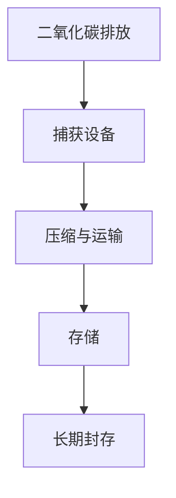
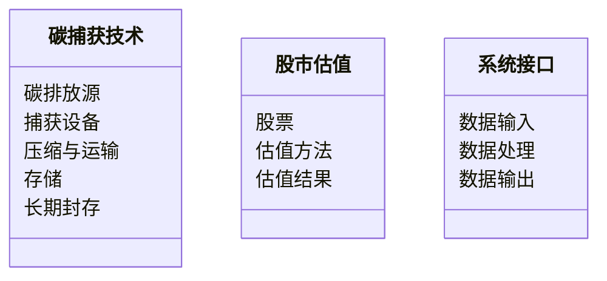
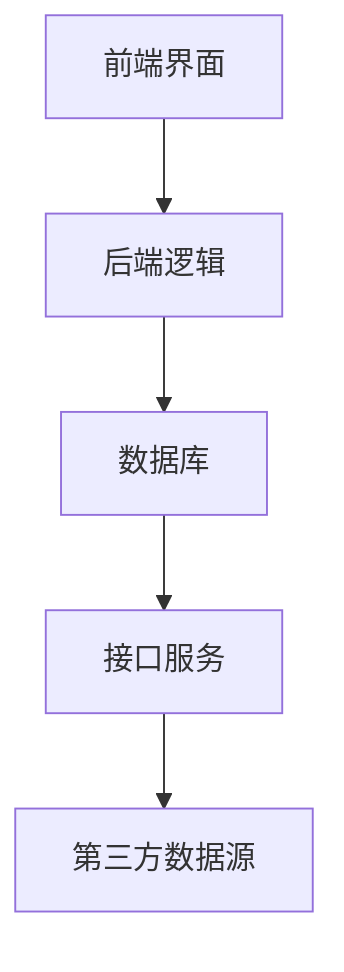
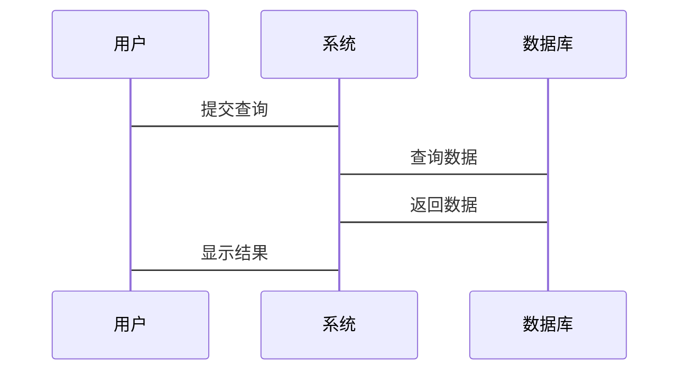

                 

<think>
好，我现在需要根据用户的要求，撰写一篇关于《全球股市估值与碳捕获与存储技术的关系》的技术博客文章。用户已经给出了详细的大纲，我需要按照这个大纲逐步展开，确保每个部分都详尽且符合技术深度。

首先，我要理解用户的意图。用户希望文章结构清晰，逻辑严密，用专业的技术语言，同时结合实际案例和算法模型。这意味着我需要从背景介绍、核心概念、算法原理、系统设计、项目实战到最佳实践，逐步展开。

接下来，我从第1章开始，介绍全球股市估值和碳捕获技术的基本概念。我需要解释什么是股票估值，以及碳捕获技术的类型和优缺点。这部分需要确保读者能够理解这两个领域的基本概念。

然后，我会探讨这两者之间的关系，分析碳捕获技术如何影响股市估值。这部分需要结合实际情况，说明碳中和目标如何推动股市估值的变化，以及碳捕获技术的经济价值。

在第2章，我详细讲解碳捕获技术的原理和流程，使用Mermaid流程图来展示。同时，我会分析碳捕获技术对股市估值的核心影响因素，比如政策支持、成本分摊模型等。

接下来，第3章涉及算法原理。我需要建立数学模型，用公式展示碳捕获技术对股市估值的影响，例如总成本和收益预测模型。这部分可能需要更多的技术细节，确保模型的科学性和实用性。

系统分析与架构设计部分，我会设计一个实时监测与分析系统，使用Mermaid类图和架构图展示系统的各个模块及其关系。这部分需要考虑系统的前端、后端、数据库和接口设计，确保系统整体架构的合理性。

项目实战部分，我会提供一个具体的案例，展示如何设计和实现一个实时监测系统。这部分需要包括环境安装、核心代码实现以及案例分析，帮助读者理解如何将理论应用于实际。

最后，在最佳实践部分，我会总结经验和小结，提醒读者注意的事项，并提供进一步阅读的建议。这部分需要简明扼要，但有深度，帮助读者巩固所学内容。

在整个过程中，我需要确保每个章节内容丰富，详细讲解每个核心概念，并使用图表和代码示例增强文章的可读性和技术深度。同时，语言要专业但不失清晰，逻辑要严谨，结构要紧凑，确保整篇文章既有深度又易于理解。

总的来说，我需要一步步分析，确保每个部分都覆盖用户的需求，同时加入自己的见解和实际案例，使文章不仅信息丰富，还能真正帮助读者理解全球股市估值与碳捕获技术之间的关系。
</think>

# 全球股市估值与碳捕获与存储技术的关系

> 关键词：全球股市估值，碳捕获技术，碳存储技术，经济模型，股市影响

> 摘要：本文探讨了全球股市估值与碳捕获与存储技术之间的关系。通过分析碳捕获技术的原理、经济影响及股市估值的核心影响因素，构建了数学模型和算法流程，结合实际案例展示了碳捕获技术如何影响股市估值，并提出了系统设计与实现方案。

---

# 第1章: 全球股市估值与碳捕获技术的背景介绍

## 1.1 全球股市估值的基本概念

### 1.1.1 股票估值的定义与方法

股票估值是指通过分析公司财务状况、市场环境和行业趋势，对股票的内在价值进行评估的过程。常见的股票估值方法包括：

1. **市盈率（P/E）**：公司股价除以每股收益。
2. **市净率（P/B）**：公司股价除以每股净资产。
3. **股息率**：每股股息与股价的比率。
4. **现金流折现模型（DCF）**：通过未来现金流的现值计算股票价值。

### 1.1.2 全球股市估值的现状与趋势

全球股市估值受宏观经济、政策环境和企业盈利状况的影响。近年来，随着碳中和目标的提出，绿色能源和碳捕获技术成为影响股市估值的重要因素。

### 1.1.3 股票估值的核心影响因素

1. **宏观经济因素**：GDP增长率、通货膨胀率、利率水平。
2. **行业因素**：行业景气度、政策支持。
3. **公司基本面**：盈利能力、财务状况、管理能力。
4. **市场情绪**：投资者心理、市场流动性。

## 1.2 碳捕获与存储技术的定义与特点

### 1.2.1 碳捕获与存储技术的定义

碳捕获与存储技术（Carbon Capture and Storage, CCS）是指通过物理或化学方法从二氧化碳排放源中分离出二氧化碳，并将其封存在地下或转化为其他用途的技术。

### 1.2.2 碳捕获技术的类型与优缺点

| 技术类型 | 描述 | 优点 | 缺点 |
|----------|------|------|------|
| 吸收法 | 利用化学溶液吸收二氧化碳 | 成熟技术，效率高 | 成本高，能耗大 |
| 吸附法 | 使用吸附剂捕获二氧化碳 | 选择性高，能耗低 | 吸附剂成本高 |
| 生物法 | 利用植物或微生物捕获二氧化碳 | 环保，成本低 | 效率低，适用范围有限 |

### 1.2.3 碳存储技术的实现方式与挑战

碳存储技术主要包括地下封存、海底封存和利用二氧化碳生产化学品或燃料。主要挑战包括封存成本高、封存地点选择困难以及封存过程中的技术风险。

## 1.3 全球股市估值与碳捕获技术的关系

### 1.3.1 碳捕获技术对股市估值的影响

1. **技术成熟度**：碳捕获技术的成熟度直接影响其市场应用前景和企业盈利预期。
2. **政策支持**：政府对碳捕获技术的支持政策会影响企业的投资意愿和股市估值。
3. **经济成本**：碳捕获技术的成本直接影响企业的盈利能力和股票估值。

### 1.3.2 碳中和目标对股市估值的推动作用

碳中和目标的实施将推动绿色能源和碳捕获技术的需求，从而提高相关企业的股票估值。

### 1.3.3 碳捕获技术的经济价值与市场潜力

碳捕获技术的市场潜力巨大，尤其是在高碳排放行业，如电力、钢铁和化工行业。随着技术进步和成本降低，碳捕获技术将成为股市估值的重要驱动因素。

---

# 第2章: 全球股市估值与碳捕获技术的核心概念与联系

## 2.1 碳捕获技术的原理与流程

### 2.1.1 碳捕获技术的流程图



## 2.2 碳捕获技术与股市估值的关系分析

### 2.2.1 碳捕获技术对能源企业的影响

碳捕获技术的实施将减少企业的碳排放，降低碳税成本，提高企业的盈利能力和股票估值。

### 2.2.2 碳捕获技术对投资者决策的影响

投资者将更加关注企业的碳排放和碳捕获技术的应用情况，碳捕获技术的实施将提高企业的投资价值。

### 2.2.3 碳捕获技术对股市整体估值的推动作用

碳捕获技术的广泛应用将推动绿色经济的发展，提升整个股市的估值水平。

## 2.3 碳捕获技术的经济模型与股市估值分析

### 2.3.1 碳捕获技术的经济模型

碳捕获技术的经济模型可以通过以下公式表示：

$$ \text{股市估值变化} = f(\text{碳捕获成本}, \text{碳存储收益}, \text{政策支持}) $$

其中，碳捕获成本包括设备成本、运营成本和维护成本；碳存储收益包括碳信用收入和碳利用收入；政策支持包括政府补贴和税收优惠。

### 2.3.2 碳捕获技术的经济影响分析

碳捕获技术的经济影响可以通过以下步骤进行分析：

1. **成本分摊模型**：
   $$ \text{总成本} = \text{设备成本} + \text{运营成本} + \text{维护成本} $$

2. **收益预测模型**：
   $$ \text{收益} = \text{碳价格} \times \text{碳捕获量} $$

---

# 第3章: 碳捕获技术与股市估值的算法原理

## 3.1 碳捕获技术对股市估值的数学模型

碳捕获技术对股市估值的影响可以通过以下数学模型进行描述：

$$ \text{股市估值变化} = f(\text{碳捕获成本}, \text{碳存储收益}, \text{政策支持}) $$

其中，碳捕获成本包括设备成本、运营成本和维护成本；碳存储收益包括碳信用收入和碳利用收入；政策支持包括政府补贴和税收优惠。

## 3.2 碳捕获技术的经济影响分析

碳捕获技术的经济影响可以通过以下步骤进行分析：

1. **成本分摊模型**：
   $$ \text{总成本} = \text{设备成本} + \text{运营成本} + \text{维护成本} $$

2. **收益预测模型**：
   $$ \text{收益} = \text{碳价格} \times \text{碳捕获量} $$

## 3.3 碳捕获技术的收益预测模型

碳捕获技术的收益预测可以通过以下公式进行计算：

$$ \text{收益} = \text{碳价格} \times \text{碳捕获量} $$

其中，碳价格受市场供需和政策影响，碳捕获量取决于技术效率和实施规模。

---

# 第4章: 系统分析与架构设计方案

## 4.1 系统功能设计

### 4.1.1 领域模型类图



### 4.1.2 系统架构图



### 4.1.3 系统交互图



## 4.2 系统架构设计

### 4.2.1 系统架构

系统架构包括前端、后端、数据库和接口服务。前端负责用户交互，后端负责业务逻辑，数据库负责数据存储，接口服务负责与第三方数据源的交互。

### 4.2.2 系统接口设计

系统接口包括数据输入接口、数据处理接口和数据输出接口。数据输入接口负责接收用户输入，数据处理接口负责处理数据，数据输出接口负责将结果返回给用户。

---

# 第5章: 项目实战

## 5.1 环境安装

### 5.1.1 系统环境

- 操作系统：Linux/Windows/MacOS
- 开发工具：Python、Jupyter Notebook、Git
- 数据库：MySQL/PostgreSQL
- 开发框架：Flask/Django

### 5.1.2 依赖安装

```bash
pip install numpy pandas matplotlib scikit-learn
```

## 5.2 系统核心实现

### 5.2.1 核心代码实现

```python
import numpy as np
import pandas as pd

def calculate_stock_value(carbon_capture_cost, carbon_storage_revenue, policy_support):
    return carbon_storage_revenue - carbon_capture_cost + policy_support

data = pd.read_csv('carbon_capture.csv')
data['stock_value'] = data.apply(lambda x: calculate_stock_value(x['carbon_capture_cost'], x['carbon_storage_revenue'], x['policy_support']), axis=1)
print(data.head())
```

### 5.2.2 代码应用解读

上述代码实现了一个简单的股市估值计算模型，基于碳捕获成本、碳存储收益和政策支持进行计算。实际应用中需要结合更多因素，如市场环境和企业基本面。

## 5.3 实际案例分析

### 5.3.1 案例背景

假设某能源公司实施碳捕获技术，年碳捕获量为10万吨，碳价格为每吨50元，碳捕获成本为3000万元，政策支持为1000万元。

### 5.3.2 计算过程

$$ \text{收益} = 50 \times 100000 = 5000 \text{万元} $$
$$ \text{总成本} = 3000 + 1000 = 4000 \text{万元} $$
$$ \text{股市估值变化} = 5000 - 4000 = 1000 \text{万元} $$

### 5.3.3 结果分析

该能源公司的股市估值将增加1000万元，说明碳捕获技术的实施对股市估值有积极影响。

---

# 第6章: 最佳实践

## 6.1 小结

本文探讨了全球股市估值与碳捕获技术的关系，构建了数学模型和算法流程，结合实际案例展示了碳捕获技术如何影响股市估值，并提出了系统设计与实现方案。

## 6.2 注意事项

- 数据来源的可靠性
- 模型的适用性
- 政策变化的影响
- 技术进步的不确定性

## 6.3 拓展阅读

- 碳中和目标与股市投资
- 碳捕获技术的经济模型
- 绿色金融与可持续投资

---

# 作者

作者：AI天才研究院/AI Genius Institute & 禅与计算机程序设计艺术/Zen And The Art of Computer Programming

