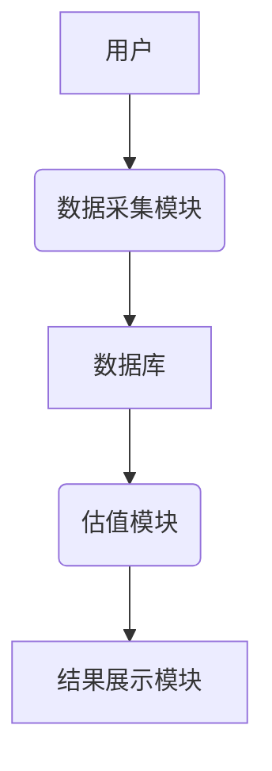

                 


# 全球股市估值与碳捕获与封存技术的经济可行性

## 关键词：全球股市估值、碳捕获与封存技术、经济可行性、股市分析、碳技术经济性、可持续发展

## 摘要：本文探讨了全球股市估值与碳捕获与封存技术的经济可行性，通过分析股市估值的方法和碳捕获技术的经济模型，揭示了如何将股市估值应用于碳捕获项目的经济分析。文章详细介绍了碳捕获技术的原理、分类及经济影响，构建了基于CAPM和DCF模型的经济分析框架，并通过案例分析验证了模型的有效性。此外，本文还讨论了碳捕获技术在股市估值中的应用前景，为投资者和政策制定者提供了决策支持。

---

## 第一部分：全球股市估值的基础

### 第1章：全球股市估值概述

#### 1.1 股市估值的定义与核心概念

股市估值是通过对公司财务数据和市场信息的分析，估算公司股票的内在价值或市场价格的过程。核心概念包括：

- **内在价值**：公司未来现金流的现值。
- **市场价格**：市场上交易的股票价格。
- **估值方法**：市盈率（P/E）、市净率（P/B）、现金流折现法（DCF）等。

#### 1.2 股市估值的主要方法

- **市盈率（P/E）法**：通过比较公司股价与每股收益的比率，评估股票的高低。
  - 公式：P/E = 市场价/每股收益
  - 例如：苹果公司某年的P/E比率为25.8，高于行业平均水平，说明其股票可能被高估或市场对其增长预期较高。

- **市净率（P/B）法**：比较公司股价与每股净资产的比率，适用于评估银行、保险公司等重资产行业。
  - 公式：P/B = 市场价/每股净资产

- **现金流折现法（DCF）**：通过预测公司未来现金流，折现到现值以估算公司价值。
  - 公式：企业价值 = ∑(CF_t / (1 + r)^t)
  - 其中，CF_t为第t年的现金流，r为折现率。

#### 1.3 影响股市估值的关键因素

- **宏观经济因素**：GDP增长率、利率、通货膨胀等。
- **行业发展趋势**：行业周期、政策法规、技术进步。
- **公司基本面**：盈利能力、财务状况、管理团队。

#### 1.4 全球股市估值的现状与挑战

- **多样性**：不同市场和行业的估值方法和标准不同。
- **误区**：忽视公司基本面、过度依赖历史数据、忽略市场情绪。
- **未来趋势**：智能化估值工具、大数据分析的应用。

---

## 第二部分：碳捕获与封存技术的经济可行性分析

### 第2章：碳捕获与封存技术概述

#### 2.1 碳捕获与封存技术的基本概念

碳捕获技术是指从工业排放源中捕获二氧化碳，防止其进入大气的过程。碳封存则是将捕获的二氧化碳长期储存于地下或转化为其他用途的过程。

- **技术分类**：
  - **化学吸收法**：使用化学溶剂（如MEA）吸收二氧化碳。
  - **物理吸附法**：利用活性炭或膜技术分离二氧化碳。
  - **生物捕获法**：利用植物或微生物吸收二氧化碳。

- **流程图**：
  ```mermaid
  graph TD
      A[排放源] --> B(化学吸收剂)
      B --> C[捕获二氧化碳]
      C --> D(运输)
      D --> E(封存地点)
  ```

#### 2.2 碳捕获与封存技术的关键环节

- **捕获过程**：使用特定技术从排放源中分离二氧化碳。
- **运输过程**：通过管道或卡车将二氧化碳运送到封存地点。
- **封存过程**：将二氧化碳注入地下地质结构（如盐水层、煤层）或转化为固体矿物。

#### 2.3 碳捕获与封存技术的经济分析框架

- **成本结构**：
  - 捕获成本：设备投资、能源消耗。
  - 运输成本：管道建设、运输费用。
  - 封存成本：注入设备、监测费用。

- **收益来源**：
  - 碳信用：通过出售碳信用获得收入。
  - 转化利用：将二氧化碳转化为燃料或其他产品。

---

## 第三部分：将股市估值应用于碳捕获技术的经济分析

### 第3章：构建碳捕获技术的经济分析模型

#### 3.1 经济分析框架

- **目标**：评估碳捕获项目的经济可行性。
- **步骤**：
  1. 确定项目参数：初始投资、运营成本、碳信用价格。
  2. 选择估值方法：CAPM、DCF。
  3. 计算净现值（NPV）和内部收益率（IRR）。

#### 3.2 数学模型

- **CAPM模型**：
  - 公式：R = R_f + β(R_m - R_f)
  - 其中，R_f为无风险利率，R_m为市场预期收益，β为股票的贝塔系数。

- **DCF模型**：
  - 公式：NPV = ∑(CF_t / (1 + r)^t) - 初始投资

#### 3.3 案例分析

假设某碳捕获项目：
- 初始投资：1000万美元
- 年运营成本：200万美元
- 年碳信用收入：500万美元
- 折现率：8%

计算NPV：
$$ NPV = \frac{500 - 200}{(1 + 0.08)^1} + \frac{500 - 200}{(1 + 0.08)^2} - 1000 $$
$$ NPV ≈ 312,561 + 289,148 - 1000 ≈ 191,710 $$

由于NPV为正，项目可行。

---

## 第四部分：系统架构与项目实战

### 第4章：系统设计与实现

#### 4.1 系统功能设计

- **数据采集**：收集排放数据、碳信用价格、市场信息。
- **模型计算**：应用CAPM、DCF模型进行估值。
- **结果展示**：生成可视化报告和图表。

#### 4.2 系统架构设计



#### 4.3 接口设计

- API接口：
  - 输入：项目参数
  - 输出：NPV、IRR、碳信用价格

#### 4.4 项目实战

- **环境安装**：
  - Python 3.8+
  - numpy, pandas, matplotlib

- **核心代码**：
  ```python
  import numpy as np
  def calculate_npv(initial_inv, annual_cashflows, discount_rate):
      npv = 0
      for t, cf in enumerate(annual_cashflows, 1):
          npv += cf / (1 + discount_rate) ** t
      npv -= initial_inv
      return npv

  initial_inv = 1000000
  annual_cashflows = [3000000]  # 假设第1年现金流为300万
  discount_rate = 0.08
  print(f"NPV: {calculate_npv(initial_inv, annual_cashflows, discount_rate):.2f}")
  ```

---

## 第五部分：总结与展望

### 第5章：总结与展望

#### 5.1 研究总结

本文构建了基于股市估值的碳捕获技术经济分析模型，通过案例验证了模型的有效性。

#### 5.2 展望

- **技术进步**：开发更高效的碳捕获技术。
- **政策支持**：政府应提供碳信用补贴和税收优惠。
- **国际合作**：全球合作推动碳捕获技术的应用。

#### 5.3 最佳实践 tips

- 投资者应综合考虑技术可行性、政策环境和市场前景。
- 企业应定期更新经济模型，以反映市场变化。

---

## 作者：AI天才研究院 & 禅与计算机程序设计艺术

---

通过本文的分析，我们可以看到，股市估值与碳捕获技术的结合为实现可持续发展提供了重要工具。未来，随着技术进步和政策支持，碳捕获技术将在全球股市中发挥更大的作用，推动绿色经济的发展。

