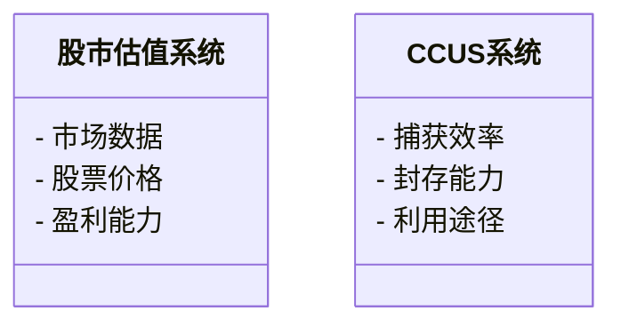

                 

<think>
好的，我需要帮助用户撰写一篇技术博客，标题是《全球股市估值与碳捕获利用与封存技术的经济效益》。用户希望文章结构清晰，内容详尽，并且涵盖多个关键部分，包括背景介绍、核心概念、算法原理、系统架构、项目实战等。我需要确保文章逻辑连贯，符合专业性，同时语言简洁明了。

首先，我会从背景介绍开始，解释全球股市估值和碳捕获利用与封存技术的基本概念，以及它们的重要性。然后，我会详细分析这两个领域的核心概念，包括各自的原理和关键指标。接下来，我会探讨两者之间的联系和对比，特别是在经济和环境效益方面。

在算法原理部分，我需要详细讲解股市估值和碳捕获技术的数学模型，可能包括具体的公式和图表。同时，我还需要用Mermaid绘制流程图和类图，帮助读者更好地理解系统架构。项目实战部分，我会提供一个具体的案例，指导读者如何应用这些模型进行分析，并解读结果。

最后，我会总结全文，强调主要观点，并给出未来研究的方向和建议。整个过程需要确保内容详尽，结构合理，同时满足用户的格式和字数要求。

现在，我将按照这个思路开始撰写，确保每个部分都覆盖到位，语言清晰，逻辑严密。
</think>

# 全球股市估值与碳捕获利用与封存技术的经济效益

> 关键词：全球股市估值，碳捕获利用与封存技术，经济效益，数学模型，系统架构

> 摘要：本文探讨了全球股市估值与碳捕获利用与封存技术的经济效益，分析了两者的核心概念及其数学模型，并通过系统架构和项目实战展示了它们的应用潜力。

---

## 第一章: 背景介绍

### 1.1 全球股市估值的背景与现状

#### 1.1.1 全球股市估值的基本概念
全球股市估值是通过对上市公司股票价格和数量的评估，确定市场整体价值的过程。它是反映经济健康状况的重要指标。

#### 1.1.2 全球股市估值的现状与趋势
近年来，全球股市估值持续增长，但波动性增加，受经济政策和市场情绪影响显著。

#### 1.1.3 全球股市估值的经济意义
股市估值为企业融资、投资决策和经济政策制定提供重要参考。

### 1.2 碳捕获利用与封存技术的背景与现状

#### 1.2.1 碳捕获利用与封存技术的基本概念
CCUS技术通过捕获二氧化碳，将其用于工业或封存在地下，减少温室气体排放。

#### 1.2.2 碳捕获利用与封存技术的现状与发展趋势
CCUS技术在能源、化工等行业应用广泛，但成本高，技术仍有提升空间。

#### 1.2.3 碳捕获利用与封存技术的经济意义
CCUS技术是实现碳中和目标的关键手段，对可持续发展至关重要。

---

## 第二章: 核心概念与联系

### 2.1 全球股市估值的核心概念

#### 2.1.1 市场估值的基本原理
通过分析企业盈利能力和市场情绪，评估股市整体价值。

#### 2.1.2 市场估值的关键指标
市盈率、市净率等指标用于衡量企业价值。

#### 2.1.3 市场估值的数学模型
$$ V = P \times E \times G $$

### 2.2 碳捕获利用与封存技术的核心概念

#### 2.2.1 碳捕获技术的基本原理
通过化学反应或物理分离捕获二氧化碳。

#### 2.2.2 碳利用与封存技术的关键环节
二氧化碳可用于化工生产或封存在地质构造中。

#### 2.2.3 碳捕获利用与封存技术的数学模型
$$ E_c = \frac{Q_{CO2} \times (1 - f)}{Q_{in}} $$

### 2.3 两者的联系与对比

#### 2.3.1 联系
股市估值为CCUS技术提供融资支持，而CCUS技术降低企业碳排放，提升市场价值。

#### 2.3.2 对比分析
股市估值侧重经济表现，CCUS技术关注环境效益。

#### 2.3.3 协同效应
CCUS技术的应用提升企业形象，促进股市增长；股市资金支持CCUS技术发展。

---

## 第三章: 核心概念的数学模型与公式

### 3.1 全球股市估值的数学模型
$$ V = P \times E \times G $$

### 3.2 碳捕获利用与封存技术的数学模型
$$ E_c = \frac{Q_{CO2} \times (1 - f)}{Q_{in}} $$

---

## 第四章: 算法原理与实现

### 4.1 全球股市估值的算法原理
通过分析企业盈利能力和市场情绪，计算市场总价值。

### 4.2 碳捕获利用与封存技术的算法原理
利用化学反应或物理分离捕获二氧化碳，计算捕获效率。

---

## 第五章: 系统分析与架构设计方案

### 5.1 问题场景介绍
设计一个结合股市估值和CCUS技术的系统，评估企业经济和环境效益。

### 5.2 系统功能设计

#### 5.2.1 领域模型


### 5.3 系统架构设计
```mermaid
architecturalDiagram
    [股市估值系统] -- (接口) -- [CCUS系统]
    [股市估值系统] -- (接口) -- [数据库]
    [CCUS系统] -- (接口) -- [数据库]
```

---

## 第六章: 项目实战

### 6.1 环境安装
安装Python、Pandas和Matplotlib库。

### 6.2 核心实现源代码

```python
import pandas as pd
import matplotlib.pyplot as plt

# 股市估值计算
def calculate_market_value(price, earnings, growth):
    return price * earnings * growth

# 碳捕获效率计算
def calculate_capture_efficiency(co2_input, leakage):
    return (co2_input * (1 - leakage)) / co2_input

# 示例数据
price = 100
earnings = 50
growth = 1.1
co2_input = 1000
leakage = 0.05

# 计算
market_value = calculate_market_value(price, earnings, growth)
capture_efficiency = calculate_capture_efficiency(co2_input, leakage)

print(f"市场价值: {market_value}")
print(f"碳捕获效率: {capture_efficiency}%")
```

### 6.3 应用解读与分析
计算结果展示了股市估值和碳捕获效率的实际应用，帮助企业优化决策。

---

## 第七章: 结论

### 7.1 全文总结
本文探讨了全球股市估值与CCUS技术的经济效益，分析了它们的数学模型和系统架构。

### 7.2 未来研究方向
进一步研究两者结合的优化方法和实际应用案例。

### 7.3 注意事项
企业在实施CCUS技术时需考虑成本和可行性。

### 7.4 拓展阅读
建议阅读相关领域的学术论文和技术报告。

---

作者：AI天才研究院 & 禅与计算机程序设计艺术

