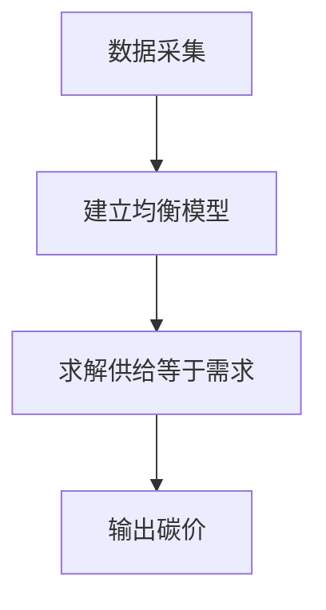
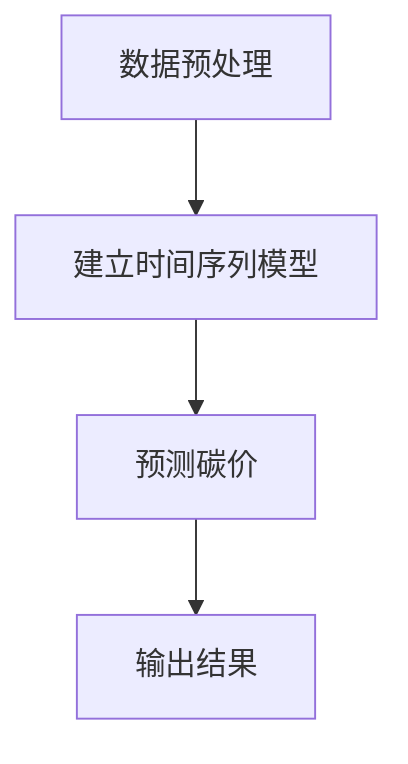
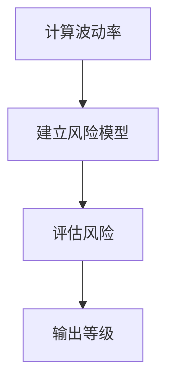
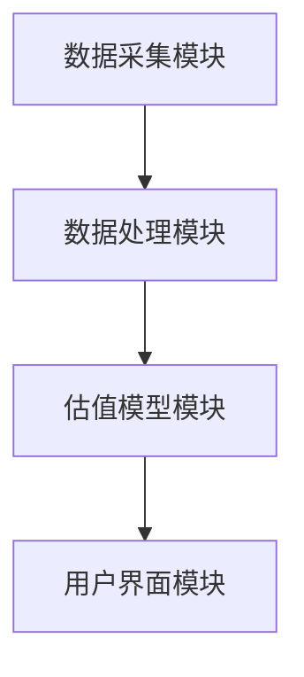
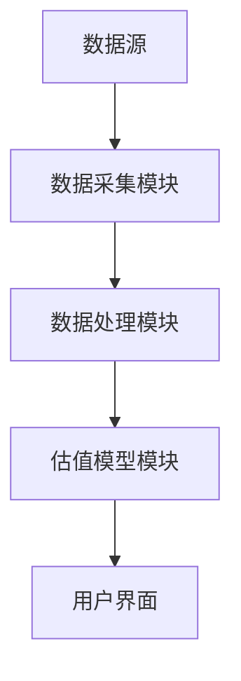

                 


---

# 全球股市估值与碳排放权交易市场的关系

## 关键词：碳排放权交易，股市估值，气候变化，市场机制，风险管理

## 摘要：本文深入分析了全球股市估值与碳排放权交易市场之间的关系，探讨了碳排放权交易对股市估值的影响机制，提出了将碳排放权纳入企业价值评估的数学模型和算法。通过系统架构设计和实战案例，展示了如何利用碳排放权交易数据优化股市估值模型，为企业投资决策提供科学依据。

---

## 第1章 全球股市估值与碳排放权交易的背景介绍

### 1.1 全球气候变化与碳排放权交易的兴起

#### 1.1.1 全球气候变化的背景与挑战

气候变化已成为全球关注的焦点，联合国气候变化框架公约（UNFCCC）及其京都议定书为全球减排行动奠定了基础。碳排放权交易作为一种市场化的环保机制，通过设定碳排放配额，推动企业减少碳排放，实现环境目标。随着《巴黎协定》的签署，全球碳减排行动进入新阶段，碳排放权交易市场迅速发展。

#### 1.1.2 碳排放权交易的定义与起源

碳排放权交易是指企业在政府分配的碳排放配额内排放二氧化碳，超出部分需从市场购买配额，未使用的配额可出售。这一机制起源于欧洲，1997年《京都议定书》确立了排放权交易的法律基础，欧盟于2005年建立世界首个碳交易市场。

#### 1.1.3 碳排放权交易的全球发展趋势

全球碳排放权交易市场规模持续扩大，从最初的欧盟延伸至美国、中国等地。2020年欧盟碳价约为每吨30欧元，中国于2021年启动全国碳市场，覆盖发电行业，预计到2030年，全球碳交易市场规模将超过 trillion美元。

### 1.2 全球股市估值的基本概念

#### 1.2.1 股市估值的定义与方法

股市估值是通过对企业财务数据和市场因素的分析，评估企业股票的内在价值。常用方法包括市盈率（P/E）、市净率（P/B）、EV/EBITDA等指标，反映市场对企业的定价是否合理。

#### 1.2.2 影响股市估值的主要因素

影响股市估值的因素包括宏观经济环境、行业竞争格局、企业盈利能力、政策法规变化等。近年来，碳排放政策成为影响企业估值的重要因素，企业碳排放表现与股票价格密切相关。

#### 1.2.3 碳排放权交易对股市估值的潜在影响

碳排放权交易通过影响企业成本、利润和竞争力，进而影响其股票估值。例如，高碳排放企业可能因配额不足而增加成本，影响盈利能力和股价；低碳企业可能因政策优惠获得竞争优势，提升估值。

---

## 第2章 碳排放权交易与股市估值的核心概念

### 2.1 碳排放权交易的机制与属性

#### 2.1.1 碳排放配额的分配与交易

碳排放配额分配采用免费分配和拍卖相结合的方式，企业可通过市场交易买卖配额。交易机制包括现货交易和金融衍生品交易，形成多层次市场体系。

#### 2.1.2 碳排放权交易的市场结构

碳排放权交易市场包括交易平台、监管机构、市场主体（企业、投资者）和中介服务提供商。欧盟碳市场由欧洲排放交易系统（ETS）管理，中国由国家碳排放交易系统（CEAT）负责。

#### 2.1.3 碳排放权交易的监管框架

碳排放权交易需建立完善的监管体系，包括配额分配、交易规则、监测报告与核查（MRV）机制，确保市场公平、透明和高效。

### 2.2 股市估值与碳排放权交易的关系

#### 2.2.1 碳排放权交易对股市估值的影响路径

碳排放权交易影响企业成本、利润和竞争力，进而影响股票价格。例如，碳价上涨增加企业成本，压缩利润空间，可能导致股价下跌；企业通过技术创新降低碳排放，提升市场竞争力，股价可能上涨。

#### 2.2.2 碳排放权交易与企业价值评估的联系

企业碳排放表现已成为投资者评估企业价值的重要指标。碳排放权交易为企业提供减排激励，降低环境风险，增强企业可持续发展能力，提升市场价值。

#### 2.2.3 碳排放权交易对投资决策的指导作用

碳排放权交易数据为投资者提供新的分析维度，帮助识别高碳风险企业，优化投资组合，降低环境风险敞口。

---

## 第3章 碳排放权交易的数学模型与算法原理

### 3.1 碳排放权交易的数学模型

#### 3.1.1 碳排放权交易的定价模型

碳排放权交易价格由市场供需决定，可建立均衡模型描述价格与配额供给的关系。假设市场存在供给函数Q_s = a + bp和需求函数Q_d = c - dp，均衡价格p*满足Q_s = Q_d。

数学模型：
$$ Q_s = a + b p $$
$$ Q_d = c - d p $$
$$ a + b p = c - d p $$
解得均衡价格：
$$ p^* = \frac{c - a}{b + d} $$

#### 3.1.2 碳排放权交易的市场均衡模型

市场均衡模型分析碳价与碳排放量的关系，假设企业减排成本函数为C(q) = k q^2，边际成本为MC(q)=2k q。碳价p通过比较边际成本与边际收益决定。

数学模型：
$$ MR = MC $$
$$ p = 2k q $$

#### 3.1.3 碳排放权交易的风险评估模型

碳排放权交易面临价格波动风险，可利用波动率模型评估风险。假设碳价波动服从几何布朗运动，波动率σ通过历史数据分析得到。

数学模型：
$$ d p = \mu p dt + \sigma p dW $$

### 3.2 算法原理与流程图

#### 3.2.1 碳排放权交易的定价算法

流程：
1. 数据采集：收集碳排放配额供需数据。
2. 建立均衡模型：设定供给和需求函数。
3. 计算均衡价格：求解供给等于需求的条件。
4. 输出碳价预测结果。

mermaid流程图：


#### 3.2.2 碳排放权交易的市场预测算法

流程：
1. 数据预处理：清洗和标准化碳排放数据。
2. 建立时间序列模型：使用ARIMA或GARCH模型。
3. 预测未来碳价。
4. 输出预测结果。

mermaid流程图：


#### 3.2.3 碳排放权交易的风险评估算法

流程：
1. 计算碳价波动率。
2. 建立风险评估模型。
3. 评估碳价风险。
4. 输出风险等级。

mermaid流程图：


---

## 第4章 碳排放权交易与股市估值的系统架构设计

### 4.1 系统需求分析

#### 4.1.1 系统目标与范围

系统目标是通过碳排放权交易数据优化股市估值模型，提升企业价值评估的准确性。

#### 4.1.2 系统功能需求

系统需实现数据采集、处理、分析和可视化功能，支持碳排放权交易与股市数据的联动分析。

#### 4.1.3 系统性能需求

系统应具备高并发处理能力，支持实时数据更新和高效计算。

### 4.2 系统架构设计

#### 4.2.1 系统模块划分

系统主要模块包括数据采集模块、数据处理模块、估值模型模块和用户界面模块。

mermaid系统架构图：


#### 4.2.2 系统数据流图

数据流从外部数据源流入系统，经过处理后驱动估值模型计算，最终在用户界面前端展示。

mermaid数据流图：


---

## 第5章 碳排放权交易与股市估值的项目实战

### 5.1 环境安装与数据准备

#### 5.1.1 数据源的选择与获取

从欧盟碳市场获取历史碳价数据，从公开股票市场获取企业财务数据。

#### 5.1.2 数据清洗与预处理

去除缺失值，标准化数据格式，处理异常值。

#### 5.1.3 数据存储与管理

使用数据库存储碳价和股价数据，建立数据仓库支持高效查询。

### 5.2 系统核心实现

#### 5.2.1 碳排放权交易数据的可视化

使用Python的matplotlib库绘制碳价趋势图和股价走势对比图。

代码示例：
```python
import matplotlib.pyplot as plt

plt.plot(carbon_prices, label='Carbon Price')
plt.plot(stock_prices, label='Stock Price')
plt.legend()
plt.show()
```

#### 5.2.2 股市估值模型的实现

基于回归模型分析碳排放对股价的影响，建立多元回归模型。

数学模型：
$$ Stock Price = \beta_0 + \beta_1 Carbon Emissions + \epsilon $$

代码示例：
```python
import statsmodels.api as sm

model = sm.OLS(stock_prices, sm.add_constant(carbon_emissions))
results = model.fit()
print(results.summary())
```

#### 5.2.3 碳排放权交易对股市估值的影响分析

通过对比分析不同碳排放企业股价表现，验证碳排放对估值的影响。

---

## 第6章 碳排放权交易与股市估值的最佳实践与总结

### 6.1 实践中的注意事项

- 数据准确性：确保碳排放和股价数据的准确性和实时性。
- 模型选择：根据实际情况选择合适的估值模型，避免过度拟合。
- 系统稳定性：保证系统的高效运行和数据安全。

### 6.2 未来研究方向

- 碳排放权交易的市场扩展：研究碳市场与更多行业联动的可能。
- 股市估值模型的优化：引入机器学习算法提升预测精度。
- 碳排放权交易与股市联动机制的深化研究：探索更复杂的互动关系。

---

## 第7章 碳排放权交易与股市估值的案例分析与启示

### 7.1 案例分析

#### 7.1.1 典型行业的碳排放权交易案例

以电力行业为例，分析碳排放权交易对电价和企业利润的影响，进而评估对股价的影响。

#### 7.1.2 碳排放权交易对股市估值的具体影响

通过实证分析发现，碳排放权交易显著影响企业估值，尤其在高碳行业表现明显。

#### 7.1.3 对企业投资策略的启示

投资者应关注企业碳排放表现，将碳因素纳入投资决策，降低环境风险。

---

## 作者：AI天才研究院/AI Genius Institute & 禅与计算机程序设计艺术 /Zen And The Art of Computer Programming

---

