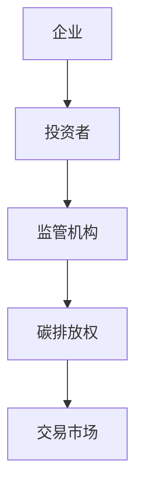
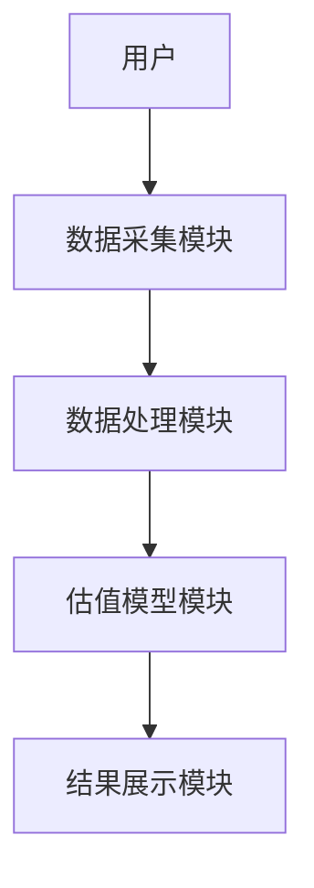

                 


# 全球股市估值与碳排放权交易市场监管的关系

> 关键词：全球股市估值、碳排放权交易、市场监管、环境因素、可持续投资

> 摘要：本文探讨了全球股市估值与碳排放权交易市场监管之间的关系，分析了碳排放权交易对股市估值的影响，提出了一种结合环境因素的股市估值模型，并通过案例分析验证了模型的有效性。

---

# 第一章：引言

## 1.1 问题背景

### 1.1.1 全球股市估值的现状与挑战
全球股市估值是衡量经济发展的重要指标，但传统估值方法往往忽视了环境因素。随着气候变化问题的加剧，环境因素对企业的价值影响日益显著。

### 1.1.2 碳排放权交易的兴起与发展
碳排放权交易（Carbon Emissions Trading）是应对气候变化的重要工具，通过市场机制将碳排放转化为可交易的资源，从而降低整体排放成本。

### 1.1.3 研究意义
探讨碳排放权交易对股市估值的影响，有助于优化企业价值评估，推动可持续投资的发展。

## 1.2 问题描述
碳排放权交易如何影响企业价值？环境因素在股市估值中的权重如何变化？监管政策对市场行为有何引导作用？

## 1.3 问题解决
通过建立碳排放权交易与股市估值的关系模型，量化分析环境因素的影响，提出监管优化策略。

## 1.4 边界与外延
研究范围聚焦于碳排放权交易对股市估值的直接影响，不考虑其他市场因素。

---

# 第二章：核心概念与联系

## 2.1 碳排放权交易的机制

### 2.1.1 碳排放配额的分配
政府设定总量，按比例分配给企业，允许企业通过交易调整配额。

### 2.1.2 碳信用的交易流程
企业购买或出售碳信用，以满足配额要求。

### 2.1.3 监管框架
包括监测、报告和核查（MRV）体系，确保交易的公正性。

## 2.2 股市估值的影响因素

### 2.2.1 传统估值方法
如市盈率、市净率等，忽视环境因素。

### 2.2.2 环境因素的纳入
考虑碳排放成本、政策风险等因素。

### 2.2.3 可持续投资的兴起
投资者越来越关注企业的环境、社会和治理（ESG）表现。

## 2.3 核心概念对比分析

| 属性 | 股市估值 | 碳排放权交易 |
|------|---------|--------------|
| 参与主体 | 投资者、企业 | 政府、企业、交易机构 |
| 价格形成 | 受市场供需影响 | 受政策和市场供需影响 |
| 影响因素 | 传统财务指标、环境因素 | 碳配额、交易规则 |

## 2.4 ER实体关系图


---

# 第三章：算法原理讲解

## 3.1 模型构建

### 3.1.1 数据收集
收集企业碳排放数据、股价数据及监管政策。

### 3.1.2 数据预处理
清洗数据，处理缺失值和异常值。

### 3.1.3 模型构建
建立回归模型，分析碳排放成本对股价的影响。

### 3.1.4 结果分析
验证模型的准确性，调整参数优化预测效果。

## 3.2 源代码实现
```python
import pandas as pd
import numpy as np
from sklearn.linear_model import LinearRegression

# 数据预处理
data = pd.read_csv('carbon_emissions.csv')
data_processed = data.dropna()

# 特征选择
X = data_processed[['carbon_emissions']]
y = data_processed['stock_price']

# 模型训练
model = LinearRegression()
model.fit(X, y)

# 预测与评估
predictions = model.predict(X)
print('预测值:', predictions[:5])
print('真实值:', y[:5].values)
print('系数:', model.coef_)
```

## 3.3 数学模型
$$ stock\_price = \beta_0 + \beta_1 \times carbon\_emissions + \epsilon $$

---

# 第四章：系统分析与架构设计

## 4.1 项目介绍
开发一个结合碳排放权交易数据的股市估值系统。

## 4.2 系统架构设计


## 4.3 接口设计
API接口：提供数据查询和模型预测功能。

---

# 第五章：项目实战

## 5.1 环境安装
安装Python、Pandas、Scikit-learn等库。

## 5.2 核心代码实现
```python
import pandas as pd
import numpy as np
from sklearn.linear_model import LinearRegression

# 数据加载与预处理
data = pd.read_csv('carbon_emissions.csv')
data_processed = data.dropna()

# 模型训练
model = LinearRegression()
model.fit(data_processed[['carbon_emissions']], data_processed['stock_price'])

# 预测与评估
print('模型预测:', model.predict(data_processed[['carbon_emissions']]))
```

## 5.3 案例分析
以某企业为例，分析碳排放权交易对其股价的影响。

---

# 第六章：总结与展望

## 6.1 研究总结
碳排放权交易对股市估值的影响显著，环境因素需纳入估值模型。

## 6.2 未来研究方向
研究更多环境因素对股价的影响，优化模型。

---

作者：AI天才研究院/AI Genius Institute & 禅与计算机程序设计艺术 /Zen And The Art of Computer Programming

