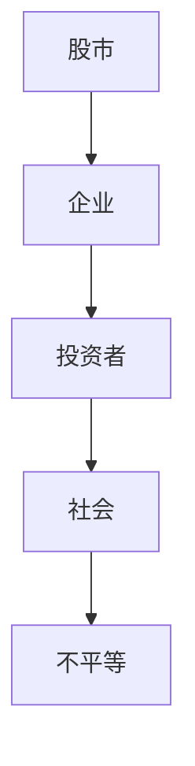
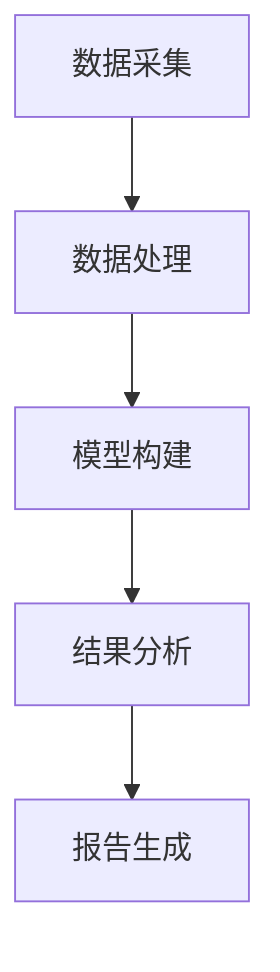

                 

# 全球股市估值与社会不平等问题的关联

## 关键词：股市估值、社会不平等、经济影响、数学模型、政策干预

## 摘要：  
本文探讨全球股市估值与社会不平等之间的深层关联，通过理论分析、数学建模和案例研究，揭示不平等如何影响股市估值，以及股市估值反过来如何加剧社会不平等。文章旨在为理解这一复杂关系提供新的视角，并为政策制定者和投资者提供可行的建议。

---

## 第一部分：引言与背景

### 第1章：问题背景与核心概念

#### 1.1 问题背景
- 1.1.1 全球化与经济不平等的加剧
- 1.1.2 股市估值与经济结构的关系
- 1.1.3 社会不平等与金融市场波动的关联

#### 1.2 核心概念定义
- 股市估值：通过市盈率（P/E）、市净率（P/B）等指标衡量。
- 社会不平等：通过基尼系数（Gini coefficient）衡量。

#### 1.3 问题解决路径
- 数据分析方法：利用历史数据和统计模型。
- 经济模型构建：建立数学模型描述两者关系。
- 政策干预：制定调节股市和不平等的政策。

#### 1.4 边界与外延
- 数据范围：全球主要股市和经济指标。
- 模型适用条件：假设数据完整性和市场有效性。

#### 1.5 概念结构与核心要素
- 核心要素对比表格：
  | 要素 | 股市估值 | 社会不平等 |
  |------|----------|------------|
  | 定义 | 股票价格 | 贫富差距 |
  | 指标 | P/E, P/B | 基尼系数 |
- ER实体关系图：

---

## 第二部分：理论基础与模型构建

### 第2章：股市估值的理论基础

#### 2.1 股市估值的计算方法
- 市盈率（P/E）：$$ P/E = \frac{股票价格}{每股收益} $$
- 市净率（P/B）：$$ P/B = \frac{股票价格}{每股净资产} $$
- 股息率：$$ \text{股息率} = \frac{每股股息}{股票价格} \times 100\% $$

#### 2.2 股市估值的影响因素
- 宏观经济指标：GDP增长率、利率、通货膨胀。
- 行业趋势：科技、能源等行业的影响。
- 公司基本面：利润、管理、行业地位。

#### 2.3 经济学模型
- CAPM模型：$$ E(R_i) = R_f + \beta_i (R_m - R_f) $$
- APT模型：$$ E(R_i) = \sum_j \lambda_j \beta_{i,j} $$

### 第3章：社会不平等的经济学分析

#### 3.1 社会不平等的测量
- 基尼系数：$$ G = \frac{A}{A + B} $$，其中A和B是洛伦兹曲线下的面积。

#### 3.2 社会不平等的经济影响
- 消费能力：低收入群体消费不足，影响经济增长。
- 投资行为：高收入群体更倾向于高风险投资。
- 社会稳定：不平等加剧可能导致社会动荡。

#### 3.3 

---

## 第三部分：核心分析

### 第4章：股市估值与社会不平等的关联机制

#### 4.1 不平等如何影响股市估值
- 高收入群体控制更多资本，推高股价。
- 低收入群体缺乏投资渠道，影响市场流动性。

#### 4.2 股市估值如何加剧不平等
- 股票收益主要流向富裕投资者。
- 企业并购加剧市场集中，扩大贫富差距。

#### 4.3 数学模型构建
- 单因素模型：$$ R_i = \alpha + \beta R_m + \epsilon $$
- 多因素模型：$$ R_i = \alpha + \beta_1 F_1 + \beta_2 F_2 + \epsilon $$

---

## 第四部分：案例研究

### 第5章：实际市场中的关联分析

#### 5.1 美国股市与不平等
- 20世纪80年代以来，美国股市估值与基尼系数呈正相关。
- 科技股泡沫与贫富差距扩大。

#### 5.2 巴西股市与不平等
- 巴西股市波动与基尼系数变化的对比分析。

#### 5.3 中国股市与不平等
- 中国股市增长与区域发展不平衡的关系。

---

## 第五部分：系统分析与架构设计

### 第6章：分析框架

#### 6.1 系统功能设计
- 数据采集模块：收集股市和经济数据。
- 模型构建模块：建立数学模型。
- 结果分析模块：输出关联性报告。

#### 6.2 系统架构设计

---

## 第六部分：项目实战

### 第7章：模拟与分析

#### 7.1 环境安装
- 数据来源：使用全球股市数据和经济指标。
- 工具：Python、Pandas、Matplotlib。

#### 7.2 核心实现
- 数据清洗：处理缺失值和异常值。
- 模型实现：计算基尼系数和P/E比率。
- 可视化：绘制散点图和回归分析。

#### 7.3 案例分析
- 分析美国科技股对不平等的影响。
- 模拟政策干预效果。

---

## 第七部分：结论与展望

### 第8章：结论与政策建议

#### 8.1 研究结论
- 不平等加剧股市波动。
- 股市估值影响社会财富分配。

#### 8.2 政策建议
- 加强市场监管，防止市场操纵。
- 推动普惠金融，扩大中小投资者参与。

#### 8.3 未来研究
- 更多国家和地区的案例研究。
- 更复杂的数学模型。

---

## 作者：AI天才研究院 & 禅与计算机程序设计艺术

