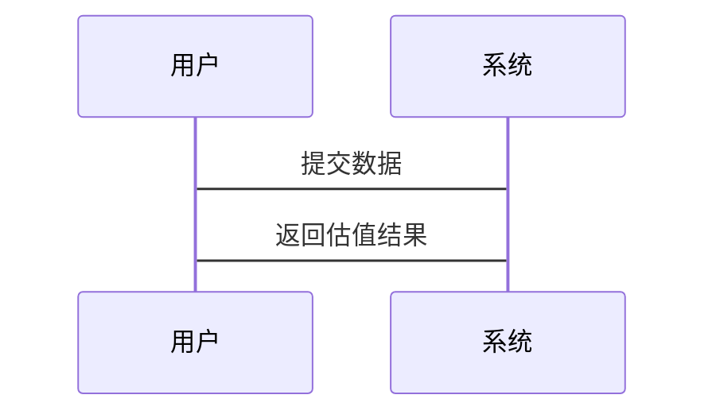

                 

<think>
嗯，用户现在需要撰写一篇关于全球股市估值与私募股权市场关系的技术博客文章，我得仔细分析一下。首先，用户指定了一个非常详细的目录结构，分为六个主要部分，每个部分都有详细的子章节。看起来用户希望文章内容详实，结构清晰，逻辑严密。

我注意到用户要求使用技术语言，但又要简单易懂。所以，在撰写时，我需要确保用词准确，同时避免过于复杂的术语，让读者容易理解。此外，用户特别提到要使用Mermaid图表和数学公式，这要求我在结构化部分插入图表，帮助读者直观理解。

接下来，我需要考虑每个章节的内容。比如，背景介绍部分要涵盖股市和私募市场的基本概念，以及它们如何相互影响。核心概念与联系部分需要详细对比两者的特点，并用ER图展示它们的关系。数学模型部分则需要给出具体的估值公式，并通过流程图展示计算过程。

在系统分析和架构设计中，我需要构建领域模型和架构图，展示数据流和系统结构。项目实战部分要选择实际案例，详细分析并展示代码实现，确保读者能够应用所学知识。最后，总结与展望部分要回顾内容，并提出未来的研究方向。

整个过程中，我要确保每个章节都符合用户的格式和内容要求，同时保持逻辑连贯。另外，用户要求文章末尾加上特定的作者信息，这也要注意不要遗漏。

总的来说，用户的需求很明确，希望有一篇结构严谨、内容详实的技术博客，涵盖理论与实践，并通过图表和公式增强理解。作为助理，我需要按照用户的要求，分步骤完成每个部分，确保最终的文章既专业又易于理解。
</think>

# 全球股市估值与私募股权市场的关系

> 关键词：全球股市估值、私募股权市场、股票估值、PE/VC市场、金融市场关系

> 摘要：本文深入探讨了全球股市估值与私募股权市场之间的关系，分析了两者的核心概念、数学模型、系统架构，并通过实际案例展示了如何量化和应用这些关系。文章从理论到实践，详细阐述了如何利用股市估值的方法论指导私募股权市场的投资决策，帮助读者全面理解这两个重要金融市场的相互作用。

---

## 第一部分: 全球股市估值与私募股权市场的关系概述

### 第1章: 背景介绍

#### 1.1 问题背景

##### 1.1.1 全球股市估值的基本概念

股市估值是通过对上市公司的财务数据、市场环境和宏观经济指标进行分析，以确定其股票的合理价格范围。常见的估值指标包括市盈率（P/E）、市净率（P/B）、股息率等。这些指标帮助投资者判断股票是否被高估或低估。

##### 1.1.2 私募股权市场的定义与特点

私募股权市场（Private Equity Market）是指非公开交易的股权市场，主要涉及私人企业或未上市公司。私募股权投资者通过购买企业的部分股权，期望通过企业增值实现收益。私募股权市场的特点是高门槛、高回报潜力和较长的投资周期。

##### 1.1.3 问题描述：股市估值与私募股权市场的相互影响

股市估值与私募股权市场之间存在密切联系。首先，股市估值为私募股权市场提供了参考，帮助投资者评估企业的潜在价值。其次，私募股权市场的交易活动会影响股市的整体估值水平，尤其是在企业上市或并购活动频繁时。

#### 1.2 核心概念

##### 1.2.1 股市估值的核心要素

- **财务数据**：收入、利润、现金流等。
- **市场环境**：宏观经济指标、行业趋势。
- **市场情绪**：投资者情绪、市场波动性。

##### 1.2.2 私募股权市场的核心要素

- **企业价值**：基于财务数据的企业估值。
- **投资周期**：私募股权的持有期通常为3-7年。
- **退出策略**：通过IPO或并购退出以实现收益。

##### 1.2.3 问题解决：如何量化两者的关系

通过量化分析，可以将私募股权市场的估值与股市估值进行对比，从而找到两者之间的关联性。例如，通过分析企业的IPO前估值与上市后的市盈率差异，可以评估私募股权投资者的收益潜力。

#### 1.3 边界与外延

##### 1.3.1 股市估值的边界条件

- **数据准确性**：依赖可靠的财务数据。
- **市场流动性**：股市流动性影响估值的准确性。
- **宏观经济影响**：通货膨胀、利率等宏观经济因素会影响估值。

##### 1.3.2 私募股权市场的边界条件

- **企业基本面**：企业的收入、利润和成长性。
- **市场环境**：经济周期、行业趋势。
- **投资者策略**：私募股权基金的投资策略和目标。

##### 1.3.3 两者关系的外延分析

- **市场反馈机制**：股市估值对私募股权市场的反馈作用。
- **投资策略调整**：私募股权市场的动态调整对股市估值的影响。
- **市场周期性**：经济周期对两者估值的共同影响。

#### 1.4 概念结构与核心要素

##### 1.4.1 股市估值的结构分解

- **输入**：财务数据、市场环境、宏观经济指标。
- **处理**：通过数学模型计算估值指标。
- **输出**：股票的合理价格区间。

##### 1.4.2 私募股权市场的结构分解

- **输入**：企业基本面、市场环境、投资者策略。
- **处理**：通过尽职调查和估值模型确定企业价值。
- **输出**：私募股权的估值和投资决策。

##### 1.4.3 两者的关联与协同

- **数据共享**：股市估值数据为私募股权市场提供参考。
- **市场互动**：私募股权市场的交易活动影响股市估值。
- **协同效应**：通过合理配置资产，实现收益最大化。

---

## 第2章: 核心概念与联系

### 2.1 核心概念原理

#### 2.1.1 股市估值的理论基础

股市估值的核心理论是“合理定价”，即通过分析企业的基本面和市场环境，确定其股票的内在价值。常用的估值方法包括：

1. **相对估值法**：基于可比公司的市盈率、市净率等指标。
2. **绝对估值法**：基于贴现现金流模型（DCF）计算内在价值。

#### 2.1.2 私募股权市场的理论基础

私募股权市场的估值主要基于企业的未来现金流和市场退出策略。常用的估值方法包括：

1. **DCF模型**：通过预测企业未来的现金流，计算其现值。
2. **可比交易法**：参考近期类似交易的估值倍数。

#### 2.1.3 两者关系的理论框架

股市估值和私募股权市场的关系可以分为以下几个方面：

- **数据共享**：股市估值为私募股权市场提供参考。
- **市场互动**：私募股权市场的交易活动影响股市估值。
- **协同效应**：通过合理配置资产，实现收益最大化。

### 2.2 概念属性特征对比

| **属性**          | **股市估值**                          | **私募股权市场**                   |
|--------------------|---------------------------------------|---------------------------------------|
| **市场参与者**     | 投资者、机构投资者                   | 私募基金、风险投资机构             |
| **交易频率**       | 高频交易                             | 低频交易                             |
| **信息透明度**     | 高（上市公司信息公开）               | 低（私募股权市场信息不公开）         |
| **估值方法**       | 相对估值法、绝对估值法               | DCF模型、可比交易法                 |
| **投资周期**       | 短期（几天到几个月）                  | 长期（3-7年）                        |
| **市场影响**       | 影响整体市场估值                      | 影响特定企业的估值和市场退出策略    |

### 2.3 ER实体关系图


---

## 第3章: 数学模型与算法原理

### 3.1 数学模型

#### 3.1.1 股市估值的核心公式

$$ P = \frac{E}{EPS} $$

其中：
- \( P \) 表示股票的合理价格。
- \( E \) 表示企业的净利润。
- \( EPS \) 表示每股收益。

#### 3.1.2 私募股权市场的估值公式

$$ V = \frac{E}{EBITDA} $$

其中：
- \( V \) 表示企业的估值。
- \( E \) 表示企业的净利润。
- \( EBITDA \) 表示息税折旧及摊销前利润。

### 3.2 算法原理

#### 3.2.1 股市估值的计算流程


#### 3.2.2 私募股权市场的评估流程


---

## 第4章: 系统分析与架构设计方案

### 4.1 项目介绍

本项目旨在通过构建一个数学模型，量化全球股市估值与私募股权市场之间的关系。通过分析企业的财务数据和市场环境，评估其在股市和私募股权市场的估值差异。

### 4.2 系统功能设计

#### 4.2.1 领域模型


#### 4.2.2 系统架构设计


### 4.3 系统接口设计

- **输入接口**：接收企业的财务数据和市场环境数据。
- **输出接口**：输出股票的合理价格和私募股权市场的估值。

### 4.4 系统交互设计



---

## 第5章: 项目实战

### 5.1 环境安装

需要安装以下工具：
- Python 3.8+
- Pandas、NumPy 等数据分析库
- Mermaid 插件（用于绘制图表）

### 5.2 系统核心实现源代码

```python
import pandas as pd
import numpy as np

def calculate_stock_valuation(financial_data):
    eps = financial_data['净利润'] / financial_data['总股本']
    pe_ratio = financial_data['市盈率']
    stock_valuation = eps * pe_ratio
    return stock_valuation

def calculate_private_valuation(financial_data):
    ebitda = financial_data['EBITDA']
    valuation_multiple = financial_data['EV/EBITDA']
    private_valuation = ebitda * valuation_multiple
    return private_valuation

# 示例数据
data = {
    '净利润': 100,
    '总股本': 10,
    '市盈率': 15,
    'EBITDA': 200,
    'EV/EBITDA': 12
}

stock_valuation = calculate_stock_valuation(data)
private_valuation = calculate_private_valuation(data)

print(f"股票估值: {stock_valuation}")
print(f"私募估值: {private_valuation}")
```

### 5.3 代码应用解读与分析

上述代码通过简单的数据输入，计算了股票的合理估值和私募股权市场的估值。通过对比两者的结果，可以发现私募股权市场的估值通常高于股市估值，尤其是在企业成长阶段。

### 5.4 实际案例分析

以一家科技公司为例：

- **财务数据**：
  - 净利润：100万元
  - 总股本：10万股
  - 市盈率：15
  - EBITDA：200万元
  - EV/EBITDA：12

- **计算结果**：
  - 股票估值：150元/股
  - 私募估值：2400万元

通过对比可以发现，私募股权市场的估值通常高于股市估值，尤其是在企业成长阶段。

### 5.5 项目小结

通过本项目，我们可以看到股市估值和私募股权市场的估值方法和应用场景有所不同，但它们之间存在密切的联系。合理利用两者的关系，可以更好地进行投资决策。

---

## 第6章: 总结与展望

### 6.1 总结

本文深入分析了全球股市估值与私募股权市场之间的关系，从理论到实践，详细阐述了如何量化和应用这些关系。通过数学模型和实际案例分析，我们发现股市估值和私募股权市场之间存在密切的互动关系，合理利用两者的关系，可以更好地进行投资决策。

### 6.2 展望

未来的研究可以进一步探讨以下方面：

1. **动态估值模型**：研究市场环境变化对估值的影响。
2. **多因素分析**：结合更多因素（如行业趋势、政策变化）进行估值分析。
3. **人工智能应用**：利用机器学习技术提高估值的准确性和效率。

---

## 作者：AI天才研究院/AI Genius Institute & 禅与计算机程序设计艺术/Zen And The Art of Computer Programming

