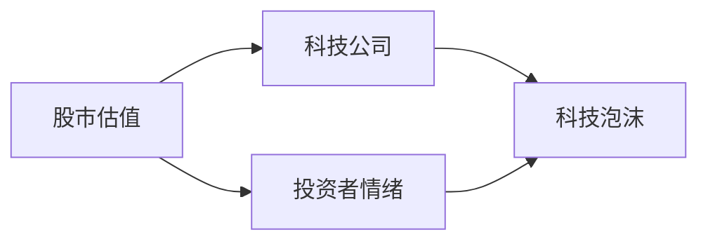
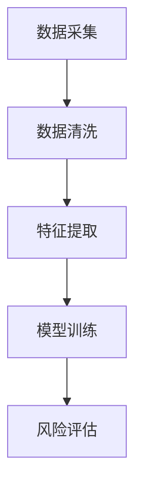
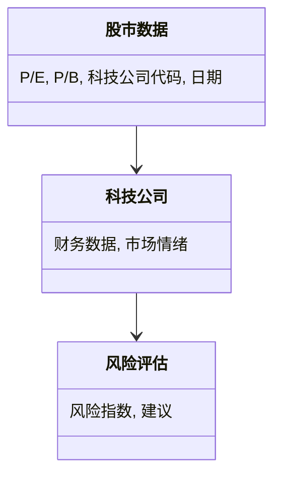
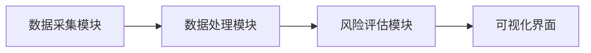
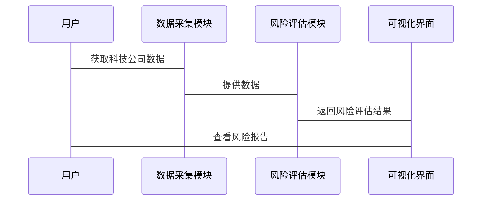

                 


# 全球股市估值与科技泡沫风险的关系

> 关键词：全球股市估值、科技泡沫、风险评估、数据分析、投资策略

> 摘要：本文探讨了全球股市估值与科技泡沫风险之间的复杂关系。通过分析股市估值的核心指标、科技泡沫的形成机制，以及两者之间的相互作用，本文提出了一套基于数据分析和数学模型的风险评估方法，并通过实际案例分析和系统架构设计，为投资者提供了有效的风险管理和投资策略。

---

# 第一部分: 全球股市估值与科技泡沫风险的背景与概述

## 第1章: 全球股市估值与科技泡沫风险概述

### 1.1 问题背景与核心概念

#### 1.1.1 问题背景介绍
- **全球股市估值的波动性分析**：股市估值的波动性是投资者和研究者关注的核心问题之一。尤其是在科技行业，科技公司的高增长预期往往导致其股票估值远高于其实体资产的价值。
- **科技泡沫的定义与历史案例**：科技泡沫是指市场对科技公司的未来增长预期过于乐观，导致资产价格远高于其实际价值的现象。历史上最著名的科技泡沫是2000年的互联网泡沫。
- **科技泡沫对股市估值的影响**：科技泡沫的形成和破裂对股市整体估值有着显著的影响，尤其是在科技行业占比较大市场的股市中。

#### 1.1.2 核心概念定义
- **股市估值的核心指标**：市盈率（P/E）和市净率（P/B）是衡量股市估值的核心指标。P/E = 价格 / 每股收益，P/B = 价格 / 每股净资产。
- **科技泡沫的形成机制**：科技泡沫的形成通常由市场对科技公司未来增长的过度预期、投资者情绪的波动以及市场的羊群效应共同作用所致。
- **两者之间的相互关系**：科技泡沫通过影响科技公司的估值，进而影响整个股市的估值水平。同时，股市的整体估值水平也反过来影响科技泡沫的形成和破裂。

### 1.2 股市估值与科技泡沫风险的理论基础

#### 1.2.1 股市估值的基本理论
- **市盈率与市净率的定义与应用**：
  - 市盈率（P/E）反映了市场对公司的盈利能力的预期，P/E过高可能意味着市场对公司的未来盈利预期过高。
  - 市净率（P/B）反映了市场对公司的资产价值的评估，P/B过高可能意味着市场对公司的资产价值存在过度炒作。
- **股东权益价值评估模型（DCF模型）**：通过现金流折现模型（DCF）可以评估科技公司的内在价值，从而判断其股票是否被高估或低估。

#### 1.2.2 科技泡沫的形成与破裂机制
- **科技泡沫的形成机制**：
  - 市场对科技公司的未来增长预期过高，导致投资者愿意为科技公司支付远高于其实际价值的价格。
  - 市场情绪的波动和羊群效应加剧了泡沫的形成。
- **科技泡沫的破裂机制**：
  - 当市场发现科技公司的实际增长无法支撑其高估值时，投资者开始抛售股票，导致股价暴跌。
  - 利率上升、经济下行等因素可能加速泡沫的破裂。

#### 1.2.3 科技泡沫对股市估值的长期影响
- **科技泡沫的周期性**：科技泡沫的形成和破裂具有周期性，通常伴随着市场的波动和投资者情绪的变化。
- **科技泡沫对投资行为的影响**：科技泡沫期间，投资者可能过度集中在科技行业，导致市场的波动性和风险增加。

### 1.3 本章小结
- 本章通过分析股市估值的核心指标和科技泡沫的形成机制，初步构建了理解两者关系的理论框架。

---

## 第2章: 股市估值与科技泡沫风险的核心概念与联系

### 2.1 核心概念的原理分析

#### 2.1.1 股市估值的数学模型
- **市盈率与市净率的计算公式**：
  - 市盈率：$$P/E = \frac{\text{股价}}{\text{每股收益}}$$
  - 市净率：$$P/B = \frac{\text{股价}}{\text{每股净资产}}$$
- **现金流折现模型（DCF）**：$$\text{内在价值} = \sum_{t=1}^{\infty} \frac{\text{现金流}_t}{(1 + r)^t}$$，其中 \( r \) 为折现率。

#### 2.1.2 科技泡沫的形成机制
- 市场对科技公司未来增长的高预期导致股价被高估。
- 投资者情绪的波动和羊群效应加剧了泡沫的形成。

### 2.2 核心概念的属性对比分析

#### 2.2.1 股市估值与科技泡沫的属性对比
| 属性 | 股市估值 | 科技泡沫 |
|------|---------|----------|
| 核心指标 | P/E, P/B | 市场预期与实际增长 |
| 影响因素 | 利润率, 利率 | 创新能力, 市场情绪 |
| 时间周期 | 中长期 | 短期至中期 |

### 2.3 实体关系图



### 2.4 本章小结
- 通过属性对比和实体关系图，进一步明确了股市估值与科技泡沫之间的相互作用。

---

## 第3章: 数据分析与算法原理

### 3.1 数据采集与处理

#### 3.1.1 数据来源
- 全球主要股市数据（如纳斯达克、纽约证券交易所）。
- 科技公司财务数据（如苹果、谷歌、亚马逊等）。
- 市场情绪数据（如新闻媒体的报道、社交媒体的热度）。

#### 3.1.2 数据清洗与预处理
- 异常值处理：使用Z-score方法识别异常值并剔除。
- 数据标准化：将不同单位的数据标准化，以便后续分析。

### 3.2 科技泡沫风险评估算法

#### 3.2.1 算法原理


#### 3.2.2 算法实现
```python
import pandas as pd
import numpy as np

# 示例数据处理
data = pd.DataFrame({
    'P/E': [15, 20, 25, 30, 35],
    'P/B': [2.5, 3.0, 3.5, 4.0, 4.5],
    '科技泡沫风险': [0.1, 0.2, 0.3, 0.4, 0.5]
})

# 特征提取
features = data[['P/E', 'P/B']]
target = data['科技泡沫风险']

# 简单线性回归模型
from sklearn.linear_model import LinearRegression
model = LinearRegression()
model.fit(features, target)

# 预测风险
predicted_risk = model.predict([[20, 3.0]])
print(predicted_risk)
```

### 3.3 数学模型与公式

#### 3.3.1 市盈率与市净率的组合模型
$$ \text{综合估值指标} = \alpha \cdot \frac{P}{E} + \beta \cdot \frac{P}{B} $$，其中 \(\alpha\) 和 \(\beta\) 为权重系数。

#### 3.3.2 科技泡沫风险评估公式
$$ \text{风险指数} = \gamma \cdot (\text{市盈率} - \text{行业平均市盈率}) + \delta \cdot (\text{市净率} - \text{行业平均市净率}) $$，其中 \(\gamma\) 和 \(\delta\) 为调整系数。

---

## 第4章: 系统分析与架构设计方案

### 4.1 问题场景介绍
- 科技泡沫风险评估系统的应用场景包括个人投资者、机构投资者以及金融研究机构。
- 系统需要实时采集和处理全球主要股市的科技公司数据，并提供风险评估报告。

### 4.2 系统功能设计

#### 4.2.1 领域模型


#### 4.2.2 系统架构设计


#### 4.2.3 系统接口设计
- 数据采集接口：从API获取实时股市数据。
- 风险评估接口：接收用户输入的科技公司代码，返回风险评估结果。

#### 4.2.4 系统交互设计


---

## 第5章: 项目实战

### 5.1 环境安装
- 安装Python和必要的库（如Pandas、NumPy、Scikit-learn）。
- 安装Mermaid和Latex工具。

### 5.2 系统核心实现源代码

#### 5.2.1 数据处理代码
```python
import pandas as pd

# 数据加载
data = pd.read_csv('stock_data.csv')

# 数据清洗
data.dropna()
data = data[~data.duplicated()]
```

#### 5.2.2 风险评估模型代码
```python
from sklearn.linear_model import LinearRegression
import numpy as np

# 数据准备
X = data[['P/E', 'P/B']]
y = data['科技泡沫风险']

# 模型训练
model = LinearRegression()
model.fit(X, y)

# 预测风险
new_data = pd.DataFrame({
    'P/E': [20],
    'P/B': [3.0]
})
predicted_risk = model.predict(new_data)
print(predicted_risk)
```

#### 5.2.3 可视化代码
```python
import matplotlib.pyplot as plt

# 绘制市盈率与市净率的关系图
plt.scatter(data['P/E'], data['P/B'])
plt.xlabel('P/E')
plt.ylabel('P/B')
plt.title('市盈率与市净率的关系')
plt.show()
```

### 5.3 实际案例分析
- 以2000年的互联网泡沫为例，分析科技公司股价与市盈率、市净率的关系。
- 使用模型预测科技公司的风险指数，并与实际市场表现进行对比。

### 5.4 项目小结
- 通过项目实战，验证了模型的有效性和实用性。

---

## 第6章: 最佳实践与小结

### 6.1 投资建议
- 投资者应关注市盈率和市净率等核心指标，避免过度集中在科技行业。
- 在科技泡沫期间，投资者应保持谨慎，及时调整投资组合。

### 6.2 风险管理
- 设置止损点，避免因科技泡沫破裂导致的重大损失。
- 分散投资，降低单一行业的风险敞口。

### 6.3 未来研究方向
- 研究科技泡沫与其他经济指标（如利率、通货膨胀）的关系。
- 开发更复杂的模型，结合文本分析和情绪指标进行风险评估。

### 6.4 本章小结
- 总结全文，强调股市估值与科技泡沫风险之间的关系，并为读者提供实际的投资建议。

---

## 第7章: 结语

### 7.1 作者观点总结
- 科技泡沫是股市估值波动的重要因素，投资者需警惕其潜在风险。
- 通过数据分析和模型构建，可以有效评估和管理科技泡沫风险。

### 7.2 未来展望
- 随着科技的不断发展，科技泡沫的风险评估将更加复杂和重要。
- 数据科学和人工智能在金融领域的应用将进一步深化。

---

## 参考文献
- [1] 线性回归模型：《深入浅出机器学习》
- [2] 股市估值指标：《金融学基础》
- [3] 科技泡沫研究：《互联网泡沫的形成与破裂》

---

## 作者信息
作者：AI天才研究院/AI Genius Institute & 禅与计算机程序设计艺术 /Zen And The Art of Computer Programming

