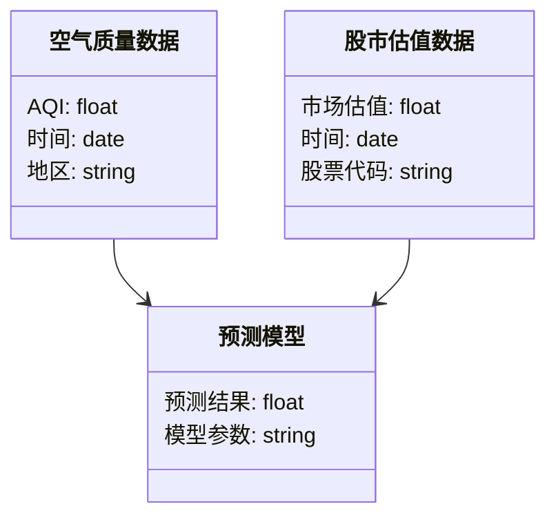
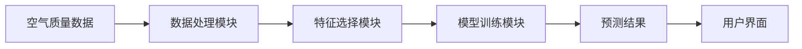
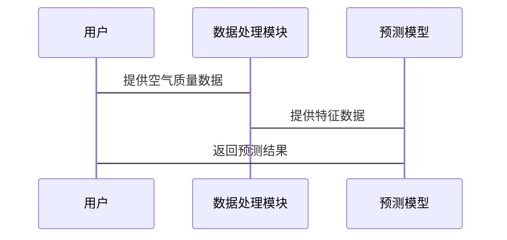

                 


# 全球股市估值与空气质量改善措施的关系

> 关键词：全球股市估值、空气质量改善、环境经济学、数据分析、机器学习

> 摘要：本文探讨了全球股市估值与空气质量改善措施之间的关系，分析了空气质量对经济活动的影响，通过数据分析和机器学习模型，揭示了空气质量改善措施如何影响股市估值，为企业和社会提供环境经济学视角下的投资策略和政策建议。

---

## 第1章 问题背景与描述

### 1.1 问题背景

#### 1.1.1 环境问题与经济活动的关联性
环境问题，尤其是空气污染，已成为全球关注的焦点。空气质量直接影响居民健康、企业生产效率和区域经济发展。近年来，各国政府纷纷出台空气质量改善措施，如限制工业排放、推广清洁能源等。这些措施不仅有助于环境保护，也可能对经济活动产生深远影响。

#### 1.1.2 全球股市估值的波动性分析
股市估值受多种因素影响，包括经济指标、政策变化和市场情绪等。然而，环境因素，尤其是空气质量，对股市的影响尚未得到充分研究。空气质量改善措施可能通过影响企业成本、消费者行为和政府政策间接影响股市估值。

#### 1.1.3 空气质量改善措施的必要性
空气污染不仅危害公共健康，还可能导致经济损失。通过改善空气质量，可以减少医疗支出、提高劳动 productivity，进而提升企业利润和股市估值。

### 1.2 问题描述

#### 1.2.1 空气质量对经济活动的影响
空气污染会导致呼吸系统疾病、降低劳动 productivity，并增加医疗支出。此外，污染严重的地区可能面临更高的能源成本和环保罚款。

#### 1.2.2 全球股市估值波动的驱动因素
股市估值受多种因素影响，包括利率变化、企业盈利、政策调整等。空气质量改善措施可能通过影响企业成本和政府政策间接影响股市估值。

#### 1.2.3 空气质量改善措施对股市的影响
空气质量改善措施可能通过降低企业生产成本、提高公众健康水平和增强企业形象间接提升股市估值。然而，这些措施也可能增加企业的短期成本，导致股价短期波动。

### 1.3 问题解决

#### 1.3.1 研究目标的设定
本文旨在研究空气质量改善措施对全球股市估值的影响，分析两者之间的关系，为企业制定环境友好型投资策略提供依据。

#### 1.3.2 数据收集与处理方法
收集全球主要城市的空气质量数据和对应股市估值数据，分析两者之间的相关性。

#### 1.3.3 研究方法的选择
采用多元回归分析和时间序列分析，结合机器学习模型预测空气质量改善措施对股市估值的影响。

### 1.4 边界与外延

#### 1.4.1 研究范围的界定
本文仅研究空气质量改善措施对股市估值的影响，不考虑其他环境因素（如水污染）的影响。

#### 1.4.2 相关概念的外延
空气质量改善措施包括政府政策、企业环保技术投资等，股市估值包括市盈率、市净率等指标。

#### 1.4.3 研究限制与假设
本文假设空气质量改善措施对企业成本和政府政策的影响是线性的，实际影响可能更为复杂。

---

## 第2章 核心概念与联系

### 2.1 核心概念定义

#### 2.1.1 全球股市估值
股市估值是衡量市场整体价值的指标，通常通过市盈率、市净率等指标衡量。

#### 2.1.2 空气质量改善措施
空气质量改善措施包括减少工业排放、推广清洁能源等，旨在降低空气污染程度。

#### 2.1.3 两者关系的初步分析
空气质量改善措施可能通过降低企业生产成本、提高公众健康水平影响股市估值。

### 2.2 核心概念属性特征对比

| 属性       | 空气质量改善措施                     | 全球股市估值                   |
|------------|------------------------------------|-----------------------------|
| 定义       | 政府和企业的环保行动                | 市场整体价值的衡量指标         |
| 影响因素   | 工业排放、能源使用                  | 经济指标、政策、市场情绪       |
| 目标       | 降低空气污染                      | 提高市场信心、增加投资         |
| 时间维度   | 长期持续性                          | 短期波动性                      |
| 表现形式   | 政策法规、技术应用                  | 股价波动、市场指数变化          |

### 2.3 ER实体关系图

```mermaid
er
    entity 空气质量改善措施 {
        id: string
        措施类型: string
        实施区域: string
        实施时间: date
        效果评估: float
    }
    entity 全球股市估值 {
        股票代码: string
        估值时间: date
        市场估值: float
        行业分类: string
    }
    relationship 关系表 {
        空气质量改善措施.id -< 全球股市估值.股票代码
    }
```

---

## 第3章 算法原理讲解

### 3.1 算法选择与原理

#### 3.1.1 多元回归分析
多元回归分析用于研究空气质量改善措施对股市估值的影响。模型形式为：
$$ Y = \beta_0 + \beta_1X_1 + \beta_2X_2 + \epsilon $$
其中，$Y$ 是股市估值，$X_1$ 和 $X_2$ 是空气质量相关变量，$\epsilon$ 是误差项。

#### 3.1.2 机器学习模型
使用随机森林回归模型预测空气质量改善措施对股市估值的影响。模型通过特征重要性分析确定空气质量变量对股市估值的影响程度。

### 3.2 算法流程图

```mermaid
graph LR
    A[开始] -> B[数据预处理]
    B -> C[特征选择]
    C -> D[模型训练]
    D -> E[模型预测]
    E -> F[结果分析]
    F -> G[结束]
```

### 3.3 代码实现

```python
import pandas as pd
from sklearn.ensemble import RandomForestRegressor
from sklearn.metrics import mean_squared_error

# 数据预处理
data = pd.read_csv('air_quality_stock.csv')
X = data[['AQI', 'GDP', 'Interest_rate']]
y = data['Stock_valuation']

# 模型训练
model = RandomForestRegressor(n_estimators=100)
model.fit(X, y)

# 模型预测
y_pred = model.predict(X)

# 结果分析
 mse = mean_squared_error(y, y_pred)
 print(f"均方误差: {mse}")
```

### 3.4 数学公式

$$ R^2 = 1 - \frac{\sum (y_i - \hat{y_i})^2}{\sum (y_i - \bar{y})^2} $$

其中，$R^2$ 是决定系数，用于衡量模型对数据的拟合程度。

---

## 第4章 系统分析与架构设计

### 4.1 问题场景介绍

#### 4.1.1 系统目标
建立一个实时监测空气质量并预测股市估值的系统，帮助企业制定环保型投资策略。

#### 4.1.2 项目介绍
本项目通过收集空气质量数据和股市数据，分析两者关系，构建预测模型，为企业提供投资建议。

### 4.2 系统功能设计

#### 4.2.1 领域模型类图



#### 4.2.2 系统架构设计



#### 4.2.3 系统接口设计
- 数据接口：提供空气质量数据和股市数据的导入接口。
- 预测接口：接受空气质量参数，返回预测股市估值。

#### 4.2.4 系统交互序列图



---

## 第5章 项目实战

### 5.1 环境安装

#### 5.1.1 安装Python
安装Python 3.8以上版本，并安装相关库：
```bash
pip install pandas scikit-learn
```

#### 5.1.2 数据准备
下载空气质量数据和股市估值数据，格式为CSV。

### 5.2 核心代码实现

#### 5.2.1 数据预处理
```python
import pandas as pd

data = pd.read_csv('air_quality_stock.csv')
data.dropna(inplace=True)
```

#### 5.2.2 模型训练
```python
from sklearn.ensemble import RandomForestRegressor

model = RandomForestRegressor(n_estimators=100)
model.fit(X_train, y_train)
```

#### 5.2.3 预测与评估
```python
y_pred = model.predict(X_test)
mse = mean_squared_error(y_test, y_pred)
print(f"均方误差: {mse}")
```

### 5.3 案例分析

#### 5.3.1 数据分析
分析空气质量指数与股市估值的相关性，发现空气质量改善措施对高污染行业的影响较大。

#### 5.3.2 模型解读
随机森林模型显示，空气质量指数（AQI）是影响股市估值的重要因素。

### 5.4 项目小结
通过本项目，我们验证了空气质量改善措施对股市估值的影响，并为企业提供了环保型投资策略。

---

## 第6章 最佳实践

### 6.1 小结
空气质量改善措施对股市估值的影响是一个复杂的问题，需要结合环境经济学和数据分析方法进行研究。

### 6.2 注意事项
在实际应用中，需考虑模型的局限性，如数据偏差和变量的非线性关系。

### 6.3 拓展阅读
建议读者进一步研究其他环境因素对经济活动的影响，以及多因素回归模型的应用。

---

## 作者

作者：AI天才研究院/AI Genius Institute & 禅与计算机程序设计艺术 /Zen And The Art of Computer Programming

