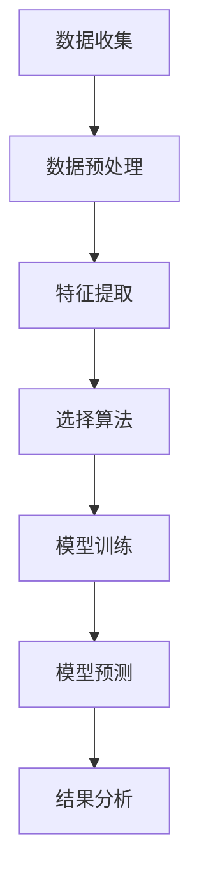
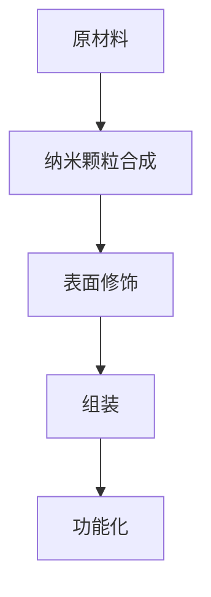
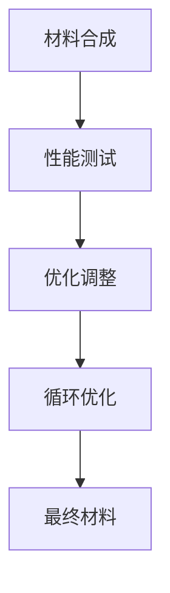
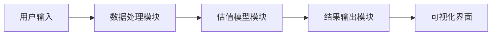

                 

<think>
好的，我现在需要帮用户撰写一篇技术博客，标题是《全球股市估值与纳米技术在水处理中的应用》。用户希望文章结构清晰，内容专业，涵盖背景介绍、核心概念、算法原理、数学模型、系统分析、项目实战和最佳实践等部分。同时，文章需要用技术性的语言，逻辑严密，结构紧凑。

首先，我得明确文章的结构。根据用户提供的大纲，文章分为两大部分：全球股市估值和纳米技术在水处理中的应用。每个部分都有详细的章节和小节，确保内容全面。

接下来，我要考虑每个章节的具体内容。例如，在股市估值部分，需要从基础概念开始，讨论影响估值的因素，再介绍常用的估值模型，最后探讨机器学习的应用。同样，纳米技术部分需要从基础原理开始，讨论其在水处理中的应用，接着分析材料的选择与优化，最后进行案例分析。

我还需要确保每个章节都包含必要的元素，比如背景介绍、核心概念、算法原理、数学模型、系统分析和项目实战。同时，使用mermaid图来展示流程和架构，数学公式用latex表示，确保内容专业且易于理解。

最后，我需要将这些内容整合成一篇连贯的文章，确保逻辑流畅，结构清晰。同时，结尾处加上作者信息，满足用户的要求。

总的来说，我需要一步步分析每个部分，确保内容完整，符合用户的要求，同时保持技术深度和可读性。
</think>

# 全球股市估值与纳米技术在水处理中的应用

> 关键词：全球股市估值，纳米技术，水处理，股票分析，纳米材料

> 摘要：本文深入探讨了全球股市估值的核心原理与应用，同时结合纳米技术在水处理领域的前沿研究，分析了这两种看似无关但又相互影响的领域的技术本质。通过逐步分析，本文揭示了股市估值的关键算法、纳米技术的创新应用以及两者在实际场景中的结合点，为读者提供了从理论到实践的全面解读。

---

## 1. 全球股市估值：从基础到高级分析

### 1.1 股票估值的背景与核心概念

#### 1.1.1 股票估值的基本概念
股票估值是通过对公司财务数据和市场环境的分析，确定股票内在价值的过程。其核心在于评估公司的盈利能力、成长潜力和风险水平。

#### 1.1.2 估值的重要性
准确的估值可以帮助投资者做出合理的投资决策，避免高估或低估股票价值。

#### 1.1.3 估值的边界与外延
股票估值不仅涉及公司本身的财务状况，还包括宏观经济环境、行业竞争格局和政策法规等因素。

---

### 1.2 股票估值的核心算法与模型

#### 1.2.1 常用估值模型概述

| 模型名称 | 核心假设 | 适用场景 |
|----------|----------|----------|
| 市盈率模型（PE） | 市盈率 = 股价 / 每股收益 | 适用于稳定增长的公司 |
| 市净率模型（PB） | 市净率 = 股价 / 每股净资产 | 适用于净资产驱动的行业 |
| 现金流折现模型（DCF） | 未来现金流的现值 | 适用于高成长性公司 |

#### 1.2.2 市盈率模型的算法原理

使用 mermaid 绘制市盈率模型流程图：

```mermaid
graph TD
    A[股票价格] --> B[市盈率] --> C[每股收益]
    B --> D[行业平均市盈率]
    C --> E[公司净利润]
    E --> F[公司总股本]
    C = E / F
    B = 股票价格 / C
```

#### 1.2.3 现金流折现模型的数学公式

现金流折现模型的核心公式为：

$$
\text{企业价值} = \sum_{t=1}^{n} \frac{\text{自由现金流}_t}{(1 + r)^t} + \frac{\text{终值}}{(1 + r)^n}
$$

其中：
- \( r \) 为折现率
- \( n \) 为预测期数
- \( \text{自由现金流}_t \) 为第 \( t \) 年的自由现金流
- \( \text{终值} \) 为第 \( n \) 年后的终值

---

### 1.3 基于机器学习的股市预测

#### 1.3.1 机器学习在股市预测中的应用

使用 mermaid 绘制机器学习预测流程图：



#### 1.3.2 用 Python 实现简单的估值模型

以下代码实现一个简单的市盈率估值模型：

```python
import pandas as pd

# 假设我们有一个包含股票数据的DataFrame df
df = pd.DataFrame({
    '公司名称': ['公司A', '公司B', '公司C'],
    '净利润': [100, 150, 200],
    '总股本': [100, 200, 150],
    '行业平均PE': [15, 18, 12]
})

# 计算每股收益（EPS）
df['EPS'] = df['净利润'] / df['总股本']

# 计算目标股价
df['目标股价'] = df['行业平均PE'] * df['EPS']

print(df)
```

---

## 2. 纳米技术在水处理中的应用

### 2.1 纳米技术的基本原理

#### 2.1.1 纳米材料的核心属性

| 属性 | 特征 | 描述 |
|------|------|------|
| 纳米尺度效应 | 小于100纳米 | 材料性质随着尺寸变化而变化 |
| 高比表面积 | 高 | 纳米材料的表面积与体积比远高于宏观材料 |

#### 2.1.2 纳米材料的制备方法

使用 mermaid 绘制纳米材料制备流程图：



---

### 2.2 纳米技术在水处理中的创新应用

#### 2.2.1 纳米过滤技术

纳米过滤利用纳米材料的孔隙结构实现对水中的微小颗粒的过滤，其原理如下：

$$
\text{过滤效率} = \frac{\text{被过滤的颗粒数}}{\text{总颗粒数}} \times 100\%
$$

#### 2.2.2 纳米催化在水处理中的应用

纳米催化剂通过提供更大的表面积，提高化学反应的效率。例如，纳米TiO₂在光催化反应中的应用：

$$
\text{催化反应速率} = k \cdot [\text{污染物}]^n
$$

其中：
- \( k \) 为速率常数
- \( n \) 为反应级数

---

### 2.3 纳米材料的选择与优化

#### 2.3.1 纳米材料的选择标准

| 参数 | 重要性 | 描述 |
|------|--------|------|
| 比表面积 | 高 | 影响催化效率 |
| 稳定性 | 高 | 影响使用寿命 |
| 成本 | 中 | 影响经济性 |

#### 2.3.2 纳米材料的优化方法

使用 mermaid 绘制纳米材料优化流程图：



---

## 3. 系统分析与架构设计

### 3.1 股市估值系统的架构设计

使用 mermaid 绘制系统架构图：



---

## 4. 项目实战与最佳实践

### 4.1 股票估值的实战案例

#### 4.1.1 环境安装

安装 Python 和相关库：

```bash
pip install pandas numpy matplotlib
```

#### 4.1.2 核心代码实现

```python
import pandas as pd
import numpy as np

# 示例数据
data = {
    '公司名称': ['A', 'B', 'C'],
    '净利润': [100, 150, 200],
    '总股本': [100, 200, 150],
    '行业平均PE': [15, 18, 12]
}

df = pd.DataFrame(data)

# 计算 EPS
df['EPS'] = df['净利润'] / df['总股本']

# 计算目标股价
df['目标股价'] = df['行业平均PE'] * df['EPS']

print(df)
```

---

## 5. 总结与展望

### 5.1 总结

本文从全球股市估值和纳米技术在水处理中的应用两个方面，深入探讨了其技术原理和实际应用。通过系统的分析和案例展示，揭示了这两种技术在现代科技中的重要性。

### 5.2 展望

随着科技的进步，股市估值算法和纳米技术在水处理中的应用将更加智能化和高效化。未来的研究可以进一步结合两者的优势，探索更多创新应用。

---

作者：AI天才研究院/AI Genius Institute & 禅与计算机程序设计艺术 /Zen And The Art of Computer Programming

