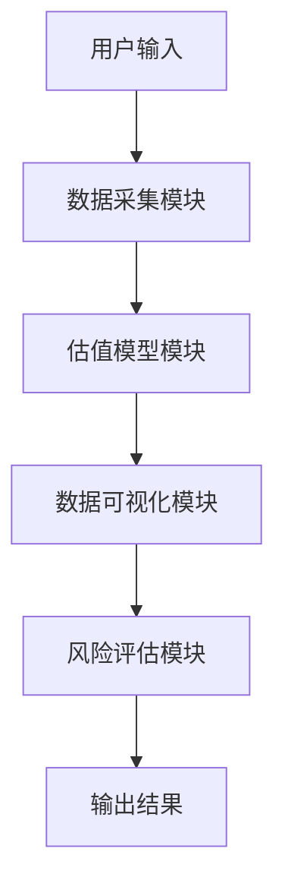

                 


---

# 全球股市估值与纳米材料在环保中的应用

---

## 关键词：
全球股市估值、纳米材料、环保应用、股市分析、环境治理、可持续发展

---

## 摘要：
本文从全球股市估值与纳米材料在环保中的应用两个核心领域展开分析。首先，探讨股市估值的基本概念、主要方法及其数学模型，深入解析股市估值的核心要素和边界条件。其次，详细介绍纳米材料的定义、特性及其在环保领域的广泛应用，包括水处理、气体净化和土壤修复等方面。通过分析纳米材料在环保中的具体应用案例，揭示其对环境治理的重要作用。最后，综合分析全球股市估值与纳米材料在环保中的应用之间的潜在联系，探讨纳米材料的环保应用如何影响股市估值，并提出未来的研究方向和投资策略。

---

## 第一部分: 全球股市估值概述

### 第1章: 全球股市估值的核心概念与方法

#### 1.1 股市估值的基本概念

股市估值是指通过对公司财务数据和市场信息的分析，评估公司股票的合理价格范围。它是投资者在股票市场中做出投资决策的重要依据。股市估值的核心在于通过分析公司基本面、行业地位、市场环境等因素，预测公司的未来盈利能力和股价走势。

#### 1.2 股市估值的核心要素

股市估值的核心要素包括：

1. **公司基本面**：包括收入、利润、资产负债表数据等。
2. **行业地位**：公司所在行业的竞争地位和市场前景。
3. **市场环境**：宏观经济环境、政策变化、行业趋势等。
4. **估值指标**：市盈率（P/E）、市净率（P/B）、股息率等。

#### 1.3 股市估值的主要方法

股市估值的主要方法包括：

1. **相对估值法**：
   - 市盈率法（P/E）：通过比较公司当前股价与每股收益的比率，评估股票的估值水平。
   - 市净率法（P/B）：通过比较公司当前股价与每股净资产的比率，评估股票的估值水平。

2. **绝对估值法**：
   - 内在价值法：通过DCF模型（现金流折现法）计算公司股票的理论价值。
   - 股息率法：通过计算股票的股息与股价的比率，评估股票的投资回报率。

#### 1.4 股市估值的数学模型

股市估值的核心在于数学模型的应用。以下是几种常用的股市估值模型：

1. **市盈率模型**：
   $$ P/E = \frac{Price}{Earnings} $$
   该模型通过比较公司的市盈率与行业平均水平或竞争对手的市盈率，评估公司的估值水平。

2. **市净率模型**：
   $$ P/B = \frac{Price}{Book\ Value} $$
   该模型适用于重资产行业，通过比较公司的市净率与行业平均水平，评估公司的估值水平。

3. **现金流折现模型（DCF模型）**：
   $$ Intrinsic\ Value = \frac{Cash\ Flows}{Discount\ Rate} $$
   该模型通过预测公司未来现金流，并将其折现为现值，计算公司的内在价值。

#### 1.5 股市估值的边界与外延

股市估值的边界条件包括：

1. **数据质量**：公司财务数据的准确性和完整性。
2. **市场假设**：假设市场是有效的，且公司未来现金流可以预测。
3. **模型假设**：假设折现率、增长率等参数是已知且稳定的。

股市估值的外延应用包括：

1. **投资决策**：通过估值结果指导买入、卖出或持有股票的决策。
2. **风险管理**：通过估值结果识别高估或低估的股票，降低投资风险。
3. **市场研究**：通过分析市场的估值水平，研究市场的整体走势和行业趋势。

---

### 第2章: 全球股市估值的系统架构与实现

#### 2.1 系统架构设计

股市估值系统架构包括以下几个模块：

1. **数据采集模块**：
   - 采集公司财务数据（收入、利润、资产负债表数据等）。
   - 采集市场数据（股价、成交量、行业指数等）。

2. **估值模型模块**：
   - 实现市盈率、市净率、DCF模型等估值方法。
   - 提供多种估值指标的计算功能。

3. **数据可视化模块**：
   - 展示公司估值结果与行业平均水平的对比。
   - 生成估值报告和图表。

4. **风险评估模块**：
   - 分析估值结果的不确定性。
   - 提供风险提示和投资建议。

#### 2.2 系统实现代码

以下是股市估值系统的核心代码示例：

```python
import pandas as pd
import numpy as np

def calculate_pe_ratio(df):
    df['PE'] = df['Price'] / df['Earnings']
    return df

def calculate_pb_ratio(df):
    df['PB'] = df['Price'] / df['Book Value']
    return df

def calculate_intrinsic_value(df, discount_rate):
    df['DCF'] = df['Cash Flows'] / (1 + discount_rate)
    return df

# 示例数据
data = {
    'Company': ['A', 'B', 'C'],
    'Price': [100, 80, 120],
    'Earnings': [20, 15, 30],
    'Book Value': [50, 40, 60],
    'Cash Flows': [25, 20, 35],
    'Discount Rate': [0.1, 0.1, 0.1]
}

df = pd.DataFrame(data)

df = calculate_pe_ratio(df)
df = calculate_pb_ratio(df)
df = calculate_intrinsic_value(df, df['Discount Rate'][0])

print(df)
```

#### 2.3 系统交互设计

以下是系统交互流程图：



---

## 第二部分: 纳米材料在环保中的应用

### 第3章: 纳米材料的基本概念与特性

#### 3.1 纳米材料的定义

纳米材料是指在三维空间中至少有一维的尺寸在1纳米到100纳米之间的材料。纳米材料具有独特的物理、化学和生物性质，使其在环保领域具有广泛的应用潜力。

#### 3.2 纳米材料的核心属性

纳米材料的核心属性包括：

1. **高比表面积**：纳米材料具有极高的比表面积，使其在吸附、催化等领域具有显著优势。
2. **量子效应**：纳米材料的尺寸效应使其在电子、磁性等方面表现出独特的性质。
3. **机械强度**：纳米材料具有极高的机械强度和硬度。

#### 3.3 纳米材料的制备方法

纳米材料的制备方法包括：

1. **物理制备法**：
   - 球磨法：通过机械力将材料破碎至纳米级别。
   - 热蒸发法：在真空环境下蒸发金属或半导体材料，形成纳米颗粒。

2. **化学制备法**：
   - 溶剂热法：通过加热溶剂体系，使纳米材料均匀分散。
   - 沉淀法：通过化学反应生成纳米颗粒。

3. **生物制备法**：
   - 利用生物分子的自组装特性，制备纳米材料。

---

### 第4章: 纳米材料在环保中的具体应用

#### 4.1 纳米材料在水处理中的应用

1. **污水处理**：
   - 纳米材料可以有效吸附水中的重金属离子、有机污染物等。
   - 示例：利用纳米氧化锌吸附水中的铅离子。

2. **饮用水净化**：
   - 纳米材料可以用于过滤和净化饮用水，去除细菌、病毒等污染物。
   - 示例：利用纳米二氧化钛去除水中的有机污染物。

3. **水污染治理**：
   - 纳米材料可以用于处理工业废水中的有毒有害物质。
   - 示例：利用纳米铁氧化物去除水中的硝酸盐。

#### 4.2 纳米材料在气体净化中的应用

1. **空气净化**：
   - 纳米材料可以吸附空气中的有害气体，如甲醛、苯等。
   - 示例：利用纳米活性炭吸附空气中的挥发性有机化合物。

2. **工业废气处理**：
   - 纳米材料可以用于催化氧化、吸附等方法处理工业废气。
   - 示例：利用纳米二氧化钛催化氧化处理工业废气中的二氧化硫。

3. **碳捕获**：
   - 纳米材料可以用于捕获和储存二氧化碳。
   - 示例：利用纳米多孔材料捕获空气中的二氧化碳。

#### 4.3 纳米材料在土壤修复中的应用

1. **重金属污染修复**：
   - 纳米材料可以吸附土壤中的重金属离子，减少污染。
   - 示例：利用纳米零价铁修复被重金属污染的土壤。

2. **有机污染物修复**：
   - 纳米材料可以分解土壤中的有机污染物。
   - 示例：利用纳米酶分解土壤中的农药残留。

3. **生物修复辅助**：
   - 纳米材料可以增强生物修复效果，加速土壤修复进程。
   - 示例：利用纳米材料辅助微生物修复被石油污染的土壤。

---

## 第5章: 纳米材料在环保中的系统架构与实现

#### 5.1 系统架构设计

纳米材料在环保中的应用系统架构包括以下几个模块：

1. **纳米材料制备模块**：
   - 制备纳米材料并测试其性能。
   - 示例：利用溶剂热法制备纳米氧化锌。

2. **污染检测模块**：
   - 检测水、空气、土壤中的污染物浓度。
   - 示例：利用传感器检测水中的重金属离子浓度。

3. **污染处理模块**：
   - 利用纳米材料吸附、催化、分解污染物。
   - 示例：利用纳米氧化锌吸附水中的铅离子。

4. **效果评估模块**：
   - 评估纳米材料在污染处理中的效果。
   - 示例：通过实验测定纳米氧化锌的吸附效率。

#### 5.2 系统实现代码

以下是纳米材料在环保中的应用系统的核心代码示例：

```python
import numpy as np

def prepare_nanomaterials(concentration):
    # 制备纳米材料
    return concentration * 0.8  # 示例：纳米材料制备后的浓度

def detect_pollutants(sample):
    # 检测污染物浓度
    return sample['Pollutant Concentration']

def treat_pollutants(concentration, nanomaterials):
    # 利用纳米材料处理污染物
    return concentration * (1 - nanomaterials / 100)

def evaluate_effectiveness(initial, final):
    # 评估处理效果
    return (initial - final) / initial * 100

# 示例数据
sample = {
    'Pollutant Concentration': 50,
    'Nanomaterials Concentration': 20
}

# 制备纳米材料
nanomaterials = prepare_nanomaterials(sample['Nanomaterials Concentration'])

# 检测污染物
pollutant_level = detect_pollutants(sample)

# 处理污染物
treated_level = treat_pollutants(pollutant_level, nanomaterials)

# 评估处理效果
effectiveness = evaluate_effectiveness(pollutant_level, treated_level)

print(f"纳米材料制备后的浓度: {nanomaterials}")
print(f"污染物处理前浓度: {pollutant_level}")
print(f"污染物处理后浓度: {treated_level}")
print(f"处理效果: {effectiveness}%")
```

---

## 第6章: 综合分析与未来展望

#### 6.1 全球股市估值与纳米材料应用的结合

1. **纳米材料的市场价值**：
   - 纳米材料在环保中的广泛应用将提升其市场价值。
   - 投资者可以通过股市估值方法评估纳米材料相关公司的股票价值。

2. **环保行业的投资机会**：
   - 纳米材料在环保中的应用将推动环保行业的发展。
   - 投资者可以关注纳米材料相关企业的投资机会。

3. **股市估值的创新应用**：
   - 纳米材料的应用将为股市估值提供新的维度和方法。
   - 例如，通过纳米材料的性能指标调整公司的估值模型。

#### 6.2 未来的研究方向

1. **纳米材料的高效制备方法**：
   - 研究如何提高纳米材料的制备效率和降低成本。
   - 示例：探索新型纳米材料制备技术，如自组装技术。

2. **纳米材料在环保中的新应用**：
   - 探索纳米材料在更多环保领域的应用，如能源回收、空气净化等。
   - 示例：利用纳米材料处理电子废物。

3. **纳米材料的可持续性研究**：
   - 研究纳米材料的生命周期，确保其在环保中的可持续应用。
   - 示例：评估纳米材料在环境中的降解性和生物相容性。

---

## 第7章: 最佳实践与小结

#### 7.1 最佳实践

1. **股市估值的实践建议**：
   - 投资者应结合公司基本面和市场环境进行估值。
   - 使用多种估值方法进行交叉验证，降低估值误差。

2. **纳米材料应用的实践建议**：
   - 纳米材料的应用应注重实验验证和实际效果评估。
   - 纳米材料的制备和应用应注重环保性和可持续性。

#### 7.2 小结

本文从全球股市估值与纳米材料在环保中的应用两个核心领域展开分析，深入探讨了股市估值的基本概念、主要方法及其数学模型，详细介绍了纳米材料的定义、特性及其在环保领域的广泛应用。通过分析纳米材料在水处理、气体净化和土壤修复中的具体应用，揭示了其在环境治理中的重要作用。最后，综合分析了全球股市估值与纳米材料在环保中的应用之间的潜在联系，提出了未来的研究方向和投资策略。

---

## 作者信息

作者：AI天才研究院/AI Genius Institute & 禅与计算机程序设计艺术/Zen And The Art of Computer Programming

---

