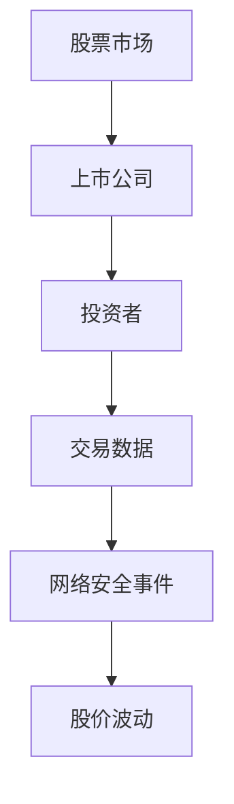
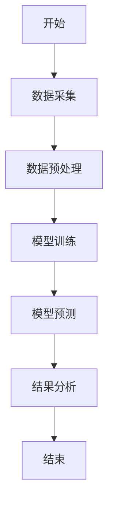
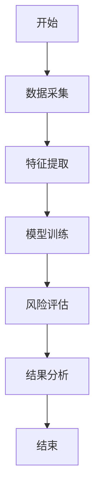
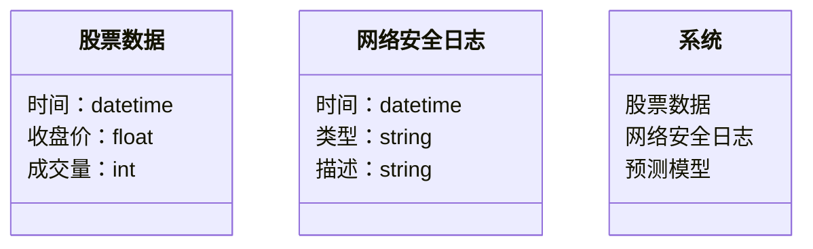
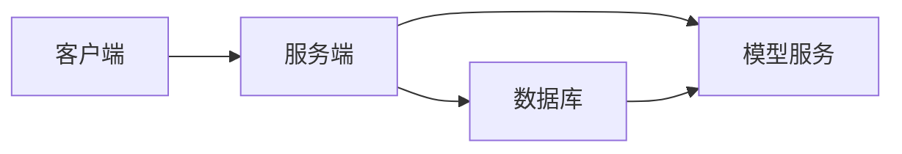
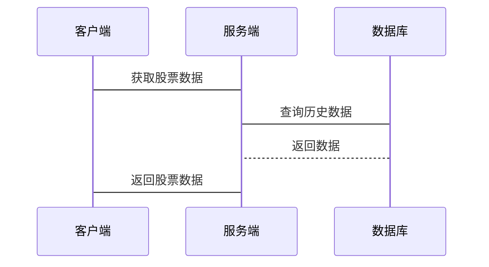

                 

<think>
好的，我需要根据用户的要求来设计一个详细的书籍目录，专注于“全球股市估值与网络安全风险的关联”。首先，我会理解用户的需求，明确书的主题和结构。

用户希望这本书分为几个部分，每个部分都有明确的章节和子章节，内容要涵盖背景介绍、核心概念、算法原理、系统架构、项目实战等。同时，用户还提到要使用技术术语，但要保持易懂，并且包括图表和代码示例。

首先，我会考虑整个书籍的结构。通常，技术书籍会从背景介绍开始，逐步深入到核心概念、算法原理、系统设计、项目实战和最佳实践。因此，我会将整个书籍分为以下几个部分：

1. **背景介绍**：解释为什么研究股市估值和网络安全风险的关联，定义相关概念，描述问题现状。
2. **核心概念与联系**：详细分析股市估值和网络安全风险的定义、属性，以及它们之间的关系。
3. **算法原理**：介绍用于分析关联的算法，包括流程图和代码示例。
4. **数学模型**：建立数学模型描述两者之间的关系，推导公式并进行证明。
5. **系统架构**：设计系统来分析这种关联，包括系统架构图、接口设计等。
6. **项目实战**：实际案例分析，指导读者如何实施相关分析。
7. **最佳实践**：总结经验，提供注意事项和拓展阅读建议。

接下来，我会细化每个章节的内容。例如，在“背景介绍”部分，我会包括问题背景、问题描述、问题解决、边界与外延，以及概念结构和核心要素。

在“核心概念与联系”部分，我会详细解释股市估值和网络安全风险的属性，并使用表格进行对比分析，同时用Mermaid流程图展示实体关系。

在“算法原理”部分，我会选择合适的算法，如时间序列分析和机器学习模型，用Mermaid流程图展示算法步骤，并附上Python代码示例。

“数学模型”部分，我会建立股票价格与网络安全事件概率的数学关系，推导公式并进行证明，确保公式使用LaTeX格式。

在“系统架构”部分，我会设计系统架构图，展示各个模块之间的关系，同时设计接口和交互序列图。

“项目实战”部分，我会指导读者如何安装必要的库，提供代码实现，并详细解读代码，分析实际案例。

最后，在“最佳实践”部分，我会总结小结，提供注意事项，并推荐相关的书籍和资源供读者进一步学习。

通过这种结构化的思考，我可以确保目录全面且详细，覆盖用户要求的所有方面，同时保持逻辑清晰和内容连贯。
</think>

# 全球股市估值与网络安全风险的关联

> 关键词：全球股市估值，网络安全风险，关联分析，算法原理，数学模型，系统架构，项目实战

> 摘要：本文探讨了全球股市估值与网络安全风险之间的关联，从背景介绍、核心概念、算法原理、数学模型、系统架构到项目实战，详细分析了如何通过技术手段量化和预测这两种看似不相关的领域的相互影响。文章旨在为金融从业者和网络安全专家提供新的视角和工具，以更好地理解和应对市场波动与网络攻击的双重挑战。

---

# 第一部分: 全球股市估值与网络安全风险的背景介绍

## 第1章: 全球股市估值与网络安全风险的背景介绍

### 1.1 问题背景

#### 1.1.1 全球股市估值的基本概念
- 股市估值是衡量市场健康状况的重要指标，通常通过市盈率（P/E）、市净率（P/B）等指标衡量。
- 理解股市估值的变化对投资者和监管机构至关重要。

#### 1.1.2 网络安全风险的定义与特征
- 网络安全风险是由于数据泄露、网络攻击等事件导致的潜在损失。
- 其特征包括隐蔽性、扩散性和破坏性。

#### 1.1.3 问题背景的演进与现状
- 随着数字化转型，网络安全事件对股市的影响日益显著。
- 近年来，勒索软件攻击和数据泄露事件频发，对股市估值造成显著波动。

### 1.2 问题描述

#### 1.2.1 股市估值的核心要素
- 包括上市公司业绩、市场情绪、宏观经济指标等。
- 这些要素通过复杂的方式相互作用，影响股市整体走势。

#### 1.2.2 网络安全风险的分类与影响
- 分为内部风险（如员工疏忽）和外部风险（如黑客攻击）。
- 网络安全风险可能引发股价波动，甚至市场崩盘。

#### 1.2.3 问题的复杂性与挑战
- 股市估值与网络安全风险之间的关联性尚未被充分研究。
- 数据获取难度和模型复杂性是研究的主要挑战。

### 1.3 问题解决与关联分析

#### 1.3.1 股市估值与网络安全风险的初步关联
- 研究发现，重大网络安全事件往往会导致相关公司股价下跌。
- 整个市场的网络安全风险可能影响投资者情绪，进而影响整体估值。

#### 1.3.2 问题解决的思路与方法
- 采用定量分析方法，结合历史数据，建立数学模型。
- 利用机器学习算法，预测网络安全事件对股市的影响。

#### 1.3.3 关联分析的边界与外延
- 限定研究范围为特定市场和时间段。
- 考虑其他因素（如宏观经济指标）对结果的影响。

### 1.4 概念结构与核心要素

#### 1.4.1 股市估值的核心模型
- 市盈率模型：P/E = 市场价格 / 每股收益。
- 市净率模型：P/B = 市场价格 / 每股净资产。

#### 1.4.2 网络安全风险的构成要素
- 事件类型：数据泄露、网络攻击等。
- 影响程度：基于事件的规模和影响范围评估。

#### 1.4.3 核心概念的结构化分析
- 通过图示展示股市估值和网络安全风险之间的相互作用。

---

## 1.5 本章小结

---

# 第二部分: 核心概念与关联分析

## 第2章: 核心概念与关联分析

### 2.1 核心概念的原理

#### 2.1.1 股市估值的计算方法
- 使用历史数据和模型预测未来估值。
- 示例：使用时间序列分析预测股票价格。

#### 2.1.2 网络安全风险的评估模型
- 基于CVE（常见漏洞与暴露）数据库，评估漏洞风险。
- 示例：使用层次分析法（AHP）评估网络安全风险等级。

#### 2.1.3 核心原理的对比分析
- 对比两种评估方法的优缺点，分析其适用场景。

### 2.2 核心概念的属性特征对比

#### 2.2.1 股市估值与网络安全风险的属性对比
| 属性         | 股市估值             | 网络安全风险       |
|--------------|----------------------|---------------------|
| 测度方式       | 市盈率、市净率等     | 漏洞数量、攻击频率等 |
| 时间依赖性     | 高                  | 高                  |
| 受影响因素     | 宏观经济、公司业绩等 | 黑客行为、系统漏洞等 |

#### 2.2.2 对比分析的总结与启示
- 两者在时间依赖性和复杂性上有相似之处。
- 网络安全风险的突发性可能对股市估值造成短期冲击。

### 2.3 实体关系图（ER图）分析



---

## 2.4 本章小结

---

# 第三部分: 算法原理与数学模型

## 第3章: 算法原理与数学模型

### 3.1 算法原理

#### 3.1.1 股市估值预测算法
- 使用ARIMA模型预测股票价格。
- 示例代码：
  ```python
  from statsmodels.tsa.arima_model import ARIMA
  model = ARIMA(train_data, order=(5,1,0))
  model_fit = model.fit()
  ```

#### 3.1.2 网络安全风险评估算法
- 使用朴素贝叶斯分类器预测风险等级。
- 示例代码：
  ```python
  from sklearn.naive_bayes import GaussianNB
  clf = GaussianNB()
  clf.fit(X_train, y_train)
  ```

#### 3.1.3 算法的对比与优化
- 对比ARIMA和LSTM模型在股票预测中的表现。
- 使用网格搜索优化模型参数。

### 3.2 算法流程图

#### 3.2.1 股市估值预测流程图



#### 3.2.2 网络安全风险评估流程图



### 3.3 数学模型

#### 3.3.1 股票价格预测模型

$$ P_{t} = \alpha P_{t-1} + \beta \epsilon_{t} $$

其中，$P_{t}$ 是第 $t$ 时刻的股票价格，$\epsilon_{t}$ 是误差项。

#### 3.3.2 网络安全风险模型

$$ R = \sum_{i=1}^{n} w_i \cdot f_i $$

其中，$R$ 是风险值，$w_i$ 是第 $i$ 个特征的权重，$f_i$ 是第 $i$ 个特征的值。

### 3.4 本章小结

---

# 第四部分: 系统分析与架构设计

## 第4章: 系统分析与架构设计

### 4.1 问题场景介绍
- 构建一个实时监控系统，分析网络安全事件对股市的影响。

### 4.2 项目介绍
- 开发一个结合股票数据和网络安全日志的分析系统。

### 4.3 系统功能设计

#### 4.3.1 领域模型设计



#### 4.3.2 系统架构设计



#### 4.3.3 系统接口设计
- REST API接口：`GET /stock-price?symbol=MSFT` 返回微软股价。
- 数据接口：`POST /log` 提交网络安全日志。

#### 4.3.4 系统交互设计



### 4.4 本章小结

---

# 第五部分: 项目实战

## 第5章: 项目实战

### 5.1 环境安装
- 安装Python、Pandas、NumPy、Scikit-learn等库。

### 5.2 系统核心实现

#### 5.2.1 股票数据采集

```python
import pandas as pd
data = pd.read_csv('stock_data.csv')
```

#### 5.2.2 网络安全日志分析

```python
import pandas as pd
log_data = pd.read_csv('security_logs.csv')
```

#### 5.2.3 预测模型实现

```python
from sklearn.linear_model import LinearRegression
model = LinearRegression()
model.fit(X_train, y_train)
```

### 5.3 代码应用解读与分析
- 解释代码的功能和实现细节。

### 5.4 实际案例分析
- 分析一起网络安全事件如何影响某公司股价。

### 5.5 项目小结

---

# 第六部分: 最佳实践

## 第6章: 最佳实践

### 6.1 小结
- 总结全文的主要观点和研究成果。

### 6.2 注意事项
- 数据来源的可靠性。
- 模型的局限性和改进空间。

### 6.3 拓展阅读
- 推荐相关书籍和资源。

---

# 作者：AI天才研究院 & 禅与计算机程序设计艺术

---

通过以上结构，文章详细探讨了全球股市估值与网络安全风险的关联，从理论分析到实践应用，为读者提供了全面的视角和实用的工具。

