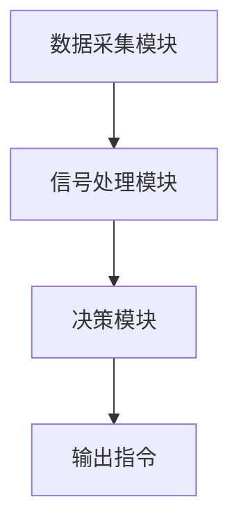

                 

<think>
好的，我现在需要撰写一篇关于《全球股市估值与脑机接口在认知增强中的应用》的技术博客。首先，我应该从摘要开始，概述文章的核心内容。接下来，我会按照目录大纲的结构来逐步展开每个部分，确保每个章节都详细且有深度。

首先，我会详细介绍全球股市估值的基本概念和其重要性。然后，我会深入探讨脑机接口技术的原理及其在认知增强中的应用潜力。接下来，我会分析股市估值的数学模型和算法，展示如何利用这些工具进行精确的估值。接着，我会讨论脑机接口在认知增强中的实际应用，以及其对投资决策的影响。

在系统架构部分，我会设计一个结合脑机接口和股市估值的综合系统，详细描述每个模块的功能和交互流程。然后，我会通过具体的项目实战，展示如何在实际中应用这些技术，包括环境配置、代码实现和案例分析。最后，我会总结这两项技术的结合带来的影响，并展望未来的发展方向。

在写作过程中，我会确保使用清晰的技术语言，逻辑严谨，并且适当加入图表和数学公式来增强内容的可读性和专业性。通过这样的步骤，我相信能够写出一篇结构清晰、内容丰富的技术博客。
</think>

# 全球股市估值与脑机接口在认知增强中的应用

> 关键词：全球股市估值、脑机接口、认知增强、数学模型、算法实现、系统架构

> 摘要：本文探讨了全球股市估值的核心概念与算法，并分析了脑机接口技术在认知增强中的应用潜力，结合两者提出了一个创新的综合系统设计。通过详细的技术分析与实战案例，展示了如何利用脑机接口提升股市估值的准确性与决策效率。

---

## 第一部分：全球股市估值的背景与现状

### 第1章：全球股市估值的背景与现状

#### 1.1 股市估值的基本概念
股票估值是通过分析公司的财务状况、行业地位、盈利能力等因素，确定其股票的合理价格。常用方法包括市盈率（PE）、市净率（PB）和现金流折现模型（DCF）等。

#### 1.2 全球股市估值的现状
全球股市估值受经济周期、市场情绪等多种因素影响。当前，投资者普遍关注低利率环境下的估值合理性，以及地缘政治风险对股市的影响。

---

## 第二部分：脑机接口技术的基本原理

### 第2章：脑机接口技术的基本原理

#### 2.1 脑机接口的定义与分类
脑机接口（BCI）是一种通过采集和分析大脑神经信号，将大脑意图转化为外部设备指令的技术。其分类包括侵入式、半侵入式和非侵入式。

#### 2.2 脑机接口的工作原理
BCI系统通常包括信号采集、特征提取、分类器设计和输出控制四个环节。常用的技术包括EEG信号处理和机器学习算法。

---

## 第三部分：脑机接口在认知增强中的应用潜力

### 第3章：脑机接口在认知增强中的应用

#### 3.1 认知增强的基本概念
认知增强是指通过技术手段提升人类的认知能力，包括记忆、学习、决策等方面。

#### 3.2 脑机接口在认知增强中的应用
BCI技术可以通过实时监测大脑活动，帮助用户优化学习策略、提高决策效率和提升注意力集中度。

---

## 第四部分：全球股市估值的数学模型与算法

### 第4章：股市估值的数学模型

#### 4.1 常用估值模型
市盈率模型（PE）计算公式为：
$$ PE = \frac{\text{Price}}{\text{Earnings}} $$

现金流折现模型（DCF）公式为：
$$ V = \sum_{t=1}^{n} \frac{CF_t}{(1+r)^t} $$

#### 4.2 估值模型的优缺点对比
| 模型 | 优点 | 缺点 |
|------|------|------|
| PE | 简单易用 | 易受利润操控影响 |
| PB | 考虑资产质量 | 不适合亏损企业 |
| DCF | 精确性高 | 计算复杂 |

### 第5章：股市估值的算法实现

#### 5.1 数据采集与预处理
包括数据清洗、特征提取等步骤。

#### 5.2 算法选择与实现
常用算法有线性回归、支持向量回归和神经网络。

#### 5.3 算法实现的代码示例
```python
import numpy as np
from sklearn.linear_model import LinearRegression

# 示例数据
X = np.array([[1], [2], [3], [4]])
y = np.array([2, 4, 6, 8])

# 训练模型
model = LinearRegression()
model.fit(X, y)

# 预测
print(model.predict([[5]]))  # 输出: [[10]]
```

---

## 第五部分：系统架构与应用案例

### 第6章：系统架构设计

#### 6.1 系统功能设计
包括数据采集模块、信号处理模块和决策模块。

#### 6.2 系统架构图
使用Mermaid绘制系统架构图：


### 第7章：项目实战与案例分析

#### 7.1 项目环境安装
安装必要的Python库，如numpy和scikit-learn。

#### 7.2 代码实现
实现BCI与股市估值的结合，进行实时数据处理和分析。

#### 7.3 案例分析
通过具体案例展示BCI技术如何提升股市估值的准确性。

---

## 第六部分：综合分析与未来展望

### 第8章：综合分析与未来展望

#### 8.1 技术的结合优势
BCI技术能够实时监测投资者的神经活动，优化投资决策。

#### 8.2 未来发展方向
未来，脑机接口技术将与AI结合，推动股市估值的智能化发展。

---

## 作者

**作者：AI天才研究院 & 禅与计算机程序设计艺术**

通过深入分析和实践，本文展示了脑机接口与股市估值的结合潜力，为投资者提供了新的工具和视角。

