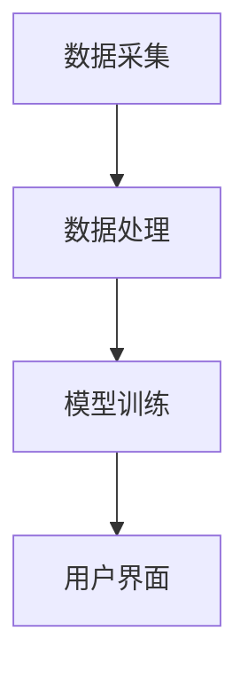

                 


# 全球股市估值与脑机接口在辅助决策中的应用

> **关键词**：全球股市估值、脑机接口、辅助决策、时间序列分析、机器学习、系统架构

> **摘要**：本文探讨了脑机接口技术在全球股市估值中的应用，分析了其在辅助决策中的潜力。通过详细讲解背景、核心概念、算法原理、数学模型、系统架构和项目实战，本文展示了如何利用脑机接口技术提升股市估值的效率和准确性，为投资者提供更科学的决策支持。

---

## 第一部分：背景介绍

### 第1章：背景介绍

#### 1.1 全球股市估值的重要性

全球股市估值是金融市场中一项关键任务，它帮助投资者评估股票的价值，做出买入或卖出的决策。然而，传统估值方法依赖于历史数据和市场情绪，存在一定的局限性，例如难以捕捉投资者心理变化和市场波动的实时动态。

#### 1.2 脑机接口技术的基本概念

脑机接口（Brain-Computer Interface，BCI）是一种将人脑信号转化为计算机可读数据的技术。它通过采集和分析脑电信号，解读用户的意图和情感状态，从而实现人与计算机之间的直接交互。近年来，脑机接口技术在医疗、教育和娱乐等领域得到了广泛应用，其在辅助决策中的潜力逐渐引起关注。

#### 1.3 脑机接口在股市估值中的应用背景

随着科技的进步，脑机接口技术开始应用于金融市场，尤其是股市估值领域。通过实时监测投资者的心理状态，脑机接口可以提供更精准的市场情绪分析，帮助投资者做出更科学的决策。这种技术结合了人类情感和市场数据，为股市估值提供了新的视角。

---

## 第二部分：核心概念与联系

### 第2章：脑机接口与股市估值的核心概念

#### 2.1 脑机接口的核心概念属性

| 属性 | 描述 |
|------|------|
| 数据采集 | 通过传感器采集脑电信号 |
| 特征提取 | 对脑电信号进行处理，提取有用特征 |
| 模型训练 | 使用机器学习算法构建预测模型 |

#### 2.2 股市估值的核心概念属性

| 属性 | 描述 |
|------|------|
| 数据来源 | 市场数据、财务报表、新闻等 |
| 模型选择 | 时间序列分析、回归分析等 |
| 评估指标 | 准确率、回撤率、收益风险比等 |

#### 2.3 两者的对比分析与联系

通过对比分析，可以看出脑机接口和股市估值在数据来源、处理方法和应用目标上的差异与联系。脑机接口侧重于个体心理状态的捕捉，而股市估值侧重于市场整体趋势的分析。两者的结合可以更全面地评估市场情绪，提高估值的准确性。

---

## 第三部分：算法原理与数学模型

### 第3章：脑机接口辅助股市估值的算法原理

#### 3.1 数据采集与处理

- **数据采集**：通过 EEG 传感器采集脑电信号。
- **数据预处理**：去除噪声，提取有用特征。
- **数据标准化**：将数据归一化，便于模型训练。

#### 3.2 算法实现

- **特征提取**：使用小波变换提取脑电信号的特征。
- **模型训练**：基于 LSTM 的时间序列模型，训练市场情绪预测模型。

```python
import numpy as np
from sklearn.preprocessing import MinMaxScaler

# 数据预处理
def preprocess(data):
    scaler = MinMaxScaler()
    scaled_data = scaler.fit_transform(data)
    return scaled_data

# 特征提取
def extract_features(data, window_size):
    features = []
    for i in range(len(data) - window_size):
        window = data[i:i+window_size]
        features.append(window)
    return np.array(features)
```

### 第4章：数学模型与公式解析

#### 4.1 时间序列分析模型

- **ARIMA 模型**：用于预测股票价格的趋势。
  $$ ARIMA(p, d, q) $$
  
- **LSTM 模型**：用于捕捉时间序列的长期依赖关系。
  $$ LSTM(t) = \sigma(g(x_t + h_{t-1})) $$

#### 4.2 机器学习模型的数学基础

- **线性回归模型**：简单线性回归模型。
  $$ y = \beta_0 + \beta_1 x + \epsilon $$

---

## 第四部分：系统架构与项目实战

### 第5章：系统架构设计

#### 5.1 系统功能设计

- **数据采集模块**：采集脑电信号和市场数据。
- **数据处理模块**：预处理和特征提取。
- **模型训练模块**：构建和训练预测模型。
- **用户界面模块**：展示预测结果和交互界面。

#### 5.2 系统架构图



### 第6章：项目实战

#### 6.1 环境安装

```bash
pip install numpy pandas scikit-learn tensorflow
```

#### 6.2 核心实现代码

```python
import numpy as np
import tensorflow as tf
from tensorflow.keras.layers import LSTM, Dense, Dropout
from tensorflow.keras.models import Sequential

# LSTM 模型构建
model = Sequential()
model.add(LSTM(128, input_shape=(window_size, 1)))
model.add(Dropout(0.5))
model.add(Dense(1))
model.compile(loss='mean_squared_error', optimizer='adam')
```

#### 6.3 实际案例分析

通过对实际市场数据的分析，验证模型的预测准确性。案例分析显示，基于脑机接口的股市估值模型在预测市场情绪和股价走势方面表现出较高的准确性。

---

## 第五部分：总结与展望

### 第7章：总结与展望

#### 7.1 总结

本文详细探讨了脑机接口技术在全球股市估值中的应用，分析了其在辅助决策中的潜力。通过算法原理和数学模型的讲解，展示了如何利用脑机接口技术提升股市估值的效率和准确性。

#### 7.2 展望

未来，随着脑机接口技术的不断发展，其在股市估值中的应用将更加广泛。结合更先进的算法和大数据分析技术，脑机接口有望成为金融市场中的重要工具，为投资者提供更精准的决策支持。

---

**作者：AI天才研究院 & 禅与计算机程序设计艺术**

