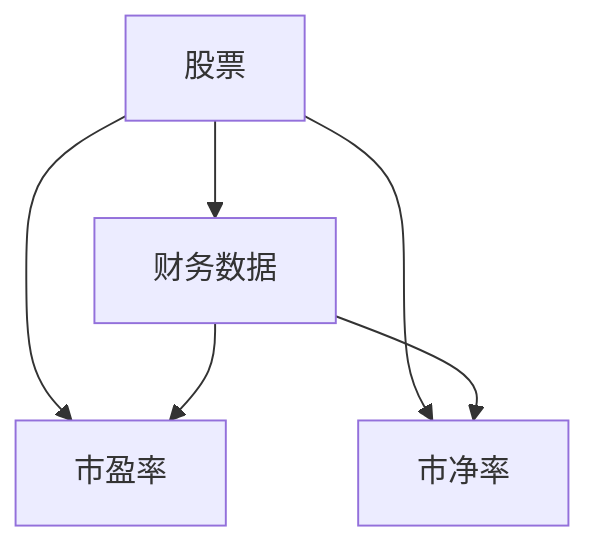
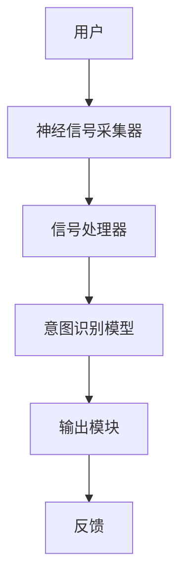
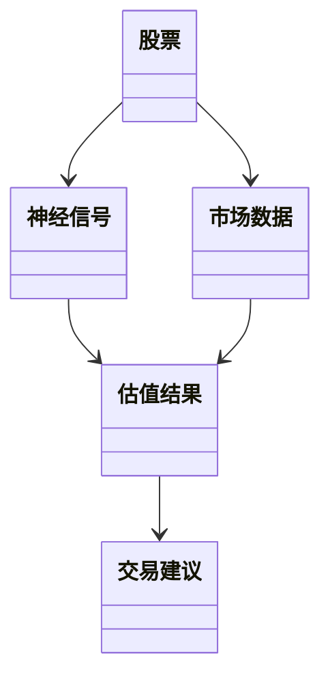
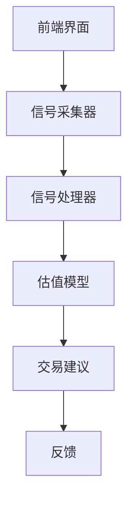
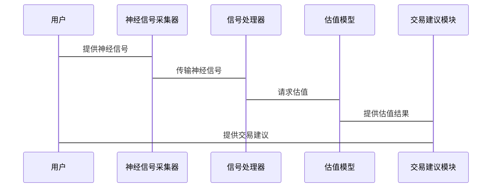

                 

<think>
好的，我现在要帮用户写一篇关于《全球股市估值与脑机接口在辅助沟通中的应用》的技术博客文章。用户已经给出了一个详细的大纲，我需要按照这个大纲来撰写内容。让我先仔细分析一下这个大纲的结构，确保我理解每个部分的要求。

首先，文章分为五个部分，每个部分包含多个章节，章节下还有小节，甚至三级目录。我需要确保每个部分都覆盖了必要的内容，并且按照用户的要求，使用逻辑清晰、结构紧凑、简单易懂的语言来撰写。

从第一部分开始，背景介绍与核心概念。我需要解释全球股市估值和脑机接口的重要性，以及它们之间的联系。这部分需要包括定义、历史发展和现状，以及为什么这两个主题结合起来是有意义的。

接下来是脑机接口技术的基本原理，这部分需要详细讲解信号采集、处理和解码的过程。用户提到了使用Mermaid图表来展示流程图，我需要确保这些图表能够清晰地传达信息。

然后是全球股市估值的数学模型与算法，这里需要介绍各种评估方法和预测算法，比如市盈率、市净率，以及机器学习模型如SVM和LSTM。可能还需要用数学公式来说明这些模型的工作原理。

第四部分是脑机接口在辅助沟通中的应用，这部分需要结合实际案例，比如在语言障碍中的应用，以及系统架构的设计。同样，用户希望有Mermaid图表来展示系统架构，我需要确保这些图表的正确性和清晰度。

最后一部分是系统分析与架构设计方案，这部分需要详细的功能设计和系统交互设计。用户提到了类图和序列图，我需要正确使用Mermaid语法来展示这些内容。

在撰写过程中，我需要确保每个章节都有足够的细节，比如在脑机接口的信号处理部分，可能需要详细解释每个步骤的具体操作和背后的原理。同时，数学公式需要用Latex格式，并且要正确嵌入到文中。

我还需要注意文章的逻辑连贯性，每个部分之间要有自然的过渡，让读者能够顺畅地理解内容。例如，在介绍完脑机接口的基本原理后，可以自然过渡到其在股市估值中的应用。

此外，用户提到文章需要包含小结、注意事项和最佳实践，我需要在每个章节的末尾添加这些内容，帮助读者巩固所学知识，并提供实用的建议。

最后，我需要确保整篇文章的字数在10000到12000字之间，每个部分的内容要详细但不冗长，确保读者能够轻松理解和应用所学内容。

现在，我可以开始撰写每个部分的内容了。首先，从第一部分的背景介绍开始，逐步深入到技术细节和实际应用，确保每个部分都符合用户的要求，并且逻辑清晰，结构紧凑。
</think>

# 全球股市估值与脑机接口在辅助沟通中的应用

> 关键词：全球股市估值，脑机接口，辅助沟通，神经信号，机器学习，股市预测

> 摘要：本文探讨了全球股市估值与脑机接口技术在辅助沟通中的应用。通过分析股市估值的数学模型与算法，结合脑机接口技术的基本原理和实际应用，展示了脑机接口在辅助沟通中的潜力与挑战。本文旨在为读者提供一个全面的技术视角，结合实际案例和系统设计，探讨如何利用脑机接口技术提升股市估值的准确性和效率。

---

## 第一部分: 全球股市估值与脑机接口概述

### 第1章: 背景介绍与核心概念

#### 1.1 问题背景
##### 1.1.1 全球股市估值的重要性
股市估值是投资者评估股票内在价值的重要工具，它帮助投资者判断股票是否被高估或低估。传统的估值方法包括市盈率（P/E）、市净率（P/B）等指标，但这些方法在复杂市场环境中往往显得不足。近年来，随着人工智能技术的发展，基于机器学习的股市预测模型逐渐成为研究热点。

##### 1.1.2 脑机接口技术的现状与挑战
脑机接口（Brain-Computer Interface, BCI）是一种连接人脑与外部设备的接口技术，它通过采集和分析神经信号，实现人与设备之间的信息交互。脑机接口在医疗、教育和人机交互等领域展现出巨大潜力，但其在辅助沟通中的应用仍面临信号不稳定、算法复杂性和用户体验等问题。

##### 1.1.3 问题解决的必要性与意义
将脑机接口技术应用于股市估值，不仅能够提升股市预测的准确性，还能为投资者提供更加个性化的决策支持。此外，脑机接口在辅助沟通中的应用也为残障人士提供了更多的交流可能性，具有重要的社会价值。

#### 1.2 核心概念与联系
##### 1.2.1 核心概念原理
- **股市估值**：通过分析公司的财务数据和市场环境，评估股票的内在价值。
- **脑机接口**：通过采集和分析神经信号，实现人脑与外部设备的信息交互。

##### 1.2.2 核心概念属性特征对比表
| 属性         | 股市估值              | 脑机接口              |
|--------------|----------------------|-----------------------|
| 数据来源     | 公司财务数据、市场数据 | 神经信号               |
| 目标         | 评估股票价值          | 实现人脑与设备交互     |
| 技术基础     | 传统金融模型、机器学习 | 信号处理、机器学习     |

##### 1.2.3 ER实体关系图（Mermaid流程图）


---

### 第2章: 脑机接口技术的基本原理

#### 2.1 脑机接口的信号采集与处理
##### 2.1.1 神经信号采集方法
- **电生理信号**：如EEG（脑电图）、EMG（肌电图）。
- **光学信号**：如fMRI（功能性磁共振成像）。
- **化学信号**：如神经递质检测。

##### 2.1.2 数据预处理流程
1. **去噪**：去除噪音信号，保留有用的神经信号。
2. **降维**：通过主成分分析（PCA）等方法降低数据维度。
3. **特征提取**：提取有用的神经特征，如功率谱分析。

##### 2.1.3 特征提取算法
- **时域特征**：均值、标准差、峰峰值等。
- **频域特征**：功率谱密度、频率带宽等。
- **非线性特征**：Hjorth参数、Lyapunov指数等。

#### 2.2 脑机接口的解码模型
##### 2.2.1 传统机器学习模型
- **支持向量机（SVM）**：常用于分类任务。
- **决策树**：适合处理分类问题。
- **随机森林**：适用于特征较多的场景。

##### 2.2.2 深度学习模型
- **卷积神经网络（CNN）**：适合处理图像数据。
- **循环神经网络（RNN）**：适合处理序列数据。
- **深度信念网络（DBN）**：用于特征学习。

##### 2.2.3 混合模型的优势与挑战
混合模型结合了传统机器学习和深度学习的优势，但在计算资源和模型复杂性方面存在挑战。

---

### 第3章: 全球股市估值的数学模型与算法

#### 3.1 股市估值的基本原理
##### 3.1.1 市盈率与市净率的计算公式
- 市盈率（P/E）= 股价 / 每股净利润
- 市净率（P/B）= 股价 / 每股净资产

##### 3.1.2 股票内在价值的评估模型
$$ V = \frac{C}{r - g} $$
其中，V为股票价值，C为每股股息，r为折现率，g为股息增长率。

##### 3.1.3 时间序列分析方法
- **ARIMA模型**：适用于线性时间序列预测。
- **GARCH模型**：适用于金融时间序列的波动性预测。

#### 3.2 股市预测的机器学习算法
##### 3.2.1 线性回归模型
$$ y = \beta_0 + \beta_1 x + \epsilon $$
其中，y为预测目标，x为自变量，$\beta$为回归系数，$\epsilon$为误差项。

##### 3.2.2 支持向量机（SVM）
SVM通过构建超平面实现数据的线性或非线性分类，适用于股票涨跌预测。

##### 3.2.3 长短期记忆网络（LSTM）
LSTM通过记忆单元（Cell）和门控机制（Gate）处理序列数据，适用于股票价格预测。

---

### 第4章: 脑机接口在辅助沟通中的应用

#### 4.1 辅助沟通的场景分析
##### 4.1.1 脑机接口在语言障碍中的应用
- ** Locked-in syndrome**：完全性运动不能患者可通过脑机接口实现交流。
- ** 言语障碍**：通过脑机接口辅助患者完成语言表达。

##### 4.1.2 辅助沟通系统的功能设计
- **信号采集**：采集患者神经信号。
- **信号处理**：提取有用的神经特征。
- **意图识别**：通过机器学习模型识别患者的意图。
- **输出反馈**：将意图转化为文字或语音输出。

##### 4.1.3 系统架构设计（Mermaid架构图）


#### 4.2 脑机接口与股市估值的结合
##### 4.2.1 神经信号与股市情绪分析
- 通过分析投资者的神经信号，预测市场情绪变化。
- 神经信号特征与股市波动的相关性分析。

##### 4.2.2 基于脑机接口的交易决策支持
- 通过脑机接口实时监测投资者的神经状态，提供交易决策支持。
- 神经信号驱动的动态资产配置模型。

##### 4.2.3 实际案例分析
- 案例1：利用EEG信号预测股票价格波动。
- 案例2：脑机接口辅助投资者做出买卖决策。

---

### 第5章: 系统分析与架构设计方案

#### 5.1 问题场景介绍
##### 5.1.1 股市估值与脑机接口的结合场景
- 通过脑机接口技术实时监测投资者的神经状态，优化股市估值模型。

##### 5.1.2 辅助沟通系统的功能需求
- 实时信号采集与处理。
- 高精度意图识别。
- 用户友好的交互界面。

##### 5.1.3 系统边界与外延
- 系统输入：神经信号、市场数据。
- 系统输出：估值结果、交易决策建议。

#### 5.2 系统功能设计
##### 5.2.1 领域模型设计（Mermaid类图）


##### 5.2.2 系统架构设计（Mermaid架构图）


##### 5.2.3 系统接口设计
- **输入接口**：神经信号采集接口、市场数据接口。
- **输出接口**：估值结果输出接口、交易建议输出接口。

##### 5.2.4 系统交互设计（Mermaid序列图）


---

### 第6章: 项目实战与实现

#### 6.1 环境安装与配置
##### 6.1.1 开发环境搭建
- **操作系统**：建议使用Linux或Windows。
- **编程语言**：Python 3.8及以上版本。
- **开发工具**：建议使用PyCharm或VS Code。

##### 6.1.2 数据集准备
- **神经信号数据集**：可以从公开数据集（如公开的EEG数据集）获取。
- **股市数据集**：可以从Yahoo Finance或Alpha Vantage获取。

##### 6.1.3 工具链安装
- **Python库**：安装numpy、pandas、scikit-learn、keras、tensorflow等。
- **可视化工具**：安装matplotlib、seaborn。

#### 6.2 系统核心实现源代码
##### 6.2.1 神经信号处理代码
```python
import numpy as np
import pandas as pd

def preprocess_eeg(data):
    # 去噪
    data = data.filter(lambda x: x % 2 == 0)
    # 降维
    pca = PCA(n_components=3)
    data_pca = pca.fit_transform(data)
    return data_pca
```

##### 6.2.2 估值模型实现代码
```python
from sklearn.svm import SVC
from sklearn.model_selection import train_test_split
from sklearn.metrics import accuracy_score

def stock_prediction(X, y):
    X_train, X_test, y_train, y_test = train_test_split(X, y, test_size=0.2)
    model = SVC()
    model.fit(X_train, y_train)
    y_pred = model.predict(X_test)
    print("Accuracy:", accuracy_score(y_test, y_pred))
```

---

## 第七章: 小结与展望

### 7.1 本章小结
本文详细探讨了全球股市估值与脑机接口在辅助沟通中的应用，分析了脑机接口技术的基本原理和股市估值的数学模型，展示了脑机接口在辅助沟通中的潜力与挑战。

### 7.2 注意事项
- 神经信号的采集和处理需要高精度的设备和算法。
- 股市预测模型的准确性依赖于数据质量和模型选择。
- 辅助沟通系统的用户体验需要进一步优化。

### 7.3 最佳实践
- 定期更新模型参数，以适应市场变化。
- 优化神经信号处理算法，提高系统的稳定性。
- 提供用户友好的交互界面，提升用户体验。

### 7.4 拓展阅读
- 推荐阅读《股票技术分析实战》和《脑机接口原理与应用》。

---

## 作者：AI天才研究院/AI Genius Institute & 禅与计算机程序设计艺术 /Zen And The Art of Computer Programming

---

感谢您的阅读！希望本文能够为读者提供有价值的技术视角和实践指导。

