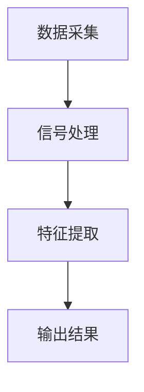
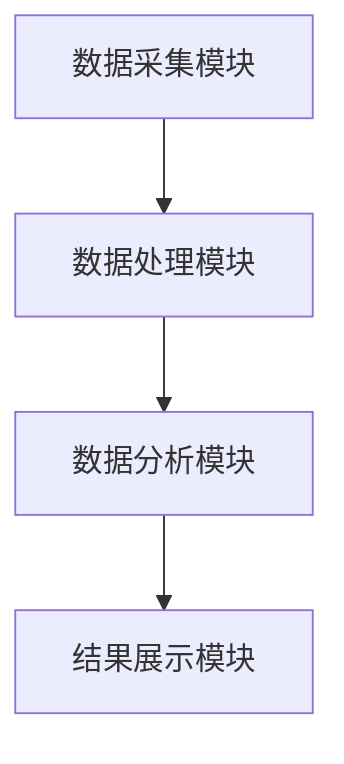

                 


# 全球股市估值与脑机接口技术的伦理考量

> 关键词：全球股市估值，脑机接口，伦理考量，数学模型，系统架构设计

> 摘要：本文探讨了全球股市估值与脑机接口技术的伦理问题，分析了脑机接口技术在金融领域的应用潜力，构建了结合脑机接口的股市估值系统，并提出了相关的伦理考量和系统设计。

---

## 第一章：全球股市估值概述

### 1.1 股市估值的定义与重要性

股市估值是指对股票内在价值的评估，是投资者进行投资决策的重要依据。准确的估值有助于识别被低估或高估的股票，从而优化投资组合。全球股市估值受到多种因素的影响，包括宏观经济指标、公司财务状况和市场情绪等。

#### 核心概念与联系

| 核心概念 | 定义 | 联系 |
|----------|------|------|
| 市盈率 (P/E) | 每股价格与每股收益的比值 | 用于衡量股票的相对价值 |
| 市净率 (P/B) | 每股价格与每股净资产的比值 | 适用于评估资产密集型企业的价值 |
| 股息率 | 每股股息与股价的比值 | 用于评估股票的分红能力 |

**ER 实体关系图**

```mermaid
entity 股票 {
  每股价格
  每股收益
  每股净资产
  每股股息
}
```

### 1.2 股市估值的核心方法

#### 1.2.1 市盈率（P/E）法

市盈率是衡量股票价值的重要指标，公式为：

$$ P/E = \frac{股票价格}{每股收益} $$

例如，若一只股票的价格为50元，每股收益为5元，则市盈率为10倍。

#### 1.2.2 市净率（P/B）法

市净率适用于评估资产密集型企业，公式为：

$$ P/B = \frac{股票价格}{每股净资产} $$

#### 1.2.3 股息率法

股息率公式为：

$$ 股息率 = \frac{每股股息}{股票价格} $$

### 1.3 影响股市估值的主要因素

影响股市估值的因素包括宏观经济指标（如GDP增长率）、公司财务状况（如盈利能力）和市场情绪（如投资者信心）。

---

## 第二章：脑机接口技术概述

### 2.1 脑机接口技术的基本原理

脑机接口（BCI）通过采集和分析神经信号，实现人与计算机的直接交互。其工作原理包括数据采集、信号处理和特征提取三个阶段。

#### 核心概念与联系

| 技术类型 | 定义 | 优缺点 |
|----------|------|--------|
| 非侵入式 | 使用EEG等技术，无需手术 | 精度较低，但安全性高 |
| 侵入式 | 植入电极，直接采集神经信号 | 精度高，但手术风险大 |

**算法流程图**



### 2.2 脑机接口在金融领域的应用潜力

脑机接口技术在金融领域的潜在应用包括情绪分析和交易决策支持。通过分析投资者的情绪，可以预测市场走势。

---

## 第三章：脑机接口与股市数据采集

### 3.1 脑机接口在数据采集中的作用

脑机接口可以通过采集投资者的神经信号，分析其情绪状态，从而辅助股市数据的采集和分析。

#### 数学模型

使用回归分析模型预测市场情绪：

$$ 情绪指数 = \beta_0 + \beta_1 \times EEG信号 + \epsilon $$

---

## 第四章：伦理考量

### 4.1 隐私与数据安全

脑机接口技术涉及个人隐私数据的采集和处理，必须确保数据的安全性。

### 4.2 责任归属

在使用脑机接口技术进行交易时，需明确责任归属，避免法律纠纷。

### 4.3 公平性

确保所有投资者在技术应用上享有平等的机会，避免市场操纵。

---

## 第五章：系统架构设计

### 5.1 系统功能设计

设计一个结合脑机接口的股市估值系统，包括数据采集、分析和展示模块。

#### 系统架构图



### 5.2 接口设计

系统接口设计包括与脑机接口设备的数据接口和用户界面的交互接口。

---

## 第六章：实战项目

### 6.1 环境安装

安装必要的开发工具和脑机接口设备驱动。

### 6.2 核心代码实现

实现数据采集和分析的Python代码：

```python
import numpy as np

def calculate_emotion(eeg_data):
    # 数据预处理
    filtered_data = np.fft.fft(eeg_data)
    # 特征提取
    features = np.abs(filtered_data)
    # 情绪预测
    model = np.load('emotion_model.npy')
    emotion_score = model.predict(features)
    return emotion_score
```

### 6.3 案例分析

通过实际案例分析，评估系统的准确性和可靠性。

---

## 结论

本文探讨了全球股市估值与脑机接口技术的伦理问题，构建了一个结合脑机接口的股市估值系统，并提出了伦理考量和系统设计的最佳实践。

---

**作者：AI天才研究院/AI Genius Institute & 禅与计算机程序设计艺术 /Zen And The Art of Computer Programming**

