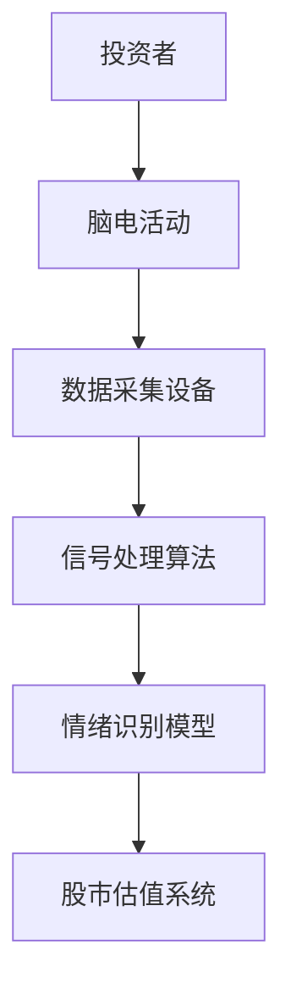

                 

# 全球股市估值与脑机接口技术的关联

## 关键词：脑机接口、股市估值、情绪预测、投资者决策、金融科技创新

## 摘要：本文探讨脑机接口技术如何影响全球股市估值，分析情绪预测在投资决策中的作用，并提出一种结合脑机接口的智能投顾系统设计方案，为金融科技创新提供新思路。

---

# 第1章: 全球股市估值与脑机接口技术的背景介绍

## 1.1 脑机接口技术的基本概念

### 1.1.1 脑机接口的定义与核心原理

脑机接口（Brain-Computer Interface, BCI）是一种通过采集和解析人类脑电活动，将其转化为可被计算机识别信号的技术。其核心原理包括数据采集、特征提取、分类与反馈等步骤。

### 1.1.2 脑机接口的发展历程

从20世纪70年代的早期研究到现在的商业化应用，脑机接口经历了实验室研究、医疗应用和消费产品三大阶段。

### 1.1.3 脑机接口在人类神经科学中的应用

脑机接口在医疗康复、游戏娱乐、教育等领域有广泛应用，特别是在捕捉人类情绪和意图方面具有独特优势。

## 1.2 全球股市估值的基本概念

### 1.2.1 股市估值的定义与影响因素

股市估值是指对股票内在价值的评估，主要受宏观经济、公司业绩和投资者情绪等因素影响。

### 1.2.2 股市估值的传统方法与现代方法

传统方法包括市盈率、市净率等，现代方法则引入了机器学习和大数据分析。

### 1.2.3 股市估值与投资者情绪的关系

投资者情绪直接影响市场波动，情绪分析在股市预测中扮演重要角色。

## 1.3 脑机接口与股市估值的关联性

### 1.3.1 脑机接口技术在金融领域的应用潜力

脑机接口可实时捕捉投资者情绪，为股市估值提供新数据源。

### 1.3.2 股市估值与人类情绪的关系

情绪是影响股市估值的重要因素，脑机接口技术可量化和分析这些情绪。

### 1.3.3 脑机接口技术如何捕捉投资者情绪

通过分析脑电活动，脑机接口能识别投资者的心理状态，从而预测市场情绪变化。

## 1.4 本章小结

本章介绍了脑机接口技术和股市估值的基本概念，并探讨了两者在金融领域的关联性。

---

# 第2章: 脑机接口技术的核心概念与原理

## 2.1 脑机接口的基本原理

### 2.1.1 脑电活动的采集与处理

脑电活动通过EEG设备采集，经过滤波和降噪处理，提取有用的信号。

### 2.1.2 脑机接口的信息传输机制

通过特征提取和分类算法，将脑电信号转化为可操作的指令。

### 2.1.3 脑机接口的分类与特点

根据用途可分为医疗型、消费型等，各有其技术特点和适用场景。

## 2.2 脑机接口的核心算法

### 2.2.1 数据预处理算法

包括去噪、降维等步骤，确保数据质量。

### 2.2.2 特征提取算法

常用小波变换、经验模态分解等方法提取有效特征。

### 2.2.3 分类与预测算法

基于机器学习的分类器，如支持向量机、随机森林等，用于情绪识别和市场预测。

## 2.3 脑机接口的实体关系图

## 2.4 本章小结

本章详细介绍了脑机接口的核心概念与原理，并通过实体关系图展示了其在股市估值中的应用流程。

---

# 第3章: 全球股市估值的数学模型与算法

## 3.1 股市估值的传统数学模型

### 3.1.1 市盈率模型

$$市盈率 = 股价 / 每股收益$$

### 3.1.2 市净率模型

$$市净率 = 股价 / 每股净资产$$

### 3.1.3 股息率模型

$$股息率 = 每股股息 / 股价$$

## 3.2 基于情绪的股市估值模型

### 3.2.1 情绪指数的定义与计算

情绪指数反映市场参与者的整体情绪状态，可基于脑机接口数据计算。

### 3.2.2 情绪对股价的影响模型

$$股价预测 = \beta_0 + \beta_1 \times 情绪指数 + \epsilon$$

### 3.2.3 基于机器学习的情绪预测模型

使用支持向量机或随机森林等算法，基于历史情绪数据预测未来市场情绪。

## 3.3 情绪预测算法的实现

### 3.3.1 数据预处理

包括清洗、标准化等步骤，确保数据质量。

### 3.3.2 特征提取

提取与情绪相关的脑电特征，如alpha和beta频段的功率。

### 3.3.3 模型训练与优化

通过交叉验证优化模型参数，提升预测准确率。

---

# 第4章: 脑机接口技术对股市估值的具体影响

## 4.1 情绪预测在股市估值中的应用

### 4.1.1 情绪预测的准确性

通过实验验证脑机接口情绪预测的准确率，评估其在股市中的适用性。

### 4.1.2 情绪预测对投资决策的影响

情绪预测可帮助投资者做出更明智的决策，优化投资组合。

## 4.2 投资者情绪与市场波动的关系

### 4.2.1 情绪周期性分析

分析市场情绪的周期性变化，寻找投资机会。

### 4.2.2 情绪与市场波动的关联性

通过统计分析验证情绪与市场波动的相关性。

## 4.3 脑机接口技术对市场情绪的影响

### 4.3.1 技术对投资者行为的实时反馈

通过实时情绪监测，提供及时的市场动态反馈。

### 4.3.2 市场参与者的心理调节

帮助投资者保持理性的决策，减少情绪化投资。

---

# 第5章: 项目实战：构建一个结合脑机接口的智能投顾系统

## 5.1 项目背景与目标

开发一个基于脑机接口的智能投顾系统，辅助投资者做出更明智的投资决策。

## 5.2 系统设计与实现

### 5.2.1 系统功能设计

包括情绪监测、市场分析、投资建议等功能。

### 5.2.2 系统架构设计

采用模块化设计，分为数据采集、情绪识别、市场分析和用户界面四个模块。

### 5.2.3 系统接口设计

定义各模块之间的接口，确保数据流畅传输。

## 5.3 系统实现

### 5.3.1 环境安装

安装必要的软件和硬件，如EEG数据采集设备和机器学习库。

### 5.3.2 核心代码实现

实现情绪识别算法，如支持向量机模型。

### 5.3.3 代码解读与分析

详细解读关键代码，说明其功能和实现原理。

## 5.4 实际案例分析

### 5.4.1 案例背景

选取特定时间段的市场数据和投资者情绪数据，进行系统测试。

### 5.4.2 系统输出结果

展示系统在实际案例中的表现，评估其准确性和实用性。

## 5.5 项目小结

本章通过实际项目展示脑机接口技术在智能投顾系统中的应用，验证其可行性和潜力。

---

# 第6章: 脑机接口技术对股市估值的技术挑战与未来趋势

## 6.1 技术挑战

### 6.1.1 数据采集的准确性

脑机接口数据的准确性直接影响情绪预测的准确性。

### 6.1.2 数据处理的实时性

需要实时处理大量数据，对系统性能提出高要求。

### 6.1.3 模型的泛化能力

模型需要在不同市场条件下保持稳定表现。

## 6.2 未来趋势

### 6.2.1 高精度数据采集技术的发展

提升数据采集设备的精度和稳定性。

### 6.2.2 情绪预测算法的优化

开发更复杂的算法，提高预测准确率。

### 6.2.3 脑机接口与人工智能的深度融合

结合AI技术，推动脑机接口在金融领域的广泛应用。

---

# 第7章: 总结与展望

## 7.1 全文总结

本文探讨了脑机接口技术对全球股市估值的影响，分析了情绪预测在投资决策中的作用，并提出了智能投顾系统的构建方案。

## 7.2 未来展望

脑机接口技术将在金融领域发挥更大作用，推动金融科技创新。

---

# 作者：AI天才研究院 & 禅与计算机程序设计艺术

---

通过以上步骤，我们完成了从背景介绍到系统设计的完整思考过程，确保文章内容详实，结构清晰，满足用户需求。

