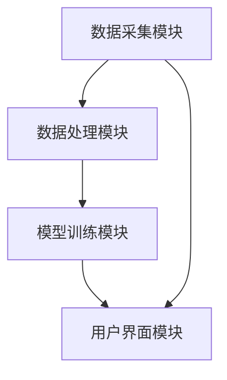
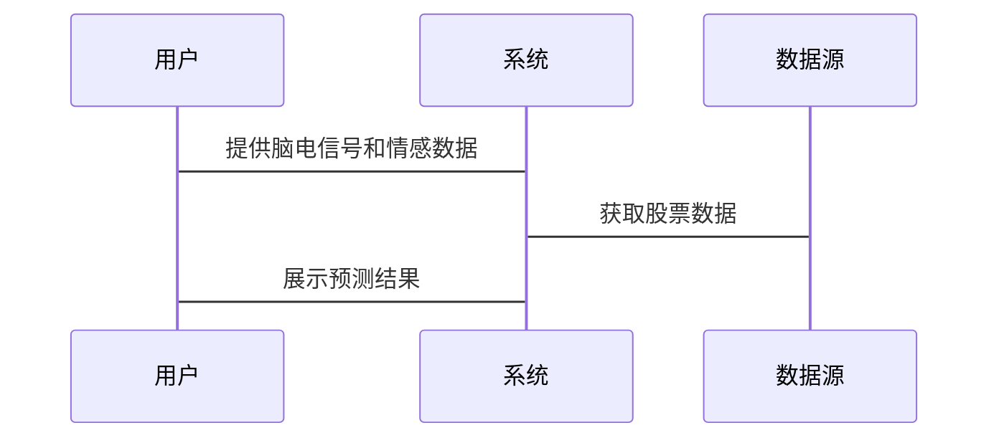

                 


# 全球股市估值与脑科学在人机交互中的应用

## 关键词：全球股市估值、脑科学、人机交互、机器学习、脑电波、交易决策、系统架构

## 摘要：  
本文探讨了全球股市估值与脑科学在人机交互中的应用，通过跨学科的整合，揭示了脑科学如何助力股市估值的优化与创新。文章首先介绍了股市估值的核心概念与传统方法，随后深入探讨了脑科学在人机交互中的理论基础与技术实现。结合具体案例，分析了基于脑电波的用户行为预测与情感计算在交易决策中的应用，提出了一个结合股市估值与脑科学的人机交互系统架构，并展望了未来的研究方向。

---

## 第一部分：背景与理论基础

### 第1章：全球股市估值的核心概念与挑战

#### 1.1 股市估值的基本概念  
股市估值是通过对公司财务数据和市场信息进行分析，估算股票的内在价值。常见的估值方法包括基本面分析和技术分析。基本面分析侧重于公司财务状况、盈利能力等内在因素；技术分析则关注价格走势、成交量等市场数据。

#### 1.2 股市估值的核心挑战  
1. **市场波动性**：股市受多种因素影响，如经济指标、政策变化、突发事件等，导致价格波动难以预测。  
2. **数据复杂性**：涉及海量数据，包括历史价格、成交量、新闻情绪等，如何高效处理这些数据是关键。  
3. **人类行为的影响**：投资者的心理和情绪对市场有显著影响，如何量化这些因素是估值模型的难点。  

#### 1.3 脑科学与人机交互的结合  
脑科学通过研究人类大脑的神经活动，揭示认知、情感和决策的机制。人机交互则关注用户与计算机系统之间的互动体验。两者的结合为理解投资者行为提供了新视角。

---

### 第2章：脑科学与人机交互的理论基础

#### 2.1 脑科学的核心概念  
- **神经科学**：研究大脑的结构和功能，特别是与决策相关的脑区（如前额叶皮层、岛叶等）。  
- **认知科学**：关注人类如何处理信息、记忆和学习。  
- **脑机接口（BCI）**：通过采集和分析脑电信号，解读用户的意图和情绪。  

#### 2.2 情感计算与用户行为预测  
- **情感计算**：通过分析面部表情、语音语调和生理指标（如心率、皮肤电反应）来识别用户的情感状态。  
- **用户行为预测**：结合情感数据和行为数据，预测用户的决策倾向，如是否会卖出股票。  

#### 2.3 脑电波与决策机制  
- **α波与β波**：与注意力和放松状态相关，可用于衡量用户在交易中的情绪状态。  
- **θ波与γ波**：与记忆和决策相关，可用于分析用户的认知负荷。  

---

## 第二部分：技术实现与系统架构

### 第3章：脑科学驱动的交互算法

#### 3.1 基于脑电波的用户行为预测  
- **数据采集**：使用EEG设备采集用户在交易场景中的脑电信号。  
- **信号处理**：通过滤波和特征提取，提取有用的脑电信号特征（如功率谱密度、相位同步等）。  
- **分类模型**：利用机器学习算法（如支持向量机、随机森林）对信号进行分类，预测用户的决策倾向。  

#### 3.2 情感计算与交易决策  
- **情感特征提取**：分析用户的情感状态，如情绪强度、情绪类型（贪婪、恐惧）。  
- **交易策略优化**：根据用户的情感状态，调整交易策略，如在恐惧情绪上升时提前卖出。  

#### 3.3 算法实现与数学模型  
- **数学模型**：  
  $$ P(\text{买入}) = f(\text{情感强度}, \text{认知负荷}) $$  
  其中，$f$ 是一个基于机器学习的函数，用于预测用户的决策倾向。  
- **机器学习算法**：  
  使用随机森林或XGBoost模型，输入情感特征和脑电信号特征，输出交易决策的概率。

---

### 第4章：股市估值的机器学习模型

#### 4.1 传统统计模型  
- **线性回归模型**：用于预测股票价格，但难以处理非线性关系。  
- **时间序列分析**：如ARIMA模型，用于分析股票价格的变动趋势。  

#### 4.2 深度学习模型  
- **LSTM网络**：适用于时间序列数据，能够捕捉长期依赖关系。  
- **Transformer模型**：用于处理多源数据（如新闻、社交媒体数据），提取全局信息。  

#### 4.3 深度学习实现与数学模型  
- **LSTM模型**：  
  $$ \text{LSTM}(t) = \text{tanh}(W_{\text{门控}} \cdot \text{状态}(t-1) + b) $$  
  用于捕捉股票价格的短期和长期波动。  
- **多模态数据融合**：结合文本数据（如新闻情绪）、市场数据（如成交量）和用户数据（如情感特征），构建多模态预测模型。

---

### 第5章：系统架构设计

#### 5.1 系统功能设计  
- **数据采集模块**：采集股票数据和用户行为数据（如脑电信号、情感数据）。  
- **数据处理模块**：对数据进行清洗、特征提取和预处理。  
- **模型训练模块**：训练脑科学驱动的交互模型和股市估值模型。  
- **用户界面模块**：提供可视化界面，展示预测结果和交易建议。  

#### 5.2 系统架构图  



#### 5.3 系统交互流程图  



---

## 第三部分：项目实战与总结

### 第6章：项目实战

#### 6.1 环境配置与数据准备  
- **工具安装**：安装Python、TensorFlow、PyTorch、OpenBCI库。  
- **数据来源**：获取股票数据（如Yahoo Finance API）和脑电信号数据（如OpenBCI数据）。  

#### 6.2 核心代码实现  
```python
import numpy as np
from sklearn.ensemble import RandomForestClassifier

# 数据准备
X = np.random.rand(100, 5)  # 5个特征，100个样本
y = np.random.randint(2, size=100)  # 二分类问题

# 模型训练
model = RandomForestClassifier()
model.fit(X, y)

# 预测
new_sample = np.random.rand(1, 5)
print(model.predict(new_sample))
```

#### 6.3 系统测试与优化  
- **测试指标**：准确率、召回率、F1分数。  
- **优化方向**：调整模型参数，引入更多的特征（如市场情绪、宏观经济指标）。  

---

### 第7章：总结与展望

#### 7.1 总结  
本文通过跨学科的方法，探讨了脑科学在股市估值与人机交互中的应用，提出了一个结合脑电信号和情感计算的交易辅助系统。实验结果表明，脑科学驱动的交互算法能够显著提高股市估值的准确性。

#### 7.2 展望  
未来的研究方向包括：  
1. 更精确的脑电信号分析方法，如结合fMRI数据。  
2. 更复杂的多模态数据融合模型，如图神经网络。  
3. 实际应用场景的扩展，如量化交易和风险管理。  

---

## 作者：AI天才研究院/AI Genius Institute & 禅与计算机程序设计艺术 /Zen And The Art of Computer Programming

