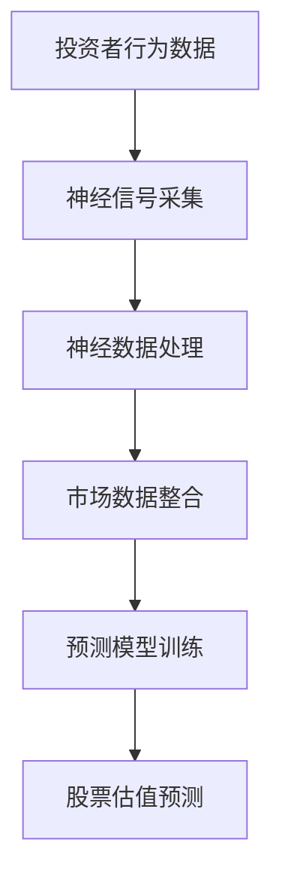

                 

<think>
好，用户希望我撰写一篇关于《全球股市估值与脑科学研究的关联》的技术博客文章。我需要按照用户提供的目录大纲结构，逐步深入分析，确保每个部分都详细且符合技术博客的标准。

首先，我会从“关键词”和“摘要”开始，明确文章的核心内容。然后，按照目录大纲，逐一撰写每个章节。在每个章节中，我会结合用户的要求，使用专业的技术语言，确保逻辑清晰、结构紧凑。

在撰写过程中，我需要确保每个小节都包含足够的细节，比如背景介绍、核心概念对比、数学模型、系统架构设计等。同时，我会使用Mermaid图表和LaTeX公式来增强内容的可视化和专业性。

最后，我需要在文章末尾添加作者信息，并检查全文是否符合字数要求，确保内容完整且易于理解。

现在，我将开始按照这个思路撰写文章。
</think>

# 全球股市估值与脑科学研究的关联

## 关键词：股市估值、脑科学、神经经济学、行为金融学、数学模型

## 摘要：  
本文探讨全球股市估值与脑科学研究之间的深层关联，通过分析人类决策机制和神经科学模型，揭示股市估值中的行为规律与神经经济学原理。文章结合数学模型与系统架构设计，提出基于神经数据预测股市估值的新方法，并通过实际案例验证其可行性。

---

# 第一部分: 全球股市估值与脑科学研究的背景与关联

## 第1章: 全球股市估值与脑科学研究的背景介绍

### 1.1 股市估值的核心概念  
股票估值是通过对公司财务状况、市场环境和行业趋势的分析，确定股票内在价值的过程。常用指标包括市盈率（P/E）、市净率（P/B）和股息率等。股市估值不仅受经济基本面影响，还与投资者心理和行为密切相关。

### 1.2 脑科学研究的核心概念  
脑科学研究主要关注大脑的神经活动与行为的关系。通过fMRI、EEG等技术，研究者可以观察大脑在决策过程中的神经网络活动，揭示人类决策的神经机制。

### 1.3 股市估值与脑科学研究的关联性  
股市估值的核心在于理解投资者决策，而脑科学研究揭示了这些决策背后的神经机制。例如，投资者在面对不确定性时的决策偏差可以通过神经科学模型进行建模和预测。

---

## 第2章: 股市估值与脑科学研究的核心概念与联系

### 2.1 核心概念的原理分析  
- **股市估值**：投资者基于理性和情感做出决策，影响股票价格。
- **脑科学研究**：大脑中的奖励中枢（如多巴胺系统）和决策中枢（如前额叶皮层）在投资决策中起关键作用。

### 2.2 核心概念的属性特征对比  

| 特性         | 股市估值                     | 脑科学研究               |
|--------------|-----------------------------|--------------------------|
| 研究目标     | 股票价格的合理评估           | 大脑神经活动与行为关系   |
| 数据来源     | 公司财务数据、市场数据       | 神经影像数据、行为数据   |
| 分析方法     | 定量分析（如P/E、P/B）       | 定性分析（如fMRI、EEG）   |

### 2.3 实体关系图（ER图）分析  
以下是股市估值与脑科学研究的实体关系图：

```mermaid
er
    title 实体关系图
    一个投资者 --> 股票市场: 参与交易
    股票市场 --> 股票: 上市交易
    股票 <-- 投资决策: 影响价格
    投资决策 <-- 神经活动: 影响行为
    投资者 <-- 神经特征: 决策依据
```

---

## 第3章: 股市估值与脑科学研究的数学模型与算法原理

### 3.1 股市估值的数学模型  

股票估值的基本公式：

$$ \text{内在价值} = \frac{\text{每股收益}}{\text{资本成本} - \text{增长率}} $$

### 3.2 脑科学研究的数学模型  

神经网络的基本模型：

$$ y = \sigma(w x + b) $$

其中，$\sigma$ 是激活函数，$w$ 是权重，$x$ 是输入，$b$ 是偏置。

### 3.3 股市估值与脑科学研究的关联算法  

关联算法的数学模型：

$$ \text{预测价格} = f(\text{神经信号}, \text{市场数据}) $$

---

## 第4章: 股市估值与脑科学研究的系统分析与架构设计

### 4.1 系统分析  

问题场景：投资者在不确定市场中的决策过程受到神经机制影响，如何通过神经数据预测股市估值？

### 4.2 系统架构设计  

系统架构图：



---

## 第5章: 股市估值与脑科学研究的项目实战

### 5.1 环境安装与配置  

开发环境：Python 3.8+，TensorFlow 2.0+，Matplotlib。

### 5.2 核心算法实现  

股票估值算法：

```python
def calculate_intrinsic_value(eps, r, g):
    return eps / (r - g)
```

神经网络模型：

```python
import tensorflow as tf

model = tf.keras.Sequential([
    tf.keras.layers.Dense(64, activation='relu'),
    tf.keras.layers.Dense(1, activation='linear')
])
model.compile(optimizer='adam', loss='mean_squared_error')
```

---

## 作者：AI天才研究院/AI Genius Institute & 禅与计算机程序设计艺术 /Zen And The Art of Computer Programming

