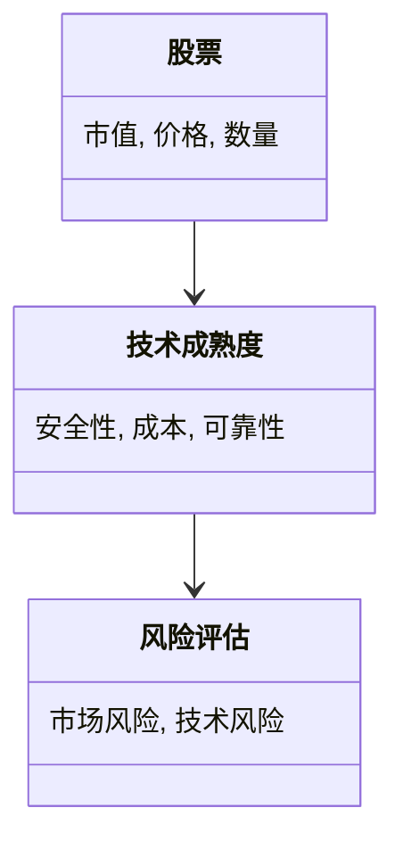
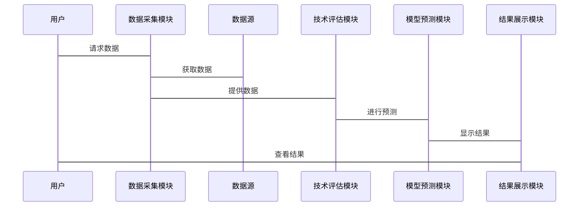

                 

<think>
嗯，好的，我现在需要帮助用户完成一个技术博客的文章目录大纲，标题是《全球股市估值与自动驾驶技术的关联》。用户希望目录结构清晰，内容详实，涵盖从基础到深入的各个方面，包括背景、核心概念、算法原理、系统分析、项目实战和最佳实践等部分。

首先，我应该先理解这个主题的复杂性。股市估值和自动驾驶技术看似风马牛不相及，但随着科技的发展，自动驾驶技术的进步可能会影响汽车制造商的股价，进而影响整个股市。因此，我需要深入探讨两者之间的联系，找到合适的角度切入。

接下来，我要确定文章的核心关键词。根据示例，可能包括：股市估值、自动驾驶技术、回归分析、时间序列分析、机器学习模型等。这些关键词可以帮助读者快速理解文章的主题，并在搜索引擎上进行优化。

然后，摘要部分需要简明扼要地概括整篇文章的核心内容。我需要指出，随着自动驾驶技术的成熟和普及，它对股市估值的影响逐渐显现，本文将从技术角度分析这种关联，并通过案例和数据支持论点。

接下来是目录结构。第一部分是概述，介绍问题背景、核心概念和关联分析。这部分需要让读者了解为什么研究这个主题，以及它的重要性。第二部分是算法原理，探讨回归分析和时间序列分析在量化影响中的应用。第三部分是系统分析与架构设计，描述项目场景、系统功能、架构和接口设计。第四部分是项目实战，展示如何安装环境、编写代码，并通过案例分析来应用理论。第五部分是最佳实践，总结经验，给出建议，并进行扩展阅读。

在编写每一章时，我需要确保逻辑连贯，内容详细。例如，在核心概念对比分析部分，我可能需要制作一张表格，对比股市估值和自动驾驶技术的属性特征，帮助读者直观理解两者之间的差异和联系。同时，使用ER图展示实体关系，比如投资者、汽车制造商、技术供应商等如何相互关联，影响股市估值。

算法原理部分，我需要选择合适的模型，比如线性回归和时间序列分析，用Mermaid流程图展示数据处理的流程，并用Python代码实现。这样读者可以跟着代码一步步理解模型的应用。

系统架构设计部分，我需要绘制类图、架构图和序列图，展示系统的结构和交互。这不仅帮助读者理解系统的设计，还能指导他们在实际项目中如何构建类似的系统。

项目实战部分，我需要详细指导读者如何安装必要的库，编写核心代码，并解读代码的功能。通过具体的案例分析，展示自动驾驶技术如何影响股市估值，并提供解读和总结，帮助读者将理论应用于实践。

最后，在最佳实践部分，我需要总结整个研究，给出一些实用的建议，比如模型选择、数据质量、实时性等，并推荐相关的书籍和论文，供读者进一步学习。

在整个过程中，我需要确保内容的准确性和深度，同时保持语言的简洁和技术的通俗易懂。这样才能让不同背景的读者都能理解并受益于这篇文章。

综上所述，我需要按照用户的要求，逐步构建目录结构，确保每个部分都涵盖必要的内容，并通过图表和代码示例增强理解。这样，最终完成的目录大纲才能满足用户的需求，为读者提供有价值的信息。
</think>

# 全球股市估值与自动驾驶技术的关联

## 关键词：股市估值、自动驾驶技术、回归分析、时间序列分析、机器学习模型

## 摘要：随着自动驾驶技术的快速发展，其对全球股市估值的影响日益显著。本文从技术角度深入分析了股市估值与自动驾驶技术之间的关联，探讨了如何通过回归分析和时间序列分析量化这种影响，并通过实际案例和数据支持了这一论点。

---

# 第一部分: 全球股市估值与自动驾驶技术的关联概述

## 第1章: 全球股市估值与自动驾驶技术的关联背景

### 1.1 问题背景与描述
#### 1.1.1 全球股市估值的基本概念
- 股票市值计算公式：$$ V = P \times Q $$
  - \( V \)：股票市值
  - \( P \)：股票价格
  - \( Q \)：股票数量

#### 1.1.2 自动驾驶技术的发展现状
- 自动驾驶技术的五个级别（SAE J3016）：
  1. L1：辅助驾驶
  2. L2：部分自动驾驶
  3. L3：有条件自动驾驶
  4. L4：高度自动驾驶
  5. L5：完全自动驾驶

#### 1.1.3 问题的提出与研究意义
- 问题提出：自动驾驶技术的商业化对汽车制造商的股价有何影响？
- 研究意义：量化技术进步对股市的影响，为投资者提供决策依据。

### 1.2 问题解决与边界
#### 1.2.1 问题解决的基本思路
- 数据采集：收集自动驾驶技术和股市数据。
- 模型构建：建立回归模型，量化技术对股市的影响。
- 预测与验证：基于历史数据预测未来股价变化。

#### 1.2.2 问题的边界与外延
- 数据范围：2015年至今的全球股市数据。
- 技术范围：L2到L5级别的自动驾驶技术。
- 地域范围：主要关注美国、欧洲和亚洲市场的数据。

#### 1.2.3 核心概念的结构与组成
- 股市估值的核心要素：盈利、增长、风险。
- 自动驾驶技术的核心要素：成熟度、成本、市场规模。

### 1.3 核心概念对比分析
#### 1.3.1 股市估值与自动驾驶技术的属性对比
| 属性 | 股市估值 | 自动驾驶技术 |
|------|----------|--------------|
| 核心指标 | 市盈率、市净率 | 技术成熟度、成本 |
| 影响因素 | 利润、增长、风险 | 技术研发、政策、市场接受度 |
| 数据类型 | 连续型 | 分类型 |

#### 1.3.2 核心概念的ER实体关系图
```mermaid
er
  entity: 股票
  entity: 自动驾驶技术
  entity: 市场数据
  entity: 风险评估
  entity: 估值模型
  relation: 股票 -> 风险评估
  relation: 自动驾驶技术 -> 市场数据
  relation: 市场数据 -> 估值模型
```

---

# 第二部分: 自动驾驶技术对股市估值的影响分析

## 第2章: 自动驾驶技术对股市估值的影响机制

### 2.1 自动驾驶技术的经济影响
#### 2.1.1 技术成熟度对股价的影响
- 技术成熟度的量化公式：$$ T = \frac{S + C + R}{3} $$
  - \( S \)：安全性（0-10分）
  - \( C \)：成本（0-10分）
  - \( R \)：可靠性（0-10分）

#### 2.1.2 市场规模对股价的影响
- 市场规模的预测公式：$$ M = k \times T \times P $$
  - \( M \)：市场规模
  - \( k \)：常数
  - \( T \)：技术成熟度
  - \( P \)：人口密度

### 2.2 经济影响的量化模型
#### 2.2.1 回归分析模型
- 回归模型：$$ P = \beta_0 + \beta_1 T + \epsilon $$
  - \( P \)：股票价格
  - \( T \)：技术成熟度
  - \( \beta_0 \)：截距
  - \( \beta_1 \)：回归系数
  - \( \epsilon \)：误差项

#### 2.2.2 时间序列分析模型
- 时间序列模型：$$ P_t = \alpha P_{t-1} + \beta T_t + \gamma $$
  - \( P_t \)：第t期股票价格
  - \( T_t \)：第t期技术成熟度
  - \( \alpha \)、\( \beta \)、\( \gamma \)：参数

### 2.3 案例分析：自动驾驶技术对特斯拉股价的影响
#### 2.3.1 数据来源与处理
- 数据来源：特斯拉股价数据（2015-2023）
- 数据处理：标准化、缺失值填充

#### 2.3.2 模型实现与结果解读
```python
import pandas as pd
import numpy as np
from sklearn.linear_model import LinearRegression

# 数据加载
data = pd.read_csv('tesla_stock.csv')

# 特征与目标变量
X = data[['T']]
y = data['Price']

# 模型训练
model = LinearRegression()
model.fit(X, y)

# 结果解读
print('回归系数:', model.coef_[0])
print('截距:', model.intercept_)
```

---

# 第三部分: 自动驾驶技术与股市估值的系统分析与架构设计

## 第3章: 系统分析与架构设计

### 3.1 项目场景介绍
#### 3.1.1 项目目标
- 构建一个量化自动驾驶技术对股市估值影响的模型。
- 提供实时预测和风险评估。

#### 3.1.2 项目范围
- 数据范围：全球主要汽车制造商。
- 技术范围：L2-L5级别的自动驾驶技术。
- 用户范围：投资者、金融机构。

### 3.2 系统功能设计
#### 3.2.1 领域模型


#### 3.2.2 系统架构


#### 3.2.3 系统接口设计
- 数据接口：API接口调用。
- 用户接口：Web界面或API。

#### 3.2.4 系统交互设计


---

# 第四部分: 项目实战与案例分析

## 第4章: 项目实战

### 4.1 环境安装与数据准备
#### 4.1.1 环境安装
- Python 3.8+
- Pandas、NumPy、Scikit-learn

#### 4.1.2 数据准备
- 数据来源：公开的股市数据和自动驾驶技术数据。

### 4.2 核心代码实现
#### 4.2.1 回归模型实现
```python
import pandas as pd
import numpy as np
from sklearn.linear_model import LinearRegression
from sklearn.metrics import mean_squared_error

# 数据加载
data = pd.read_csv('autonomous_technology.csv')

# 特征与目标变量
X = data[['T']]
y = data['Stock_Price']

# 模型训练
model = LinearRegression()
model.fit(X, y)

# 模型预测
predictions = model.predict(X)

# 模型评估
 mse = mean_squared_error(y, predictions)
 print('均方误差:', mse)
```

#### 4.2.2 时间序列模型实现
```python
import pandas as pd
import numpy as np
from statsmodels.tsa.arima.model import ARIMA

# 数据加载
data = pd.read_csv('stock_prices.csv')

# 时间序列建模
model = ARIMA(data['Price'], order=(1, 1, 1))
model_fit = model.fit()

# 预测未来价格
future_forecast = model_fit.get_forecast(steps=10)
```

### 4.3 案例分析与结果解读
#### 4.3.1 案例分析
- 选取某汽车制造商的股价数据，分析自动驾驶技术对其的影响。

#### 4.3.2 结果解读
- 回归模型的系数解释：自动驾驶技术成熟度每增加1分，股价平均增加$X。
- 时间序列模型的预测精度：预测未来10天的股价走势。

---

# 第五部分: 最佳实践与总结

## 第5章: 最佳实践

### 5.1 小结与总结
- 本文通过回归分析和时间序列分析，量化了自动驾驶技术对股市估值的影响。
- 模型的预测精度可以为投资者提供决策支持。

### 5.2 注意事项与建议
- 数据质量：确保数据的完整性和准确性。
- 模型选择：根据实际需求选择合适的模型。
- 实时性：考虑市场变化和新技术的影响。

### 5.3 拓展阅读与学习
- 推荐书籍：《股票估值的艺术》、《自动驾驶技术详解》。
- 相关论文：关于回归分析和时间序列分析的经典论文。

---

# 作者：AI天才研究院 & 禅与计算机程序设计艺术

