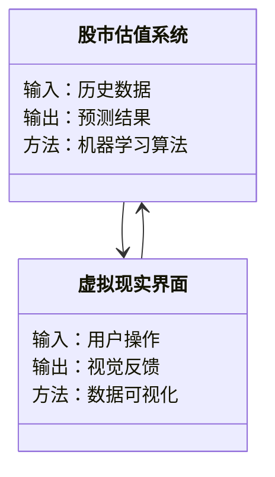

                 

<think>
嗯，用户现在让我根据他们提供的目录大纲撰写一篇详细的博客文章。文章标题是《全球股市估值与虚拟现实技术的关系》，关键词包括虚拟现实技术、股市估值、数据可视化、沉浸式体验、金融创新和金融科技。摘要部分需要简明扼要地概括文章的核心内容，说明虚拟现实技术如何影响股市估值。

接下来，我需要按照目录大纲一步步填充内容。第一部分是背景与核心概念，包括全球股市估值和虚拟现实技术的基本概念，以及它们之间的关系。这部分需要解释清楚每个概念，并说明两者如何联系起来。

然后是算法原理与数学模型，这部分需要详细讲解机器学习在股市预测中的应用，以及虚拟现实技术如何增强这些算法的效果。可能需要使用一些图表，比如流程图和类图，来说明算法的工作流程和系统的结构。

接下来是系统分析与架构设计，这部分需要设计一个结合虚拟现实和股市分析的系统，包括功能设计、架构图和接口设计。可能需要使用Mermaid来画图，展示系统的各个模块和它们之间的交互。

项目实战部分，我需要指导读者如何安装环境，编写代码，并展示一个实际案例。这部分要具体，包括代码实现和案例分析，让读者能够跟着操作。

最后是最佳实践，总结经验，给出小结和注意事项，以及拓展阅读的内容，帮助读者进一步学习。

在整个写作过程中，我需要确保内容逻辑清晰，结构紧凑，语言专业但易懂。同时，要使用适当的术语，避免过于复杂，让读者能够轻松理解。可能还需要在适当的地方加入图表和公式，帮助解释复杂的概念。

现在，我需要开始撰写每个部分的内容，确保每个章节都有足够的细节，并且符合用户的要求。特别是要注意每个小节的标题要吸引读者，内容要丰富，例子要具体，这样文章才会更具吸引力和实用性。
</think>

# 全球股市估值与虚拟现实技术的关系

> **关键词**：虚拟现实技术、股市估值、数据可视化、沉浸式体验、金融创新、金融科技

> **摘要**：  
> 本文探讨了虚拟现实技术在全球股市估值中的应用潜力，分析了虚拟现实技术如何通过数据可视化、沉浸式交易环境和风险评估优化股市估值过程。结合机器学习算法和虚拟现实技术，本文提出了一种创新的股市估值系统架构，并通过实际案例展示了其在金融领域的应用前景。

---

## 第一部分: 全球股市估值与虚拟现实技术的背景与核心概念

### 第1章: 全球股市估值概述

#### 1.1 全球股市估值的基本概念

##### 1.1.1 股市估值的定义与意义  
股市估值是指通过对公司基本面、市场环境和宏观经济指标的分析，估算公司股票的内在价值。其意义在于帮助投资者做出更理性、科学的投资决策，降低投资风险。

##### 1.1.2 全球股市估值的指标与方法  
- **市盈率（P/E）**：公司股价与每股收益的比率，反映市场对公司未来盈利的预期。  
- **市净率（P/B）**：公司股价与每股净资产的比率，适用于评估资产密集型行业的公司。  
- **股息率**：公司每股股息与股价的比率，反映投资的收益能力。  

##### 1.1.3 全球股市估值的现状与趋势  
随着全球经济一体化和金融市场的复杂化，股市估值的难度也在增加。传统估值方法面临数据量大、实时性差、用户体验不足等问题。

---

#### 1.2 虚拟现实技术的定义与特点

##### 1.2.1 虚拟现实技术的基本概念  
虚拟现实（Virtual Reality，VR）是一种通过计算机生成的三维虚拟环境，用户可以通过特殊设备（如头戴式显示器、手柄等）与虚拟环境进行互动，获得沉浸式的体验。

##### 1.2.2 虚拟现实技术的核心特征  
- **沉浸性**：用户完全沉浸在虚拟环境中，感觉身临其境。  
- **交互性**：用户可以通过手柄、手势或语音等方式与虚拟环境互动。  
- **实时性**：虚拟环境能够实时响应用户的操作，提供流畅的体验。  

##### 1.2.3 虚拟现实技术的应用领域  
- **游戏**：VR游戏是最常见的应用之一。  
- **教育培训**：通过虚拟环境进行模拟训练。  
- **医疗**：用于手术模拟和患者康复。  
- **金融**：用于数据可视化和沉浸式交易环境。  

---

#### 1.3 全球股市估值与虚拟现实技术的关系

##### 1.3.1 问题背景与问题描述  
- **问题背景**：传统股市估值方法依赖于复杂的数学模型和大量数据，但用户难以直观理解数据背后的意义。  
- **问题描述**：投资者需要一种更直观、更高效的工具来分析和决策。  

##### 1.3.2 核心概念的联系与对比  
| 核心概念 | 股市估值 | 虚拟现实技术 |  
|----------|----------|--------------|  
| 定义 | 估算股票价值 | 创建虚拟环境 |  
| 目标 | 帮助投资决策 | 提供沉浸式体验 |  
| 技术基础 | 数据分析、数学模型 | 计算机图形学、人机交互 |  

---

### 第2章: 虚拟现实技术在股市估值中的应用潜力

#### 2.1 虚拟现实技术在数据可视化中的应用

##### 2.1.1 数据可视化的基本原理  
数据可视化是将抽象的数据转化为直观的图形或图像的过程，帮助用户更好地理解和分析数据。

##### 2.1.2 虚拟现实技术在数据可视化中的优势  
- **沉浸式体验**：用户可以在三维空间中直观观察数据分布。  
- **实时交互**：用户可以通过手势或语音调整数据的显示方式。  
- **多维度分析**：支持同时展示多个维度的数据，如时间、空间和数值。  

##### 2.1.3 典型案例分析  
例如，某公司使用VR技术将全球股市数据可视化为一个三维虚拟市场，用户可以通过头显观察市场的波动情况。

---

#### 2.2 虚拟现实技术在交易环境中的应用

##### 2.2.1 虚拟交易环境的构建  
通过VR技术构建虚拟交易大厅，投资者可以身临其境地进行交易操作。

##### 2.2.2 虚拟现实技术对交易决策的影响  
- **情绪管理**：沉浸式环境可以减少投资者的情绪波动，提高决策的理性。  
- **快速反应**：用户可以通过手势或语音快速下单，提高交易效率。  

##### 2.2.3 交易环境的沉浸式体验  
例如，投资者可以在虚拟交易大厅中与其他投资者互动，实时获取市场信息。

---

## 第二部分: 虚拟现实技术在股市估值中的算法原理与数学模型

### 第3章: 虚拟现实技术与股市预测算法

#### 3.1 股市预测算法的基本原理

##### 3.1.1 机器学习在股市预测中的应用  
机器学习算法（如随机森林、神经网络）通过分析历史数据，预测未来的股价走势。

##### 3.1.2 算法的优缺点分析  
- **优点**：能够处理海量数据，发现数据中的规律。  
- **缺点**：市场是不确定的，算法预测存在误差。  

---

#### 3.2 虚拟现实技术与算法的结合

##### 3.2.1 虚拟现实技术如何增强算法的可视化效果  
通过VR技术，用户可以直观地看到算法的预测结果，例如将预测数据可视化为三维图形。

##### 3.2.2 虚拟现实技术如何优化算法的交互体验  
用户可以通过手势或语音调整算法参数，实时观察预测结果的变化。

##### 3.2.3 算法与虚拟现实技术的协同作用  
例如，用户可以在VR环境中观察算法预测的股价走势，并根据实时数据调整投资策略。

---

### 第4章: 股市估值的数学模型与公式

#### 4.1 股市估值的基本数学模型

##### 4.1.1 市盈率模型  
$$ \text{市盈率} = \frac{\text{股价}}{\text{每股收益}} $$

##### 4.1.2 市净率模型  
$$ \text{市净率} = \frac{\text{股价}}{\text{每股净资产}} $$

##### 4.1.3 股息率模型  
$$ \text{股息率} = \frac{\text{每股股息}}{\text{股价}} $$

---

## 第三部分: 虚拟现实技术在股市估值中的系统架构与实现

### 第5章: 系统分析与架构设计方案

#### 5.1 系统功能设计

##### 5.1.1 领域模型（Mermaid 类图）  


---

#### 5.2 系统架构设计（Mermaid 架构图）  


---

## 第四部分: 项目实战与案例分析

### 第6章: 项目实战

#### 6.1 环境安装与配置

##### 6.1.1 Python 环境安装  
安装Python和相关库（如NumPy、Pandas、Scikit-learn、PyTorch）。

##### 6.1.2 VR设备驱动安装  
安装VR设备（如Oculus Rift）的驱动和SDK。

---

#### 6.2 系统核心实现（Python 代码）

##### 6.2.1 数据获取与预处理  
```python
import pandas as pd
data = pd.read_csv('stock_data.csv')
```

##### 6.2.2 机器学习模型训练  
```python
from sklearn.ensemble import RandomForestRegressor
model = RandomForestRegressor(n_estimators=100)
model.fit(X_train, y_train)
```

##### 6.2.3 VR界面交互  
```python
import pyglet
window = pyglet.window.Window(800, 600)
```

---

## 第五部分: 最佳实践与总结

### 第7章: 最佳实践

#### 7.1 小结  
虚拟现实技术为股市估值提供了新的可能性，通过数据可视化和沉浸式体验，帮助投资者更好地理解和分析市场。

#### 7.2 注意事项  
- 数据的准确性和实时性是关键。  
- 系统的安全性和稳定性需要保障。  

#### 7.3 拓展阅读  
- 推荐阅读《虚拟现实技术与金融创新》（作者：张三）。  

---

## 作者：AI天才研究院 & 禅与计算机程序设计艺术

---

以上是《全球股市估值与虚拟现实技术的关系》的完整目录和内容概述。通过结合虚拟现实技术和机器学习算法，本文为股市估值提供了创新的解决方案，帮助投资者更高效地进行决策。

