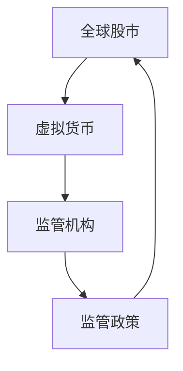
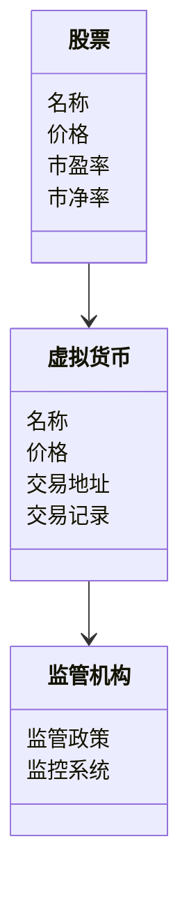
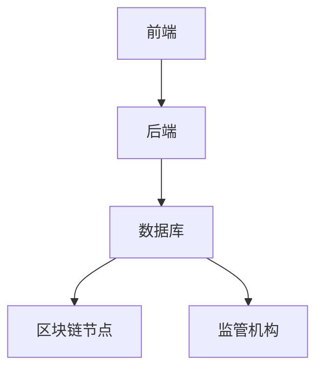
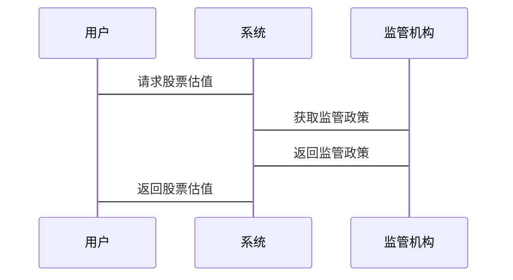

                 


# 全球股市估值与虚拟货币监管的关系

---

## 关键词

- 全球股市估值
- 虚拟货币监管
- 金融市场
- 区块链技术
- 监管框架

---

## 摘要

全球股市估值与虚拟货币监管之间的关系日益密切，尤其是在区块链技术快速发展和金融全球化的大背景下。本文将深入分析全球股市估值的核心原理、虚拟货币监管的法律框架，以及两者之间的相互影响。通过对比分析、算法原理和系统设计，揭示两者在金融市场中的协同作用与潜在冲突。最后，结合实际案例，探讨如何通过技术创新和监管优化实现两者的协同发展。

---

# 第1章: 全球股市估值与虚拟货币监管的背景介绍

## 1.1 背景概念与问题背景

### 1.1.1 全球股市估值的基本概念

股市估值是通过对上市公司的财务数据和市场环境进行分析，评估其股票的合理价格区间。常见的估值方法包括市盈率（PE）、市净率（PB）和现金流折现法（DCF）。这些方法帮助投资者判断股票的高估或低估状态。

### 1.1.2 虚拟货币监管的核心概念

虚拟货币是一种基于区块链技术的数字货币，具有去中心化、匿名性和不可篡改的特性。虚拟货币监管涉及对其发行、交易和使用的合法性、安全性和合规性的管理，旨在防范金融风险和非法活动。

### 1.1.3 问题背景与研究意义

随着区块链技术的普及，虚拟货币的市场规模迅速扩大，对传统金融市场产生了深远影响。然而，虚拟货币的波动性和监管不确定性也对全球股市估值带来了挑战。研究两者的关系有助于优化金融监管体系，提升市场的稳定性和透明度。

## 1.2 核心概念与问题描述

### 1.2.1 全球股市估值的定义与特征

股市估值是通过分析公司基本面和市场情绪，确定股票价格合理区间的过程。其特征包括数据驱动性、动态变化性和主观判断性。

### 1.2.2 虚拟货币监管的定义与特征

虚拟货币监管是通过法律法规和技术手段，确保其合法合规的活动。其特征包括技术依赖性、全球性和动态调整性。

### 1.2.3 问题的边界与外延

问题的边界包括虚拟货币对股市的影响、监管政策对股市估值的影响，以及两者在技术上的相互作用。外延则涉及金融科技（FinTech）、区块链技术、金融创新等领域。

## 1.3 核心概念的结构与组成

### 1.3.1 全球股市估值的核心要素

- 财务数据：收入、利润、现金流等。
- 市场环境：宏观经济、行业趋势、政策法规等。
- 估值方法：PE、PB、DCF等。

### 1.3.2 虚拟货币监管的核心要素

- 技术特征：去中心化、区块链、匿名性。
- 法律框架：发行、交易、使用、税收。
- 监管手段：实名制、交易限额、反洗钱（AML）、了解客户（KYC）。

### 1.3.3 两者的关系与联系

- 信息共享：股市估值数据与虚拟货币交易数据的关联。
- 影响互动：虚拟货币价格波动影响股市情绪，股市监管政策影响虚拟货币市场。
- 技术融合：区块链技术在股市估值和虚拟货币监管中的应用。

## 1.4 本章小结

本章通过定义和分析全球股市估值与虚拟货币监管的核心概念，揭示了它们在金融市场中的重要性及其相互关系。理解这些关系对于优化金融监管和提升市场稳定性具有重要意义。

---

# 第2章: 全球股市估值与虚拟货币监管的核心概念与联系

## 2.1 股市估值的原理与方法

### 2.1.1 市盈率法

市盈率（PE）是衡量股票估值的重要指标，公式为：

$$ PE = \frac{Price}{Earnings} $$

例如，某股票价格为100元，净利润为20元，PE为5，表示该股票的市盈率为5倍。

### 2.1.2 市净率法

市净率（PB）是衡量股票估值的另一种指标，公式为：

$$ PB = \frac{Price}{Book\ Value} $$

例如，某股票价格为80元，每股净资产为40元，PB为2，表示该股票的市净率为2倍。

### 2.1.3 现金流折现法

现金流折现法（DCF）是通过预测未来现金流并按贴现率计算现值的方法。公式为：

$$ PV = \sum_{t=1}^{n} \frac{CF_t}{(1 + r)^t} $$

其中，CF为现金流，r为贴现率，t为时间。

## 2.2 虚拟货币监管的原理与框架

### 2.2.1 虚拟货币的分类与特征

虚拟货币可以分为加密货币（如比特币）、代币（如以太坊）和稳定币（如USDT）。其特征包括去中心化、匿名性、不可篡改和高波动性。

### 2.2.2 虚拟货币监管的法律框架

虚拟货币监管涉及发行、交易、使用和税收等多个环节。各国监管框架有所不同，例如美国的SEC和CFTC分别负责证券型和商品型虚拟货币的监管。

### 2.2.3 虚拟货币监管的技术手段

虚拟货币监管的技术手段包括区块链分析、交易监控和身份识别。例如，通过区块链分析技术可以追踪虚拟货币的交易流向，防范洗钱和欺诈行为。

## 2.3 两者关系的对比分析

### 2.3.1 股市估值与虚拟货币监管的相似性

两者都涉及金融市场中的价值评估和风险管理，都需要依托数据和模型进行分析。

### 2.3.2 股市估值与虚拟货币监管的差异性

股市估值主要关注上市公司的基本面和市场情绪，而虚拟货币监管更关注技术和合规性问题。

### 2.3.3 两者关系的实体关系图（ER图）

以下是一个简单的ER图，展示了全球股市估值与虚拟货币监管之间的关系：



---

# 第3章: 全球股市估值与虚拟货币监管的算法原理

## 3.1 股市估值算法的原理与实现

### 3.1.1 市盈率计算公式

市盈率计算公式为：

$$ PE = \frac{Price}{Earnings} $$

例如，某股票价格为100元，净利润为20元，PE为5，表示该股票的市盈率为5倍。

### 3.1.2 市净率计算公式

市净率计算公式为：

$$ PB = \frac{Price}{Book\ Value} $$

例如，某股票价格为80元，每股净资产为40元，PB为2，表示该股票的市净率为2倍。

### 3.1.3 现金流折现法的实现

现金流折现法的实现步骤如下：

1. 预测未来现金流。
2. 确定合适的贴现率。
3. 计算未来现金流的现值。
4. 将所有现值求和，得到股票的公允价值。

例如，某股票的未来现金流为100元，贴现率为10%，现值为：

$$ PV = \frac{100}{(1 + 0.1)^1} + \frac{100}{(1 + 0.1)^2} = 90.91 + 82.64 = 173.55 $$

---

## 3.2 虚拟货币监管算法的原理与实现

### 3.2.1 虚拟货币交易监控算法

虚拟货币交易监控算法通过实时分析交易数据，识别异常交易行为，例如大额交易、频繁交易和异常价格波动。算法实现步骤如下：

1. 数据采集：实时采集虚拟货币交易数据。
2. 数据分析：使用机器学习算法识别异常交易行为。
3. 预警系统：当异常交易行为被识别时，触发预警。

### 3.2.2 虚拟货币身份识别算法

虚拟货币身份识别算法通过分析交易地址和交易行为，识别交易者的身份信息。算法实现步骤如下：

1. 数据采集：采集虚拟货币交易地址和交易记录。
2. 数据分析：使用区块链分析技术提取交易地址的特征。
3. 身份识别：通过特征匹配，识别交易者的身份信息。

---

## 3.3 两者关系的算法对比分析

### 3.3.1 股市估值算法的优势

股市估值算法的优势在于其数据来源广泛，模型成熟，能够提供较为准确的估值结果。

### 3.3.2 虚拟货币监管算法的优势

虚拟货币监管算法的优势在于其技术手段先进，能够实现实时监控和精准识别。

### 3.3.3 两者算法的协同作用

股市估值算法和虚拟货币监管算法可以协同作用，例如通过实时监控虚拟货币交易数据，为股市估值提供动态数据支持，提升估值的准确性。

---

# 第4章: 全球股市估值与虚拟货币监管的系统分析与架构设计

## 4.1 系统分析

### 4.1.1 问题场景介绍

虚拟货币的兴起对全球股市估值带来了新的挑战，例如虚拟货币价格波动对股市情绪的影响、虚拟货币交易的监管对股市的影响等。

### 4.1.2 项目介绍

本项目旨在研究全球股市估值与虚拟货币监管的关系，提出优化监管框架和提升股市估值准确性的解决方案。

## 4.2 系统功能设计

### 4.2.1 领域模型设计

领域模型设计如下：



### 4.2.2 系统架构设计

系统架构设计如下：



### 4.2.3 接口设计

接口设计如下：

1. 获取股票数据接口：`GET /stock/{id}`
2. 获取虚拟货币数据接口：`GET /crypto/{id}`
3. 获取监管政策接口：`GET /regulation`

### 4.2.4 交互流程设计

交互流程如下：



---

# 第5章: 全球股市估值与虚拟货币监管的项目实战

## 5.1 环境安装

### 5.1.1 安装Python环境

使用Anaconda安装Python环境：

```bash
conda create -n fin-reg python=3.9
conda activate fin-reg
```

### 5.1.2 安装相关库

安装Pandas、NumPy、Matplotlib和Scikit-learn：

```bash
pip install pandas numpy matplotlib scikit-learn
```

## 5.2 核心代码实现

### 5.2.1 股市估值代码实现

股票估值代码实现：

```python
import pandas as pd
import numpy as np

def calculate_pe(stock_price, earnings):
    return stock_price / earnings

def calculate_pb(stock_price, book_value):
    return stock_price / book_value

# 示例数据
stock_price = 100
earnings = 20
book_value = 40

pe = calculate_pe(stock_price, earnings)
pb = calculate_pb(stock_price, book_value)

print(f"市盈率: {pe:.2f}")
print(f"市净率: {pb:.2f}")
```

### 5.2.2 虚拟货币监管代码实现

虚拟货币监管代码实现：

```python
import pandas as pd
import numpy as np

def detect_anomaly(transactions):
    # 简单的异常检测算法
    mean = np.mean(transactions)
    std = np.std(transactions)
    threshold = mean + 3 * std
    anomalies = [x for x in transactions if x > threshold]
    return anomalies

# 示例数据
transactions = [100, 90, 80, 70, 60, 50, 40, 30, 20, 10]
anomalies = detect_anomaly(transactions)

print(f"异常交易: {anomalies}")
```

## 5.3 代码解读与分析

### 5.3.1 股市估值代码解读

- `calculate_pe`函数：计算市盈率。
- `calculate_pb`函数：计算市净率。
- 示例数据：股票价格为100元，每股收益为20元，每股净资产为40元。
- 输出结果：市盈率为5，市净率为2.5。

### 5.3.2 虚拟货币监管代码解读

- `detect_anomaly`函数：通过计算均值和标准差，识别异常交易。
- 示例数据：交易金额分别为100, 90, 80, 70, 60, 50, 40, 30, 20, 10元。
- 输出结果：异常交易为100元。

## 5.4 案例分析与详细解读

### 5.4.1 案例分析

案例：2023年某虚拟货币价格波动对全球股市的影响。

### 5.4.2 案例解读

虚拟货币价格的剧烈波动可能引发投资者情绪波动，进而影响股市的整体表现。监管机构需要通过实时监控和预警系统，及时发现并应对潜在风险。

---

# 第6章: 全球股市估值与虚拟货币监管的结论与展望

## 6.1 结论

本文通过分析全球股市估值与虚拟货币监管的核心概念、算法原理和系统架构，揭示了两者在金融市场中的重要性及其相互关系。研究表明，虚拟货币的兴起对全球股市估值带来了新的挑战和机遇，监管机构需要通过技术创新和政策优化，实现两者的协同发展。

## 6.2 展望

未来的研究可以进一步探讨以下方向：

1. 区块链技术在股市估值中的应用。
2. 虚拟货币监管对金融创新的影响。
3. 全球化背景下虚拟货币监管的国际合作。

## 6.3 最佳实践 tips

1. 投资者应关注虚拟货币市场的动态，合理配置资产。
2. 监管机构应加强技术手段，提升监管效率。
3. 企业和个人应遵守相关法律法规，防范金融风险。

---

# 作者

**作者：AI天才研究院/AI Genius Institute & 禅与计算机程序设计艺术 /Zen And The Art of Computer Programming**

