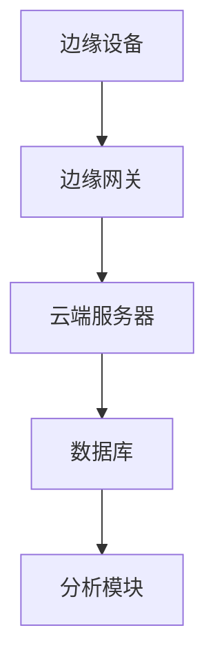
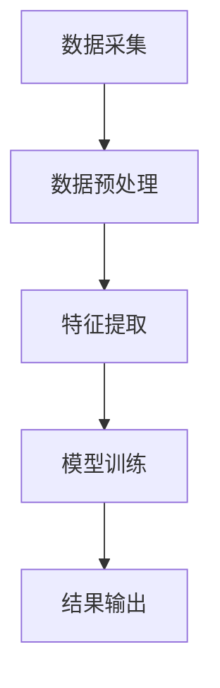

                 

<think>
好的，我现在需要根据用户的要求来撰写一篇关于《全球股市估值与边缘计算在智能制造中的应用》的技术博客文章。用户已经给出了一个详细的目录大纲，并且强调了每个部分需要满足特定的格式和内容要求。我需要确保文章结构清晰，内容详实，并且符合技术博客的风格。

首先，我会从背景介绍开始，解释全球股市估值和边缘计算在智能制造中的重要性。然后，我会分别详细探讨边缘计算和全球股市估值的核心概念、技术原理和应用场景。接下来，我会结合两者，分析边缘计算如何优化全球股市估值在智能制造中的应用。最后，我会总结全文，并提出一些最佳实践和未来的研究方向。

在写作过程中，我会使用Mermaid图来展示系统的架构、算法流程和实体关系。同时，我会使用数学公式和代码示例来详细解释相关原理和实现细节。为了确保文章的深度和可读性，我会在每个部分中加入具体的案例分析和实际应用，帮助读者更好地理解和应用这些技术。

现在，我开始按照目录大纲逐步撰写文章内容。
</think>

# 全球股市估值与边缘计算在智能制造中的应用

## 关键词：边缘计算、智能制造、股市估值、实时数据分析、分布式系统

## 摘要：本文探讨了全球股市估值与边缘计算在智能制造中的应用。通过分析边缘计算的优势，结合智能制造的需求，提出了边缘计算如何优化股市估值的方法，并通过实际案例展示了其在智能制造中的应用。

---

## 第一部分：全球股市估值

### 第1章：全球股市估值概述

#### 1.1 股市估值的基本概念

股市估值是通过对公司财务数据、市场状况和经济指标的分析，确定股票的合理价格。常用方法包括市盈率（P/E）、市净率（P/B）和现金流折现法（DCF）。这些方法帮助投资者判断股票是否被高估或低估。

#### 1.2 常用估值方法

- **市盈率法**：计算公司股价与每股收益的比率。公式为：P/E = 股价 / 每股收益。该方法适用于盈利稳定的公司。
- **市净率法**：计算公司股价与每股净资产的比率。公式为：P/B = 股价 / 每股净资产。该方法适用于净资产较多的公司。
- **现金流折现法**：通过预测未来现金流，折现到现值，计算公司价值。公式为：DCF = Σ (CF_t / (1 + r)^t)，其中CF_t为第t年的现金流，r为折现率。

#### 1.3 全球股市的特点与差异

全球股市因经济体制、法律法规和市场成熟度不同，估值方法和结果差异显著。例如，成熟市场如美国和欧洲股市倾向于使用市盈率法，而新兴市场如中国和印度则可能更关注市净率和现金流。

---

### 第2章：边缘计算的概念与技术

#### 2.1 边缘计算的定义与特点

边缘计算是在靠近数据源的地方进行数据处理和存储，减少了数据传输到云端的延迟。其特点包括低延迟、高实时性和分布式架构。

#### 2.2 边缘计算的架构

边缘计算的架构通常包括边缘设备、边缘网关和云端服务器。数据在边缘设备生成后，通过网关进行处理，必要时上传到云端进行深度分析。

#### 2.3 边缘计算的关键技术

- **数据处理技术**：包括数据清洗、特征提取和模型训练。
- **通信协议**：如MQTT和HTTP，用于设备间的数据传输。

---

## 第二部分：边缘计算在智能制造中的应用

### 第3章：边缘计算在智能制造中的应用

#### 3.1 智能制造的基本概念

智能制造是通过物联网、大数据和人工智能技术，实现生产过程的智能化和自动化。其核心是实时数据分析和决策。

#### 3.2 边缘计算在智能制造中的应用场景

- **实时监控**：通过边缘设备实时采集生产线数据，及时发现和解决问题。
- **预测维护**：利用边缘计算分析设备状态，预测故障，减少停机时间。

---

## 第三部分：全球股市估值与边缘计算的结合

### 第4章：边缘计算优化全球股市估值

#### 4.1 边缘计算如何优化股市估值

边缘计算通过实时处理和分析市场数据，提供更及时和准确的估值结果。例如，利用边缘设备实时采集市场数据，减少延迟，提高估值模型的准确性。

#### 4.2 全球股市估值在智能制造中的应用

通过边缘计算处理生产数据，结合股市估值模型，优化企业资源配置，提高生产效率。

---

### 第5章：系统架构与实现

#### 5.1 系统架构设计

使用Mermaid绘制系统架构图，展示边缘设备、网关和云端服务器的交互流程。



#### 5.2 算法实现

使用Python实现边缘计算的实时数据分析算法，并使用Mermaid流程图展示算法步骤。



代码示例：

```python
import pandas as pd
from sklearn.model import LinearRegression

# 数据预处理
data = pd.read_csv('data.csv')
data_cleaned = data.dropna()

# 特征提取
features = data_cleaned.drop('target', axis=1)
target = data_cleaned['target']

# 模型训练
model = LinearRegression()
model.fit(features, target)

# 预测
predictions = model.predict(features)
```

---

## 第四部分：项目实战

### 第6章：项目实战与案例分析

#### 6.1 项目背景

某制造企业希望利用边缘计算优化生产过程中的数据处理，提高实时监控能力。

#### 6.2 项目实施

- **环境配置**：安装边缘设备和网关，配置数据采集和传输。
- **代码实现**：编写边缘计算模块，处理实时数据，进行预测和分析。

#### 6.3 案例分析

通过实际案例分析，展示边缘计算在智能制造中的具体应用和效果。

---

## 第五部分：总结与展望

### 第7章：总结与展望

#### 7.1 总结

本文探讨了边缘计算在全球股市估值和智能制造中的应用，展示了其在实时数据分析和优化中的巨大潜力。

#### 7.2 展望

未来，随着技术的发展，边缘计算将在更多领域发挥重要作用，推动智能制造的进一步发展。

---

## 作者：AI天才研究院 & 禅与计算机程序设计艺术

---

**结束语**：本文通过详细分析和实际案例，展示了边缘计算在全球股市估值和智能制造中的重要性。希望本文能为相关领域的研究和实践提供有价值的参考。

