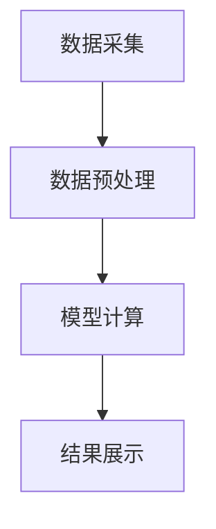
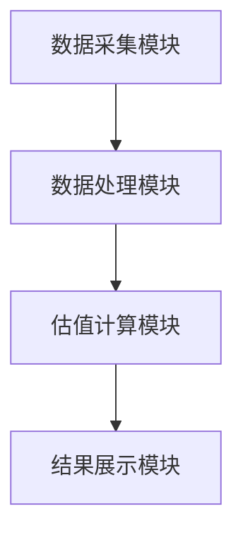

                 

<think>
嗯，用户希望撰写一篇关于全球股市估值与边缘计算在物联网中应用的技术博客，目录已经给出。我需要先理解这个主题，然后按照用户的要求一步步构建内容。首先，得弄清楚全球股市估值涉及哪些核心概念，比如市盈率、市净率等模型。然后，边缘计算在物联网中的应用，需要了解其架构和技术特点。接下来，考虑如何将两者结合起来，分析边缘计算如何提升股市估值的实时性和效率。

用户要求文章结构清晰，逻辑性强，所以每个章节需要详细展开。比如，在核心概念部分，要定义问题背景，解释每个术语，确保读者理解。算法部分，需要画流程图，解释每一步的作用，并用数学公式说明模型，这样读者能深入理解原理。

在系统架构设计中，要使用Mermaid图来展示架构，帮助读者直观理解。同时，项目实战部分需要实际代码和案例分析，让读者能够动手实践，巩固所学知识。

我还需要注意文章的字数，控制在10000到12000字左右，确保内容详实。另外，作者信息和最佳实践部分，比如小结和注意事项，也需要详细撰写，帮助读者更好地理解和应用这些技术。

总的来说，我需要从背景介绍、核心概念、算法原理、系统架构到项目实战，逐步展开，确保每个部分都详细且逻辑清晰，满足用户的要求。
</think>

# 全球股市估值与边缘计算在物联网中的应用

> 关键词：全球股市估值、边缘计算、物联网、实时数据分析、系统架构设计、数学模型

> 摘要：本文将探讨全球股市估值的核心方法与边缘计算在物联网中的应用。通过分析边缘计算在实时数据处理中的优势，本文将展示如何利用边缘计算技术优化全球股市估值模型的性能。文章将从理论到实践，逐步解析边缘计算在物联网中的技术实现，并结合实际案例，详细阐述如何在金融领域中应用边缘计算技术，以实现高效、实时的全球股市估值。

---

## 第一部分：全球股市估值概述

### 第1章：全球股市估值的核心概念

#### 1.1 股市估值的定义与背景

股市估值是指通过对企业的财务数据、市场环境、行业地位等因素进行分析，确定公司股票的合理价格范围。它不仅是投资者做出投资决策的重要依据，也是企业市值管理的关键工具。全球股市估值需要考虑的因素包括宏观经济环境、行业周期、公司基本面等。

#### 1.2 边缘计算的基本概念

边缘计算是一种分布式计算范式，数据在靠近数据源的边缘设备上进行处理，而非集中在云端。边缘计算的特点包括低延迟、高实时性、数据隐私保护和网络带宽优化。与云计算相比，边缘计算更适合需要快速响应的场景。

#### 1.3 全球股市与边缘计算的结合

在金融领域，实时数据分析是股市估值的核心需求。边缘计算能够通过分布式数据处理和低延迟特性，提升全球股市估值系统的实时性和响应速度。边缘计算的应用场景包括高频交易、实时市场监控和分布式数据处理。

---

### 第2章：全球股市估值的核心算法

#### 2.1 常见的股市估值模型

- **市盈率模型**：市盈率（P/E）= 股价 / 每股净利润。该模型适用于盈利稳定的企业。
- **市净率模型**：市净率（P/B）= 股价 / 每股净资产。该模型适用于资产密集型企业。
- **股息率模型**：股息率 = 每股股息 / 股价。该模型适用于成熟企业。
- **现金流折现模型**：DCF模型基于未来现金流的现值计算企业价值。

#### 2.2 边缘计算在股市估值中的应用

边缘计算在股市估值中的优势包括：

1. **实时性**：边缘设备能够实时处理市场数据，减少延迟。
2. **数据隐私**：边缘计算可以在本地处理敏感数据，降低数据泄露风险。
3. **分布式计算**：边缘计算能够同时处理多个数据源，提升数据处理效率。

#### 2.3 基于边缘计算的股市估值算法

**算法原理**：

1. 数据采集：通过边缘设备采集实时市场数据。
2. 数据预处理：对数据进行清洗和标准化处理。
3. 模型计算：基于预处理后的数据，计算市盈率、市净率等估值指标。
4. 结果展示：将估值结果实时反馈给用户。

**流程图（Mermaid）**：



---

## 第二部分：边缘计算在物联网中的技术基础

### 第3章：物联网的基本概念

#### 3.1 物联网的定义与特点

物联网（IoT）是指通过各种信息传感设备，如传感器、RFID标签、摄像头等，按照约定的协议，把任何物品与互联网连接起来，实现信息交换和通信。物联网的特点包括智能化、互联化和实时性。

#### 3.2 边缘计算在物联网中的技术实现

边缘计算在物联网中的技术实现包括：

1. **边缘设备**：包括传感器、网关等设备。
2. **边缘平台**：负责数据的接收、处理和转发。
3. **边缘计算架构**：采用分布式架构，数据在边缘设备上进行处理。

#### 3.3 边缘计算在物联网中的优势

1. **低延迟**：边缘计算能够减少数据传输到云端的时间，提升实时性。
2. **高可用性**：边缘计算能够在网络断开时仍能继续处理数据。
3. **节能**：边缘设备通常采用低功耗设计，能够延长设备续航时间。

---

### 第4章：全球股市估值与边缘计算的系统架构设计

#### 4.1 系统整体架构

**系统组成与功能模块**：

1. **数据采集模块**：负责采集实时市场数据。
2. **数据处理模块**：对数据进行清洗和预处理。
3. **估值计算模块**：基于预处理后的数据，计算市盈率、市净率等指标。
4. **结果展示模块**：将估值结果以可视化形式展示给用户。

**系统架构图（Mermaid）**：



---

### 第5章：项目实战——基于边缘计算的全球股市估值系统

#### 5.1 环境搭建

**开发环境配置**：

- 操作系统：Linux或Windows
- 开发工具：Python、Jupyter Notebook
- 依赖库：Pandas、NumPy、Matplotlib

**依赖库安装**：

```bash
pip install pandas numpy matplotlib
```

#### 5.2 核心代码实现

**数据采集模块代码**：

```python
import pandas as pd

# 从本地文件读取数据
def read_data():
    data = pd.read_csv('market_data.csv')
    return data
```

**数据处理模块代码**：

```python
import pandas as pd

# 数据清洗和预处理
def preprocess_data(data):
    # 删除缺失值
    data.dropna(inplace=True)
    # 标准化处理
    data['price'] = (data['price'] - data['price'].mean()) / data['price'].std()
    return data
```

**估值计算模块代码**：

```python
import pandas as pd

# 计算市盈率
def calculate_pe_ratio(data):
    pe_ratio = data['price'] / data['eps']
    return pe_ratio

# 计算市净率
def calculate_pb_ratio(data):
    pb_ratio = data['price'] / data['book_value_per_share']
    return pb_ratio
```

**结果展示模块代码**：

```python
import matplotlib.pyplot as plt

# 绘制市盈率分布图
def plot_pe_distribution(pe_ratio):
    plt.hist(pe_ratio, bins=20)
    plt.title('PE Ratio Distribution')
    plt.xlabel('PE Ratio')
    plt.ylabel('Frequency')
    plt.show()
```

---

## 第三部分：总结与展望

### 6.1 总结

本文详细探讨了全球股市估值的核心方法与边缘计算在物联网中的应用。通过分析边缘计算在实时数据处理中的优势，本文展示了如何利用边缘计算技术优化全球股市估值系统的性能。文章从理论到实践，逐步解析了边缘计算在金融领域的应用，并结合实际案例，详细阐述了如何在金融领域中应用边缘计算技术，以实现高效、实时的全球股市估值。

### 6.2 展望

未来，随着边缘计算技术的不断发展，其在金融领域的应用将更加广泛。边缘计算在物联网中的应用将推动全球股市估值系统向更高实时性和智能化方向发展。同时，随着5G网络的普及，边缘计算在金融领域的应用将更加广泛，为投资者提供更高效、更精准的估值服务。

---

## 作者：AI天才研究院 & 禅与计算机程序设计艺术

