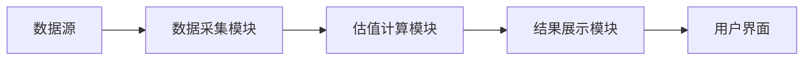

                 

# 全球股市估值与边缘计算在自动驾驶中的应用

## 关键词：
全球股市估值，边缘计算，自动驾驶，人工智能，分布式计算，算法优化

## 摘要：
本文探讨全球股市估值与边缘计算在自动驾驶中的应用。首先，介绍全球股市估值的核心概念，包括市盈率、市净率等关键指标。其次，分析边缘计算在自动驾驶中的应用，涵盖感知、决策和执行技术。最后，探讨两者结合的可能性，通过案例分析展示边缘计算如何优化股市估值，提升自动驾驶的实时性和安全性。

## 第1章: 全球股市估值概述

### 1.1 股市估值的核心概念
股市估值是评估股票内在价值的过程，旨在确定其合理的价格区间。主要方法包括市盈率（P/E）、市净率（P/B）和股息率。这些方法帮助投资者评估股票的吸引力。

### 1.2 股市估值的关键指标
#### 1.2.1 市盈率（P/E）
市盈率=股价/每股收益。例如，若某股股价为20元，每股收益为2元，则市盈率为10倍。

#### 1.2.2 市净率（P/B）
市净率=股价/每股净资产。例如，股价15元，每股净资产5元，则市净率为3倍。

#### 1.2.3 股息率
股息率=每股股息/股价×100%。例如，股息0.5元，股价10元，股息率为5%。

### 1.3 全球股市估值的影响因素
宏观经济因素（如GDP增长率）、行业因素（如科技行业）和公司基本面因素（如利润）均会影响股市估值。

## 第2章: 股市估值的数学模型与公式

### 2.1 常用估值模型概述
市盈率模型用于评估股票的相对价值，市净率模型适用于评估资产丰富的公司，股息率模型适用于高分红股票。

### 2.2 股市估值的数学公式
#### 市盈率公式：
$$P/E = \frac{Price}{Earnings}$$

#### 市净率公式：
$$P/B = \frac{Price}{Book\ Value}$$

#### 股息率公式：
$$Dividend\ Yield = \frac{Dividend}{Price} \times 100\%$$

### 2.3 估值模型的优缺点对比
| 模型 | 优点 | 缺点 |
|------|------|------|
| 市盈率 | 易懂，广泛应用 | 不适用于亏损企业 |
| 市净率 | 适合资产密集型行业 | 忽略收益因素 |
| 股息率 | 适用于高分红企业 | 受市场波动影响大 |

## 第3章: 全球股市估值的系统分析

### 3.1 股市估值系统的功能需求
- 数据采集：收集股票价格、收益等数据。
- 估值计算：应用模型进行估值。
- 结果展示：以图表形式展示结果。

### 3.2 股市估值系统的架构设计

### 3.3 系统接口设计
- 数据接口：定义数据格式和来源。
- 计算接口：定义模型调用方式。
- 展示接口：定义结果呈现方式。

## 第4章: 边缘计算与自动驾驶概述

### 4.1 边缘计算的基本概念
边缘计算是在数据生成的地方进行处理，减少延迟，提高实时性。与云计算相比，边缘计算更注重实时性和本地处理能力。

### 4.2 自动驾驶的核心技术
- 感知：利用摄像头、雷达等传感器获取环境信息。
- 决策：基于感知数据做出驾驶决策。
- 执行：通过执行机构控制车辆动作。

## 第5章: 边缘计算在自动驾驶中的应用

### 5.1 边缘计算在自动驾驶中的具体应用
边缘计算在自动驾驶中的应用主要体现在实时数据处理、快速决策和高效通信。

### 5.2 边缘计算在自动驾驶中的优势
边缘计算能够减少延迟，提高数据处理效率，增强车辆的实时反应能力。

## 第6章: 全球股市估值与边缘计算的结合

### 6.1 全球股市估值的数据需求
自动驾驶需要实时的股市数据，包括股票价格、成交量等。

### 6.2 边缘计算如何优化股市估值
边缘计算可以通过实时数据分析，优化估值模型，提高估值的准确性和实时性。

### 6.3 结合应用的案例分析
例如，某自动驾驶系统使用边缘计算处理实时股市数据，优化投资决策，提升交易效率。

## 第7章: 结论与展望

### 7.1 全文总结
本文探讨了全球股市估值与边缘计算在自动驾驶中的应用，分析了其重要性及相互结合的可能性。

### 7.2 未来展望
未来，边缘计算将进一步优化股市估值，推动自动驾驶技术的发展。

## 附录

### 附录A: 相关术语解释
- 股市估值：评估股票价值的过程。
- 边缘计算：在数据源附近处理数据的技术。

### 附录B: 参考文献
- [1] 《股票投资入门》
- [2] 《边缘计算技术手册》

作者：AI天才研究院 & 禅与计算机程序设计艺术

---

这篇文章系统地介绍了全球股市估值和边缘计算在自动驾驶中的应用，结合实际案例和系统架构设计，深入浅出地分析了两者的结合与优化。希望这篇文章能为读者提供有价值的信息和启发。

