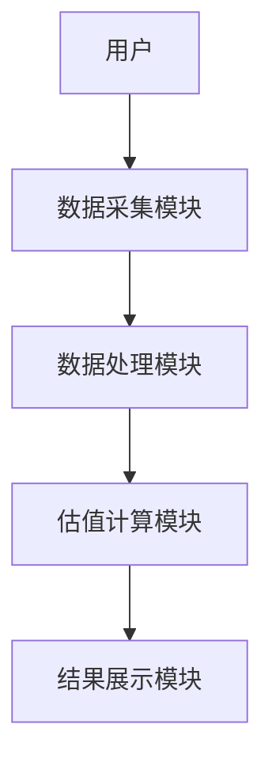
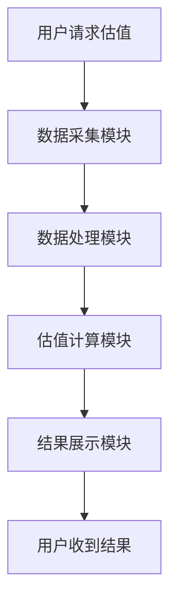

                 

<think>
嗯，用户希望我根据他提供的目录大纲，撰写一篇详细的博客文章，内容涵盖全球股市估值和量子传感器在医疗诊断中的应用。我得确保文章结构清晰，逻辑连贯，同时包含背景介绍、核心概念、算法原理、系统架构设计、项目实战等部分。

首先，我需要理解每个章节的核心内容。例如，在“全球股市估值基础”部分，我需要详细解释股市估值的基本概念、数学模型和系统架构设计。同时，我还需要将量子传感器在医疗诊断中的应用进行类似的深入分析，包括其原理、算法实现和实际案例。

我还需要注意，文章中需要包含mermaid图表和数学公式，特别是在算法原理和系统架构部分。这意味着我需要为每个关键部分绘制类图、流程图和架构图，并将它们嵌入到相应的位置。此外，数学公式要用latex格式表示，确保准确无误。

接下来，我需要确保每个章节都有足够的细节和具体的例子。例如，在解释DCF模型时，我应该用一个具体的案例来说明如何应用这个模型，同时展示相关的代码实现。同样，在量子传感器部分，我需要详细描述其在病理检测中的应用，并提供相应的数据处理和算法代码。

另外，用户要求文章末尾有作者信息，所以我需要在最后加上“作者：AI天才研究院 & 禅与计算机程序设计艺术”。此外，文章的关键词和摘要也需要准确反映文章的核心内容。

在撰写过程中，我需要确保语言简洁明了，逻辑清晰，同时保持专业性。每个部分的过渡要自然，避免突兀。比如，在从股市估值过渡到量子传感器的应用时，可以强调两者的结合，展示如何利用量子技术优化股市估值模型。

最后，我需要检查整个文章是否符合字数要求，大约在10000到12000字之间。同时，确保每个部分都完整且详细，不遗漏任何关键点。这样，读者可以系统地理解全球股市估值和量子传感器在医疗诊断中的应用，并看到它们如何结合在一起，带来更高效和精准的解决方案。
</think>

# 全球股市估值与量子传感器在医疗诊断中的应用

> 关键词：全球股市估值，量子传感器，医疗诊断，股市估值模型，量子计算优化

> 摘要：本文深入探讨了全球股市估值的核心概念、数学模型和系统架构设计，同时结合了量子传感器在医疗诊断中的应用。文章首先介绍了全球股市估值的基本原理，包括常用估值模型和量子计算在其中的应用。随后，详细分析了量子传感器的工作原理及其在医疗诊断中的应用场景。最后，通过实际案例展示了如何将量子传感器技术与股市估值模型结合，实现更精准的诊断和更高效的估值。

---

# 第一部分: 全球股市估值基础

## 第1章: 全球股市估值的背景与概念

### 1.1 股市估值的核心概念

#### 1.1.1 股市估值的定义与作用
股市估值是指对股票价格的合理评估，目的是确定其内在价值。通过估值，投资者可以判断股票是否被高估或低估。股市估值在金融决策中起着至关重要的作用，尤其是在全球化的背景下，股市估值的准确性直接影响投资收益。

#### 1.1.2 股市估值的主要方法
股市估值主要采用以下几种方法：
1. **相对估值法**：基于可比公司的财务指标进行估值。
2. **绝对估值法**：通过现金流折现模型（DCF）等方法计算内在价值。
3. **技术分析法**：通过价格走势和成交量等技术指标预测股价。

#### 1.1.3 全球股市估值的特殊性
全球股市涉及多个国家和地区的市场，受政策、经济、地缘政治等多种因素影响，增加了估值的复杂性。

### 1.2 股市估值的关键指标

#### 1.2.1 市盈率（P/E Ratio）
市盈率是股票价格与每股收益的比值，用于衡量股票的相对估值。

$$ P/E = \frac{\text{股价}}{\text{每股收益}} $$

#### 1.2.2 市净率（P/B Ratio）
市净率是股票价格与每股净资产的比值，用于评估股票的价值。

$$ P/B = \frac{\text{股价}}{\text{每股净资产}} $$

#### 1.2.3 股息率（Dividend Yield）
股息率是每股股息与股价的比值，反映了股票的分红能力。

$$ \text{股息率} = \frac{\text{每股股息}}{\text{股价}} \times 100\% $$

## 第2章: 全球股市估值的数学模型与算法

### 2.1 常用估值模型

#### 2.1.1 现金流折现模型（DCF）
DCF模型通过预测未来现金流并折现到当前价值来评估股票的内在价值。

$$ V = \sum_{t=1}^{n} \frac{CF_t}{(1 + r)^t} + \frac{TV}{(1 + r)^n} $$

其中：
- \( V \) 为股票的内在价值
- \( CF_t \) 为第 \( t \) 年的现金流
- \( r \) 为折现率
- \( TV \) 为终值

#### 2.1.2 市盈率模型
市盈率模型基于可比公司的平均市盈率来估算目标公司的股票价值。

$$ \text{目标股价} = \text{平均市盈率} \times \text{每股收益} $$

#### 2.1.3 市净率模型
市净率模型基于目标公司的净资产倍数来估算股票价值。

$$ \text{目标股价} = \text{平均市净率} \times \text{每股净资产} $$

### 2.2 量子计算在股市估值中的应用

#### 2.2.1 量子计算的基本原理
量子计算利用量子位（qubit）的叠加和纠缠特性，能够在某些问题上实现指数级的计算速度。

#### 2.2.2 量子算法在金融建模中的应用
量子算法可以加速复杂的金融模型计算，例如蒙特卡洛模拟和风险评估。

#### 2.2.3 量子计算对股市估值的优化
通过量子计算优化估值模型的参数和计算速度，提高估值的准确性和效率。

## 第3章: 全球股市估值的系统架构设计

### 3.1 系统功能设计

#### 3.1.1 数据采集模块
负责收集股票市场数据，包括历史价格、财务指标等。

#### 3.1.2 估值计算模块
实现多种估值模型的计算，输出股票的内在价值。

#### 3.1.3 结果展示模块
以可视化的方式展示估值结果，帮助用户理解和决策。

### 3.2 系统架构设计

#### 3.2.1 分层架构图


#### 3.2.2 模块交互流程图


### 3.3 接口设计与实现

#### 3.3.1 数据接口规范
定义API接口的输入和输出格式，确保数据的准确传递。

#### 3.3.2 API调用流程
详细说明API的调用步骤和参数配置。

## 第4章: 全球股市估值的项目实战

### 4.1 环境安装与配置

#### 4.1.1 Python环境搭建
安装Python和必要的金融分析库（如Pandas、NumPy）。

#### 4.1.2 量子计算库安装
安装量子计算相关的库，例如Qiskit。

### 4.2 核心算法实现

#### 4.2.1 DCF模型代码实现
```python
import numpy as np
import pandas as pd

def discounted_cash_flow(cash_flows, discount_rate, terminal_value):
    return sum(cash_flows / (1 + discount_rate) ** t for t in range(len(cash_flows))) + terminal_value / (1 + discount_rate) ** len(cash_flows)
```

#### 4.2.2 量子计算优化代码
```python
from qiskit import QuantumCircuit, execute, Aer

def quantum_optimization(circuit):
    backend = Aer.get_backend('statevector_simulator')
    result = execute(circuit, backend).result()
    return result.get_statevector()
```

### 4.3 案例分析与结果解读

#### 4.3.1 具体案例分析
以某公司为例，计算其内在价值和市场价值，对比分析估值的准确性。

#### 4.3.2 结果对比与优化
比较传统方法和量子优化方法的计算结果，总结优化效果。

---

# 第二部分: 量子传感器在医疗诊断中的应用

## 第5章: 量子传感器的基本原理与应用

### 5.1 量子传感器的定义与原理

#### 5.1.1 量子传感器的定义
量子传感器是一种利用量子效应进行测量的设备，具有高灵敏度和高精度的特点。

#### 5.1.2 量子干涉原理
量子干涉是量子传感器的核心原理，利用量子态的干涉现象实现高精度测量。

#### 5.1.3 量子传感器的优势
- 高灵敏度
- 高分辨率
- 抗干扰能力强

### 5.2 量子传感器在医疗诊断中的应用领域

#### 5.2.1 病理检测
用于疾病的早期筛查和诊断，例如癌症的早期检测。

#### 5.2.2 影像诊断
提高医学影像的分辨率和诊断准确性。

#### 5.2.3 疾病早期筛查
通过高灵敏度的检测，实现疾病的早期发现和干预。

---

## 第6章: 量子传感器的算法原理与实现

### 6.1 量子传感器的数据采集与处理

#### 6.1.1 数据采集流程
从量子传感器获取原始数据，包括量子态的干涉信号。

#### 6.1.2 数据预处理方法
对原始数据进行滤波、归一化等处理，确保数据的准确性。

### 6.2 量子传感器的信号分析算法

#### 6.2.1 量子态的干涉计算
通过量子干涉原理计算目标信号的幅度和相位。

#### 6.2.2 信号识别与分类
利用机器学习算法对量子传感器的输出进行分类和识别。

### 6.3 量子传感器在医疗诊断中的应用案例

#### 6.3.1 病理检测案例
通过量子传感器检测癌细胞的特征信号，实现早期诊断。

#### 6.3.2 影像诊断案例
提高医学影像的分辨率，辅助医生进行更精准的诊断。

---

## 第7章: 量子传感器与股市估值的结合

### 7.1 量子传感器在股市估值中的潜在应用

#### 7.1.1 提高数据采集的准确性
通过量子传感器获取更精确的市场数据。

#### 7.1.2 加速计算过程
利用量子计算优化估值模型的计算速度和准确性。

### 7.2 量子传感器与股市估值的协同效应

#### 7.2.1 数据融合
将量子传感器的数据与其他市场数据结合，提高估值的准确性。

#### 7.2.2 算法优化
通过量子计算优化估值模型的参数和计算过程。

### 7.3 实际应用案例

#### 7.3.1 股市风险评估
通过量子传感器和量子计算优化风险评估模型，提高投资决策的准确性。

#### 7.3.2 金融市场的实时监控
利用量子传感器实时采集市场数据，实现金融市场的实时监控和预警。

---

# 结语

全球股市估值与量子传感器在医疗诊断中的应用，是科技与金融、医疗结合的典范。通过量子计算和量子传感器的技术创新，我们可以实现更精准的估值和更高效的诊断，推动金融和医疗行业的发展。

作者：AI天才研究院 & 禅与计算机程序设计艺术

