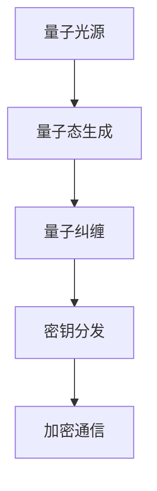
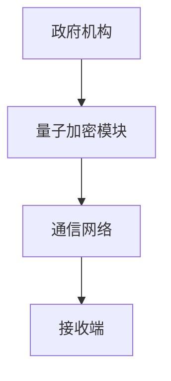

                 


# 全球股市估值与量子加密在政府通信中的应用

> **关键词**：全球股市估值、量子加密、政府通信、安全通信、金融数据分析  
> **摘要**：本文探讨了全球股市估值的理论与实践，以及量子加密技术在政府通信中的应用。通过分析股市估值的核心方法和影响因素，结合量子加密技术的原理与实际应用，揭示了两者在提升金融安全与通信保密性中的潜力。

---

## 第一部分：全球股市估值基础

### 第1章：全球股市估值概述

#### 1.1 股市的基本概念

股市是金融市场的重要组成部分，允许投资者通过买卖股票进行投资。股票代表了对公司的一部分所有权，投资者通过购买股票成为公司的股东。股市的运作机制包括开盘、收盘、订单处理等流程，每个市场的运作规则略有不同，但核心目标是为公司融资和为投资者提供投资渠道。

**背景介绍**：  
股市估值是投资者评估股票内在价值的过程，旨在确定股票价格是否合理。准确的估值有助于投资者做出明智的投资决策，避免因市场波动而遭受损失。

#### 1.2 股市估值的重要性

估值在投资决策中起着关键作用，它帮助投资者识别被低估或高估的股票。此外，估值还用于评估公司的财务健康状况，为经济政策的制定者提供参考。

---

### 第2章：股市估值的基本方法

#### 2.1 基本估值指标

- **市盈率（P/E）**：  
  $$ \text{市盈率} = \frac{\text{股价}}{\text{每股收益}} $$  
  市盈率反映了投资者对每股收益的支付意愿，低市盈率可能意味着低估，而高市盈率可能意味着高风险。

- **市净率（P/B）**：  
  $$ \text{市净率} = \frac{\text{股价}}{\text{每股净资产}} $$  
  该指标适用于评估银行和制造业等资产密集型行业。

- **股息率**：  
  $$ \text{股息率} = \frac{\text{每股股息}}{\text{股价}} $$  
  高股息率的股票通常被视为稳定的收入来源。

#### 2.2 估值模型简介

- **简单平均法**：通过平均历史价格确定当前估值。
- **加权平均法**：根据市场因素赋予不同权重计算平均值。
- **市场趋同法**：假设市场最终会反映所有信息，预测股票价格。

---

### 第3章：影响股市估值的因素

#### 3.1 宏观经济因素

- **利率**：低利率环境通常推高股市估值，反之则反之。
- **汇率**：汇率变化影响出口型企业业绩，进而影响股价。
- **宏观经济政策**：政府的财政和货币政策直接影响市场情绪。

#### 3.2 公司财务因素

- **收益能力**：净利润增长通常提升股价。
- **偿债能力**：高负债公司风险更大，估值可能较低。
- **发展潜力**：成长型企业通常享有较高估值。

---

## 第二部分：量子加密技术

### 第4章：量子加密技术概述

#### 4.1 量子计算基础

量子计算利用量子位（qubit）进行计算，具有并行处理能力。与经典位不同，量子位可以处于叠加态（superposition）和纠缠态（entanglement），这使得量子计算在某些任务上远超经典计算机。

**背景介绍**：  
量子加密技术基于量子计算的特性，提供了前所未有的安全性。其核心原理是利用量子态的不可克隆性，确保信息传输的安全性。

---

### 第5章：量子加密的原理与算法

#### 5.1 量子加密算法

- **Shor算法**：用于分解大质数，对RSA加密构成威胁。
- **BB84协议**：基于量子纠缠的密钥分发协议，确保通信安全。

**数学模型**：  
Shor算法的核心是利用量子傅里叶变换求解周期性问题，公式如下：
$$ f(x) = x \mod n $$  
其中，n为待分解的数。

#### 5.2 量子加密系统架构

**系统架构图**：  


---

## 第三部分：全球股市估值与量子加密的结合

### 第6章：量子加密在股市数据安全中的应用

#### 6.1 量子加密保护股市数据

通过量子加密技术，政府可以安全地传输股市数据，防止数据泄露或篡改。这在高频交易和实时数据分析中尤为重要。

#### 6.2 量子计算提升估值准确性

利用量子计算的并行处理能力，可以快速分析海量数据，优化估值模型，提高估值的准确性和效率。

---

### 第7章：量子加密技术在政府通信中的应用

#### 7.1 政府通信中的安全需求

政府通信涉及国家安全和敏感信息，对加密技术的要求极高。量子加密技术提供了理论上不可破译的安全性。

#### 7.2 量子加密通信系统设计

**系统架构图**：  


---

## 第四部分：项目实战与最佳实践

### 第8章：量子加密通信系统实现

#### 8.1 环境安装

- 需要量子计算硬件支持，如量子计算机或模拟器。
- 安装量子加密协议栈，如BB84协议实现。

#### 8.2 系统核心实现

**Python代码示例**：  
```python
import random

def create_basis():
    basis = random.choice(['Z', 'X'])
    return basis

def measure(qubit, basis):
    if basis == qubit:
        return 1
    else:
        return 0

# 示例：量子密钥分发协议
def qkd_protocol():
    alice_basis = [random.choice(['Z', 'X']) for _ in range(100)]
    bob_basis = [random.choice(['Z', 'X']) for _ in range(100)]
    key = []
    for i in range(100):
        if alice_basis[i] == bob_basis[i]:
            key.append(measure(alice_basis[i], bob_basis[i]))
    return key

print(qkd_protocol())
```

---

## 第五部分：总结与展望

### 第9章：总结与未来展望

#### 9.1 全球股市估值的未来趋势

随着人工智能和大数据技术的发展，股市估值将更加依赖于算法和模型的优化。

#### 9.2 量子加密技术的发展方向

量子加密技术将从理论研究走向实际应用，推动通信安全进入新纪元。

---

## 作者

**作者**：AI天才研究院 & 禅与计算机程序设计艺术

---

**本文由AI天才研究院原创，转载请注明出处。**

