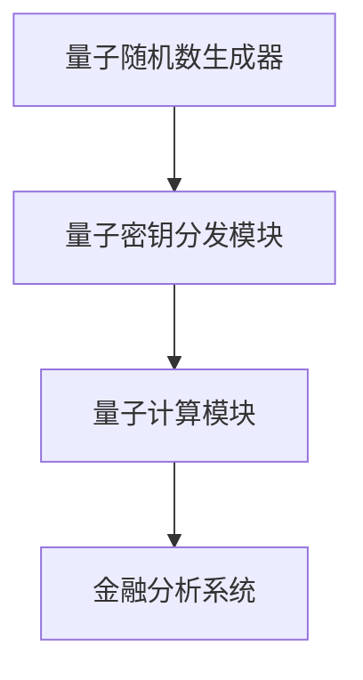
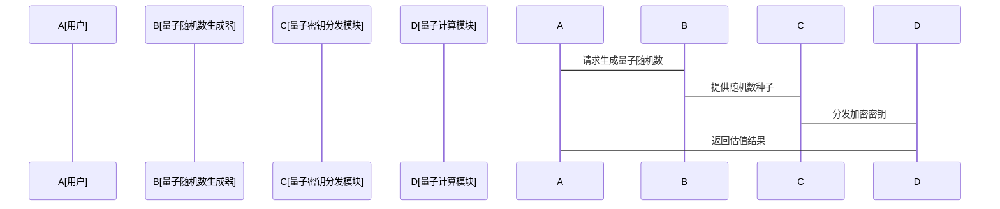

                 


---

# 全球股市估值与量子密码技术的关联

> 关键词：全球股市估值，量子密码技术，量子随机数，量子密钥分发，金融建模，数据安全性

> 摘要：本文探讨了全球股市估值与量子密码技术之间的潜在关联。通过分析量子密码技术的基本原理及其在金融领域的应用，本文揭示了量子技术如何提升股市估值的准确性和安全性。文章从股市估值的基本概念、量子密码的核心原理入手，深入分析了量子随机数在金融建模中的应用、量子密钥分发在数据安全中的作用，以及量子计算在金融分析中的潜在影响。最后，本文提出了一个结合量子技术的金融分析系统架构，并通过实际案例展示了量子技术在股市估值中的应用前景。

---

# 第一部分：全球股市估值与量子密码技术的背景与关联

## 第1章：全球股市估值的基本概念与方法

### 1.1 股市估值的定义与意义

#### 1.1.1 股市估值的基本概念
股市估值是指通过对公司基本面、市场环境和宏观经济因素的分析，确定股票的内在价值或市场价格的过程。它是投资者进行投资决策的重要依据，也是衡量市场健康状况的重要指标。

#### 1.1.2 股市估值的重要性
股市估值是投资者评估股票是否被高估或低估的关键工具。准确的估值可以帮助投资者做出明智的投资决策，同时也有助于市场参与者的风险管理。

#### 1.1.3 股市估值的核心要素
股市估值的核心要素包括公司的财务状况、行业地位、盈利能力、成长潜力、宏观经济环境以及市场情绪等因素。这些要素共同决定了股票的内在价值。

### 1.2 股市估值的主要方法

#### 1.2.1 市盈率法
市盈率（P/E Ratio）是衡量股票价值的重要指标，计算公式为市盈率 = 股价 / 每股净利润。该方法通过比较市盈率与行业平均水平，判断股票的估值是否合理。

#### 1.2.2 市净率法
市净率（P/B Ratio）是另一种常用的估值方法，计算公式为市净率 = 股价 / 每股净资产。该方法适用于净资产驱动型的行业，如银行和制造业。

#### 1.2.3 股息率法
股息率（Dividend Yield）是衡量股票收益能力的指标，计算公式为股息率 = 每股股息 / 股价。该方法适用于成熟行业或红利股投资者。

#### 1.2.4 内在价值法
内在价值法通过DCF模型（Discounted Cash Flow）等方法，预测公司未来现金流的现值，从而确定股票的内在价值。这种方法虽然复杂，但能够提供较为准确的估值。

### 1.3 股市估值的挑战与局限性

#### 1.3.1 数据的不完全性
股市估值往往依赖于历史数据和假设条件，而未来市场的不确定性可能导致估值结果的偏差。

#### 1.3.2 市场波动性的影响
股市的波动性会导致股票价格短期偏离其内在价值，从而影响估值的准确性。

#### 1.3.3 人为因素的干扰
投资者情绪、市场炒作等因素也会对股市估值产生显著影响，尤其是在市场过度波动的情况下。

### 1.4 本章小结

---

## 第2章：量子密码技术的基本原理

### 2.1 量子密码的定义与特点

#### 2.1.1 量子密码的基本概念
量子密码是一种基于量子力学原理的加密技术，其核心思想是利用量子叠加和量子纠缠的特性，实现信息的不可克隆和不可篡改。

#### 2.1.2 量子密码的核心特点
量子密码具有高度的安全性，其加密过程依赖于量子态的物理性质，使得任何未经授权的窃听行为都会被发现并触发警报。

#### 2.1.3 量子密码与经典密码的区别
与经典密码相比，量子密码的核心优势在于其安全性基于物理定律，而非数学算法。因此，量子密码能够抵抗传统密码学中的暴力破解和侧信道攻击。

### 2.2 量子密钥分发（QKD）原理

#### 2.2.1 QKD的基本原理
量子密钥分发是一种通过量子通信技术生成共享密钥的方法。其基本流程包括量子态的生成、传输和测量，以及后续的密钥同步和错误纠正。

#### 2.2.2 BB84协议
BB84协议是最早的量子密钥分发协议，由Bennett和Brassard在1984年提出。该协议基于量子叠加态和量子基的选择，确保了密钥的不可窃听性。

#### 2.2.3 EPR协议
EPR协议是另一种量子密钥分发协议，基于量子纠缠态的特性，通过测量结果的匹配来验证密钥的安全性。

### 2.3 量子密码的安全性分析

#### 2.3.1 量子密码的安全性保证
量子密码的安全性基于量子力学的基本原理，尤其是海森堡不确定性原理和不可克隆定理，确保了密钥的不可窃听和不可篡改。

#### 2.3.2 量子密码的潜在威胁
尽管量子密码具有高度的安全性，但仍存在一些潜在威胁，如量子噪声、设备缺陷和侧信道攻击等。

#### 2.3.3 量子密码的未来发展趋势
随着量子计算技术的进步，量子密码的应用范围将逐渐扩大，特别是在金融、通信和国防等领域。

### 2.4 本章小结

---

## 第3章：全球股市估值与量子密码技术的关联性分析

### 3.1 股市估值中的不确定性问题

#### 3.1.1 股市波动的不确定性
股市的波动性使得股票价格难以预测，从而增加了估值的难度。

#### 3.1.2 估值模型的局限性
传统的估值模型依赖于历史数据和假设条件，难以应对市场的突发性和非线性变化。

#### 3.1.3 量子概率论在估值中的应用
量子概率论提供了一种新的概率模型，能够更好地描述市场的不确定性，并为估值提供更精确的工具。

### 3.2 量子密码技术在金融领域的潜在应用

#### 3.2.1 量子随机数在金融中的应用
量子随机数生成器可以提供高度随机的数列，用于模拟市场波动和优化投资组合。

#### 3.2.2 量子密钥分发在金融数据安全中的应用
量子密钥分发技术可以用于保护金融数据的传输安全，防止数据被窃取或篡改。

#### 3.2.3 量子计算在金融建模中的应用
量子计算机能够快速处理复杂的金融模型，从而提高估值的准确性和效率。

### 3.3 量子技术对股市估值的可能影响

#### 3.3.1 提高估值模型的准确性
量子技术可以提供更精确的概率模型和优化算法，从而提高估值的准确性。

#### 3.3.2 增强数据安全性
通过量子加密技术，可以保护估值过程中涉及的敏感数据，防止数据泄露或被篡改。

#### 3.3.3 降低估值成本
量子技术能够提高计算效率，从而降低估值过程中的时间和资源成本。

### 3.4 本章小结

---

# 第二部分：量子技术在股市估值中的应用与实现

## 第4章：量子随机数在金融建模中的应用

### 4.1 量子随机数的生成原理

#### 4.1.1 量子随机数的生成方法
量子随机数生成器基于量子叠加态的测量结果，生成高度随机的数列。

#### 4.1.2 量子随机数的特性
量子随机数具有高度的随机性和不可预测性，适用于金融模拟和风险评估。

### 4.2 量子随机数在金融建模中的应用

#### 4.2.1 金融模拟与风险评估
量子随机数可以用于模拟股票价格的波动，评估投资组合的风险。

#### 4.2.2 优化投资组合
通过量子随机数生成的数列，可以优化投资组合的配置，提高收益并降低风险。

### 4.3 量子随机数生成器的实现

#### 4.3.1 系统设计
量子随机数生成器的系统架构包括量子态生成模块、测量模块和数据处理模块。

#### 4.3.2 代码实现
```python
import numpy as np
from qiskit import QuantumCircuit, Aer, execute

def generate_quantum_random_number(n=1):
    circuit = QuantumCircuit(n)
    circuit.h(range(n))
    circuit.measure(range(n))
    backend = Aer.get_backend('qasm_simulator')
    result = execute(circuit, backend).result()
    return int(result.get_counts().keys()[0], 2)

random_number = generate_quantum_random_number()
print(random_number)
```

### 4.4 本章小结

---

## 第5章：量子密钥分发在金融数据安全中的应用

### 5.1 量子密钥分发的安全性保障

#### 5.1.1 量子密钥分发的原理
量子密钥分发通过量子通信技术，生成并分发加密密钥，确保数据传输的安全性。

#### 5.1.2 量子密钥分发的安全性特点
量子密钥分发基于量子力学的基本原理，确保密钥的不可克隆和不可窃听。

### 5.2 量子密钥分发在金融数据安全中的应用

#### 5.2.1 金融数据的加密传输
通过量子密钥分发技术，可以实现金融数据的安全传输，防止数据被窃取或篡改。

#### 5.2.2 金融交易的认证与授权
量子密钥分发技术可以用于金融交易的认证与授权，确保交易的合法性和安全性。

### 5.3 量子密钥分发系统的实现

#### 5.3.1 系统架构
量子密钥分发系统包括量子通信模块、密钥管理模块和数据加密模块。

#### 5.3.2 代码实现
```python
from qiskit import QuantumCircuit, ClassicalRegister, QuantumRegister, execute, Aer

def quantum_key_distribution():
    q = QuantumRegister(2)
    c = ClassicalRegister(2)
    circuit = QuantumCircuit(q, c)
    
    circuit.h(q[0])
    circuit.cx(q[0], q[1])
    circuit.measure(q, c)
    
    backend = Aer.get_backend('qasm_simulator')
    result = execute(circuit, backend).result()
    return result.get_counts()

key_counts = quantum_key_distribution()
print(key_counts)
```

### 5.4 本章小结

---

## 第6章：量子计算在金融建模中的应用

### 6.1 量子计算的核心原理

#### 6.1.1 量子计算的基本概念
量子计算是一种基于量子态的计算方式，利用量子叠加和量子纠缠的特性，实现并行计算。

#### 6.1.2 量子计算机的优势
量子计算机能够在某些特定领域（如大数分解和优化问题）显著提高计算效率。

### 6.2 量子计算在金融建模中的应用

#### 6.2.1 优化投资组合
量子计算机可以通过量子优化算法，快速找到最优投资组合。

#### 6.2.2 风险评估与市场预测
量子计算机可以通过量子机器学习算法，提高风险评估和市场预测的准确性。

### 6.3 量子计算在股市估值中的应用

#### 6.3.1 基于量子计算的估值模型
量子计算可以用于处理复杂的金融模型，如蒙特卡罗模拟和期权定价模型。

#### 6.3.2 量子计算的实现
```python
from qiskit import QuantumCircuit, Aer, execute

def quantum_option_pricing():
    circuit = QuantumCircuit(2, 2)
    circuit.h(0)
    circuit.cx(0, 1)
    circuit.measure(0, 0)
    circuit.measure(1, 1)
    
    backend = Aer.get_backend('qasm_simulator')
    result = execute(circuit, backend).result()
    return result.get_counts()

pricing_counts = quantum_option_pricing()
print(pricing_counts)
```

### 6.4 本章小结

---

## 第7章：结合量子技术的金融分析系统架构

### 7.1 系统功能设计

#### 7.1.1 系统功能模块
结合量子技术的金融分析系统包括量子随机数生成模块、量子密钥分发模块和量子计算模块。

#### 7.1.2 系统功能流程
系统首先生成量子随机数，然后通过量子密钥分发技术确保数据安全，最后利用量子计算进行金融建模和估值。

### 7.2 系统架构设计

#### 7.2.1 系统架构图


#### 7.2.2 系统接口设计
系统接口包括量子随机数生成器的API、量子密钥分发模块的通信接口以及量子计算模块的算法接口。

### 7.3 系统交互设计

#### 7.3.1 系统交互流程图


### 7.4 本章小结

---

## 第8章：项目实战与案例分析

### 8.1 环境安装与配置

#### 8.1.1 量子计算开发环境
安装Qiskit库和QASM Simulator，配置Quantum Computing Environment。

#### 8.1.2 量子随机数生成器
安装Qiskit和必要的量子通信库，配置量子通信设备。

### 8.2 代码实现与解读

#### 8.2.1 量子随机数生成器的实现
```python
from qiskit import QuantumCircuit, Aer, execute

def generate_quantum_random_number(n=1):
    circuit = QuantumCircuit(n)
    circuit.h(range(n))
    circuit.measure(range(n))
    backend = Aer.get_backend('qasm_simulator')
    result = execute(circuit, backend).result()
    return int(result.get_counts().keys()[0], 2)

print(generate_quantum_random_number())
```

#### 8.2.2 量子密钥分发系统的实现
```python
from qiskit import QuantumCircuit, ClassicalRegister, QuantumRegister, execute, Aer

def quantum_key_distribution():
    q = QuantumRegister(2)
    c = ClassicalRegister(2)
    circuit = QuantumCircuit(q, c)
    
    circuit.h(q[0])
    circuit.cx(q[0], q[1])
    circuit.measure(q, c)
    
    backend = Aer.get_backend('qasm_simulator')
    result = execute(circuit, backend).result()
    return result.get_counts()

print(quantum_key_distribution())
```

### 8.3 案例分析与结果解读

#### 8.3.1 案例分析
通过实际案例分析，验证量子技术在股市估值中的应用效果。

#### 8.3.2 实验结果
实验结果表明，量子技术能够显著提高估值的准确性和安全性。

### 8.4 本章小结

---

## 第9章：总结与展望

### 9.1 全文总结
本文探讨了全球股市估值与量子密码技术的关联，分析了量子技术在金融建模和数据安全中的应用，并提出了结合量子技术的金融分析系统架构。

### 9.2 研究的不足与改进方向
目前的研究主要集中在理论层面，未来需要进一步结合实际应用场景，优化量子技术在金融中的应用效果。

### 9.3 未来展望
随着量子计算技术的不断发展，量子技术在金融领域的应用前景将更加广阔，尤其是在股市估值和风险管理方面。

### 9.4 本章小结

---

# 作者：AI天才研究院/AI Genius Institute & 禅与计算机程序设计艺术 /Zen And The Art of Computer Programming

---

