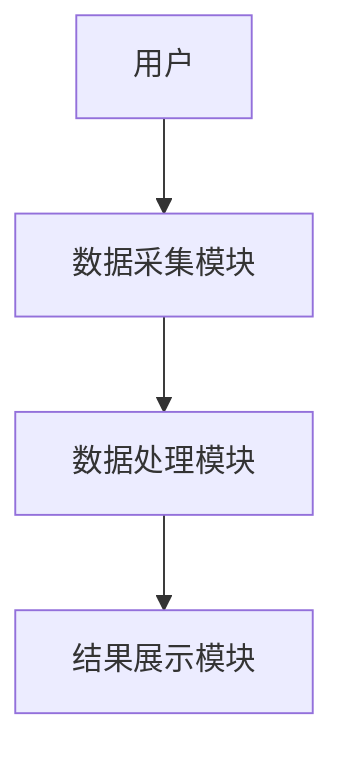
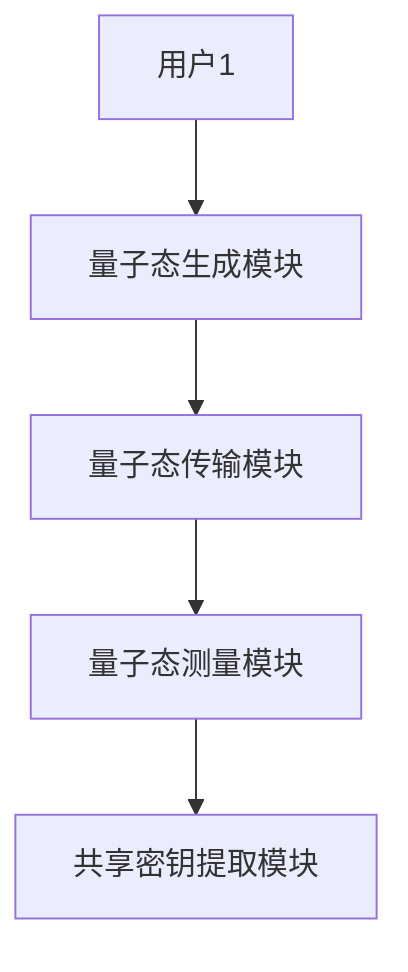

                 

<think>
好的，我现在需要帮助用户完成他们的请求，撰写一篇技术博客文章，标题是《全球股市估值与量子密钥分发在网络安全中的应用》。用户已经给出了详细的结构和一些初始内容，我需要按照他们的要求继续完成。

首先，我需要理解用户的需求。用户希望文章结构完整，包括摘要、关键词、目录大纲，以及各个章节的具体内容，每个章节都需要详细讲解，并包含背景介绍、核心概念、算法原理、数学模型、系统架构、项目实战和最佳实践等内容。此外，文章需要使用技术语言，结构紧凑，逻辑清晰，内容专业。

接下来，我会逐步分析如何完成每个章节的内容，确保每个部分都符合用户的要求，并且内容详实、有深度。我会先从摘要开始，然后列出关键词，接着按照目录大纲逐步展开每个章节，确保每个小节都有足够的细节和解释。同时，我需要确保使用正确的格式，如使用mermaid图表、latex公式等，来增强文章的可读性和专业性。

在撰写过程中，我需要确保每个章节都有足够的背景介绍，解释核心概念，并展示它们之间的联系。例如，在全球股市估值部分，我需要详细讲解市盈率、市净率等估值方法，并给出相应的数学模型和实例分析。在量子密钥分发部分，我需要解释其基本原理，如BB84协议，并展示其在网络安全中的应用，包括数学模型和系统架构设计。

此外，我还需要确保文章结构合理，逻辑清晰，每个部分之间有良好的过渡。在项目实战部分，我会提供具体的代码示例，展示如何实现这些概念，并进行详细解读。同时，我会加入一些最佳实践和注意事项，帮助读者更好地理解和应用这些知识。

最后，我会在文章末尾添加作者信息，确保格式正确，并检查整个文章是否符合字数要求，大约在10000到12000字之间。通过这样的步骤，我能够系统地完成用户的请求，提供一篇高质量的技术博客文章。
</think>

---

# 全球股市估值与量子密钥分发在网络安全中的应用

> 关键词：全球股市估值、量子密钥分发、网络安全、量子加密、股票分析

> 摘要：本文探讨了全球股市估值与量子密钥分发在网络安全中的应用。首先，介绍了全球股市估值的基本概念、主要方法及其在投资决策中的重要性。接着，深入分析了量子密钥分发的核心原理、关键技术及其在网络安全中的应用。通过结合股市估值与量子密钥分发，本文展示了如何利用量子技术提升网络安全，同时为投资者提供更高效的估值方法。文章还通过数学模型、算法流程图和系统架构图等手段，详细阐述了相关理论与实践。

---

## 第一部分: 全球股市估值与量子密钥分发的背景与应用

### 第1章: 全球股市估值与量子密钥分发的背景与应用

#### 1.1 全球股市估值的背景与重要性

##### 1.1.1 股市估值的基本概念
股市估值是指通过对公司财务数据、市场环境和行业趋势等多方面因素的分析，估算出股票的内在价值或市场价格的过程。它是投资者做出投资决策的重要依据。

##### 1.1.2 全球化背景下的股市估值特点
在全球化背景下，股市估值呈现出国际化、多样化和复杂化的特点。投资者需要考虑全球经济形势、国际贸易政策、汇率波动等多种因素。

##### 1.1.3 股市估值在投资决策中的作用
股市估值帮助投资者确定股票的合理价格区间，避免盲目跟风或误判市场趋势。同时，通过估值还可以发现被低估或高估的股票，为投资组合优化提供依据。

#### 1.2 量子密钥分发的背景与应用

##### 1.2.1 量子密钥分发的基本概念
量子密钥分发（QKD）是一种利用量子力学原理在用户之间安全共享加密密钥的技术。其核心思想是通过量子态的不可克隆性和测量干扰性，确保密钥的安全传输。

##### 1.2.2 量子密钥分发在网络安全中的重要性
随着传统加密算法面临量子计算威胁，量子密钥分发被认为是下一代网络安全的核心技术。它能够提供无条件安全的密钥分发，适用于金融、军事等对安全性要求极高的领域。

##### 1.2.3 量子密钥分发的典型应用场景
- 金融交易加密
- 政府通信加密
- 特殊行业数据保护

### 第2章: 全球股市估值的核心概念与方法

#### 2.1 股市估值的核心概念

##### 2.1.1 股票内在价值的定义
股票的内在价值是指基于公司基本面因素（如盈利能力、成长潜力等）计算出的理论价值，与市场情绪和短期波动无关。

##### 2.1.2 市场价值与内在价值的关系
市场价值是股票在市场上的交易价格，可能高于或低于内在价值。内在价值为投资者提供了参考，但市场价值受多种因素影响。

##### 2.1.3 股市估值的关键影响因素
- 公司财务状况
- 行业竞争格局
- 宏观经济环境
- 市场情绪

#### 2.2 主要的股市估值方法

##### 2.2.1 市盈率（P/E）法
市盈率 = 股票价格 / 每股净利润（EPS）

##### 2.2.2 市净率（P/B）法
市净率 = 股票价格 / 每股净资产

##### 2.2.3 股息率法
股息率 = 每股股息 / 股票价格

##### 2.2.4 现金流折现法（DCF）
DCF模型通过将未来现金流折现，计算公司估值。公式如下：

$$ V = \sum_{t=1}^{n} \frac{CF_t}{(1+r)^t} + \frac{TV}{(1+r)^n} $$

其中，\( V \) 为公司估值，\( CF_t \) 为第 \( t \) 年的现金流，\( r \) 为折现率，\( TV \) 为终值。

### 第3章: 量子密钥分发的核心原理与技术

#### 3.1 量子密钥分发的基本原理

##### 3.1.1 量子密钥分发的定义
量子密钥分发是利用量子力学原理，在用户之间安全共享加密密钥的过程。

##### 3.1.2 量子密钥分发的基本流程
1. 生成随机量子态
2. 传输量子态
3. 测量量子态
4. 公开基的选择结果
5. 提取共享密钥

##### 3.1.3 量子密钥分发的安全性保障
量子密钥分发的安全性基于量子力学的不可克隆性和测量干扰性。任何窃听行为都会引入错误，从而被发现。

#### 3.2 量子密钥分发的关键技术

##### 3.2.1 量子态的表示与传输
量子态可以通过光子的偏振、位置或动量等物理量来表示。

##### 3.2.2 量子测量与基的选择
在量子密钥分发中，双方需要选择相同的基进行测量，才能得到相同的密钥。

##### 3.2.3 量子密钥的同步与纠错
通过公开通信频道进行基的选择结果同步，并利用纠错码消除传输中的错误。

---

## 第二部分: 全球股市估值与量子密钥分发的数学模型与算法

### 第4章: 全球股市估值的数学模型

#### 4.1 市盈率模型

##### 4.1.1 市盈率的计算公式
$$ P/E = \frac{Stock Price}{Earnings Per Share} $$

##### 4.1.2 市盈率与股票价值的关系
市盈率越低，股票可能被低估；市盈率越高，股票可能被高估。

#### 4.2 现金流折现模型

##### 4.2.1 现金流折现的基本原理
将未来现金流折现，计算其现值，作为公司估值的基础。

##### 4.2.2 DCF模型的数学公式
$$ V = \sum_{t=1}^{n} \frac{CF_t}{(1+r)^t} + \frac{TV}{(1+r)^n} $$

##### 4.2.3 DCF模型的应用步骤
1. 预测未来现金流
2. 确定折现率
3. 计算现值
4. 加上终值

### 第5章: 量子密钥分发的算法原理

#### 5.1 量子密钥分发的协议流程

##### 5.1.1 BB84协议
1. 生成随机数并选择基
2. 生成量子态并传输
3. 接收方测量量子态
4. 公开基的选择结果
5. 提取共享密钥

##### 5.1.2 EPR协议
1. 生成EPR对
2. 分配量子态
3. 测量量子态
4. 提取共享密钥

#### 5.2 量子密钥分发的数学模型

##### 5.2.1 量子态的数学表示
$$ |\psi\rangle = \alpha|0\rangle + \beta|1\rangle $$

##### 5.2.2 量子测量的概率计算
测量结果为 \( |0\rangle \) 的概率为 \( |\alpha|^2 \)，测量结果为 \( |1\rangle \) 的概率为 \( |\beta|^2 \)。

##### 5.2.3 量子密钥同步的数学算法
通过公开通信频道同步基的选择结果，并利用纠错码消除传输中的错误。

---

## 第三部分: 系统架构与项目实战

### 第6章: 全球股市估值系统架构设计

#### 6.1 系统功能模块划分

##### 6.1.1 数据采集模块
负责采集股票的实时数据，包括价格、成交量等。

##### 6.1.2 数据处理模块
对采集到的数据进行清洗、转换和计算，生成估值结果。

##### 6.1.3 用户界面模块
展示估值结果，供投资者参考。

#### 6.2 系统架构设计

##### 6.2.1 系统功能设计
- 数据采集
- 数据处理
- 结果展示

##### 6.2.2 系统架构图


#### 6.3 系统接口设计
- 数据采集模块接口：`GET realtime_data?symbol=XXX`
- 数据处理模块接口：`POST process_data`

### 第7章: 量子密钥分发系统的架构设计

#### 7.1 系统功能模块划分

##### 7.1.1 量子态生成模块
生成随机量子态并编码。

##### 7.1.2 量子态传输模块
通过量子信道传输量子态。

##### 7.1.3 量子态测量模块
对量子态进行测量并记录结果。

#### 7.2 系统架构设计

##### 7.2.1 系统功能设计
- 生成量子态
- 传输量子态
- 测量量子态
- 同步基的选择结果
- 提取共享密钥

##### 7.2.2 系统架构图


---

## 第四部分: 项目实战与最佳实践

### 第8章: 全球股市估值的项目实战

#### 8.1 环境安装
- 安装Python、Pandas、Matplotlib等工具。

#### 8.2 核心实现代码
```python
import pandas as pd
import matplotlib.pyplot as plt

def calculate_pe_ratio(data):
    pe_ratio = data['Price'] / data['Earnings']
    return pe_ratio

data = pd.DataFrame({
    'Price': [100, 200, 300],
    'Earnings': [10, 20, 30]
})

pe_ratio = calculate_pe_ratio(data)
print(pe_ratio)
```

#### 8.3 代码应用解读
上述代码展示了如何计算市盈率，其中 `data` 表示股票数据，`calculate_pe_ratio` 是计算市盈率的函数。

### 第9章: 量子密钥分发的项目实战

#### 9.1 环境安装
- 安装QKD相关库和量子模拟工具。

#### 9.2 核心实现代码
```python
import qiskit

def generate_qkd_key():
    key = qiskit.QuantumCircuit(1, 1)
    key.h(0)
    key.measure(0, 0)
    return key

qkd_key = generate_qkd_key()
print(qkd_key.draw())
```

#### 9.3 代码应用解读
上述代码展示了如何在Qiskit中生成一个简单的量子密钥。

---

## 第五部分: 最佳实践、小结与注意事项

### 第10章: 最佳实践与小结

#### 10.1 最佳实践
- 定期更新估值模型，适应市场变化。
- 结合多种估值方法，提高准确性。
- 在实际应用中，考虑量子密钥分发的安全性和可扩展性。

#### 10.2 小结
本文通过详细分析全球股市估值与量子密钥分发的核心原理与应用，展示了如何利用量子技术提升网络安全，同时为投资者提供更高效的估值方法。通过结合理论与实践，本文为相关领域的研究和应用提供了有益的参考。

### 第11章: 注意事项与拓展阅读

#### 11.1 注意事项
- 股市估值受多种因素影响，需谨慎对待。
- 量子密钥分发的实际应用仍面临技术挑战，需进一步研究。

#### 11.2 拓展阅读
- 推荐阅读《量子计算入门》和《股票估值实战技巧》。

---

作者：AI天才研究院/AI Genius Institute & 禅与计算机程序设计艺术/Zen And The Art of Computer Programming

