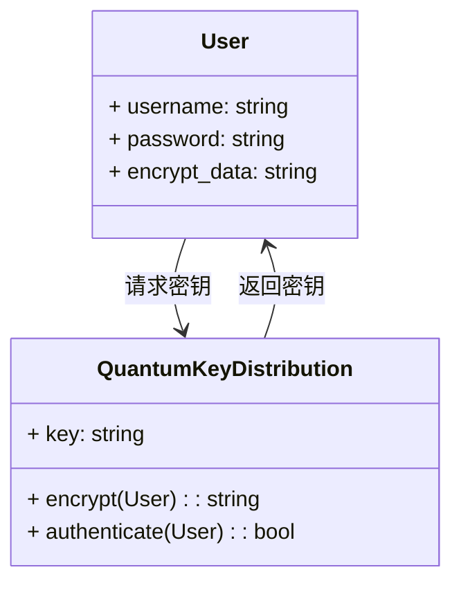
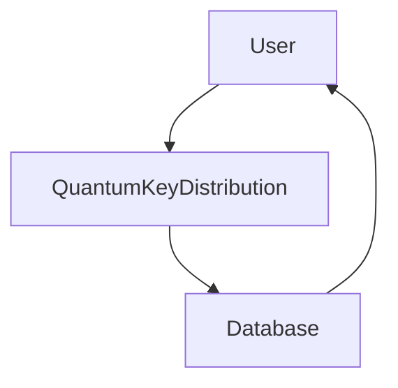
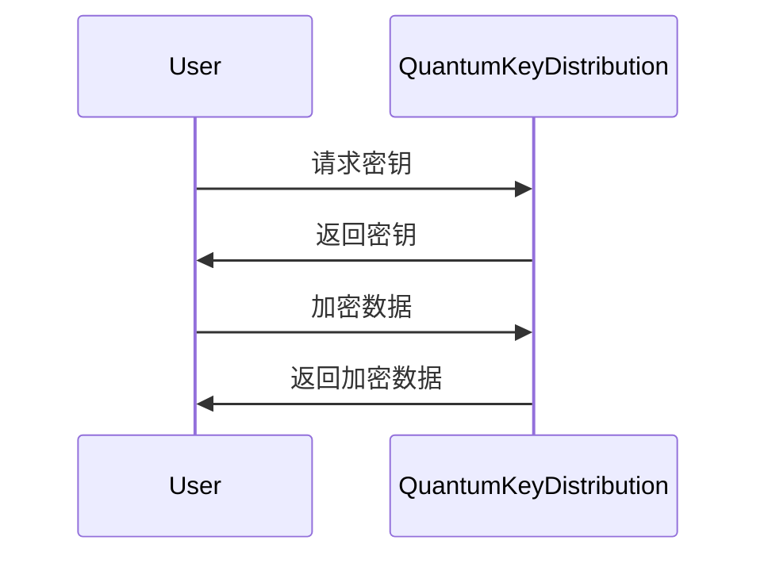

                 

# 全球股市估值与量子密钥分发在金融安全中的应用

> 关键词：全球股市估值，量子密钥分发，金融安全，量子加密，数据加密

> 摘要：本文深入探讨了全球股市估值与量子密钥分发在金融安全中的应用。通过分析股市估值的传统方法与现代技术，结合量子密钥分发的原理与优势，本文揭示了如何利用量子技术提升金融安全水平。同时，文章通过实际案例和系统设计，详细讲解了量子密钥分发在金融安全中的具体应用，为读者提供了全面的技术见解。

---

## 第一章: 全球股市估值与量子密钥分发的背景介绍

### 1.1 全球股市估值的核心概念

#### 1.1.1 股市估值的定义与基本原理
股市估值是通过对公司财务数据、市场环境和经济指标的分析，确定公司股票的合理价格范围。传统估值方法包括市盈率（P/E）和市净率（P/B）等，而现代技术如大数据分析和机器学习则提供了更精准的预测模型。

#### 1.1.2 股市估值的主要方法
- **市盈率法**：通过比较公司股价与每股收益的比率，评估股票的合理价格。
- **市净率法**：通过比较公司股价与每股净资产的比率，评估股票的价值。
- **股息率法**：通过比较公司股息与股价的比率，评估股票的收益能力。

#### 1.1.3 股市估值的边界与外延
股市估值不仅关注单个公司的价值，还涉及整体市场的波动、宏观经济因素和投资者情绪等复杂因素。其外延包括风险管理、投资策略和市场预测等领域。

### 1.2 量子密钥分发的核心概念

#### 1.2.1 量子密钥分发的定义
量子密钥分发（QKD）是一种利用量子力学原理，通过量子态传输和测量来生成并共享加密密钥的技术。其核心思想是利用量子叠加和纠缠的特性，确保密钥的安全传输。

#### 1.2.2 量子密钥分发的基本原理
量子密钥分发的原理基于量子态的不可克隆性和测量扰动性。当第三方试图窃听或篡改密钥时，量子态将被破坏，从而触发系统报警。

#### 1.2.3 量子密钥分发的优缺点
优点：
- **安全性**：基于量子力学原理，确保密钥传输的安全性。
- **抗干扰**：能够检测未经授权的窃听行为。

缺点：
- **技术复杂性**：实现难度较高，需要专业的量子通信设备。
- **距离限制**：目前量子密钥分发的距离受限于物理条件，通常在几十公里以内。

### 1.3 全球股市估值与量子密钥分发的联系

#### 1.3.1 金融安全的需求与挑战
金融市场的数据安全需求日益增长，尤其是在高频交易和量化投资中，数据的保密性和完整性至关重要。传统的加密方法面临被破解的风险，而量子密钥分发提供了一种更安全的解决方案。

#### 1.3.2 量子密钥分发在金融安全中的潜在应用
- **金融交易中的数据加密**：保护交易数据的 confidentiality 和 integrity。
- **金融通信中的身份认证**：确保通信双方的身份真实性。
- **金融数据传输中的安全性保障**：防止数据在传输过程中被篡改或窃取。

#### 1.3.3 全球股市估值与量子密钥分发的结合点
通过量子密钥分发技术，可以实现股市估值数据的高效传输和安全存储，确保估值模型和预测结果的保密性，从而提升金融市场的整体安全性。

---

## 第二章: 量子密钥分发的原理与技术

### 2.1 量子密钥分发的基本原理

#### 2.1.1 量子密钥分发的数学模型
量子密钥分发的数学模型基于量子态的叠加和纠缠特性。通过测量和比对，生成共享的密钥。

$$
\text{量子态叠加：} \quad |\psi\rangle = \alpha|0\rangle + \beta|1\rangle
$$

$$
\text{量子态纠缠：} \quad |\phi\rangle = \frac{|01\rangle - |10\rangle}{\sqrt{2}}
$$

#### 2.1.2 量子密钥分发的实现步骤
1. **密钥生成**：通过量子态传输生成密钥。
2. **密钥比对**：双方通过经典通信比对测量结果，确定最终的共享密钥。
3. **安全性验证**：检测是否有未经授权的窃听行为。

#### 2.1.3 量子密钥分发的安全性分析
量子密钥分发的安全性基于量子力学的不可克隆性和测量扰动性。任何未经授权的窃听都会导致量子态的破坏，从而被系统检测到。

### 2.2 量子密钥分发的主要技术

#### 2.2.1 基于量子态的密钥分发
通过量子态的传输和测量，生成共享的密钥。其核心技术包括量子态的制备、传输和测量。

#### 2.2.2 基于经典密码学的密钥分发
结合经典密码学方法，通过量子密钥分发生成加密密钥，再利用传统加密算法进行数据加密。

#### 2.2.3 量子密钥分发的实验验证
通过实验验证量子密钥分发的安全性和有效性，例如在光纤中传输量子态，并检测窃听行为。

### 2.3 量子密钥分发在金融安全中的应用

#### 2.3.1 金融交易中的数据加密
通过量子密钥分发技术，保护金融交易数据的 confidentiality 和 integrity。

#### 2.3.2 金融通信中的身份认证
利用量子密钥分发实现通信双方的身份认证，确保通信的安全性。

#### 2.3.3 金融数据传输中的安全性保障
通过量子密钥分发技术，确保金融数据在传输过程中的安全性，防止数据被篡改或窃取。

---

## 第三章: 全球股市估值的方法与技术

### 3.1 股市估值的传统方法

#### 3.1.1 市盈率法
市盈率法通过比较公司股价与每股收益的比率，评估股票的合理价格。

$$
\text{市盈率} = \frac{\text{股价}}{\text{每股收益}}
$$

#### 3.1.2 市净率法
市净率法通过比较公司股价与每股净资产的比率，评估股票的价值。

$$
\text{市净率} = \frac{\text{股价}}{\text{每股净资产}}
$$

#### 3.1.3 股息率法
股息率法通过比较公司股息与股价的比率，评估股票的收益能力。

$$
\text{股息率} = \frac{\text{股息}}{\text{股价}} \times 100\%
$$

### 3.2 股市估值的现代技术

#### 3.2.1 大数据分析在股市估值中的应用
通过分析海量数据，包括历史价格、财务数据和市场情绪，利用大数据技术预测股市走势。

#### 3.2.2 机器学习在股市预测中的应用
利用机器学习算法，如支持向量机（SVM）和神经网络（NN），进行股市预测和估值。

#### 3.2.3 自然语言处理在财经新闻分析中的应用
通过自然语言处理技术，分析财经新闻和社交媒体数据，辅助股市估值。

### 3.3 股市估值的挑战与解决方案

#### 3.3.1 数据的实时性与准确性问题
通过实时数据采集和高速计算，解决数据延迟和不准确性问题。

#### 3.3.2 市场波动的不可预测性
利用统计套利和对冲策略，降低市场波动对股市估值的影响。

#### 3.3.3 量化交易中的技术难题
通过优化算法和硬件配置，提升量化交易的效率和准确性。

---

## 第四章: 量子密钥分发在金融安全中的应用

### 4.1 金融安全的需求分析

#### 4.1.1 金融交易中的数据安全需求
金融交易数据的保密性和完整性是金融安全的核心需求。

#### 4.1.2 金融通信中的身份认证需求
确保通信双方的身份真实性是金融通信安全的关键。

#### 4.1.3 金融数据传输中的安全性需求
防止数据在传输过程中被篡改或窃取是金融数据安全的重要保障。

### 4.2 量子密钥分发在金融安全中的具体应用

#### 4.2.1 数据加密
通过量子密钥分发生成加密密钥，保护金融数据的 confidentiality。

#### 4.2.2 身份认证
利用量子密钥分发实现通信双方的身份认证，确保金融通信的 authenticity。

#### 4.2.3 数据完整性验证
通过量子密钥分发技术，确保金融数据的 integrity，防止数据篡改。

### 4.3 量子密钥分发在金融安全中的优势

#### 4.3.1 高安全性
量子密钥分发基于量子力学原理，具有抗干扰和抗窃听的能力。

#### 4.3.2 高效性
量子密钥分发能够在较短的时间内生成和传输密钥，提升金融交易的效率。

#### 4.3.3 可扩展性
量子密钥分发技术可以扩展到更广泛的金融应用场景，如跨境支付和区块链。

---

## 第五章: 量子密钥分发在金融安全中的系统设计

### 5.1 项目介绍
本项目旨在利用量子密钥分发技术，提升金融安全水平，保护金融数据的 confidentiality 和 integrity。

### 5.2 系统功能设计

#### 5.2.1 用户需求分析
- **数据加密**：保护金融交易数据的安全性。
- **身份认证**：确保通信双方的身份真实性。
- **数据完整性验证**：防止数据篡改。

#### 5.2.2 领域模型设计
通过 Mermaid 类图展示系统的功能模块和交互关系。

### 5.3 系统架构设计

#### 5.3.1 模块划分
- **用户模块**：负责用户身份认证和数据加密请求。
- **量子密钥分发模块**：生成和分发加密密钥。
- **数据存储模块**：存储加密数据和密钥。

#### 5.3.2 系统架构图
通过 Mermaid 架构图展示系统的整体架构。

### 5.4 系统接口设计

#### 5.4.1 接口定义
- **encrypt(key, data)**：对数据进行加密。
- **decrypt(key, data)**：对数据进行解密。
- **authenticate(user, key)**：验证用户身份。

#### 5.4.2 接口实现
通过代码实现加密和解密功能，确保数据的安全性。

### 5.5 系统交互设计

#### 5.5.1 交互流程
1. 用户请求加密数据。
2. 系统生成并分发加密密钥。
3. 用户利用密钥对数据进行加密。
4. 系统验证数据的完整性。

#### 5.5.2 交互序列图
通过 Mermaid 序列图展示系统的交互流程。

---

## 第六章: 量子密钥分发在金融安全中的系统优化与扩展

### 6.1 系统优化

#### 6.1.1 性能优化
通过优化算法和硬件配置，提升量子密钥分发的效率和安全性。

#### 6.1.2 系统扩展
将量子密钥分发技术扩展到更广泛的金融应用场景，如跨境支付和区块链。

### 6.2 系统扩展

#### 6.2.1 跨境支付中的应用
通过量子密钥分发技术，实现跨境支付数据的安全传输。

#### 6.2.2 区块链中的应用
将量子密钥分发技术应用于区块链，提升区块链的安全性和可信度。

---

## 第七章: 量子密钥分发在金融安全中的未来展望

### 7.1 量子密钥分发技术的未来发展

#### 7.1.1 技术趋势
随着量子计算技术的发展，量子密钥分发将在金融安全中发挥越来越重要的作用。

#### 7.1.2 研究方向
未来的研究方向包括量子密钥分发的优化、扩展和与其他量子技术的结合。

### 7.2 量子密钥分发在金融安全中的潜在应用

#### 7.2.1 股市估值的精准预测
通过量子密钥分发技术，提升股市估值的精准度和安全性。

#### 7.2.2 金融风险管理
利用量子密钥分发技术，增强金融风险管理的能力和效率。

---

## 作者信息

**作者：AI天才研究院/AI Genius Institute & 禅与计算机程序设计艺术 /Zen And The Art of Computer Programming**

**联系方式：**  
- 邮箱：contact@aitalentinstitute.com  
- 官网：https://www.aitalentinstitute.com

---

**声明：** 本文内容基于公开可用的信息和理论分析，不构成任何实际的投资建议或技术实现指导。

