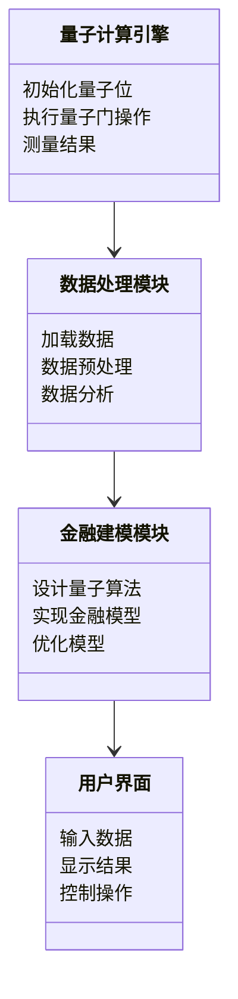
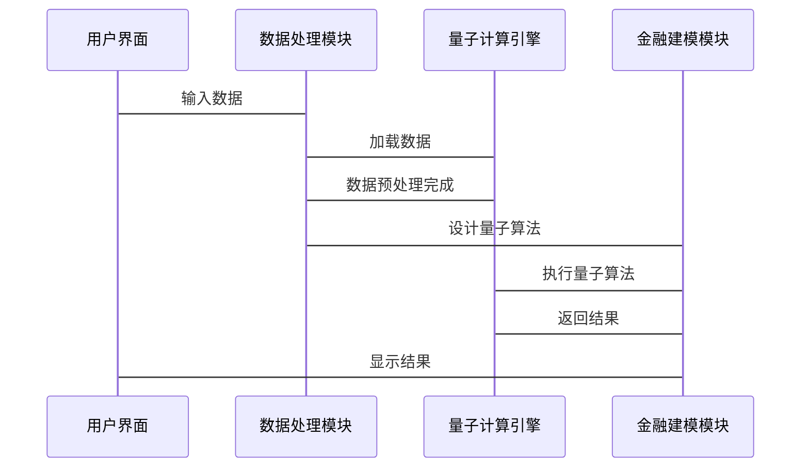

                 


# 全球股市估值与量子计算在金融建模中的应用

> 关键词：全球股市估值，量子计算，金融建模，量子算法，金融风险管理，量子优化

> 摘要：本文探讨了全球股市估值的传统方法及其局限性，介绍了量子计算的基本概念和其在金融建模中的潜力，详细讲解了量子计算在优化金融模型、风险管理中的应用，以及如何通过量子算法实现更高效的股市估值。文章结合理论与实践，通过具体的算法实现和系统设计，展示了量子计算在金融领域的巨大应用前景。

---

## 第1章 全球股市估值的背景与现状

### 1.1 全球股市估值的背景

#### 1.1.1 问题背景
全球股市估值是金融领域的重要组成部分，它通过对上市公司财务数据的分析，评估企业的内在价值，为投资者提供决策依据。然而，传统估值方法面临数据复杂性高、计算效率低、模型准确性不足等问题，尤其是在处理海量数据和非线性关系时，传统方法显得力不从心。

#### 1.1.2 核心概念与术语
- **股市估值**：通过对企业的财务状况、市场表现和行业环境进行分析，估算其股票的内在价值。
- **金融建模**：通过数学模型模拟金融市场的行为，用于投资决策、风险管理等。
- **量子计算**：利用量子叠加和量子纠缠等特性，进行并行计算，解决复杂问题。

#### 1.1.3 问题描述
传统的股市估值方法依赖于线性回归、时间序列分析等技术，这些方法在处理复杂数据和非线性关系时存在局限性。此外，金融市场具有高度不确定性，传统模型难以捕捉市场波动中的隐含信息。

### 1.2 量子计算的基本概念

#### 1.2.1 量子计算的核心原理
量子计算基于量子叠加和量子纠缠的原理。与经典计算不同，量子计算机可以在同一时间处理大量的可能性，从而在某些复杂问题上显著提高计算效率。

#### 1.2.2 量子计算与经典计算的对比

| 特性 | 经典计算 | 量子计算 |
|------|----------|----------|
| 状态 | 二进制位 | 量子位（qubit） |
| 并行性 | 串行计算 | 并行计算 |
| 处理复杂性 | 适合简单线性问题 | 适合复杂非线性问题 |

### 1.3 本章小结
本章介绍了全球股市估值的背景和传统方法的局限性，同时阐述了量子计算的基本概念和其在金融建模中的潜力。

---

## 第2章 量子计算在金融建模中的核心原理

### 2.1 量子计算的基本原理

#### 2.1.1 量子叠加
量子叠加允许量子位同时处于多个状态的叠加态，这使得量子计算机能够在同一时间处理多个可能性。

#### 2.1.2 量子纠缠
量子纠缠使得两个或多个量子位之间形成强关联，一个量子位的状态会直接影响另一个量子位的状态。

#### 2.1.3 量子算法的基本框架
量子算法通过设计量子门操作和量子电路，利用量子叠加和量子纠缠的特性，解决特定问题。

### 2.2 量子计算在金融建模中的优势

#### 2.2.1 处理复杂金融数据的能力
量子计算能够高效处理海量金融数据，发现传统方法难以察觉的非线性关系。

#### 2.2.2 优化金融模型的计算效率
通过量子优化算法，可以显著提高金融模型的计算速度和准确性。

#### 2.2.3 量子计算在风险管理中的应用潜力
量子计算能够快速评估市场风险，优化投资组合，提高风险管理效率。

### 2.3 本章小结
本章详细讲解了量子计算的基本原理，并分析了其在金融建模中的优势。

---

## 第3章 全球股市估值的传统方法与现代方法

### 3.1 传统股市估值方法

#### 3.1.1 市盈率法
市盈率法通过将股票价格除以每股收益，评估股票的相对价值。

#### 3.1.2 市净率法
市净率法通过将股票价格除以每股净资产，评估股票的价值。

#### 3.1.3 股息率法
股息率法通过将每股股息除以股票价格，评估股票的分红能力。

### 3.2 现代股市估值方法

#### 3.2.1 资产评估模型
资产评估模型通过对企业资产进行详细评估，估算企业的内在价值。

#### 3.2.2 资本资产定价模型（CAPM）
CAPM模型通过计算系统性风险和非系统性风险，确定资产的预期收益率。

#### 3.2.3 风险中性定价模型
风险中性定价模型通过假设市场参与者对风险持中性态度，评估资产的价值。

### 3.3 传统方法与现代方法的对比分析

#### 3.3.1 计算复杂度的对比
传统方法通常基于线性回归和时间序列分析，计算复杂度较低；现代方法引入复杂模型如随机森林和神经网络，计算复杂度较高。

#### 3.3.2 结果准确性的对比
传统方法在处理简单问题时结果准确，但在处理复杂非线性问题时准确性不足；现代方法通过引入复杂模型，提高了结果的准确性。

#### 3.3.3 适用场景的对比
传统方法适用于简单线性问题，现代方法适用于复杂非线性问题。

### 3.4 本章小结
本章对比了传统和现代股市估值方法的优缺点，分析了其在实际应用中的适用场景。

---

## 第4章 量子计算在金融建模中的算法实现

### 4.1 量子金融算法的基本框架

#### 4.1.1 量子随机游走算法
量子随机游走算法通过模拟金融市场的随机波动，评估资产的价格走势。

#### 4.1.2 量子期权定价算法
量子期权定价算法通过量子叠加态，同时评估期权的多种可能价格。

#### 4.1.3 量子投资组合优化算法
量子投资组合优化算法通过量子并行性，优化投资组合的风险收益比。

### 4.2 量子计算在金融建模中的实现细节

#### 4.2.1 量子叠加态的构建
通过量子叠加，将多个可能性同时表示在量子位中。

#### 4.2.2 量子门操作的实现
通过设计量子门操作，实现对量子态的转换和运算。

#### 4.2.3 量子测量与结果解读
通过量子测量，将量子态的结果转化为可读的数值。

### 4.3 量子计算在金融建模中的优化与改进

#### 4.3.1 算法复杂度的优化
通过优化量子算法的设计，降低计算复杂度。

#### 4.3.2 算法稳定性的提升
通过引入量子纠错码，提高量子算法的稳定性。

#### 4.3.3 算法适用性的扩展
通过扩展量子算法的应用场景，提高其在金融建模中的适用性。

### 4.4 本章小结
本章详细讲解了量子计算在金融建模中的算法实现，并分析了其优化与改进的方向。

---

## 第5章 量子计算在金融建模中的系统架构设计

### 5.1 问题场景介绍
金融建模需要处理海量数据和复杂计算，传统方法难以满足需求，而量子计算可以提供高效的解决方案。

### 5.2 系统功能设计

#### 5.2.1 领域模型设计
通过Mermaid类图，展示系统中各模块之间的关系。



### 5.3 系统架构设计

#### 5.3.1 系统架构图
通过Mermaid架构图，展示系统的整体架构。

```mermaid
architecturalDiagram
    title 量子金融建模系统架构
    Quantum_Compute_Engine ---(implem "量子计算引擎")--> Quantum_Simulator
    Data_Processing_Module ---(implem "数据处理模块")--> Quantum_Compute_Engine
    Financial_Modeling_Module ---(implem "金融建模模块")--> Quantum_Compute_Engine
    User_Interface ---(implem "用户界面")--> Data_Processing_Module
```

### 5.4 系统接口设计

#### 5.4.1 系统接口描述
- 数据处理模块与量子计算引擎之间的接口：数据预处理和量子计算请求。
- 金融建模模块与量子计算引擎之间的接口：量子算法设计和模型优化。

### 5.5 系统交互设计

#### 5.5.1 系统交互流程
通过Mermaid序列图，展示系统交互流程。



### 5.6 本章小结
本章详细设计了量子金融建模系统的架构，并展示了系统交互流程。

---

## 第6章 量子计算在金融建模中的项目实战

### 6.1 项目背景与目标
本项目旨在通过量子计算优化金融建模，提高股市估值的效率和准确性。

### 6.2 项目环境搭建

#### 6.2.1 量子计算环境
使用量子计算模拟器，如Qiskit或Rigetti，搭建量子计算环境。

#### 6.2.2 金融数据获取
通过API获取全球股市数据，如Yahoo Finance或Alpha Vantage。

### 6.3 项目核心实现

#### 6.3.1 量子算法实现
通过Python代码实现量子金融算法，如量子随机游走算法。

```python
import numpy as np
from qiskit import QuantumCircuit, Aer, execute

def quantum_random_walk():
    circuit = QuantumCircuit(1, 1)
    circuit.h(0)
    circuit.measure(0, 0)
    backend = Aer.get_backend('qasm_simulator')
    job = execute(circuit, backend)
    result = job.result()
    return result.get_counts()

quantum_random_walk()
```

#### 6.3.2 金融建模实现
通过量子计算优化投资组合，实现风险收益比最大化。

### 6.4 项目案例分析
以某公司为例，通过量子计算优化其股票估值模型，分析结果与传统方法的对比。

### 6.5 项目小结
本章通过具体案例展示了量子计算在金融建模中的实际应用，并分析了其优势。

---

## 第7章 总结与展望

### 7.1 总结
本文探讨了全球股市估值的传统方法及其局限性，介绍了量子计算的基本概念和其在金融建模中的潜力，详细讲解了量子计算在优化金融模型、风险管理中的应用。

### 7.2 展望
未来，随着量子计算技术的不断发展，其在金融建模中的应用将更加广泛。量子计算将帮助我们更好地理解和预测金融市场，实现更高效的股市估值。

---

## 最佳实践 tips

- 在实际应用中，建议结合量子计算与经典计算的优势，设计混合计算模型。
- 注意数据质量和模型的可解释性，避免因数据偏差导致的结果错误。
- 定期更新模型和算法，以适应金融市场变化。

---

## 作者：AI天才研究院/AI Genius Institute & 禅与计算机程序设计艺术 /Zen And The Art of Computer Programming

---

**全文完**

