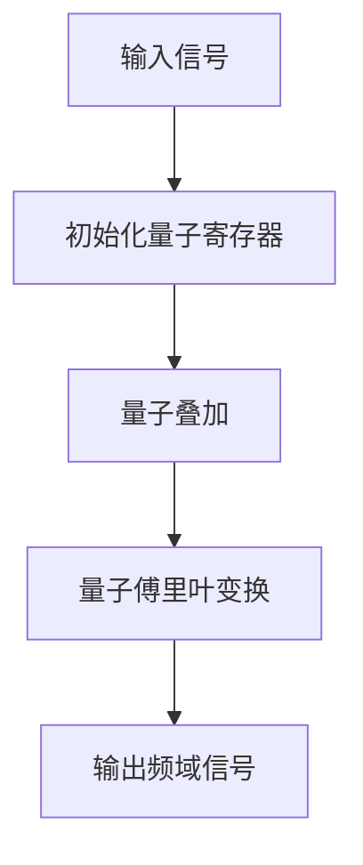
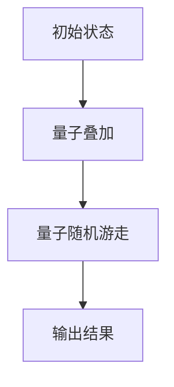
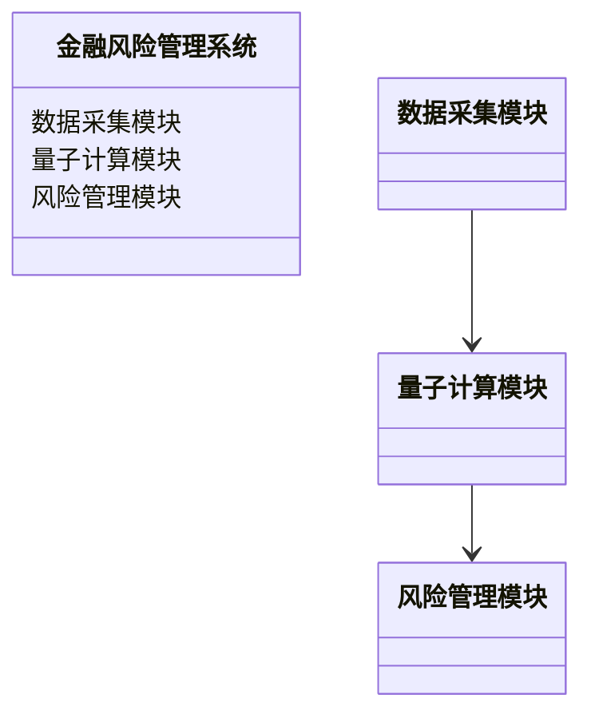

                 


# 全球股市估值与量子计算在金融风险管理中的应用

> **关键词**: 量子计算, 金融风险管理, 股市估值, 算法原理, 数学模型

> **摘要**: 本文探讨了全球股市估值与量子计算在金融风险管理中的应用。从量子计算的基本原理到其在金融领域的潜力，再到股市估值的核心算法，详细分析了量子计算如何 revolutionize 金融风险管理。通过数学模型和算法原理的深入剖析，结合实际案例，展示了量子计算在金融风险管理中的优势与挑战。

---

## 第一部分: 全球股市估值与量子计算的背景与基础

### 第1章: 全球股市估值概述

#### 1.1 全球股市估值的基本概念

股票市场的估值是金融领域的重要组成部分，它通过分析公司的财务数据、市场趋势和宏观经济指标，评估股票的内在价值。传统的估值方法包括市盈率（P/E ratio）、市净率（P/B ratio）和股息率（Dividend Yield）等。

- **市盈率（P/E ratio）**: 公司股价除以每股收益（EPS），反映了投资者对股票盈利能力的预期。
- **市净率（P/B ratio）**: 公司股价除以每股净资产，适用于评估资产密集型行业。
- **股息率（Dividend Yield）**: 每股股息除以股价，反映了股票的分红能力。

#### 1.2 量子计算的基本原理

量子计算是一种基于量子力学原理的计算方式，其核心在于利用量子叠加（Superposition）和量子纠缠（Entanglement）等特性来处理信息。与经典计算机不同，量子计算机可以同时处理多个状态，从而在某些特定问题上实现指数级的计算速度。

- **量子叠加**: 量子比特（Qubit）可以同时处于0和1的状态，这使得量子计算机可以在多个可能性之间并行计算。
- **量子纠缠**: 两个或多个量子比特之间可以形成纠缠态，使得其中一个比特的状态直接影响另一个比特的状态。

#### 1.3 量子计算在金融风险管理中的潜在优势

量子计算的并行计算能力使其在金融风险管理中具有巨大潜力。它可以快速处理海量数据，优化投资组合，预测市场趋势，并评估复杂的风险场景。

- **优化投资组合**: 量子计算可以快速找到最优的投资组合，以最大化收益并最小化风险。
- **市场预测**: 通过量子随机行走（Quantum Random Walk）模型，可以更准确地预测市场波动。
- **风险评估**: 量子计算可以模拟复杂的金融模型，评估极端市场条件下的风险。

### 第2章: 量子计算在金融领域的应用前景

#### 2.1 金融风险管理的挑战

传统的金融风险管理方法依赖于统计模型和历史数据，但在面对复杂市场和极端事件时，往往显得力不从心。

- **复杂性**: 金融市场受到多种因素的影响，包括宏观经济、公司基本面和投资者情绪等。
- **不确定性**: 由于市场的不可预测性，传统的模型难以捕捉所有风险因素。
- **计算能力限制**: 高维优化问题需要强大的计算能力，而经典计算机在处理这些问题时效率较低。

#### 2.2 量子计算与股市估值的结合

通过量子计算，可以实现对股市估值的更高效和更精确的计算。

- **量子回归分析**: 通过量子计算快速找到变量之间的关系，优化回归模型。
- **量子聚类分析**: 将股票按相似性分类，帮助投资者发现市场趋势。
- **量子时间序列分析**: 利用量子计算预测未来的价格走势。

---

## 第二部分: 量子计算在金融风险管理中的算法原理

### 第3章: 量子计算的核心算法

#### 3.1 量子傅里叶变换

量子傅里叶变换（Quantum Fourier Transform, QFT）是量子计算中的一个关键算法，用于将信号从时域变换到频域。

- **定义**: 通过量子叠加和量子纠缠，将输入状态转换为频率域的表示。
- **实现步骤**:
  1. 初始化量子寄存器。
  2. 对每个量子比特进行叠加操作。
  3. 应用量子傅里叶变换的逆变换。
- **应用场景**: 在金融领域，QFT 可以用于分析市场周期和发现价格波动的模式。



#### 3.2 量子随机行走

量子随机行走（Quantum Random Walk）是一种利用量子叠加和量子纠缠来模拟随机过程的算法。

- **定义**: 通过量子态的演化，模拟随机游走过程。
- **实现步骤**:
  1. 初始化量子状态。
  2. 应用量子叠加操作。
  3. 更新量子态，模拟随机游走。
- **应用场景**: 在金融领域，QRW 可以用于预测股票价格的波动。



### 第4章: 股市估值的核心算法

#### 4.1 股市估值的传统算法

传统股市估值方法基于统计学和经济学原理，尽管有效，但在面对复杂市场时显得效率低下。

- **市盈率法**: 通过比较股票的市盈率与行业平均水平，评估股票的估值。
- **市净率法**: 通过比较股票的市净率与行业平均水平，评估股票的估值。
- **股息率法**: 通过比较股票的股息率与行业平均水平，评估股票的估值。

#### 4.2 基于量子计算的股市估值算法

量子计算的应用为股市估值提供了新的可能性。

- **量子回归分析**: 通过量子计算优化回归模型，提高估值的准确性。
- **量子聚类分析**: 通过量子计算将股票按相似性分类，发现市场趋势。
- **量子时间序列分析**: 通过量子计算预测未来的价格走势。

---

## 第三部分: 量子计算在股市估值中的数学模型与公式

### 第5章: 量子计算的数学基础

#### 5.1 量子态与叠加态

量子态是量子计算的核心概念，表示量子系统的状态。

- **定义**: 量子态是一个向量，表示系统在不同状态下的概率幅。
- **叠加态**: 量子态可以同时处于多个状态的叠加。

$$|\psi\rangle = \alpha|0\rangle + \beta|1\rangle$$

其中，$\alpha$ 和 $\beta$ 是概率幅，满足 $|\alpha|^2 + |\beta|^2 = 1$。

#### 5.2 量子纠缠与测量

量子纠缠是量子计算的重要特性，表示两个或多个量子比特之间的强关联。

- **定义**: 当两个量子比特处于纠缠态时，其中一个比特的状态会直接影响另一个比特的状态。
- **测量**: 通过对量子态的测量，可以提取信息。

### 第6章: 股市估值的数学模型

#### 6.1 传统估值模型

传统估值模型基于统计学和经济学原理，尽管有效，但在面对复杂市场时显得效率低下。

- **市盈率法**: 通过比较股票的市盈率与行业平均水平，评估股票的估值。
- **市净率法**: 通过比较股票的市净率与行业平均水平，评估股票的估值。
- **股息率法**: 通过比较股票的股息率与行业平均水平，评估股票的估值。

#### 6.2 量子估值模型

量子计算的应用为股市估值提供了新的可能性。

- **量子回归分析**: 通过量子计算优化回归模型，提高估值的准确性。
- **量子聚类分析**: 通过量子计算将股票按相似性分类，发现市场趋势。
- **量子时间序列分析**: 通过量子计算预测未来的价格走势。

---

## 第四部分: 量子计算在金融风险管理中的系统分析与架构设计

### 第7章: 金融风险管理的场景介绍

#### 7.1 问题场景

金融风险管理的核心目标是通过识别、评估和应对风险，保护投资组合免受损失。

- **市场风险**: 由于市场价格波动导致的损失。
- **信用风险**: 由于债务人违约导致的损失。
- **操作风险**: 由于内部操作失误导致的损失。

#### 7.2 系统功能设计

- **数据采集**: 收集市场数据、公司财务数据和宏观经济指标。
- **量子计算模块**: 实现量子傅里叶变换和量子随机行走算法。
- **风险管理模块**: 评估风险并制定应对策略。



### 第8章: 项目实战

#### 8.1 环境安装

- **Python环境**: 安装Python和Quantum Computing库。
- **Quantum Computing库**: 使用Qiskit或Cirq等量子计算库。

#### 8.2 核心代码实现

以下是实现量子傅里叶变换的Python代码示例：

```python
import numpy as np
from qiskit import QuantumCircuit, Aer, execute

def quantum_fourier_transform(circuit, n):
    for i in range(n):
        for j in range(i):
            circuit.cu1(2 * np.pi / (2 ** (i - j)), 2 * np.pi / (2 ** (i - j)), i, j)
        circuit.h(i)
    return circuit

n = 3
circuit = QuantumCircuit(n)
quantum_fourier_transform(circuit, n)
circuit.draw()
```

#### 8.3 案例分析

假设我们有一个包含30只股票的投资组合，我们希望优化其风险和收益。

- **输入数据**: 股票的历史价格和财务数据。
- **量子计算**: 使用量子傅里叶变换优化投资组合。
- **输出结果**: 优化后的投资组合。

---

## 第五部分: 小结与注意事项

### 第9章: 小结

通过本文的探讨，我们可以看到量子计算在金融风险管理中的巨大潜力。通过量子计算，我们可以更高效地优化投资组合、预测市场趋势并评估风险。

### 第10章: 注意事项

- **量子计算的局限性**: 量子计算目前仍处于发展阶段，尚未完全成熟。
- **数据质量问题**: 金融数据的质量对结果的影响至关重要。
- **计算成本**: 量子计算的硬件和软件成本较高。

### 第11章: 拓展阅读

- 《Quantum Computing for Finance》
- 《Financial Risk Management with Quantum Computing》
- 《Quantum Machine Learning in Financial Markets》

---

**作者**: AI天才研究院/AI Genius Institute & 禅与计算机程序设计艺术/Zen And The Art of Computer Programming

---

这篇文章从背景介绍到算法原理，再到系统设计和实际案例，详细探讨了量子计算在金融风险管理中的应用。通过数学模型和实际代码的展示，读者可以全面理解量子计算如何 revolutionize 金融领域。

