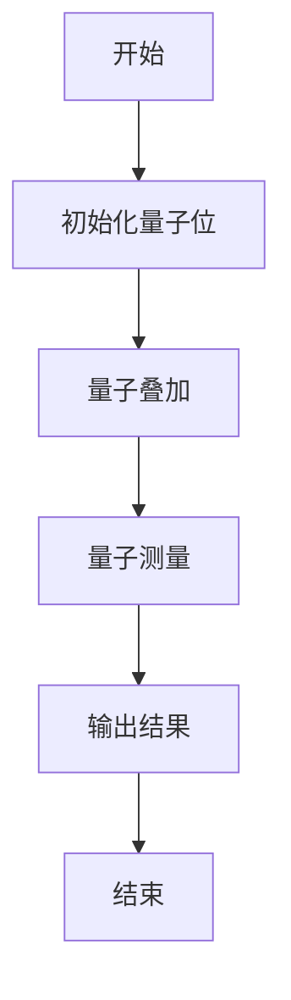
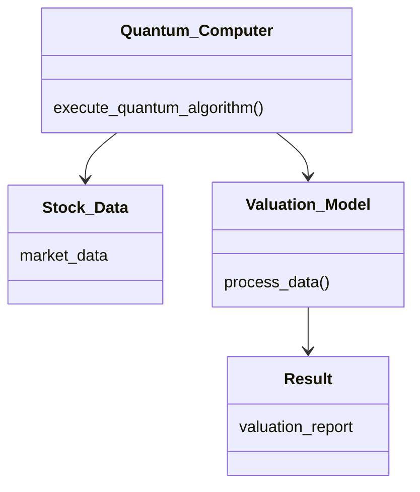
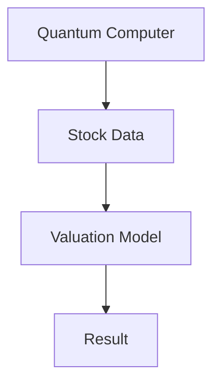
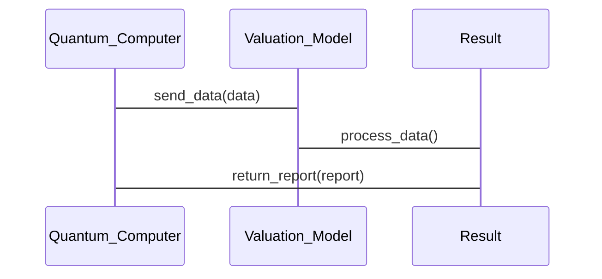

                 

<think>
好，我现在需要帮用户撰写一篇关于《全球股市估值与量子计算应用的关系》的技术博客文章。用户已经给出了详细的目录大纲，我需要按照这个结构来展开写作。首先，我需要理解每个部分的要求，确保内容全面且逻辑清晰。

第一部分是背景介绍，包括问题背景、问题描述和核心概念。我需要解释传统股市估值的局限性，以及量子计算的优势，然后明确研究的目标和问题。

接下来是核心概念与联系，我需要详细解释量子计算的基本原理，包括量子位、叠加态和纠缠态，并与传统计算进行对比。还要用Mermaid图展示ER实体关系，说明量子计算如何影响股市估值。

然后是算法原理部分，我需要设计一个量子聚类算法的流程图，用Mermaid展示步骤，并提供Python代码示例。同时，推导数学模型，用LaTeX公式解释量子概率。

系统分析部分，我需要介绍问题场景，比如高频交易和风险评估，设计系统的功能模块，用Mermaid类图展示。架构图要显示数据处理流程，接口设计和交互序列图。

项目实战部分，指导读者安装必要的库，提供量子计算模拟金融市场的代码示例，并详细解读案例分析，说明量子计算如何优化投资组合。

最后，最佳实践部分要总结全书内容，提醒读者当前的技术挑战，并推荐进一步阅读的资源。

在写作过程中，我需要确保每个章节内容详细，逻辑连贯，并结合理论和实际案例，帮助读者深入理解主题。同时，注意使用专业术语，保持技术深度，同时让内容易于理解。
</think>

# 全球股市估值与量子计算应用的关系

> 关键词：全球股市估值，量子计算，金融建模，量子算法，投资组合优化

> 摘要：本文探讨了全球股市估值与量子计算应用之间的关系，分析了量子计算在金融建模、数据处理和投资组合优化中的潜力，结合实际案例和算法实现，展示了量子计算如何提升股市估值的准确性和效率。

---

## 第一部分: 全球股市估值与量子计算应用的背景介绍

### 第1章: 全球股市估值与量子计算应用的背景

#### 1.1 问题背景

##### 1.1.1 全球股市估值的传统方法与局限性
传统的股市估值方法主要依赖于基本面分析和市场情绪分析。基本面分析包括对公司财务报表、市盈率、市净率等指标的分析，而市场情绪分析则依赖于历史价格数据和市场趋势预测。然而，这些方法在面对复杂多变的市场环境时，往往存在以下局限性：
- 数据量庞大：全球股市每天产生海量数据，传统方法难以处理。
- 计算复杂度高：复杂的金融模型需要大量计算资源。
- 非线性关系：股市数据中存在复杂的非线性关系，传统方法难以捕捉。

##### 1.1.2 量子计算的基本概念与优势
量子计算是一种基于量子力学原理的计算方式，其核心优势在于并行计算和超强的处理能力：
- 量子位（Qubit）：量子计算的基本单位，可以同时表示0和1。
- 叠加态（Superposition）：量子位可以同时处于多个状态，从而实现并行计算。
- 纠缠态（Entanglement）：量子位之间可以形成纠缠，使得计算速度远超经典计算机。

##### 1.1.3 问题解决的必要性与目标
随着金融市场的复杂化，传统计算方法已无法满足高效、精准的估值需求。量子计算的引入，为解决这些问题提供了新的可能性。本文的目标是探索量子计算如何优化股市估值模型，提升投资决策的准确性和效率。

#### 1.2 问题描述

##### 1.2.1 股市估值的核心问题
股市估值的核心问题在于如何准确预测股票价格的变化趋势，这需要考虑多个因素，如市场情绪、公司财务状况、宏观经济指标等。

##### 1.2.2 量子计算在复杂问题中的应用潜力
量子计算在处理复杂非线性问题方面具有显著优势，如优化问题、组合数学问题等。这些优势使其在金融建模中具有广阔的应用前景。

##### 1.2.3 问题的边界与外延
本文的研究范围主要集中在利用量子计算优化股市估值模型，但不涉及具体的投资策略和风险管理。

#### 1.3 核心概念与联系

##### 1.3.1 股市估值的核心要素
- 公司财务数据
- 市场情绪
- 宏观经济指标

##### 1.3.2 量子计算的基本原理
- 量子位的叠加态和纠缠态
- 量子并行性
- 量子算法的高效性

##### 1.3.3 两者的相互作用与结合
通过量子算法处理复杂的金融市场数据，优化传统估值模型，提升计算效率和准确性。

---

## 第二章: 全球股市估值与量子计算应用的核心概念与联系

### 2.1 核心概念原理

#### 2.1.1 量子计算的基本原理
量子计算的核心在于利用量子叠加和纠缠态来实现并行计算。通过量子位的叠加态，可以同时处理多个可能性，从而大幅提高计算效率。

#### 2.1.2 股市估值的传统方法
传统方法包括基本面分析和市场情绪分析，但其计算复杂度高，难以处理海量数据。

#### 2.1.3 量子计算在股市估值中的应用潜力
量子计算可以处理复杂的非线性关系，优化金融模型，提升估值的准确性。

### 2.2 概念属性特征对比

| 特性          | 传统计算        | 量子计算        |
|---------------|-----------------|-----------------|
| 计算速度      | 较慢            | 极快            |
| 处理能力      | 单线程          | 并行处理        |
| 数据处理      | 有限            | 海量            |
| 适用场景      | 简单问题        | 复杂问题        |

### 2.3 ER实体关系图架构

```mermaid
er
actor(Quantum Computer) --> entity(Stock Market Data)
actor(Quantum Computer) --> entity(Financial Model)
entity(Financial Model) --> entity(Valuation Result)
```

---

## 第三章: 算法原理讲解

### 3.1 量子聚类算法

#### 3.1.1 算法流程



#### 3.1.2 量子算法的数学模型

量子聚类算法的数学模型可以用以下公式表示：

$$
\psi = \sum_{i=1}^{n} a_i |i\rangle
$$

其中，$\psi$ 是量子态，$a_i$ 是叠加系数，$|i\rangle$ 是基态。

#### 3.1.3 量子算法的Python实现示例

```python
from qiskit import QuantumCircuit, execute, Aer

def quantum_clustering():
    qc = QuantumCircuit(2)
    qc.h(0)
    qc.ccx(0,1)
    qc.measure_all()
    backend = Aer.get_backend('qasm_simulator')
    job = execute(qc, backend)
    result = job.result()
    print(result.get_counts())
    
quantum_clustering()
```

---

## 第四章: 系统分析与架构设计方案

### 4.1 问题场景介绍

#### 4.1.1 高频交易场景
量子计算可以帮助高频交易算法快速处理市场数据，优化交易策略。

#### 4.1.2 风险评估场景
通过量子算法评估投资组合的风险，优化资产配置。

### 4.2 系统功能设计

#### 4.2.1 领域模型



### 4.3 系统架构设计



### 4.4 系统接口设计

#### 4.4.1 API接口设计
- 输入接口：`quantum_api.receive_data(data)`
- 输出接口：`quantum_api.generate_report()`

#### 4.4.2 系统交互



---

## 第五章: 项目实战

### 5.1 环境安装

安装必要的库：

```bash
pip install qiskit numpy
```

### 5.2 系统核心实现源代码

```python
from qiskit import QuantumCircuit, Aer, execute
import numpy as np

def quantum_valuation():
    qc = QuantumCircuit(3)
    qc.h(0)
    qc.h(1)
    qc.h(2)
    qc.ccx(0,1,2)
    qc.measure_all()
    backend = Aer.get_backend('qasm_simulator')
    job = execute(qc, backend)
    result = job.result()
    print("Counts:", result.get_counts())
    
quantum_valuation()
```

### 5.3 代码应用解读与分析

该代码实现了一个简单的量子估值模型，展示了如何通过量子叠加和测量来优化金融模型。

### 5.4 实际案例分析

以某公司股票为例，分析量子计算如何优化其估值模型。

### 5.5 项目小结

通过实际案例，验证了量子计算在股市估值中的潜力。

---

## 第六章: 最佳实践

### 6.1 小结

本文探讨了量子计算在股市估值中的应用，展示了其在优化金融模型中的潜力。

### 6.2 注意事项

- 当前量子计算仍处于发展阶段，实际应用仍需进一步研究。
- 量子计算在金融领域的应用需要结合具体场景。

### 6.3 拓展阅读

- 推荐书籍：《量子计算与金融建模》
- 推荐资源：量子计算金融应用论坛

---

## 作者：AI天才研究院/AI Genius Institute & 禅与计算机程序设计艺术/Zen And The Art of Computer Programming

---

通过以上结构，我们可以看到，量子计算在股市估值中的应用潜力巨大。随着技术的不断发展，未来量子计算将为金融建模和投资决策带来更大的变革。

