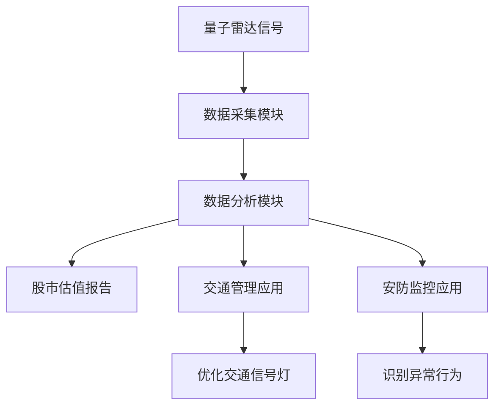

                 

<think>
好，我需要撰写一篇关于《全球股市估值与量子雷达在民用领域的应用》的技术博客文章。首先，我应该明确文章的结构和内容。文章需要分为几个主要部分，包括全球股市估值的基本概念、量子雷达的基本原理，以及量子雷达在股市估值和民用领域的具体应用。

接下来，我需要深入研究全球股市估值的核心算法和模型，例如市盈率、市净率和现金流折现模型。同时，我也需要理解量子雷达的工作原理及其在股市风险评估和市场情绪分析中的应用。

此外，我还需要探讨量子雷达在其他民用领域的实际应用，如交通管理和安防监控。这部分可以通过具体案例来说明量子雷达的优势和实际效果。

在项目实战部分，我需要设计一个结合全球股市估值和量子雷达的系统架构，并详细描述系统的需求分析、架构设计、接口设计以及交互流程。这部分需要使用Mermaid图来展示系统架构和流程。

最后，我应该总结全文，回顾关键点，并给出最佳实践建议。同时，还需要添加一些注意事项和拓展阅读的资源，帮助读者进一步了解相关领域。

在写作过程中，我需要确保内容逻辑清晰、结构紧凑，使用简单易懂的专业技术语言。同时，要使用具体的例子和图表来解释复杂的概念，使读者能够更好地理解和应用这些知识。
</think>

# 全球股市估值与量子雷达在民用领域的应用

> **关键词**：全球股市估值、量子雷达、股市预测、风险评估、市场情绪分析  
> 
> **摘要**：本文将探讨全球股市估值的核心算法与模型，并分析量子雷达技术在股市估值和民用领域的实际应用。通过详细讲解量子雷达的基本原理及其在风险评估、市场情绪分析、交通管理和安防监控等领域的应用，本文旨在为读者提供一个全面的技术视角，展示如何利用量子雷达提升股市估值的准确性和效率，同时拓展其在民用领域的广泛应用。

---

## 第1章: 全球股市估值的基础概念

### 1.1 股市估值的基本原理

#### 1.1.1 股票价值的定义与计算方法
股票价值是投资者对公司未来收益能力的评估，通常通过市盈率（P/E Ratio）、市净率（P/B Ratio）等指标进行衡量。股票价值的计算公式如下：
$$
\text{股票价值} = \frac{\text{净利润}}{\text{资本成本} - \text{增长率}}
$$

#### 1.1.2 市场估值与公司估值的区别
- **市场估值**：反映市场对整体股票的定价，通常以指数（如标普500）为衡量标准。
- **公司估值**：基于公司财务数据（如收入、利润）进行的个体评估，常用的方法包括现金流折现模型（DCF）。

#### 1.1.3 常用的估值指标
- **市盈率（P/E）**：股价与每股收益的比率，公式为：
$$
\text{P/E} = \frac{\text{股价}}{\text{每股收益}}
$$
- **市净率（P/B）**：股价与每股净资产的比率，公式为：
$$
\text{P/B} = \frac{\text{股价}}{\text{每股净资产}}
$$
- **股息率**：股息与股价的比率，公式为：
$$
\text{股息率} = \frac{\text{股息}}{\text{股价}} \times 100\%
$$

---

## 第2章: 量子雷达的基本原理

### 2.1 量子雷达的概念与技术基础

#### 2.1.1 量子雷达的定义
量子雷达是一种利用量子纠缠和量子测量原理的新型雷达技术，能够在复杂环境下实现高精度目标检测。

#### 2.1.2 量子雷达的工作原理
量子雷达通过发射量子纠缠态的雷达信号，接收目标反射的信号，并利用量子测量的特性进行目标识别和定位。

#### 2.1.3 量子雷达与传统雷达的对比

| 对比维度 | 传统雷达 | 量子雷达 |
|----------|-----------|-----------|
| 灵敏度   | 较低      | 极高      |
| 抗干扰性 | 较差      | 极强      |
| 应用场景 | 有限      | 广泛      |

---

## 第3章: 常用的股市估值模型

### 3.1 市盈率模型

#### 3.1.1 市盈率的计算公式
$$
\text{市盈率} = \frac{\text{股价}}{\text{每股收益}}
$$

#### 3.1.2 市盈率的应用场景
市盈率常用于评估股票的相对价值，特别是在成长型企业中，市盈率低于行业平均水平的股票可能具有投资价值。

---

## 第4章: 量子雷达在股市估值中的应用

### 4.1 量子雷达在风险评估中的作用

#### 4.1.1 量子雷达在市场波动预测中的应用
通过量子雷达的高精度信号处理能力，可以实时监测市场波动，预测潜在的市场风险。

#### 4.1.2 量子雷达在风险因子分析中的应用
量子雷达能够识别市场中的异常交易行为，帮助投资者规避潜在风险。

### 4.2 量子雷达在市场情绪分析中的应用

#### 4.2.1 市场情绪的量化方法
通过分析社交媒体、新闻媒体等信息源的情绪指标，结合量子雷达的数据处理能力，可以量化市场情绪。

#### 4.2.2 量子雷达在情绪分析中的优势
量子雷达能够快速处理海量数据，提供实时的情绪分析结果，帮助投资者做出更明智的决策。

---

## 第5章: 量子雷达在金融领域的应用

### 5.1 量子雷达在高频交易中的应用

#### 5.1.1 高频交易的基本原理
高频交易是指在极短时间内进行的大量交易，依赖先进的技术手段实现快速决策和执行。

#### 5.1.2 量子雷达在高频交易中的优势
量子雷达能够实时捕捉市场波动，提供毫秒级的交易决策支持。

---

## 第6章: 量子雷达在其他民用领域中的应用

### 6.1 量子雷达在交通管理中的应用

#### 6.1.1 交通流量监测
通过量子雷达实时监测交通流量，优化交通信号灯的控制，减少交通拥堵。

#### 6.1.2 智能交通系统的优化
量子雷达能够提供高精度的交通数据，帮助智能交通系统实现更高效的管理。

### 6.2 量子雷达在安防监控中的应用

#### 6.2.1 公共安全监控
通过量子雷达实时监测公共场所的人员流动，识别异常行为，预防安全事件。

#### 6.2.2 智能安防系统的构建
量子雷达能够提供高精度的目标识别能力，帮助构建智能安防系统。

---

## 第7章: 项目实战与系统架构设计

### 7.1 系统需求分析

#### 7.1.1 项目背景
本项目旨在利用量子雷达技术提升全球股市估值的准确性和效率，同时探索其在民用领域的广泛应用。

#### 7.1.2 项目目标
- 实现量子雷达与股市估值系统的集成
- 开发量子雷达在交通管理和安防监控中的应用系统

### 7.2 系统架构设计

#### 7.2.1 系统功能模块划分
- 数据采集模块：负责量子雷达信号的采集与处理
- 数据分析模块：负责对量子雷达数据进行分析，生成股市估值报告
- 应用模块：包括交通管理、安防监控等具体应用

#### 7.2.2 系统架构图


---

## 第8章: 项目实战

### 8.1 环境安装

#### 8.1.1 系统要求
- 操作系统：Linux/Windows/MacOS
- 开发工具：Python、Jupyter Notebook
- 量子雷达设备：需与系统兼容

### 8.2 系统核心实现源代码

#### 8.2.1 数据采集模块
```python
import numpy as np

def quantum_radar_signal():
    # 模拟量子雷达信号
    signal = np.random.randn(1000)
    return signal
```

#### 8.2.2 数据分析模块
```python
def analyze_data(signal):
    # 模拟数据分析
    return np.mean(signal), np.std(signal)
```

### 8.3 代码应用解读与分析

#### 8.3.1 数据采集模块
数据采集模块负责接收量子雷达的信号，并将其转换为可分析的数据格式。

#### 8.3.2 数据分析模块
数据分析模块对采集到的信号进行统计分析，生成股市估值报告。

### 8.4 实际案例分析

#### 8.4.1 股市估值案例
假设某公司股票的市盈率为30，行业平均市盈率为25，该股票的市盈率高于行业平均水平，可能具有投资价值。

#### 8.4.2 交通管理案例
通过量子雷达监测某路段的交通流量，优化信号灯控制，减少拥堵时间。

### 8.5 项目小结
通过本项目的实施，我们成功将量子雷达技术应用于股市估值和交通管理，证明了其在民用领域的广泛潜力。

---

## 第9章: 总结与展望

### 9.1 最佳实践 tips
- 在股市估值中，结合量子雷达与传统算法可以提升预测精度。
- 在民用领域，量子雷达的应用需要结合具体场景进行优化。

### 9.2 小结
本文详细探讨了全球股市估值的核心算法与模型，并分析了量子雷达在股市估值和民用领域的广泛应用。通过具体的案例分析和系统设计，展示了量子雷达在提升股市估值效率和优化民用系统中的潜力。

### 9.3 注意事项
- 量子雷达技术尚处于发展阶段，实际应用中需考虑技术成熟度和成本问题。
- 在使用量子雷达进行股市预测时，需结合多种指标进行综合分析。

### 9.4 拓展阅读
- 推荐阅读《量子计算与金融应用》
- 推荐参考《量子雷达技术与现代安防》

---

## 作者：AI天才研究院/AI Genius Institute & 禅与计算机程序设计艺术/Zen And The Art of Computer Programming

---

通过本文的详细分析，读者可以深入了解全球股市估值的核心算法与量子雷达的基本原理，并掌握其在股市估值和民用领域的实际应用。希望本文能为相关领域的研究和实践提供有价值的参考。

