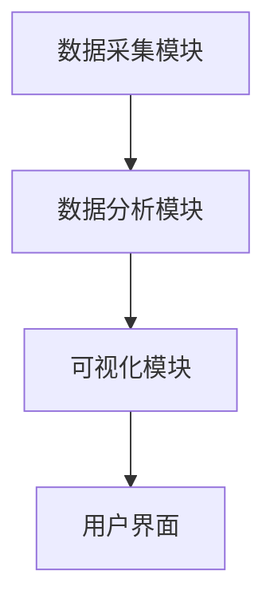

                 

# 全球股市估值周期性特征探讨

**关键词：** 全球股市、估值周期性、经济周期、市场情绪、资产定价模型

**摘要：** 本文旨在探讨全球股市估值的周期性特征，从理论与实证两个角度深入分析其形成机制、影响因素及表现形式。通过结合经济周期理论、市场情绪模型以及资产定价模型，本文试图揭示股市估值周期性背后的规律，并为投资者提供有效的分析工具与策略建议。

---

# 第1章 全球股市估值周期性特征的背景与概念

## 1.1 全球股市的基本概念

### 1.1.1 什么是股市估值
股市估值是衡量市场整体价值的重要指标，通常通过市盈率（P/E）、市净率（P/B）等指标来衡量。这些指标反映了市场参与者对上市公司未来盈利能力的预期。

### 1.1.2 全球主要股市的构成
全球主要股市包括纽约证券交易所（NYSE）、纳斯达克（NASDAQ）、伦敦证券交易所（LSE）、东京证券交易所（TSE）等。每个市场的构成和特点各不相同，但都反映了全球经济的波动。

### 1.1.3 股市估值的重要性
股市估值是投资者决策的重要依据，同时也是宏观经济政策制定的重要参考。通过分析股市估值的周期性特征，可以更好地理解市场的波动规律。

## 1.2 周期性特征的定义与表现

### 1.2.1 周期性特征的基本概念
周期性特征是指市场估值在一定时间内呈现规律性波动的特性。这种周期性波动通常与经济周期、市场情绪等因素密切相关。

### 1.2.2 股市估值的周期性表现
股市估值的周期性表现主要体现在市盈率、市净率等指标的波动上。例如，在经济繁荣时期，市盈率通常较高；而在经济衰退时期，市盈率则可能下降。

### 1.2.3 周期性特征的边界与外延
周期性特征并非孤立存在，它受到宏观经济环境、政策变化、市场参与者的预期等多种因素的影响。因此，周期性特征的边界需要结合具体市场环境来分析。

## 1.3 股市估值周期性特征的核心要素

### 1.3.1 经济周期与股市估值的关系
经济周期是影响股市估值的核心因素之一。在经济扩张阶段，企业盈利能力增强，股市估值上升；在经济衰退阶段，股市估值可能下降。

### 1.3.2 市场情绪与周期性特征
市场情绪是股市估值周期性波动的重要推动力。投资者的情绪波动会直接影响市场参与度和资产定价。

### 1.3.3 全球化视角下的周期性特征
全球化背景下，国际经济波动、地缘政治风险等因素都会影响全球股市估值的周期性特征。

## 1.4 本章小结

---

# 第2章 股市估值周期性特征的理论基础

## 2.1 经济周期理论与股市估值

### 2.1.1 经济周期的定义与阶段划分
经济周期通常分为繁荣、衰退、萧条和复苏四个阶段。不同阶段的经济表现对股市估值的影响也不同。

### 2.1.2 经济周期对股市估值的影响
在经济扩张阶段，企业盈利增长，股市估值上升；在经济衰退阶段，企业盈利下降，股市估值可能下跌。

### 2.1.3 股市估值与经济周期的关系模型
$$ V(t) = a \cdot E(t) + b \cdot M(t) $$
其中，\( V(t) \) 表示股市估值，\( E(t) \) 表示经济周期指数，\( M(t) \) 表示市场情绪指数，\( a \) 和 \( b \) 为系数。

## 2.2 股市估值周期性特征的形成机制

### 2.2.1 市场参与者的心理与行为
投资者的心理预期和行为是股市估值周期性波动的重要驱动因素。例如，过度乐观可能导致股市估值过高，过度悲观可能导致股市估值过低。

### 2.2.2 市场信息的不对称性
信息不对称可能导致市场参与者对同一信息产生不同解读，从而引发股市估值的波动。

### 2.2.3 宏观经济政策的影响
货币政策、财政政策等宏观经济政策的调整对股市估值具有重要影响。例如，宽松的货币政策可能导致股市估值上升。

## 2.3 周期性特征的数学模型

### 2.3.1 经济周期与股市估值的数学关系
$$ V(t) = \alpha \cdot E(t) + \beta \cdot S(t) + \gamma \cdot \epsilon(t) $$
其中，\( E(t) \) 表示经济周期指数，\( S(t) \) 表示市场情绪指数，\( \epsilon(t) \) 表示随机误差项。

### 2.3.2 周期性波动的数学表达式
$$ V(t) = \mu + \phi \cdot V(t-1) + \theta \cdot \epsilon(t) $$
其中，\( \mu \) 表示均值，\( \phi \) 表示自回归系数，\( \epsilon(t) \) 表示随机误差项。

### 2.3.3 模型的假设与验证
通过实证分析验证模型的假设，例如通过回归分析验证经济周期对股市估值的影响。

## 2.4 本章小结

---

# 第3章 全球主要股市估值周期性特征的实证分析

## 3.1 美国股市估值周期性特征

### 3.1.1 美国股市的历史表现
美国股市是全球最重要的股市之一，其周期性特征具有典型性。例如，2008年金融危机后，美国股市估值经历了从低点到高点的波动。

### 3.1.2 美国股市估值周期性特征的实证结果
通过实证分析发现，美国股市估值与经济周期密切相关，且具有明显的周期性波动。

### 3.1.3 美国股市估值周期性特征的驱动因素
经济周期、市场情绪、政策变化等是影响美国股市估值周期性特征的主要因素。

## 3.2 中国股市估值周期性特征

### 3.2.1 中国股市的历史发展
中国股市自1990年代以来经历了快速发展，其周期性特征受到宏观经济政策和市场情绪的双重影响。

### 3.2.2 中国股市估值周期性特征的实证结果
通过实证分析发现，中国股市估值也具有明显的周期性波动，且与经济周期密切相关。

### 3.2.3 中国股市估值周期性特征的特殊性
与美国股市相比，中国股市的周期性特征受到政策干预的影响更大。

## 3.3 日本股市估值周期性特征

### 3.3.1 日本股市的历史发展
日本股市在20世纪80年代曾经历过泡沫经济，其周期性特征具有一定的特殊性。

### 3.3.2 日本股市估值周期性特征的实证结果
通过实证分析发现，日本股市估值也具有周期性波动，且与经济周期密切相关。

### 3.3.3 日本股市估值周期性特征的驱动因素
日本股市的周期性特征受到全球经济波动、国内经济政策以及市场情绪的综合影响。

## 3.4 全球主要股市估值周期性特征的对比分析

### 3.4.1 不同市场的周期性特征比较
通过对比分析发现，不同市场的周期性特征受到各自经济环境和政策的影响。

### 3.4.2 周期性特征的共性与差异
全球主要股市的周期性特征具有一定的共性，但也存在差异，例如中国股市受到政策干预的影响更大。

## 3.5 本章小结

---

# 第4章 股市估值周期性特征的预测与投资策略

## 4.1 股市估值周期性特征的预测方法

### 4.1.1 时间序列分析
通过时间序列分析预测未来股市估值的变化趋势。

### 4.1.2 经济周期模型
利用经济周期模型预测未来股市估值的周期性变化。

## 4.2 投资策略的制定

### 4.2.1 基于周期性特征的投资策略
根据股市估值的周期性特征制定相应的投资策略，例如在经济衰退阶段减少投资，在经济复苏阶段增加投资。

### 4.2.2 风险控制与投资组合优化
通过风险控制和投资组合优化，降低周期性波动对投资组合的影响。

## 4.3 实际案例分析

### 4.3.1 美国股市的投资策略
基于美国股市的周期性特征，制定相应的投资策略。

### 4.3.2 中国股市的投资策略
基于中国股市的周期性特征，制定相应的投资策略。

## 4.4 本章小结

---

# 第5章 系统设计与实现

## 5.1 系统设计概述

### 5.1.1 问题场景介绍
通过系统设计解决全球股市估值周期性特征的分析与预测问题。

### 5.1.2 项目介绍
介绍项目的开发目标、技术架构和实现方案。

## 5.2 系统功能设计

### 5.2.1 数据采集模块
负责采集全球主要股市的估值数据，例如市盈率、市净率等。

### 5.2.2 数据分析模块
通过时间序列分析、回归分析等方法分析数据，提取周期性特征。

### 5.2.3 可视化模块
将分析结果以图表形式展示，帮助用户直观理解周期性特征。

## 5.3 系统架构设计

### 5.3.1 系统架构图
使用Mermaid绘制系统架构图，展示各模块之间的关系。

### 5.3.2 接口设计
定义各模块之间的接口，例如数据采集模块向数据分析模块提供数据。

## 5.4 系统实现

### 5.4.1 环境安装
介绍开发环境的安装步骤，例如安装Python、Jupyter Notebook等。

### 5.4.2 核心实现代码
提供系统核心实现的代码示例，例如数据采集模块的代码。

## 5.5 本章小结

---

# 第6章 总结与展望

## 6.1 全文总结

### 6.1.1 全球股市估值周期性特征的核心结论
总结全文的核心结论，例如经济周期对股市估值的影响。

### 6.1.2 研究的创新点
总结研究的创新点，例如提出新的周期性特征预测方法。

## 6.2 未来研究方向

### 6.2.1 更复杂模型的构建
提出构建更复杂的数学模型来分析股市估值的周期性特征。

### 6.2.2 多因素分析
探讨更多因素对股市估值周期性特征的影响，例如地缘政治风险、技术创新等。

## 6.3 本章小结

---

**作者：AI天才研究院/AI Genius Institute & 禅与计算机程序设计艺术 /Zen And The Art of Computer Programming**

